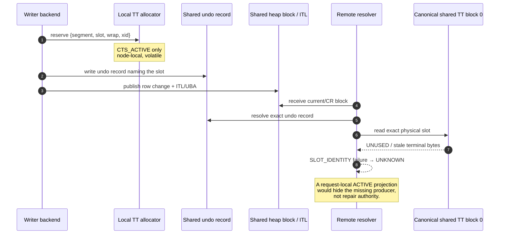
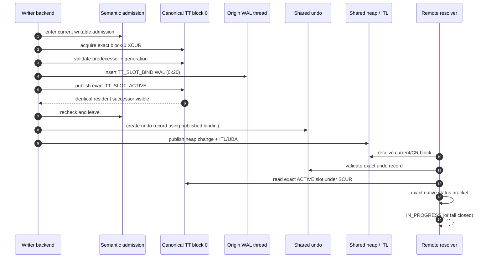
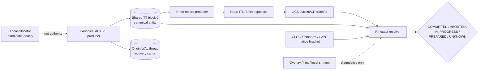
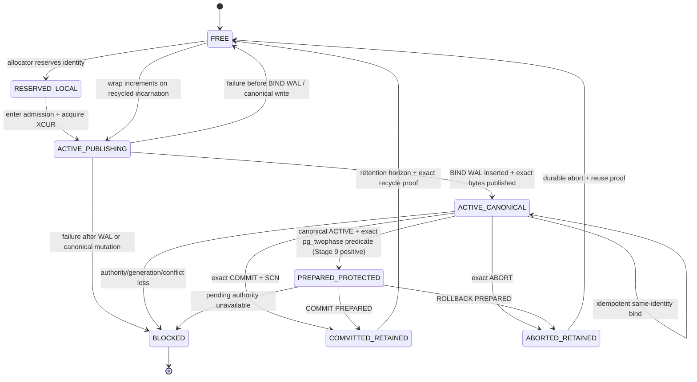
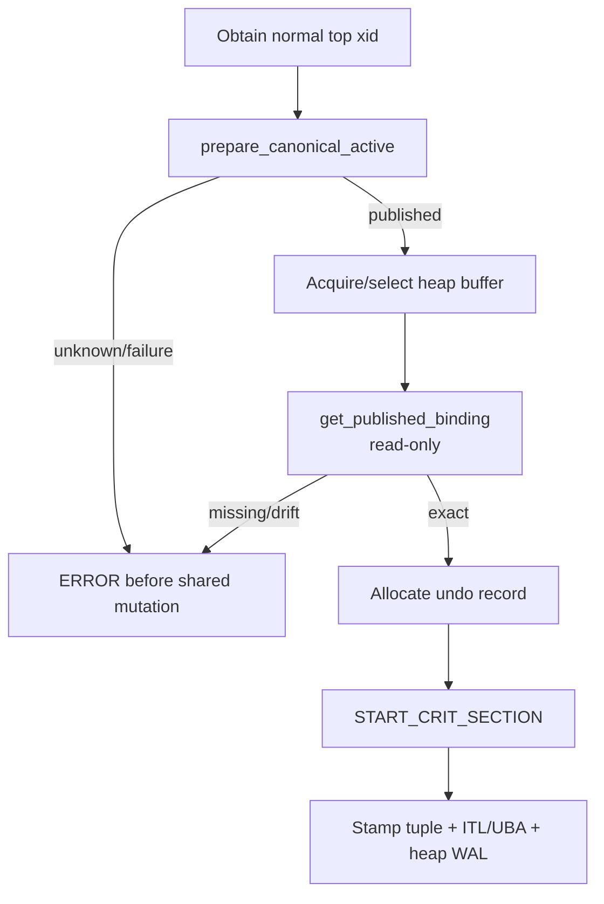
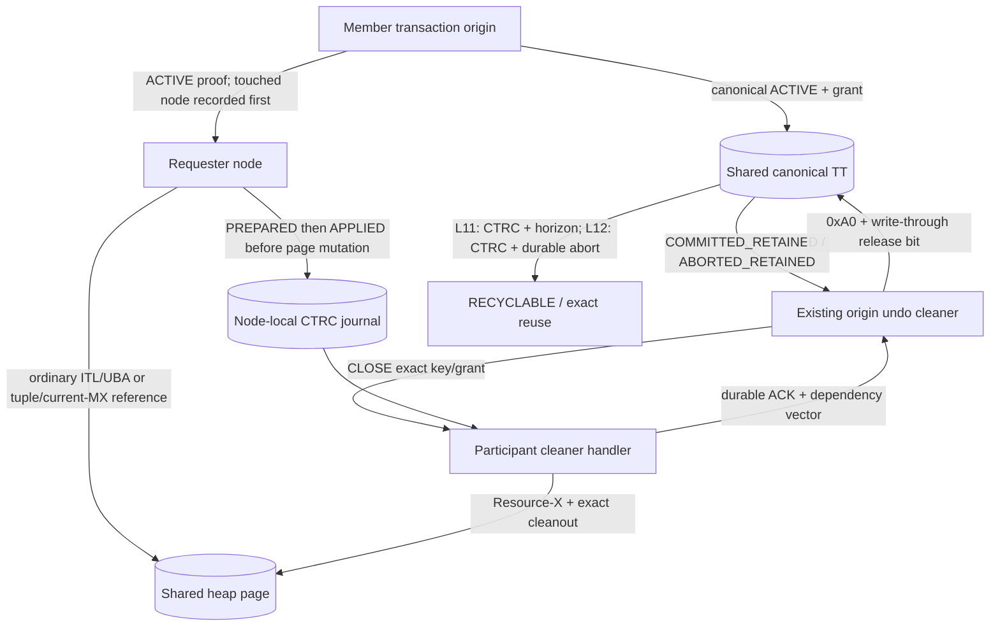
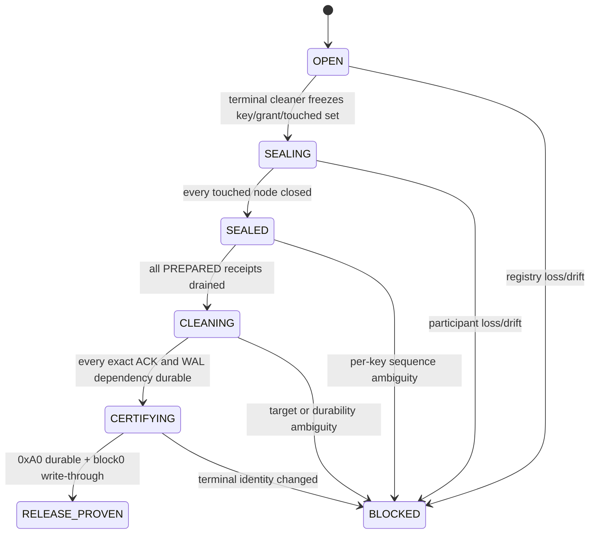

# AD-024 — Canonical ACTIVE transaction authority before shared ITL/UBA exposure

> **Status: USER APPROVED 2026-08-30; CTRC AMENDMENT APPROVED 2026-09-01**
>
> Date: 2026-08-30
> Scope: Stage 8 ordinary four-node point `UPDATE + COMMIT`, plus the minimum
> abort/restart/fail-closed seams required to keep that path correct
> Privacy: private design material; never copy this document, its reasoning, or
> its Oracle-to-PGRAC mapping into the public repository
> Product gate: the user approved the canonical ACTIVE producer and explicitly
> rejected request-local/current-owner/rolled-live projection as positive
> authority on 2026-08-30. On 2026-09-01 the user issued `APPROVE_CTRC`.
> Sections §21–§31, Spec 8.4D matrix v2, its checker and the CTRC implementation
> plan are the single frozen private handoff; product TDD follows that plan
> without reordering.

| Relationship | Document |
|---|---|
| Transaction identity predecessor | [AD-017](ad-017-cluster-transaction-identity.md) |
| Recovery/transaction-truth ownership | [AD-019](ad-019-oracle-rac-recovery-foundation.md) |
| Primary resolver consumer | [Spec 8.4](../specs/spec-8.4-oracle-synchronous-consistent-read.md) |
| Stage 8 executable current-MultiXact cross-product | [Spec 8.4D](../specs/spec-8.4d-current-mx-transaction-authority-state-matrix.md) |
| Side-state lifecycle owner | [RF-SIDE](../specs/spec-rf-side-typed-recovery-and-shared-terminal.md) |

---

## 0. Decision summary

The current Stage 8 transaction-visibility path has a locally scoped design
integration gap:

1. a heap page can expose an ITL/UBA reference that names a transaction-table
   slot;
2. the named canonical shared transaction-table slot is still zero, stale, or
   terminal from a previous incarnation;
3. the origin keeps the current owner only in a node-local allocator;
4. a remote resolver can therefore read an exact pointer but not the canonical
   transaction entity to which it points.

The frozen canonical-ACTIVE direction is:

> **Before the first dependent undo record or heap ITL/UBA can become externally
> visible, the owning transaction must publish an exact `TT_SLOT_ACTIVE` entity
> in the canonical shared undo transaction table. COMMIT and ABORT must
> transition that same entity, and no consumer may synthesize it from local
> memory, an overlay, a hint, native CLOG alone, or request-local bytes.**

This is a **local transaction/undo lifecycle design-integration repair**. It is
not a replacement for GCS, GES, GRD, Resource-X, R4, shared storage, or the
existing exact-locator resolver.

Spec 8.4D is the executable Stage 8 closure of this decision. It enumerates the
bounded physical-TT, current/rolled segment, owner, native-bracket,
whole-MultiXact and requester-composition state spaces. It adds no authority and
does not supersede this lifecycle. A state absent from that matrix must be
specified and table-tested before another same-chain product patch.

`APPROVE_CTRC` closes the previously unnamed owner inside `TT-A5`: canonical
terminal bytes are retained until the existing cleaner proves that every
Stage 8 reference capable of needing them—including ordinary ITL/UBA and
current-MX references—was discharged. This does not add a transaction-status
authority; it adds exact **release evidence** only.

The repair is organized as `TT-A0..TT-A7`:

| ID | Required outcome |
|---|---|
| `TT-A0` | Void the r46 consumer projection; retain only non-authoritative diagnostics. |
| `TT-A1` | Freeze the r45 evidence, the dangling-reference invariant, and exact authority vocabulary. |
| `TT-A2` | Freeze the canonical ACTIVE publication point, identity, state machine, WAL/replay shape, lock order, and failure polarity. |
| `TT-A3` | Add focused REDs that fail on an empty physical slot even when local allocator state exists. |
| `TT-A4` | Implement the minimum canonical ACTIVE producer before any dependent shared mutation. |
| `TT-A5` | Close ordinary COMMIT, ABORT, retention, rollover, and reuse on the same exact entity. |
| `TT-A6` | Bind the current Stage 8 resolver/visibility seam; keep broader recovery, 2PC, and MultiXact positives in their existing scope. |
| `TT-A7` | Run one deterministic end-to-end causal witness, then unchanged `t/400`, then four-node PRE. |

---

## 1. Why this AD exists

### 1.1 The now-proven contradiction

The current design corpus requires both of the following:

- Spec 8.4 transaction resolution returns `IN_PROGRESS` only for **exact active
  durable TT plus native in-progress**;
- the current ordinary binding path does **not** publish a durable/shared ACTIVE
  slot, and ordinary abort does not durably transition one.

Those statements cannot jointly support a positive cross-node ordinary DML
path. The missing producer used to be a known latent seam. Campaign r45 is the
first end-to-end evidence that the seam is the load-bearing failure in PRE.

### 1.2 Broken causal chain



The resolver is behaving correctly when it returns UNKNOWN. The invalid state
was created earlier, when a reference escaped before its canonical referent.

### 1.3 Corrected causal chain



The new ACTIVE record does not make uncommitted data visible. It makes the
transaction identity and state resolvable so the existing MVCC/undo rules can
correctly reconstruct or wait.

---

## 2. Evidence ledger

### 2.1 Evidence classes

| Label | Meaning | May carry a normative decision? |
|---|---|---|
| `ORACLE OFFICIAL FACT` | Directly supported by Oracle official documentation. | Yes, for the documented role/behavior only. |
| `EVIDENCE-BASED PGRAC IMPLICATION` | Required by combining Oracle roles with a proven PGRAC constraint. | Yes, when explicitly labeled as PGRAC. |
| `PGRAC ADAPTATION` | Exact PGRAC field, state, WAL, lock, or failure choice not published by Oracle. | Yes, only after project approval. |
| `CURRENT CODE FACT` | Read from the named product baseline or uncommitted diff. | Descriptive only. |
| `CAMPAIGN OBSERVATION` | Runtime evidence from a named attempt. | Descriptive; archival quality must be stated. |
| `PUBLICLY UNKNOWN` | Oracle public material does not close the question. | No Oracle claim may be inferred from it. |

### 2.2 Oracle official facts

| ID | Verified fact | Source | Consequence for this AD |
|---|---|---|---|
| `O24-01` | The first DML allocates an undo segment transaction-table slot and a transaction ID; the ID is undo segment, slot, and sequence. The example state is ACTIVE. | Oracle 26, [Transactions](https://docs.oracle.com/en/database/oracle/oracle-database/26/cncpt/transactions.html) | A data-changing transaction has a transaction-table identity during its active lifetime; terminal-only creation is not the Oracle role shape. |
| `O24-02` | The transaction-table entry for every active transaction points to its undo data in reverse application order. | Oracle 26, [Transactions](https://docs.oracle.com/en/database/oracle/oracle-database/26/cncpt/transactions.html) | The transaction entity and its undo are one lifecycle, not unrelated hints. This AD does not infer Oracle's exact pointer-update algorithm. |
| `O24-03` | The block header of every segment block contains an ITL; ITL entries identify committed/uncommitted changes and point to the undo-segment transaction table for transaction timing. | Oracle 18, [Data Concurrency and Consistency](https://docs.oracle.com/en/database/oracle/oracle-database/18/cncpt/data-concurrency-and-consistency.html) | A published ITL must not name a transaction-table entity that is absent from the authority used to resolve it. |
| `O24-04` | RAC read consistency uses undo and Cache Fusion; GCS/GES/GRD coordinate current and consistent block images between instances. | Oracle 18, [Data Concurrency and Consistency](https://docs.oracle.com/en/database/oracle/oracle-database/18/cncpt/data-concurrency-and-consistency.html); Oracle RAC, [Software Components](https://docs.oracle.com/database/121/RACAD/GUID-B1CFEBD7-9F45-45A8-B1EE-4699950885B4.htm) | GCS can correctly deliver a block and still expose a transaction-authority defect. The transaction producer cannot be replaced by a GCS consumer guess. |
| `O24-05` | At commit, the undo transaction table records COMMITTED and the commit SCN; LGWR writes remaining redo and the transaction SCN. Later block cleanout may remove ITL information after checking the undo header. | Oracle 26, [Transactions](https://docs.oracle.com/en/database/oracle/oracle-database/26/cncpt/transactions.html) | ACTIVE and COMMITTED are states of one transaction entity; cleanout is downstream of terminal proof. |
| `O24-06` | `V$TRANSACTION_TABLE` exposes undo-segment transaction identities and ACTIVE, COMMITTED, and PREPARED states. | Oracle 26, [`V$TRANSACTION_TABLE`](https://docs.oracle.com/en/database/oracle/oracle-database/26/refrn/V-TRANSACTION_TABLE.html) | State vocabulary is supported; PGRAC's bytes, opcodes, and lock sequence are not. |
| `O24-07` | In RAC, every instance may read undo blocks for transaction recovery/read consistency; an instance uses its own undo for ordinary transactions, while recovery ownership permits another instance to act on the failed instance's undo. | Oracle 26, [Automatic Undo Management in Oracle RAC](https://docs.oracle.com/en/database/oracle/oracle-database/26/adrac/rac_undo_tblspc.html) | Terminal reference discharge may cross instance boundaries, but ordinary ownership and recovery ownership remain distinct. It does not prove Oracle's internal release protocol. |
| `O24-08` | RAC database files and undo data are on cluster-accessible supported shared storage managed for all instances. | Oracle 26, [Administering Storage in Oracle RAC](https://docs.oracle.com/en/database/oracle/oracle-database/26/racad/administering-storage-in-oracle-rac.html) | A node death alone cannot prove the shared page reference disappeared; release requires an exact surviving owner/proof. |

### 2.3 Evidence-backed implication and unknown boundary

`I24-01` is the central implication:

> Because an externally visible PGRAC ITL/UBA carries an exact canonical TT
> identity, and because remote MVCC must decide through that canonical entity,
> the entity must reach canonical ACTIVE before the reference can escape.

Oracle public material does **not** disclose:

- the exact atomic ordering between Oracle's transaction-table ACTIVE update,
  undo creation, and ITL mutation;
- Oracle's internal WAL/redo payload for that state;
- its latch/enqueue order, retry protocol, or crash cut implementation;
- a PGRAC `0xFB` resource, `TTSlot`, `XLOG_UNDO_TT_SLOT_BIND`, or semantic
  admission token.

Therefore every exact mechanism in §§5–10 is a `PGRAC ADAPTATION`, not a claim
about Oracle internals.

### 2.4 Current code facts

Evidence baseline:

| Item | Exact evidence |
|---|---|
| Writer product HEAD | `b1f5d10fc83b24537cd779cbcb7c445a6096d9e6` |
| Relevant uncommitted visibility diff | SHA-256 `10ca9494543320ebb8cb4ffad6e020db6505853eb4c3c900aac2fdba3b433e8f` |
| Current Spec 8.4 working body | SHA-256 `f632fdfbb6ae77b4cb1ce7fbfc81b93297069874b483ca7d71db6e4633059989` |
| RF-SIDE working body | SHA-256 `d621a3a4852f8474890fe78a0436ab487019f4d377a890c049ede77e750b7ee1` |

The relevant code facts are:

1. `ClusterTTSlotCurrentOwner` is explicitly documented as **not shared or
   durable** and never a wire format.
2. `cluster_tt_recovery.c` states that on-disk header slots are never written
   ACTIVE and that BIND is not WAL-logged.
3. `cluster_runtime_visibility.c` constructs a stack `projected_slot`, assigns
   `TT_SLOT_ACTIVE`, and explicitly says no durable/shared byte changes.
4. That projection can be labeled with
   `CLUSTER_TX_PROOF_ORIGIN_DURABLE_TT_CLOG`, even though its ACTIVE input is
   not a durable TT byte.
5. `cluster_tt_local_get_or_create_binding()` reserves only the local allocator
   slot. Heap INSERT/DELETE/UPDATE later emit undo and stamp ITL/UBA.
6. opcode `0x20` is reserved by name for `XLOG_UNDO_TT_SLOT_BIND` but has no
   payload, emitter, decoder, preflight row, redo handler, or route.
7. normal COMMIT has a block-0 XCUR/resident successor path; normal ABORT only
   updates local status/allocator state. Durable abort exists only for the
   prepared path.
8. the current normal-commit writer does not compare an exact ACTIVE predecessor
   before stamping COMMITTED and does not consume a bind-captured segment
   generation.

### 2.5 r45/r46/r49 campaign evidence

| Attempt | Persisted identity | Observed result | Evidence quality / verdict |
|---|---|---|---|
| r45 `stage8-pre-20260830-happy-target-phase8-r45` | `runtime.json`: formation `2`, all nodes R4 generation `6` | Exact DATA locator, undo record, canonical block-0 generation, root/residency, and resident copy succeeded. Representative node0 reached phase 8 with `xid=4198160`, slot offset `28`, then failed first at `SLOT_IDENTITY`; the physical 32-byte slot was zero. Node1 (`xid=4198673`, slot `10`) and node3 (`xid=4213811`, slot `33`) showed the same physical absence. | First end-to-end causal isolation. The detailed diagnostic was captured live but not archived under the attempt; only runtime identity persists. It is root-cause evidence, not a valid PRE sample. |
| r46 `stage8-pre-20260830-happy-target-liveowner-r46` | `runtime.json`: formation `2`, all nodes R4 generation `6` | Launcher reached ClusterQuad-ready after about 894.609 seconds with the request-local ACTIVE projection in WIP. No workload/TPS sample was published. | `0/4`; setup readiness is not correctness or performance evidence. The projection must be voided. |
| r49 `stage8-pre-20260830-happy-target-currentexact-r49` | setup `runtime.json` and server logs retained under the attempt root | The fresh happy-path cluster reached ClusterQuad-ready, but no p1 or PRE sample was run. The attempt was stopped cleanly; postmasters exited and loop devices were detached in reverse order with artifacts preserved. | Diagnostic/setup evidence only. It cannot qualify the rejected projection, count toward PRE, or authorize performance work. |

No statement in this AD claims that PRE has passed.

---

## 3. Root cause and ownership

### 3.1 Root cause in one sentence

PGRAC publishes a shared heap ITL/UBA reference before publishing the exact
ACTIVE transaction entity named by that reference in canonical shared TT
block 0.

### 3.2 Module classification

| Module | Current role | Root-cause ownership |
|---|---|---|
| local TT allocator | reserves a slot/incarnation for the backend | Supplies a candidate identity, but is not canonical authority. |
| undo TT block 0 | canonical transaction state | **Missing ACTIVE producer and exact transition checks — primary owner.** |
| heap/ITL/UBA | publishes the dependent reference | Must be gated on prior canonical publication. |
| origin WAL/redo | makes lifecycle transitions recoverable | Missing BIND record/route/replay; terminal records need exact entity validation. |
| R4 transaction resolver | consumes canonical state | Correct to reject an absent slot; WIP projection is invalid. |
| GCS/GRD/Resource-X | routes current block authority and block images | Working substrate in r45; not the authority source for transaction state. |
| GES | serializes global resources/waits | Not the missing transaction producer. |
| CLOG/ProcArray/2PC | native corroboration/projection | May bracket canonical evidence; may not manufacture it. |



### 3.3 What is not being redesigned

- the `0xFB` Candidate-2 block-0 resource identity;
- SCUR for exact read and XCUR for exact mutation;
- Resource-X target-only authority;
- R4's exact locator, canonical wrap upgrade, native two-sample bracket, reply
  validation, or UNKNOWN polarity;
- GCS current/CR block transfer;
- GES/GRD master placement;
- shared storage format outside the existing 32-byte `TTSlot` and a versioned
  WAL carrier;
- Stage 9 shared catalog, full WAL-thread recovery, RECO, broad crash matrix,
  rolling upgrade, or deployment certification.

---

## 4. Normative invariants

| ID | Invariant |
|---|---|
| `INV24-01 NO-DANGLING-REF` | No undo record, heap ITL, tuple ITL index, GCS image, or resolver reply may expose a binding unless the exact canonical slot is already ACTIVE. |
| `INV24-02 ONE-ENTITY` | ACTIVE, COMMITTED, and ABORTED are transitions of one exact entity; terminal code cannot construct a different identity. |
| `INV24-03 EXACT-IDENTITY` | Identity is `{origin instance, canonical TT segment, segment generation, slot offset, slot wrap, xid}`. UBA record segment is a locator component, not a substitute canonical TT segment. |
| `INV24-04 CANONICAL-BYTES` | Only exact TT block-0 bytes protected by current authority can supply ACTIVE/terminal status. Local allocator, overlay, hint, request context, CLOG, or cached verdict cannot replace them. |
| `INV24-05 WAL-BEFORE-DEPENDENCY` | BIND WAL insertion and canonical ACTIVE application precede the first undo/heap WAL record that depends on the binding. |
| `INV24-06 XCUR-MUTATION` | Every live ACTIVE/COMMITTED/ABORTED mutation holds exact block-0 XCUR and exact resident content authority for the sampled generation. |
| `INV24-07 NO-RANK-INVERSION` | A backend must hold no heap content lock, GRD entry/shard lock, native/PGRAC SLRU lock, or second `0xFB` guard while waiting for ACTIVE XCUR. |
| `INV24-08 COMPARE-BEFORE-TRANSITION` | A state write applies only to a legal exact predecessor; no blind 32-byte overwrite is allowed. |
| `INV24-09 PUBLISH-AFTER-WRITE` | Resident successor bytes are published only after the canonical targeted write succeeds; they must be byte-identical. |
| `INV24-10 RECHECK-BEFORE-ESCAPE` | Admission, root, resource, generation, and binding identity are rechecked before marking the backend-local binding PUBLISHED. |
| `INV24-11 ABORT-NOT-ABSENCE` | Ordinary abort transitions the exact entity to ABORTED or leaves it ACTIVE/blocked; it never clears to UNUSED and never permits reuse without durable terminal evidence. |
| `INV24-12 REUSE-AFTER-TERMINAL` | Recycle/rollover cannot reuse a slot whose canonical state is ACTIVE or whose exact terminal transition is not recoverable. |
| `INV24-13 UNKNOWN-STAYS-UNKNOWN` | Missing, stale, ambiguous, conflicting, or unavailable canonical evidence returns UNKNOWN/fail-closed; no local projection upgrades it. |
| `INV24-14 NO-NEW-AUTHORITY` | This repair introduces no second transaction service, shared overlay authority, daemon, quorum object, or consumer-owned repair path. |

The core ordering can be written compactly as:

```text
CanonicalActive(T) happens-before DependentUndo(T)
CanonicalActive(T) happens-before HeapItlUbaVisible(T)
HeapItlUbaVisible(T) happens-before any remote resolution of that reference
Terminal(T) compare-transitions the same CanonicalActive(T)
Reuse(slot) happens-after recoverable Terminal(T) and retention proof
```

---

## 5. Exact identity and state model

### 5.1 Entity identity

```text
ClusterCanonicalTxnIdentity = {
    origin_instance,
    canonical_tt_segment_id,
    segment_generation,      // UndoSegmentHeaderData.wrap_count sample
    tt_slot_offset,
    tt_slot_wrap,            // TTSlot.wrap incarnation
    xid                      // corroborating owner, not a raw-xid search key
}
```

`UBA{record_segment, block, slot-directory, ...}` locates an undo record. The
record identifies the canonical TT segment and slot. A record-segment rollover
must not create another transaction entity.

### 5.2 State machine



`RESERVED_LOCAL` and `ACTIVE_PUBLISHING` are backend-local progress states, not
transaction truth. `PREPARED_PROTECTED` is likewise not a new TT status byte:
it means the same canonical ACTIVE entity plus an exact native prepared
predicate. Only `ACTIVE_CANONICAL`, that exact composite predicate, and exact
canonical terminal states may be consumed across nodes.

### 5.3 Exact slot images

| State | `xid` | `wrap` | `status` | `commit_scn` | `flags` | `first_undo_block` |
|---|---|---|---|---|---|---|
| ACTIVE | exact | exact | `TT_SLOT_ACTIVE` | invalid | zero unless separately specified | invalid in the Stage 8 minimum slice |
| COMMITTED | same | same | `TT_SLOT_COMMITTED` | valid exact commit SCN | preserved/validated | current approved terminal rule |
| ABORTED | same | same | `TT_SLOT_ABORTED` | invalid | preserved/validated | current approved abort/head rule |

The Stage 8 minimum slice does not claim that `first_undo_block` is Oracle's
exact chain-head mechanism. The existing heap UBA and undo record remain the
current visibility locator. A complete crash/survivor rollback head contract
remains owned by the existing recovery/Stage 9 scope; it may not be inferred
from this ACTIVE publication.

---

## 6. Publication API and lock order

### 6.1 Required API split

The existing get-or-create call runs inside heap content-lock regions. It must
not simply acquire block-0 XCUR there. The implementation must split the path:

```c
/* Called before any heap content lock. May wait, WAL-log, and perform I/O. */
bool cluster_tt_local_prepare_canonical_active(
    TransactionId top_xid,
    ClusterCanonicalTxnBinding *binding_out);

/* Called while heap locks may be held. Read-only, non-waiting, no I/O. */
bool cluster_tt_local_get_published_binding(
    TransactionId top_xid,
    ClusterCanonicalTxnBinding *binding_out);
```

The exact exported type is stack/backend-local, not wire authority:

```c
typedef struct ClusterCanonicalTxnBinding {
    uint32 segment_id;
    uint32 segment_generation;
    TransactionId xid;
    uint16 slot_offset;
    uint16 slot_wrap;
    uint8 origin_instance;
    uint8 publish_state;      /* local progress only */
    uint16 reserved16;
    XLogRecPtr active_lsn;    /* ordering witness only */
} ClusterCanonicalTxnBinding;
```

All reserved bytes must be zero. Exact size/offset assertions are mandatory if
the type is persisted or copied. If it remains backend-local, it must be named
and documented as non-authoritative.

### 6.2 `prepare_canonical_active` algorithm

```text
prepare_canonical_active(top_xid):
  1. Require cluster enabled, normal top xid, regular backend, writable current
     semantic admission, and no forbidden ranked lock held.
  2. If a backend binding is already PUBLISHED, recheck its immutable identity
     and return it. PUBLISHING, FAILED, or identity drift fails closed.
  3. Reserve one allocator slot. Capture canonical segment, current segment
     generation, slot offset, slot wrap, owner instance, and xid.
  4. Resolve the exact shared block-0 root and acquire resource 0xFB XCUR.
     Wait using the dedicated ACTIVE-publication wait event.
  5. Pin the exact admitted resident block-0 generation EXCLUSIVE. There is no
     storage-read, local-shmem, or strict-empty positive fallback after R4 OPEN.
  6. Read the exact predecessor and run the §7 transition table.
  7. Insert versioned XLOG_UNDO_TT_SLOT_BIND (reserved opcode 0x20).
  8. Apply the exact 32-byte ACTIVE successor to canonical storage; after
     success, copy the identical successor into the pinned resident frame.
  9. Recheck admission, root, XCUR ownership, generation, and exact successor.
 10. Release pin/XCUR/admission, mark the backend binding PUBLISHED, expose the
     active_lsn ordering witness, and return.
 11. On any pre-publication failure, publish no dependent reference. On a
     post-WAL/post-write failure, retain/fence the slot and fail closed; never
     return a usable binding.
```

### 6.3 DML call-site rule

Every cluster heap mutation must run the preparation hook after obtaining a
normal top xid but before acquiring a heap buffer content lock. The later
INSERT/DELETE/UPDATE/multi-insert/tuple-lock code may call only the read-only
published-binding accessor.



Preparing a binding for an attempted DML that later finds no row is safe: it
creates an orphan ACTIVE transaction entity with no heap reference. It remains
owned by the top transaction and is transitioned at commit/abort. This cost is
preferred to a rank inversion or dangling reference.

### 6.4 Lock order

```text
semantic modifier admission
  → exact 0xFB block-0 XCUR
    → exact resident block-0 content pin EXCLUSIVE
      → canonical 32-byte transition
    ← unpin
  ← release/cancel XCUR
← leave admission

only afterwards:
heap buffer pin/content lock → undo allocation → heap critical section
```

No implementation may wait for ACTIVE XCUR while holding heap content, a GRD
entry/shard lock, a native/PGRAC SLRU lock, another block-0 guard, or a GCS DATA
continuation.

---

## 7. Compare-before-transition tables

### 7.1 Live ACTIVE publication

Let `R` be the requested entity and `D` the exact disk/resident predecessor.

| Predecessor | Decision | Rationale |
|---|---|---|
| all-zero/UNUSED, exact segment generation, allocator proves reserved R | `APPLY ACTIVE` | First use of the slot. |
| COMMITTED/ABORTED, exact segment generation, `R.wrap > D.wrap`, retention/recycle proof exact | `APPLY ACTIVE` | Legal new slot incarnation. |
| ACTIVE with exact R identity and exact bytes | `IDEMPOTENT` | Retry of the same publication. |
| any status with `D.wrap > R.wrap` | `STALE / FAIL CLOSED` live; stale-skip only in ordered redo | A newer incarnation exists. |
| same wrap, different xid | `CONFLICT / FAIL CLOSED` | ABA or allocator corruption; never overwrite. |
| ACTIVE for another identity | `CONFLICT / FAIL CLOSED` | Live owner collision. |
| segment generation mismatch/unknown | `FAIL CLOSED` | Segment identity is not proven. |
| malformed flags/status/SCN | `CORRUPTION` | Structural contradiction. |

### 7.2 Terminal transition

| Requested transition | Required predecessor | Result |
|---|---|---|
| COMMIT | exact ACTIVE entity; native commit record is being formed; valid commit SCN | same entity COMMITTED |
| ordinary ABORT | exact ACTIVE entity; no commit terminal; abort WAL recoverable | same entity ABORTED |
| COMMIT PREPARED | exact protected entity + exact pending/2PC proof | same entity COMMITTED (Stage 9 positive owner) |
| ROLLBACK PREPARED | exact protected entity + exact pending/2PC proof | same entity ABORTED (Stage 9 positive owner) |
| duplicate exact terminal | byte-identical terminal | idempotent |
| terminal over zero/different/higher incarnation | none | fail closed; no overwrite |
| opposite terminal polarity | none | corruption/blocked; never last-writer-wins |

The current blind `tt_slot_write_committed()` behavior is insufficient for this
model. The shared transition primitive must validate the exact predecessor
under the same pinned generation before it writes.

---

## 8. WAL, redo, and durability contract

### 8.1 BIND carrier

Opcode `0x20` keeps its reserved meaning:

```text
XLOG_UNDO_TT_SLOT_BIND v1
  segment_id
  segment_generation
  slot_offset
  slot_wrap
  xid
  owner_instance
  format_version
  flags/reserved == 0
```

The final C layout must:

- use fixed-width fields and explicit zero padding;
- have `StaticAssertDecl` size and offset checks;
- be decoded through the single cluster-undo decoder;
- be included in cold and online preflight/route totality;
- appear in `pg_waldump` through the existing rmgr descriptor;
- never carry a pointer, backend-local address, allocator index outside the
  exact slot, or request-local proof kind.

The record does not need an independent flush before ordinary heap mutation.
It must be inserted first. The later dependent undo/heap WAL record has a higher
LSN, so any legal WAL-before-data flush covers the BIND record. A crash before a
dependent reference can leave only an orphan ACTIVE entity, which is safe and
must be resolved as aborted/retained by recovery.

This ordering applies to WAL-logged cluster data. Any unlogged/non-WAL shared
mutation needs a separately approved recovery carrier or must fail closed; this
AD does not infer durability from a later record that does not exist.

### 8.2 Normal COMMIT

Normal commit may continue to fold the TT terminal delta into the transaction
commit record, but the folded form must carry or consume the same exact
`segment_generation` and require an exact ACTIVE predecessor. The commit SCN,
terminal CLOG projection, and TT transition must remain one commit durability
decision.

The sequence is:

```text
exact ACTIVE predecessor under XCUR
  → build exact COMMITTED successor
  → apply canonical/resident successor
  → return/include the versioned TT delta in the commit record
  → commit WAL flush / CLOG terminal
  → expose COMMITTED only when canonical + native evidence agree
```

A window in which TT bytes read COMMITTED but native commit is not durable must
remain UNKNOWN. It is never sufficient for visibility.

### 8.3 Ordinary ABORT

Adding durable ACTIVE makes a local-only ordinary abort insufficient. The
ordinary abort path must use the existing ABORT semantic carrier (opcode
`0x60`) in a version that includes/consumes the exact segment generation.

Because ordinary abort has no later commit-record flush, it must satisfy one of
these equivalent safe outcomes before slot reuse:

1. explicitly flush the abort record, apply ABORTED, then mark the allocator
   terminal/recyclable; or
2. apply ABORTED but retain the slot as non-recyclable until the abort LSN is
   proven durable.

The Stage 8 minimum selects **outcome 1** for simplicity and proof locality.
Abort latency is secondary to avoiding ACTIVE leaks or unlogged reuse. An abort
failure after shared heap mutation cannot silently continue: it fences the
transaction/resource and escalates according to the existing critical
durability policy; it does not clear the slot.

### 8.4 Redo decision

For BIND replay:

| Disk/header relation to record | Redo decision |
|---|---|
| disk segment generation greater | stale-skip |
| equal generation + exact already ACTIVE | idempotent-skip/apply-identical |
| equal generation + legal older terminal/free predecessor | apply ACTIVE |
| equal generation + higher wrap | stale-skip |
| equal generation + same wrap different xid/opposite live owner | PANIC corruption |
| disk segment generation lower | PANIC: missing/out-of-order segment lifecycle |

COMMIT/ABORT replay must use the same exact-entity table. It may not inherit a
last-writer-wins rule that accepts same-wrap/different-xid.

### 8.5 Crash-cut matrix

| Cut | Persisted/visible state | Required recovery/runtime behavior |
|---|---|---|
| before local reserve | none | no effect |
| after local reserve, before BIND WAL | local-only | no dependent reference; backend cleanup frees it |
| after BIND WAL, before ACTIVE write | WAL may exist | redo can materialize orphan ACTIVE; no false visible data |
| after ACTIVE write, before resident copy | canonical bytes may exist | publication does not return; scope blocked/retried; no dependent reference |
| after resident ACTIVE, before undo record | orphan ACTIVE | later commit/abort or recovery resolves it |
| after undo record, before heap ITL | orphan undo + ACTIVE | no heap-visible dangling reference |
| after heap WAL insert, before flush | ordered uncommitted changes | recovery replays ACTIVE before dependent heap/undo; transaction remains nonterminal |
| after COMMITTED write, before commit durable | canonical terminal candidate plus native live window | never COMMITTED; an exact stable Spec 8.4D current-MX visibility row may conservatively remain IN_PROGRESS and wait/recheck, while other unsupported combinations remain UNKNOWN |
| after commit durable | exact terminal | resolver may return COMMITTED with matching SCN |
| after ABORT WAL insert, before its explicit flush | canonical slot remains ACTIVE and non-recyclable | redo may later apply ABORTED; live abort does not write/recycle yet |
| after ABORT flush, before ABORTED write | durable terminal WAL, canonical slot still ACTIVE | redo or the live path applies the exact ABORTED successor |
| after ABORT durable | exact terminal | resolver may return ABORTED under native precedence |
| after terminal, before reuse | retained identity | old readers resolve; reuse remains gated |

The Stage 8 campaign need not re-import the broad Stage 9 crash matrix, but
focused unit/fault tests must prove every mutation side of this table fails
closed.

---

## 9. Resolver and visibility contract

### 9.1 Consumer rule

The exact resolver continues to:

1. validate the page/undo locator;
2. acquire canonical block-0 SCUR with no forbidden lock held;
3. validate generation/root/resident bytes;
4. read the exact physical slot;
5. bracket native CLOG/ProcArray/2PC state;
6. apply the frozen precedence table;
7. return a request-local verdict without installing authority.

### 9.2 Mandatory removals

The following must not participate in a positive verdict:

- construction of a stack `TTSlot` with `TT_SLOT_ACTIVE` from
  `ClusterTTSlotCurrentOwner`;
- the rolled-segment native-CLOG-only `IN_PROGRESS` shortcut;
- proof kind `ORIGIN_DURABLE_TT_CLOG` when the TT input is not a canonical
  physical slot;
- overlay/hint repair on a physical miss;
- storage fallback outside the admitted resident current image;
- a request-local cache that survives authority/generation revalidation.

Allocator snapshots may remain in diagnostics only. A counter or log field
must never alter the decision.

### 9.3 Outcome truth table

| Canonical TT | Native bracket | Outcome |
|---|---|---|
| exact ACTIVE | stable IN_PROGRESS, no exact prepared | `IN_PROGRESS` |
| exact ACTIVE | exact prepared + stable native nonterminal | `PREPARED` (where already in scope) |
| exact COMMITTED + valid SCN | stable IN_PROGRESS, no exact prepared, and every current/rolled owner bracket in Spec 8.4D exact | conservative `IN_PROGRESS`; never expose commit SCN or terminal cleanout |
| exact COMMITTED + SCN | matching terminal CLOG/SCN | `COMMITTED` |
| exact ABORTED | terminal native ABORTED | `ABORTED` |
| absent/stale/conflicting/unavailable | anything nonterminal | `UNKNOWN` |
| any canonical/native terminal conflict | conflicting | `UNKNOWN` or corruption according to structural proof; never guessed terminal |

---

## 10. End-to-end normal path

```mermaid
sequenceDiagram
    autonumber
    participant C as Client on node N
    participant X as xact/heap preflight
    participant T as TT block-0 owner/current
    participant W as node N WAL thread
    participant H as heap/undo path
    participant P as Peer resolver

    C->>X: BEGIN; UPDATE key
    X->>X: allocate normal top xid
    X->>T: prepare canonical ACTIVE under XCUR
    T->>W: insert BIND 0x20 (ordered, no sync flush)
    T-->>X: exact ACTIVE published
    X->>H: acquire heap content lock
    H->>H: create undo record
    H->>H: stamp tuple + ITL/UBA + heap WAL

    par peer read while transaction open
        P->>H: request current/CR block
        P->>T: exact SCUR lookup
        T-->>P: ACTIVE exact entity
        P-->>P: native in-progress bracket
        P-->>P: construct old CR / wait as operation requires
    and owner commits
        C->>X: COMMIT
        X->>T: exact ACTIVE → COMMITTED under XCUR
        X->>W: folded commit + TT delta
        W-->>C: durable commit acknowledged
    end

    P->>T: later exact lookup
    T-->>P: COMMITTED + matching SCN
```

An ordinary point update performs at most one ACTIVE publication per top-level
transaction, regardless of how many rows/pages it later changes.

---

## 11. Subtransactions, savepoints, 2PC, and recovery boundary

### 11.1 Stage 8 minimum

- The top-level transaction entity is published before ordinary heap DML.
- A savepoint rollback does not terminally abort the top transaction; it
  remains ACTIVE and the existing PG/subtransaction semantics decide which
  changes survive.
- Child/subtransaction locators must resolve to an exact top entity through the
  already approved native parent chain. Missing top identity remains UNKNOWN.
- Ordinary COMMIT and ordinary ABORT transition the top entity exactly.
- `PREPARE TRANSACTION` cannot use this AD to bypass any existing fail-closed
  guard.

### 11.2 Not pulled into Stage 8

- full positive PREPARE/COMMIT PREPARED/ROLLBACK PREPARED and RECO;
- survivor reading another failed instance's complete undo chain and performing
  full physical rollback;
- repeated recoverer failure;
- broad crash/restart/future-join matrix;
- full MULTIXACT/COMMIT_TS projection recovery;
- rolling/mixed-version WAL compatibility certification.

Those remain with the existing Stage 9/recovery owners. This AD defines enough
identity/lifecycle invariants that those owners cannot later treat a local
allocator snapshot as canonical truth.

---

## 12. Observability and operator behavior

### 12.1 Wait event

ACTIVE publication is a new blocking site and needs one dedicated wait event:

```text
ClusterUndoTtActivePublish
```

It covers the bounded wait for exact block-0 XCUR/current content during the
pre-DML publication hook. It must not cover ordinary heap lock time, undo data
write time, or terminal resolution. Existing `ClusterCfTerminalResolve` and
`UndoTtLookupRemote` retain their meanings.

### 12.2 Counters

Expose monotonic counters in `pg_cluster_state`, category `undo`:

| Key | Meaning |
|---|---|
| `tt_active_publish_attempt_count` | First/publication attempts, excluding read-only binding reuse. |
| `tt_active_publish_ok_count` | Exact ACTIVE successors published. |
| `tt_active_publish_idempotent_count` | Same-entity retry observed. |
| `tt_active_publish_failclosed_count` | Publication denied before a usable binding was returned. |
| `tt_active_predecessor_conflict_count` | Slot/generation/xid/wrap conflict. |
| `tt_active_redo_apply_count` | BIND redo applications. |
| `tt_active_redo_stale_skip_count` | Proven older BIND records skipped. |
| `tt_abort_durable_count` | Ordinary exact ABORTED transitions made recoverable. |
| `tt_dependency_without_active_count` | Defensive invariant violation; must remain zero in valid runs. |

Counters are evidence only. Setting, resetting, or overflowing a counter cannot
change a verdict. Healthy transactions must not emit per-row warnings.

### 12.3 SQLSTATE and logs

No new SQLSTATE is required for the Stage 8 minimum:

| Failure | Existing polarity |
|---|---|
| admission/formation/root/current authority unavailable before DML | retryable cluster reconfiguration/unavailable error (`53R60` family as currently owned) |
| remote exact TT outcome unprovable | `53R97` / exact current resolver reason |
| terminal authority unresolved where that consumer is active | `53R9O` |
| malformed canonical slot or opposite terminal | data corruption / fail-closed according to existing critical-section policy |
| allocator capacity | existing program/undo capacity error |

One structured server log at fail-closed may include the exact entity,
formation, root, generation, transition, and reason. It must not include row
contents, credentials, or repeated warning storms.

### 12.4 Background processes

This design adds no process or worker. Existing WAL redo, startup recovery, and
undo cleanup consume the new record through their existing ownership. If a
new daemon appears in implementation, that is a scope expansion and must stop
for a new decision.

---

## 13. TDD and verification contract

### 13.1 Focused REDs before product implementation

| RED | Required failing witness |
|---|---|
| `RED24-01` | Local allocator reports exact CTS_ACTIVE while physical slot is zero; resolver remains UNKNOWN. |
| `RED24-02` | Any request-local projected ACTIVE is rejected by source/static test. |
| `RED24-03` | Heap/undo dependency helper refuses a binding whose publish state is not PUBLISHED. |
| `RED24-04` | ACTIVE bind predecessor table covers zero, exact retry, legal recycle, higher wrap, same-wrap/different-xid, active collision, and generation drift. |
| `RED24-05` | COMMIT cannot stamp over zero, stale, different xid/wrap, or wrong generation. |
| `RED24-06` | ordinary ABORT cannot make allocator slot recyclable before abort WAL durability. |
| `RED24-07` | BIND redo applies/idempotently skips/stale-skips/PANICs exactly per §8.4. |
| `RED24-08` | DML source-order test proves ACTIVE preparation occurs before heap content-lock acquisition and undo/ITL publication. |
| `RED24-09` | decoder/preflight/rmgrdesc/online route recognize `0x20`; unknown length/version/reserved bits fail closed. |
| `RED24-10` | feature-disabled build has no active publication call or changed vanilla WAL. |

### 13.2 Deterministic single-transaction causal witness

Before another PRE campaign, run a small four-node witness:

1. node0 begins and updates one known row without committing;
2. inspect the exact physical canonical slot and prove ACTIVE identity bytes;
3. node1 reads the row under a new snapshot and resolves the transaction as
   IN_PROGRESS using the physical slot, not local origin memory;
4. prove the returned row image/lock behavior matches the operation contract;
5. node0 commits; inspect the same slot as COMMITTED with exact SCN;
6. node2 obtains a new snapshot and sees the committed value;
7. repeat with ordinary abort and prove the same slot becomes ABORTED and no
   new snapshot sees the aborted value;
8. inject a missing/mismatched ACTIVE slot and prove `53R97` with zero false
   visible/terminal outcome.

The witness must print one correlation ID and the exact entity at each step. A
counter alone is not evidence.

### 13.3 Campaign order

```text
focused unit/source tests
  → deterministic single-transaction causal witness
  → existing p1 transaction/undo closure
  → unchanged t/400, exact 236/236
  → four-node PRE at the frozen resource configuration
  → adaptive saturation only after correctness
```

r46 is void as PRE evidence. Round numbers may increase, but a setup-only
runtime or a round containing forced cancel/error/timeout is not a sample.

---

## 14. Existing-code change contract

| Area | Required change | Forbidden expansion |
|---|---|---|
| `cluster_tt_local.*` | add pre-lock canonical preparation; persist binding generation/publish state; make in-lock accessor read-only | shared overlay authority; background publisher |
| `heapam.c` and related DML paths | call preflight before heap content lock; require published binding before undo/ITL | acquire block0 XCUR inside heap lock; workload-specific bypass |
| `cluster_tt_durable.*` | one compare-before-transition primitive for ACTIVE/COMMIT/ABORT; exact resident successor | blind overwrite; storage-only or shmem-only positive path |
| `cluster_undo_xlog.*` | implement versioned `0x20` payload, emit/decode/preflight/redo/route | second decoder or out-of-band journal |
| xact commit fold | carry/recheck exact generation and ACTIVE predecessor | terminal-only identity creation |
| ordinary abort | recoverable ABORTED transition before reuse | clear-to-UNUSED; local allocator-only terminal |
| runtime visibility | remove projected/rolled-live positive outcomes; retain optional diagnostics | synthesize physical slots; CLOG-only positive verdict |
| rmgr descriptor | identify/describe BIND with exact fields | expose private pointers or ambiguous raw bytes |
| observability | one wait event and bounded counters | counter-controlled correctness |
| tests | focused state/order/redo/e2e evidence | changed judge, skip, whitelist, timeout relaxation |

No public GUC is added. The safety rule cannot be disabled.

---

## 15. Alternatives and disposition

| Alternative | Disposition | Reason |
|---|---|---|
| A. Canonical ACTIVE producer before reference exposure | **Selected** | Repairs the producer invariant and follows the verified Oracle role shape. |
| B. Request-local ACTIVE projection from allocator shmem | **Rejected / TT-A0** | Consumer manufactures missing authority; not shared, durable, or remotely reproducible. |
| C. Treat empty slot + native in-progress as ACTIVE | **Rejected** | Raw/native state cannot prove canonical slot incarnation, segment generation, or alias safety. |
| D. Continue terminal-only TT writes | **Rejected** | Leaves every live cross-node transaction with a dangling ITL/UBA reference. |
| E. Promote TT overlay/hints to authority | **Rejected** | Creates a second volatile transaction service and restart/retention ambiguity. |
| F. Publish ACTIVE after heap mutation | **Rejected** | Preserves the crash/race window and violates NO-DANGLING-REF. |
| G. Add XCUR directly at current in-lock binding call sites | **Rejected** | Violates frozen lock order and risks heap↔block0 inversion. |
| H. Redesign all TT block0 storage into a new buffer manager now | **Deferred, not required** | May be a later measured optimization; current correctness has an in-scope mainline with existing 32-byte slot/XCUR machinery. |
| I. Serialize all writers through node0 | **Rejected** | Evades the required four-node writer path and is not RAC parity. |

---

## 16. Risks and mitigations

| ID | Risk | Severity | Mitigation/proof |
|---|---|---:|---|
| `R24-01` | ACTIVE XCUR added under heap content lock creates deadlock | critical | mandatory pre-lock API split; lock-held assertions and source-order tests |
| `R24-02` | same-wrap/different-xid overwrite causes ABA | critical | segment generation + slot wrap + xid compare-before-transition |
| `R24-03` | COMMIT stamps a zero/stale slot | critical | exact ACTIVE predecessor required under the same pin/generation |
| `R24-04` | ordinary abort leaves permanent ACTIVE or reuses it early | critical | recoverable ABORT transition; no allocator recycle before durability |
| `R24-05` | BIND WAL replays after segment reuse | critical | generation-ordered redo decision; stale skip or PANIC, never blind apply |
| `R24-06` | resident bytes differ from canonical write | critical | one successor struct, post-write byte-identical copy, recheck before release |
| `R24-07` | root/admission drifts mid-publication | high | entry and exit recheck; return no published binding on drift |
| `R24-08` | new WAL opcode bypasses RF-SIDE route/preflight | high | decoder/route totality RED; cold and online share one decoded shape |
| `R24-09` | per-transaction block0 mutation reduces TPS | high | exactly once per top transaction, no bind fsync, owner-local fast path where proven; profile only after GREEN |
| `R24-10` | early ACTIVE without heap row leaks slots | medium | same top transaction terminal transition; recovery orphan handling; counters |
| `R24-11` | savepoint rollback incorrectly aborts top transaction | critical | top entity remains ACTIVE; savepoint tests and native parent-chain contract |
| `R24-12` | projection code remains reachable in a rare branch | critical | source absence test plus physical-slot-missing negative e2e |
| `R24-13` | new record breaks disabled/old build | high | `USE_PGRAC_CLUSTER` guards, fixed ABI asserts, catversion/format evaluation |
| `R24-14` | logs/counters become success authority | medium | instrumentation read-only; decision functions accept no metric input |
| `R24-15` | broad recovery/2PC work silently returns to Stage 8 | high | §11 boundary and current-scope test matrix; full positives remain deferred |

---

## 17. Definition of done

- [ ] `TT-A0`: request-local ACTIVE and rolled-live positive paths are absent
      from production resolver code.
- [ ] `TT-A1`: r45 root-cause witness and evidence limitations are recorded.
- [ ] Oracle facts, PGRAC implications, adaptations, and unknowns are visibly
      separated.
- [ ] Frozen Spec 8.4 no longer simultaneously requires active durable TT and
      forbids an ordinary durable binding.
- [ ] One exact canonical identity type includes segment generation and slot
      incarnation.
- [ ] DML calls canonical preparation before any heap content lock.
- [ ] In-lock DML code performs no block0 wait/I/O and accepts only PUBLISHED.
- [ ] BIND `0x20` has fixed payload, emitter, decoder, preflight, redo, route,
      descriptor, and negative length/version/reserved tests.
- [ ] ACTIVE apply is compare-before-transition under exact XCUR/generation.
- [ ] normal COMMIT transitions exact ACTIVE to COMMITTED with matching SCN.
- [ ] normal ABORT transitions exact ACTIVE to recoverable ABORTED before reuse.
- [ ] terminal writes cannot overwrite zero, stale, different-xid, different-
      wrap, different-generation, or opposite-terminal entities.
- [ ] resident successor and canonical targeted write are byte-identical.
- [ ] no overlay, hint, local allocator snapshot, or CLOG-only result can produce
      a positive canonical outcome.
- [ ] no new worker, correctness GUC, second decoder, or second authority exists.
- [ ] wait event and counters have live call sites and cannot affect verdicts.
- [ ] feature-disabled build remains free of cluster publication/WAL changes.
- [ ] focused state, ordering, redo, abort, reuse, and fail-closed tests pass.
- [ ] deterministic open-transaction/commit/abort four-node witness passes with
      physical-slot evidence.
- [ ] unchanged `t/400` reports exact `236/236`.
- [ ] PRE obtains at least four valid samples only after correctness; setup-only,
      error, timeout, forced-cancel, zero-op, and nonzero-RC rounds remain invalid.
- [ ] no Stage 9 completion gate is claimed by this Stage 8 repair.

---

## 18. Decisions and Q&A

### Q1. Is this still only a wiring bug?

No. The substrate and much of the consumer wiring exist, but the lifecycle has
no canonical ACTIVE producer. That is a localized design-integration gap plus
missing implementation, not merely a missed function call.

### Q2. Does this mean the whole RAC architecture is wrong?

No. r45 reached exact DATA/undo/block0 generation/root/residency through the
current GCS/GRD/R4 path. The failure was the empty named transaction entity.

### Q3. Why not let the origin's ProcArray prove ACTIVE?

ProcArray can corroborate liveness, but it does not prove the canonical segment,
generation, slot, wrap, or ownership named by the remote ITL/UBA. It cannot
repair an absent shared entity.

### Q4. Why publish before undo, not merely before the heap critical section?

This gives one simple invariant: no dependent shared record exists before its
transaction entity. It also orders BIND WAL before every dependent undo/heap
record and simplifies crash proof.

### Q5. Why not fsync BIND synchronously?

The bind is not a commit. WAL insertion before dependent WAL plus ordinary
WAL-before-data ordering is sufficient: a pre-reference crash leaves only an
orphan; a durable dependent record necessarily has earlier BIND WAL available.
Normal abort, which lacks a later commit flush, has a separate durability rule.

### Q6. Does ACTIVE make uncommitted changes visible?

No. The resolver still requires native status and snapshot/undo logic. ACTIVE
means the transaction exists and is in progress; readers reconstruct the
appropriate CR image or wait according to the operation.

### Q7. Why must ordinary abort change?

Once ACTIVE is canonical, leaving abort local would leak or prematurely recycle
that canonical entity. ABORT must close the same lifecycle.

### Q8. Does this add a global transaction server?

No. Each transaction publishes into its owner partition/segment using existing
block0 authority. There is no new daemon, queue, leader, or quorum service.

### Q9. Is `first_undo_block` fully solved here?

No. Stage 8 visibility continues to use the exact heap UBA/undo record. Full
survivor physical rollback and chain-head lifecycle stay with recovery/Stage 9.
This AD neither fabricates nor claims that positive capability.

### Q10. Can implementation optimize ACTIVE publication immediately?

Only after the causal path is GREEN and profiling identifies it as the first
bottleneck. An optimization must preserve the exact same authority, ordering,
and failure table.

### Q11. What happens if an implementation needs a new daemon or alternate
authority to meet performance?

That is outside this decision. Stop, classify it as a new design deviation,
and obtain a separate decision; do not hide it as an optimization.

### Q12. What is the first proof before another PRE round?

One open transaction across two nodes: the remote resolver must read a real
physical ACTIVE slot, then the same slot must become COMMITTED or ABORTED. If
that causal witness is absent, another broad campaign is premature.

---

## 19. Implementation order after approval

```mermaid
flowchart LR
    A0[TT-A0<br/>remove projection] --> A1[TT-A1<br/>freeze invariant/evidence]
    A1 --> A2[TT-A2<br/>spec + state/WAL/lock contract]
    A2 --> A3[TT-A3<br/>focused REDs]
    A3 --> A4[TT-A4<br/>canonical ACTIVE producer]
    A4 --> A5[TT-A5<br/>commit/abort/reuse closure]
    A5 --> A6[TT-A6<br/>resolver integration]
    A6 --> W[Single-txn causal witness]
    W --> T400[unchanged t/400<br/>236/236]
    T400 --> PRE[PRE correctness samples]
    PRE --> PERF[adaptive saturation]
```



Detailed post-approval coding plan must name exact call sites and tests, but it
must not change this order. `TT-A*` is a subplan under the existing
transaction/undo authority item; it does not renumber the Stage 8 master queue.

---

## 20. Required document amendments after user approval

1. Amend Spec 8.4 so its `exact active durable TT` resolver requirement and
   ordinary binding/abort producer contract are consistent.
2. Amend the RF-SIDE current slice to route/verify the BIND record without
   importing full Stage 9 recovery positives.
3. Amend AD-017 carrier status only where the approved segment-generation
   identity is consumed; do not reopen unrelated identity alternatives.
4. Update the WAL format/decoder inventory and recovery route table.
5. Update private Stage 8 campaign status to void r46 and require the
   deterministic causal witness before PRE.
6. Add only user-facing behavior/diagnostic documentation to the public repo;
   never link the public manual to this AD or disclose this reasoning.

The 2026-08-30 approval amendment updates Spec 8.4, RF-SIDE, AD-017, the WAL
inventory, and the private campaign ledger in the same private change set. With
those amendments present, `PRODUCT AUTHORIZATION=1`. This authorization is
strictly bounded to §19: it does not authorize PRE before the deterministic
single-transaction causal witness and unchanged `t/400` are GREEN.

---

## 21. CTRC amendment: why terminal publication alone is insufficient

### 21.1 Newly proven gap

AD-024 originally froze the producer half correctly:

```text
canonical ACTIVE
→ publish dependent undo/ITL/tuple/current-MX reference
→ exact COMMIT or ABORT on the same physical slot
```

It did not identify who proves that a terminal slot is no longer referenced.
The original `COMMITTED_RETAINED/ABORTED_RETAINED → RECYCLABLE` wording named a
result but not a producer, state machine, wire, durability boundary or crash
cut. The current WIP therefore chose the only locally safe behavior—retain
peer-mode ABORTED forever. That prevents r96's early reuse but exhausts the
finite `256 × 48` slot pool.

The missing half is:

```text
terminal slot
→ close future reference publication
→ enumerate every already-published dependent reference
→ clean/rewrite it under exact page authority
→ prove all resulting WAL dependencies durable
→ certify release on the same physical TT identity
→ only then RECYCLABLE
```

This is a local design-integration gap in terminal lifecycle, not evidence that
canonical ACTIVE, undo/ITL, GCS/GES, Resource-X or shared storage must be
replaced.

### 21.2 Oracle alignment and the public unknown

Oracle documents the architectural roles used here:

- first DML obtains an undo-segment transaction-table slot and transaction ID;
- ITL points toward transaction/undo state;
- commit records terminal state and commit SCN in the transaction table;
- RAC instances can read undo, and recovery can act on another instance's undo
  under recovery ownership.

Sources remain `O24-01..O24-06` plus Oracle RAC [Automatic Undo Management in
Oracle RAC](https://docs.oracle.com/en/database/oracle/oracle-database/26/adrac/rac_undo_tblspc.html)
and [Administering Storage in Oracle
RAC](https://docs.oracle.com/en/database/oracle/oracle-database/26/racad/administering-storage-in-oracle-rac.html).

The public documentation does not reveal Oracle's exact transaction-slot
reference census, delayed cleanout release algorithm, wire fields or latch
order. We therefore make only this evidence-backed mapping:

| Oracle-aligned role | PGRAC implementation | Evidence class |
|---|---|---|
| one undo transaction entity across active and terminal lifetime | exact physical `TTSlot` | evidence-based implication |
| downstream block cleanout after terminal truth exists | participant page/current-MX cleanout | evidence-based implication |
| undo remains RAC-accessible under ownership rules | origin-coordinated touched-node cleanup | evidence-based implication |
| exact reference journal, seal generations, `0xA0`, release bit and ACK vector | CTRC | **PGRAC adaptation** |

No sentence in this amendment claims Oracle implements CTRC internally.

## 22. Decision

The approved decision is:

> The canonical physical TT remains the sole ACTIVE/COMMITTED/ABORTED
> authority. A terminal slot is reusable only after Canonical Terminal
> Reference Census (CTRC) has closed its exact ACTIVE grant generation,
> discharged every registered Stage 8 physical-TT-dependent reference, made all cleanout
> dependencies durable, and written an exact release certificate/flag to that
> same canonical slot. Missing evidence retains; no time or status guess is
> allowed.

The decision has six non-negotiable consequences:

1. reference tracking happens before publication, not by a later best-effort
   scan;
2. status authority and release evidence stay separate;
3. terminal commit/abort is not a synchronous all-node barrier;
4. only touched nodes participate in the later seal;
5. the existing undo cleaner owns progress; there is no new daemon;
6. crash uncertainty before the durable certificate loses liveness but never
   permits reuse.

## 23. Component and authority topology



The arrows have different semantics:

- `TT → resolver` is transaction authority;
- `grant → journal` is permission to publish a tracked reference;
- `journal → cleaner` is possible-reference evidence;
- `ACK → certificate` is release evidence;
- none of the last three can answer visibility or transaction status.

## 24. Grant-before-reference protocol

### 24.1 Origin grant

The canonical ACTIVE publisher reserves an origin-key entry before publication
and opens it with an empty touched set and nonzero `grant_generation` before
returning success. An interrupted/missing entry is not an empty registry and
retains. For every positive ACTIVE/SELF current-MX proof, and before every
local ordinary ITL receipt prepare, the member origin samples the canonical
slot exactly as already approved and records the requester node, admitted boot
incarnation and capability-record generation **before** reply enqueue or local
page mutation.

The send decision is atomic at the semantic level:

| Canonical sample | Registry state | Record result | Proof result |
|---|---|---|---|
| exact ACTIVE/SELF | OPEN | success/idempotent | positive + nonzero grant |
| exact ACTIVE/SELF | CLOSING/CLOSED | n/a | UNKNOWN/DENIED |
| terminal/UNKNOWN | any | n/a | terminal/UNKNOWN + zero grant |
| exact ACTIVE but capacity/boot/admission/capability mismatch | any | refuse | UNKNOWN/DENIED |

Recording a node that never publishes is a safe over-approximation. Sending a
proof before recording is forbidden because it creates an unsealable
under-approximation.

The grant is a node-global monotonic `uint32` allocated when an exact ACTIVE key
opens and remains constant until close. Seal and global journal sequences are
node-global monotonic `uint64`; each participant key/grant also allocates an
exact contiguous `key_sequence=1..N`; receipt-slot reuse has its own nonzero
generation. Zero, wrap or exhaustion never aliases: the key/slot blocks or
retires. A node identity that changes boot/capability/formation/admission while
the same grant is open blocks instead of replacing the frozen touched record.

### 24.2 Participant receipt

The requester allocates a fixed shared-journal slot outside heap content lock.
It binds the full transaction key, publication identity, descriptor/member,
reference kind, intended target and exact grant. It returns only `READY` or
`REFUSE`; it does not mutate a page.

Under heap content lock, the caller may only:

1. compute a nonmutating exact ITL/tuple successor plan;
2. compare the current target/proof/grant/formation identity;
3. finalize a preallocated pending ITL slot or tuple offset;
4. write final target fields into its exclusively owned receipt slot;
5. atomic-CAS `PREPARED → APPLIED` with release semantics;
6. after the successful CAS, publish the page/descriptor mutation.

No lock fallback, allocation, network, storage I/O, `0xFB`, extent operation,
sleep or victim selection is legal in this phase. Any mismatch returns retry
before shared mutation. The existing ITL touch list is only an eager terminal
hint: its observed implementation may drop invalid ownership captures and skip
drifted stamps, so it cannot replace the pre-mutation CTRC receipt.

## 25. Terminal seal and reference census

### 25.1 Terminal transition remains cheap

The transaction's exact COMMIT/ABORT path writes
`COMMITTED_RETAINED/ABORTED_RETAINED`, clears the release-proven flag and wakes
the existing cleaner as needed. It does not wait for all nodes. Durable commit
latency therefore remains governed by the existing commit/WAL contract, not by
CTRC network cleanup.

### 25.2 Seal phases



The touched set is frozen from the origin registry. Death, timeout or lack of a
capability is not permission to delete a member. A missing registry is not an
empty registry. A zero-node seal is legal only after a positive exact proof
that the key never issued an ACTIVE grant.

At each participant, CLOSE makes receipt creation/apply fail for the exact key
and grant. When CLOSE arrives before the delayed proof has created local state,
it installs an exact closed zero-range tombstone through certificate
notification; later prepare cannot reopen it. The handler then waits for all
already-PREPARED receipts to become
APPLIED or CANCELLED. Backend death does not cancel a receipt; without a
positive owner transition, it blocks normal Stage 8 release.

### 25.3 Census semantics

The participant freezes the contiguous per-key range `key_sequence=1..N` and
visits every APPLIED reference under exact current page authority. Global
journal sequence is unique but may have gaps from interleaved keys. The sole
empty ACK is a persistent close-before-proof tombstone encoded as `N=0`; missing
state is never empty. Cleanout is conservative:

- an ordinary ITL/UBA receipt becomes clean only when its exact slot
  incarnation is absent through a censused reuse path or is durably projected
  to a terminal-independent page state;
- data COMMIT `NEEDS_CLEANOUT`, an invalid/missing touch proof and a typed
  terminal-stamp skip remain dependent and are not release evidence;
- terminal lock-only and aborted updater members may be removed;
- a committed updater waits while any ACTIVE/UNKNOWN companion exists;
- once it is the sole semantic updater, the existing page-local committed
  projection and ITL commit SCN must be WAL-protected before TT dependency is
  removed;
- any surviving ACTIVE member receives a successor receipt before predecessor
  removal and a successor descriptor is durable before tuple publication;
- target absence is positive only because every reference-moving path obeys
  successor-before-predecessor;
- DROP/TRUNCATE/relation rewrite and physical identity reuse extend the existing
  KO/SMGR chokepoint: every matching bounded CTRC receipt is cancelled/cleaned
  and durable before KO `DONE` and physical removal; a bare missing relation is
  not release proof;
- unknown descriptor/member/topology/page authority retains.

This is not survivor physical rollback. It is terminal reference discharge on
the current Stage 8 page/MultiXact path. Stage 9 still owns recovery-driven
rollback, repeated recoverers and positive journal reconstruction after node
loss.

## 26. Durability and release certificate

The participant ACK is the Spec 8.4D fixed 416-byte per-key-range proof with
counts, empty/nonempty polarity, digest, participant identity, highest cleanout
WAL LSN and exactly 16 per-origin required-LSN entries. `ClusterSfDepVec`
semantics may be reused, but CTRC lifecycle state is not stored there; CTRC
retains its own exact-key ownership. A cleanout-created page dependency is
still installed in the ordinary Smart Fusion BufferTag store so page writeback
cannot outrun a foreign origin WAL dependency.

Digest encoding is frozen: SHA-256 over canonical little-endian,
length-delimited bytes, participant rows ordered by key sequence and 416-byte
ACKs ordered by node id, with the domain separators frozen in Spec 8.4D and its
JSON. The participant carries 32 bytes; `0xA0` carries the first 16 bytes of the
full ACK-set digest. The digest is an integrity/idempotency check, never a
replacement for exact key/range/count/result/LSN validation.

The origin needs exactly one byte-valid ACK for every touched node. It rejects
missing, extra, duplicate, stale or conflicting ACKs, sorts them by node id and
computes the certificate digest. It then rechecks the terminal slot under
block-0 X-current and emits the Spec 8.4D §12.10 fixed 96-byte
`XLOG_UNDO_TT_SLOT_CTRC_RELEASE (0xA0)`.

The WAL record and `TT_SLOT_FLAG_CTRC_RELEASE_PROVEN` are release evidence,
never status. Redo may set only that flag on an exact COMMITTED/ABORTED
predecessor. Every transition to terminal first clears it; every ACTIVE,
RECYCLABLE, UNUSED, INVALID or fresh successor requires it clear. These rules
close xid/wrap/segment-generation ABA.

The runtime emitter validates live root/formation/admission. Redo validates the
WAL bytes and exact storage/segment/slot predecessor but does not require the
historical formation to be currently OPEN; otherwise an already-durable release
could become unreplayable after restart.

```text
L11 COMMITTED_RETAINED -> RECYCLABLE
  iff exact terminal identity
  AND durable canonical CTRC release bit
  AND valid commit_scn
  AND same-epoch valid folded horizon
  AND commit_scn <= horizon

L12 ABORTED_RETAINED -> RECYCLABLE
  iff exact durable ABORTED identity
  AND durable canonical CTRC release bit
```

CTRC cannot remove the commit horizon, and ABORT does not invent one.

## 27. Lock-order decision

CTRC inherits AD-024's two-phase law and adds no exception:

```mermaid
flowchart LR
    A[Reserve/freeze under CTRC lock] --> B[Release CTRC lock]
    B --> C[Network / block0 / Resource-X / I/O]
    C --> D[Acquire one heap content lock]
    D --> E[Conditional local receipt CAS]
    E --> F[Page mutation + WAL insert]
    F --> G[Release page lock]
    G --> H[Wait WAL/dependency durability]
    H --> I[Exact CTRC revalidation]
    I --> J[Block0 X-current certificate last]
```



No page lock waits on CTRC and no CTRC lock waits on a page, wire, WAL flush or
block0. Current allocator GC is correspondingly two-phase: snapshot shmem
candidate, release allocator lock, sample canonical release/horizon, reacquire
and exact-revalidate, then free.

## 28. Bounded resources and performance posture

CTRC uses fixed activation-sized shared memory, not an unbounded catalog and not
a correctness-tuning GUC:

```text
origin keys = CLUSTER_UNDO_SEGS_PER_INSTANCE × TT_SLOTS_PER_SEGMENT
participant keys = origin keys
                   × min(max(declared node count, 1),
                         CLUSTER_SF_DEP_MAX_ORIGINS)
receipts = NBuffers + MaxBackends × CLUSTER_CURRENT_MX_MAX_MEMBERS
ACK summaries = participant keys
```

The current compile-time values are respectively `256`, `48`, `16` and `256`;
the symbolic formula is normative so a future constant change cannot silently
desynchronize capacity and encoding limits.

All arithmetic is overflow-checked. Inability to allocate the frozen tables
blocks target OPEN. Runtime full refuses before page mutation and wakes the
existing cleaner outside locks. No LRU/TTL eviction, deadline extension or
untracked fallback is legal.

The ordinary commit fast path does not execute a global close. CTRC cost is:

- one origin touched-bit/grant update per positive ACTIVE proof;
- one local receipt allocation/CAS per new ordinary ITL incarnation or
  terminal-dependent current-MX reference; repeated same-transaction writes to
  the exact same ITL receipt reuse it after an under-lock exact plan check;
- asynchronous seal/cleanout later, only across touched nodes.

Any optimization must preserve this exact authority and release sequence. Cache
or batching work begins only after correctness and profile evidence; it cannot
be introduced merely because the protocol looks expensive.

Standalone or non-OPEN source behavior remains unchanged and emits no CTRC v2
traffic. A peer-mode target lacking formation-wide CTRC capability, or whose
admitted node ids cannot be represented exactly by the frozen 16-entry
dependency vector, refuses; it does not fall back to the pre-CTRC positive
current-MX path.

## 29. Crash boundary

Before durable `0xA0`, every ambiguous or lost component retains the slot. This
includes origin registry loss, participant boot/reconnect, unresolved PREPARED,
target ambiguity, lost ACK, undurable dependency and coordinator failure.

After durable `0xA0`, the canonical release bit is sufficient for `L11/L12`;
participant notification only reclaims local ACK/journal summaries. A crash in
that notification window may leak participant memory state until recovery but
cannot reverse or fabricate the durable certificate.

Stage 8 requires deterministic negative crash-cut tests for this polarity. It
does not claim positive origin/participant reconstruction after loss; that
liveness capability remains Stage 9.

## 30. Rejected alternatives

| Alternative | Disposition | Reason |
|---|---|---|
| permanently retain ABORTED/COMMITTED in peer mode | rejected as final design; retained only as temporary fail-closed WIP | finite slot exhaustion |
| release ABORTED immediately because it has no commit SCN | rejected | surviving current-MX member can still require exact ABORTED truth |
| use global oldest SCN/time only | rejected | horizon says nothing about an uncleaned aborted/current-MX reference |
| scan all heap pages after terminal without pre-registration | rejected | no complete bounded census and move/ABA gaps |
| transaction COMMIT waits for every node cleanout | rejected | unnecessary global commit latency; terminal retain + async cleaner is sufficient |
| journal/ACK becomes a terminal status cache | rejected | creates a second authority and repeats the projection defect |
| durable tombstone/archive for every terminal transaction | deferred/rejected for Stage 8 | expands storage/authority/recovery surface; CTRC exact release is enough |
| new cleaner daemon or global transaction coordinator | rejected | existing origin cleaner and partitioned TT ownership suffice |
| treat node death as reference release | rejected | death does not prove durable shared pages or moved references were cleaned |

## 31. CTRC amendment definition of done

The amendment is implemented only when all are true:

- [ ] Spec 8.4D JSON/checker proves the receipt and seal FSMs total with
      fail-closed defaults.
- [ ] Positive ACTIVE/SELF proof cannot be enqueued before touched-node/grant
      registration.
- [ ] Every ordinary ITL/UBA and named current-MX publication has PREPARED and
      APPLIED before page mutation; all heap restart boundaries remain native
      and pre-mutation.
- [ ] Invalid/missing legacy ITL touch proof and typed terminal-stamp skip keep
      the ordinary receipt APPLIED; only exact terminal-independent projection
      discharges it.
- [ ] Terminal close deterministically wins or loses every prepare/apply race
      without an untracked reference.
- [ ] PREPARED is never cancelled from timeout/backend death.
- [ ] Cleanout semantics cover lock-only, updater, zero/one/many survivors,
      HOT and absent/ambiguous target cases.
- [ ] Every successor reference and descriptor precedes predecessor removal.
- [ ] Participant ACK covers exact per-key `1..N`, uses the sole byte-exact
      zero-range encoding for `N=0`, and its counts/digest/WAL dependency
      frontiers are exact and durable.
- [ ] The 128-byte request, 64-byte reply header, 416-byte ACK and all-zero
      BLCKSZ reply tail match the frozen offsets and decoder polarity.
- [ ] `0xA0` is fixed 96 bytes; redo/descriptor/side decoder/route inventory
      and release flag matrix are exact.
- [ ] `L11` requires CTRC plus the valid commit horizon; `L12` requires CTRC
      plus durable ABORTED.
- [ ] Current and rolled segment reuse both reject a missing/wrong release bit;
      fresh templates clear it.
- [ ] Capability `0x00400000`, current-MX wire v2, forward kind 11 and reply 30
      are formation-gated with reserved holes/previous tail preserved.
- [ ] Shared-memory capacity is activation-sized and runtime exhaustion refuses
      before mutation.
- [ ] The generated source census has zero unclassified reference or release
      writers.
- [ ] The focused CTRC suite and deterministic four-node causal witness are
      GREEN before unchanged `t/400`, R11 and PRE.

Until every item is proven, the existing permanent-retention WIP remains the
safe fallback. It must not be removed merely because the design document is
committed.
