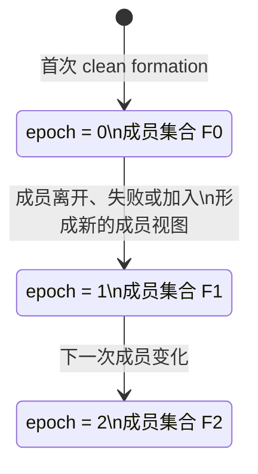
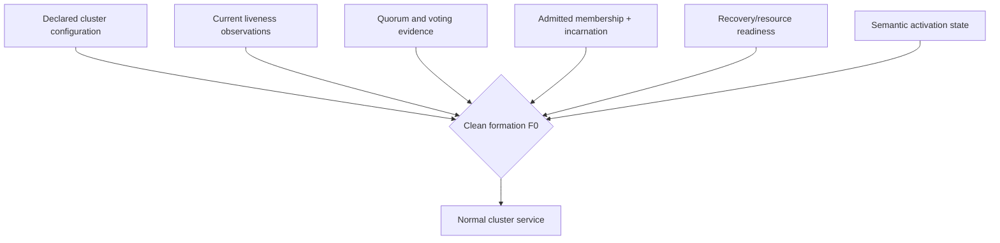
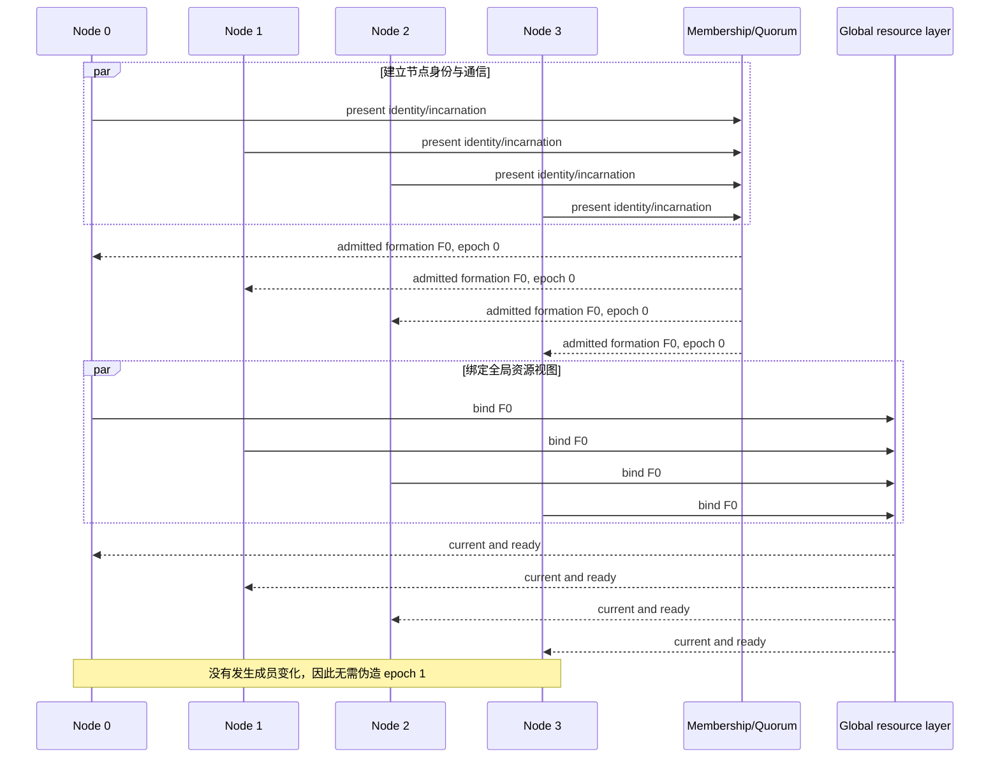
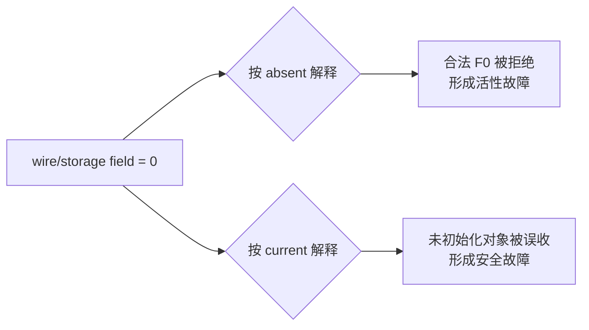
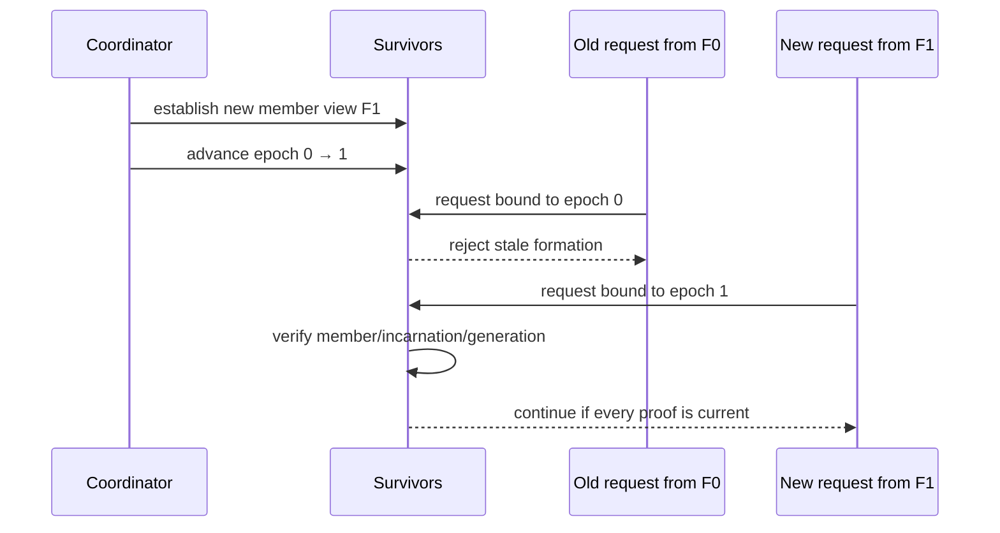

# 01：Clean Formation、逻辑 Epoch 与合法零值

[返回索引](README.md) · [下一篇：当前性与事务终态权威](02-currentness-and-terminal-authority.md)

## 1. 先把三个概念分开

在集群系统里，“版本”经常被混成一个概念。至少要区分：

| 概念 | 回答的问题 | 是否要求从 1 开始 |
|---|---|---|
| membership epoch | 这条消息/证据属于哪一次成员集合？ | 不要求；`0` 可以是第一个合法版本 |
| instance incarnation | 这是该 node slot 的哪一次进程生命期？ | 通常以非零身份避免与 absent 混淆 |
| admission/record generation | 这条准入证据属于哪一次语义发布？ | 取决于协议；必须精确匹配当前记录 |

`epoch` 不是 wall clock，也不是“系统成熟度分数”。它是一个离散的逻辑版本：只有发生需要区分前后成员视图的事件时才推进。



若首次 formation 没有发生成员变化，那么从 `0` 人为跳到 `1` 不是“更安全”，而是制造了一次不存在的历史事件。

## 2. Clean formation 是什么

这里的 clean formation 指：一组已配置、同构的实例在无待处理成员变化的条件下，完成当前成员身份、quorum、资源协调和服务准入的建立。

它不等于：

- 配置文件里写了四个 node；
- 四个 TCP 连接都建立；
- 四个 heartbeat 都是 ALIVE；
- 四个 postmaster 都完成启动；
- 所有节点恰好观察到同一个整数。

它是一个合取事实：



其中 epoch 只是 `F0` 的一个坐标。不能拿一个坐标代替整个 formation，也不能因为这个坐标恰好为零就否定其余证据。

## 3. 首次启动的正常时序

下面是行为级时序，不对应 Oracle 或 PGRAC 的私有消息名：



这里有两个关键点：

1. 所有参与者必须把 `0` 当作一个可在线携带、比较和复验的真实值。
2. “初始值”不等于“未初始化”。未初始化必须由独立的存在位、状态枚举、generation 或有效性证明表示。

## 4. 当前性是等式，不是正数测试

对某个请求 `r`，可把最基本的 epoch 当前性写成：

```text
EpochCurrent(r) :=
    r.formation_epoch == admission.formation_epoch
    AND admission.formation_epoch == snapshot.formation_epoch
    AND snapshot.formation_epoch == current_membership_epoch
```

若四个值都为 `0`，等式仍成立：

```text
0 == 0 == 0 == 0  → current
```

若请求来自旧 formation，即使数值大于零，也必须拒绝：

```text
request=7, admission=8, snapshot=8, current=8  → stale
```

因此下面的判断没有安全意义：

```text
epoch > 0
```

它只能证明“发生过至少一次数值推进”，不能证明：

- 请求属于当前成员集合；
- 发送者仍是 admitted member；
- incarnation 没有变化；
- 准入记录没有被替换；
- 事务 origin 与 undo/TT 记录一致；
- provider 在返回结果期间 formation 没有变化。

## 5. 为什么不能让零同时表示 absent

假设一个字段同时使用下面两种含义：

```text
0 = 首个合法 formation
0 = 没有 formation / 没填字段
```

接收方无法仅凭该字段区分二者。常见后果有两类：



正确做法是分离“值”和“存在性”：

| 维度 | 示例表达 |
|---|---|
| epoch value | `0, 1, 2, ...`，每个值都可能合法 |
| object exists | 明确的 valid/present 状态 |
| identity valid | 非空 node/incarnation 或完整复合 key |
| admission active | current generation + open state |
| terminal proof valid | proof kind + durable source + exact echo |

## 6. 成员变化后才推进

当成员集合真正变化时，epoch 用来切开变化前后的证据：



注意：`epoch=1` 也不能单独授权请求。它只是让旧 `epoch=0` 请求可以被明确识别；新请求仍要通过身份、资源和事务权威验证。

## 7. 四个示例

| 场景 | observed epoch | current epoch | 其他证据 | 结果 |
|---|---:|---:|---|---|
| 首次四节点 clean formation | 0 | 0 | 全部 current | 可继续验证，不因零值拒绝 |
| F0 请求延迟到第一次重配置后 | 0 | 1 | 即使签名正确 | stale，拒绝 |
| F1 请求但发送者 incarnation 已更新 | 1 | 1 | identity mismatch | 拒绝 |
| F1 请求、身份正确，但 transition 已关闭 | 1 | 1 | admission closed | 拒绝或重试 |

“可继续验证”不等于无条件成功。它只表示 epoch 这一维没有失败，后续权威条件仍必须全部成立。

## 8. Oracle 行为映射

**Oracle 已验证。** Oracle RAC 允许不同节点上的多个实例访问同一个数据库；Cache Fusion 自动同步实例 buffer cache，GCS、GES 与 GRD 共同完成跨实例协调。Oracle Clusterware 的 CSS 负责成员控制并通知 node join/leave，voting files 用于节点成员判断。参见：

- [Introduction to Oracle RAC](https://docs.oracle.com/en/database/oracle/oracle-database/26/racad/introduction-to-oracle-rac.html)
- [Introduction to Oracle Clusterware](https://docs.oracle.com/en/database/oracle/oracle-database/26/cwadd/introduction-to-oracle-clusterware.html)

**基于公开证据的推断。** 已完成正常启动和成员建立的 RAC 集群能够直接进入多实例服务；公开资料没有显示需要先制造一次虚假的 node join/leave，才能让 GCS/GES 处理跨实例工作。

**PGRAC 自研适配。** PGRAC 公开代码把初始 membership epoch 定义为 `0`，在真实重配置时单调推进。Oracle 是否使用相同初值、相同宽度或相同传播算法，官方没有披露。

下一篇把这个原则带入更困难的问题：在当前 epoch 为零时，如何确认另一个实例产生的事务已经 COMMIT 或 ABORT。
