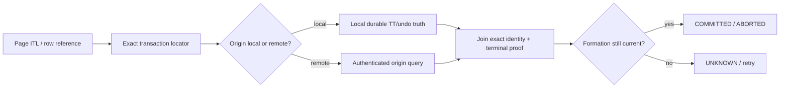
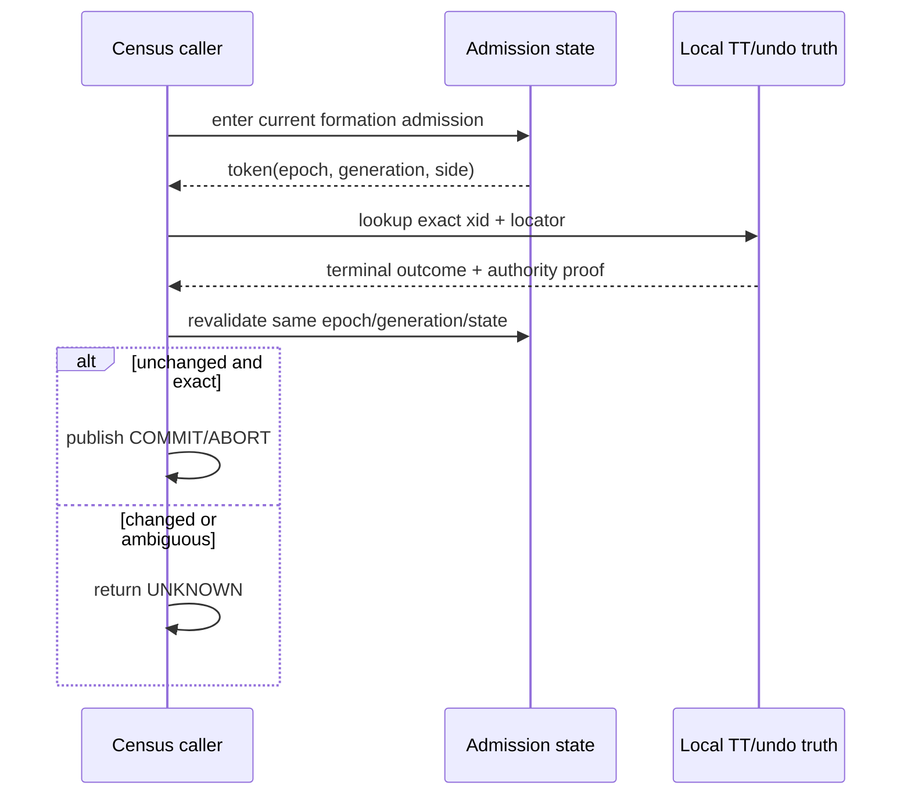
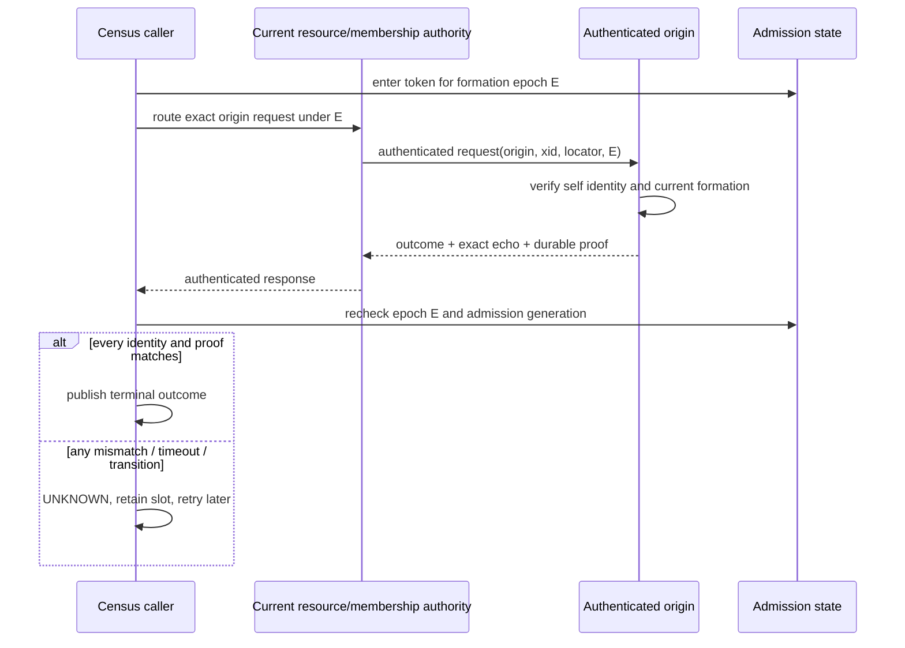
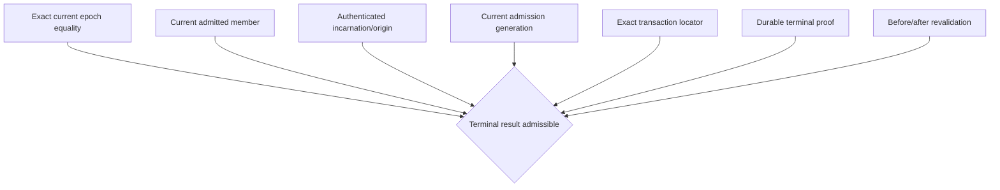
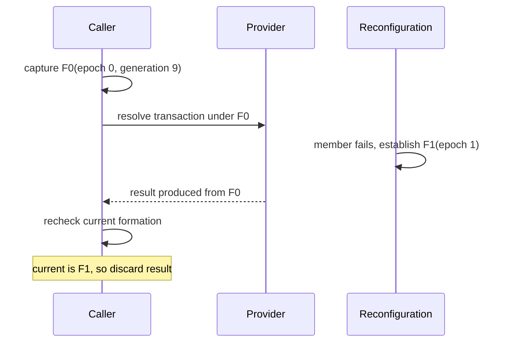
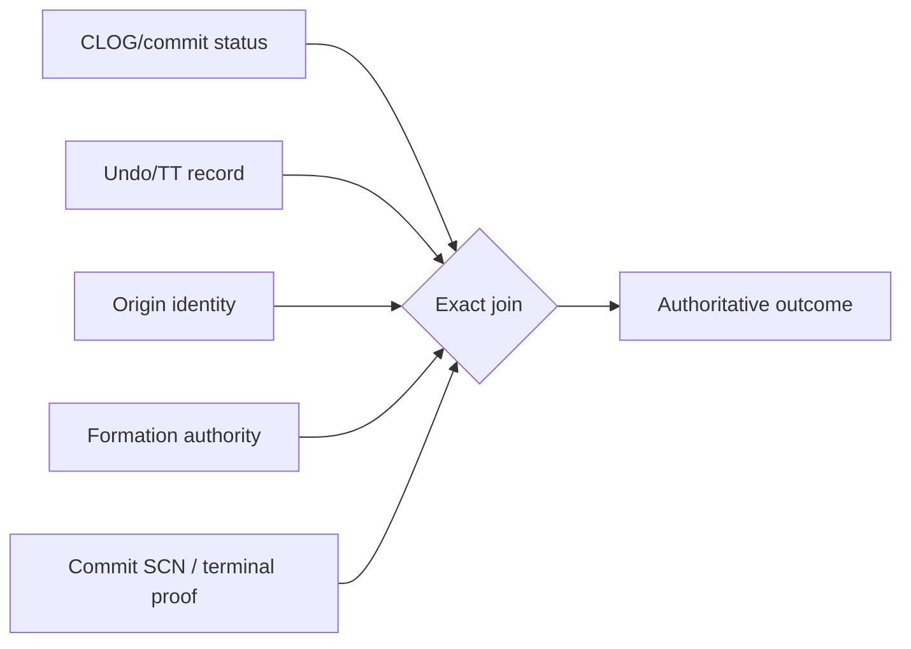
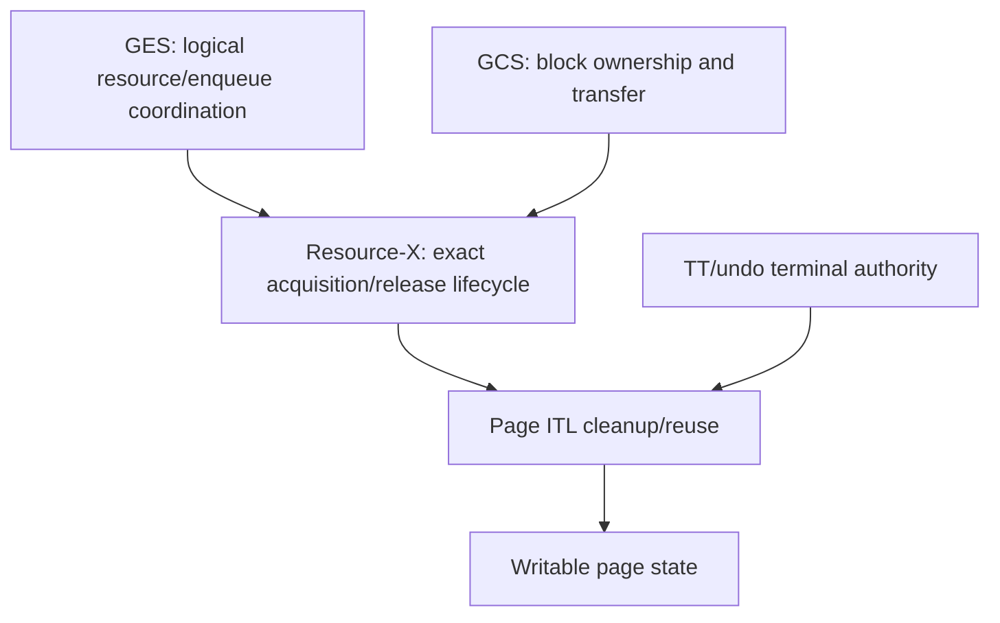

# 02：当前性、事务终态与多维权威

[上一篇：Clean formation 与 epoch](01-clean-formation-and-epoch.md) · [返回索引](README.md) · [下一篇：安全不变量与故障矩阵](03-safety-invariants-and-failure-matrix.md)

## 1. 为什么事务终态比 membership 更难

一个页面上的事务槽可能只告诉读取者：某行由事务 `X` 修改，事务记录位于某个 undo/TT 位置。它不能单独回答：

- `X` 是否已经提交；
- 若已提交，commit SCN 是多少；
- `X` 是否属于当前已认证的 origin instance；
- 这个结果属于哪个 formation；
- 读取期间 origin 是否重启、成员关系是否变化；
- 返回结果是 durable truth、临时 cache，还是过期 projection。

这就是 terminal census 的任务：**对需要清理或复用的事务槽，逐项确认其精确事务身份和不可逆终态；无法证明时返回 UNKNOWN，而不是猜测。**



## 2. 终态不是节点状态的函数

下面三个推导都不安全：

```text
node is DEAD      → transaction ABORTED       // 错
node is ALIVE     → transaction IN_PROGRESS   // 错
CLOG bit observed → globally authoritative    // 证据可能不完整
```

节点死亡后，某事务可能已经把 commit 记录持久化，只是还没完成页面 cleanout。节点存活时，事务也可能已提交或回滚。因此，membership 决定“谁可以提供或继承权威”，而 TT/undo/redo/CLOG 等持久事实决定具体终态。

## 3. 权威由多个正交维度组成

可以用两个复合对象理解终态解析。

### 3.1 Formation admission

```text
F = <
    membership_epoch,
    admitted_member_set,
    member_incarnations,
    admission_generation,
    transition_state
>
```

### 3.2 Transaction locator and result

```text
T = <
    origin_node,
    xid,
    undo_or_tt_locator,
    slot_generation_or_wrap,
    outcome,
    commit_scn,
    authority_epoch,
    proof_source
>
```

只有 `T` 与当前 `F` 精确连接时，结果才可发布：

```text
Publishable(T, F) :=
    F is admitted and open for this operation
    AND T.origin is authenticated in F
    AND T.locator exactly identifies the durable record
    AND T.authority_epoch == F.membership_epoch
    AND T.outcome has a valid terminal proof
    AND committed(T) implies valid(T.commit_scn)
    AND aborted(T) implies no fabricated commit_scn
    AND F is unchanged after provider returns
```

这个定义允许 `F.membership_epoch == 0`。它不允许任何一项身份或 proof 缺失。

## 4. 本地 origin 与远端 origin

### 4.1 本地 origin

本地 origin 可以直接读取当前实例拥有的 canonical transaction record，但仍不能跳过 formation recheck：



### 4.2 远端 origin

远端 origin 多了一条传输和身份边界：



远端请求不能因为 `epoch=0` 而自动失败，也不能因为 `epoch=0` 而自动通过。它应当和其他 epoch 一样接受精确 equality 检查。

## 5. Epoch 0 的正确准入形状

在 clean formation 中，下列组合是合法候选：

```text
request.epoch   = 0
envelope.epoch  = 0
admission.epoch = 0
snapshot.epoch  = 0
current.epoch   = 0
```

但是还必须同时满足：



只放宽“必须非零”这一条，不等于放宽其余条件。

## 6. 为什么需要前后复验

provider 调用可能跨越一次 formation 变化：



如果只在调用前检查，旧 formation 的合法结果可能在新 formation 中被错误发布。前后复验把 provider 调用包在一个乐观并发窗口里：不需要持有一个覆盖网络 I/O 的大锁，但一旦 version/generation 漂移，结果立即失效。

## 7. Terminal outcome 的严格极性

| provider 返回 | 可否直接清理事务槽 | 要求 |
|---|---|---|
| COMMITTED | 可以 | 精确 identity、durable terminal proof、有效 commit SCN、formation 复验通过 |
| ABORTED | 可以 | 精确 identity、durable terminal proof、不得附带伪造 commit SCN、formation 复验通过 |
| IN_PROGRESS | 不可以复用 | 保留事务保护，等待后续终态 |
| PREPARED / in-doubt | 不可以猜测 | 交给相应 pending/RECO owner；普通 census 不授权终局 |
| UNKNOWN | 不可以 | fail closed，保留槽或稍后重试 |

最重要的一条是：

```text
UNKNOWN ≠ ABORTED
```

网络超时、origin 不可达、generation 漂移和 proof 缺失都只能得到 UNKNOWN。把 UNKNOWN 折叠成 ABORTED 会破坏已提交事务；折叠成 COMMITTED 则可能暴露从未提交的数据。

## 8. 为什么单个 CLOG bit 不够

PostgreSQL 的本地事务状态机制是必要证据，但跨实例场景还需要回答“这个 bit 属于谁、哪一代、哪个 formation、是否与页面 locator 对应”。



若一个 projection 或 cache 可以被重建，它可以加速读取，但不能独立创造 COMMIT/ABORT 权威。这与 [pending transaction authority](../transaction-recovery/pending-transaction-authority.md) 中“projection 不拥有真值”的原则一致。

## 9. 与 GCS/GES/Resource-X 的关系

事务终态解析不是孤立模块：



- GES/GCS 决定谁能协调或传递资源；
- Resource-X 证明 requester 对目标资源的 acquisition/release 已闭合；
- TT/undo 证明事务自身不可逆终态；
- ITL 只有在两条证据链都满足时才能安全清理或复用。

因此，“节点已形成集群”并不自动意味着“页面上所有事务槽都可以回收”。formation 只是让后续权威查询有了当前上下文。

## 10. 公开实现状态的正确表述

PGRAC 公开接口已经表达了：初始 epoch 可以为零、事务解析必须绑定 admission、终态 proof 必须精确匹配、provider 返回后要重新核验当前性。

但这不应被写成“所有版本都已经开放四节点 epoch-zero 远端 census”。本系列给出的是行为合同：**当该路径启用时，零值只能取消错误的 nonzero 假设，不能取消任何身份、durability、generation 或复验要求。**

下一篇将把这些要求转换为负向矩阵：哪些 `epoch=0` 合法，哪些必须 fail closed，以及并发重配置时如何避免 stale result 越过边界。
