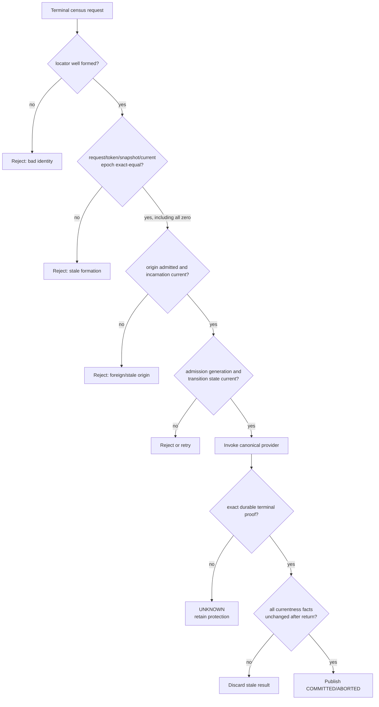
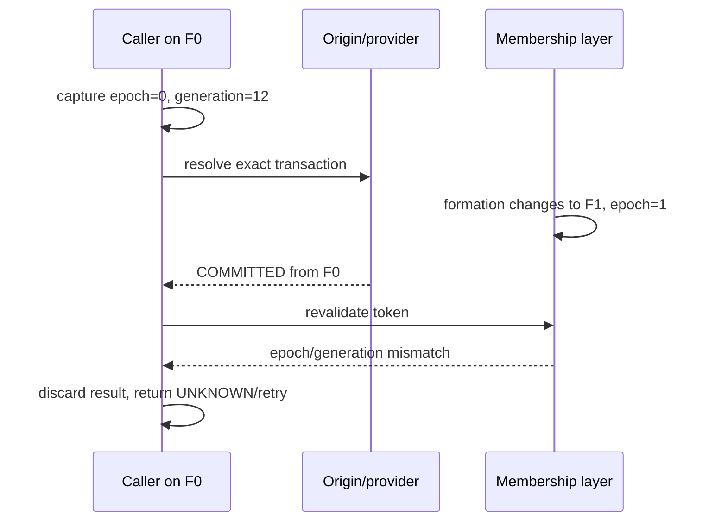
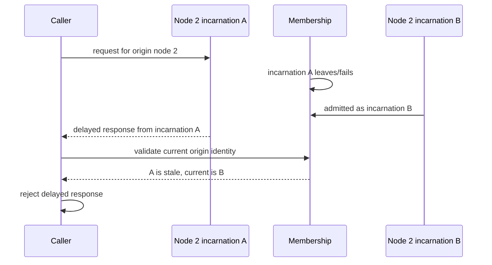
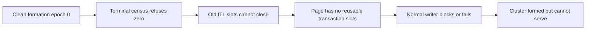
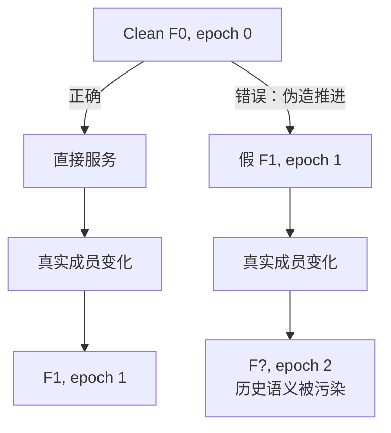

# 03：安全不变量、竞态与故障矩阵

[上一篇：当前性与事务终态权威](02-currentness-and-terminal-authority.md) · [返回索引](README.md) · [下一篇：Oracle 对比与证据边界](04-oracle-comparison-and-evidence.md)

## 1. 七条安全不变量

### I1：零值是值，不是自动的 absent sentinel

若当前 formation epoch 为 `0`，任何合法请求都可以携带 `0`。对象是否存在必须由独立状态表示。

### I2：必须精确等于当前值

```text
request_epoch == token_epoch == snapshot_epoch == current_epoch
```

大于零不构成授权；精确相等才构成当前性的必要条件。

### I3：Epoch 不能替代成员身份

请求发送者必须是当前 admitted member，且 incarnation 与当前记录一致。相同 `node_id` 的旧实例不能因 epoch 正确而复活。

### I4：资源 authority 与事务 authority 必须会合

持有页面/资源的资格不自动产生事务终态；知道事务终态也不自动授予页面写权限。

### I5：终态必须来自 durable canonical truth

COMMIT/ABORT 必须可追溯到与精确 transaction locator 对应的持久终态。cache、hint、统计计数或节点状态不能单独授权。

### I6：Provider 前后必须复验 formation

任何跨锁、跨进程或跨网络的查询都可能遇到重配置。返回后若 epoch、generation、membership 或 transition state 变化，结果必须丢弃。

### I7：不确定必须保持不确定

timeout、MISMATCH、UNAVAILABLE、UNKNOWN 不能映射成 COMMIT 或 ABORT。保留资源和稍后重试是正确的 fail-closed 结果。

## 2. 准入决策树



这个树没有 `epoch > 0` 分支。它有的是 exact equality 和完整 provenance。

## 3. Epoch-zero 故障矩阵

| 场景 | epoch 关系 | 其他事实 | 结果 | 原因 |
|---|---|---|---|---|
| 四节点首次 clean formation | 全部为 0 | admitted/current/proof 完整 | 允许进入 provider | 0 是当前版本 |
| 未初始化 request object | 字段默认为 0 | valid/present 缺失 | 拒绝 | 不能把数值当存在性 |
| 旧 F0 消息到达 F1 | request 0，current 1 | 其他字段可能正确 | 拒绝 | stale formation |
| envelope 0、payload 1 | 不一致 | — | 拒绝 | 传输与逻辑身份不一致 |
| 当前 epoch 0，旧 incarnation | 全部 epoch 相等 | origin identity stale | 拒绝 | epoch 不能替代 incarnation |
| 当前 epoch 0，wrong origin locator | 全部 epoch 相等 | undo/TT origin 不匹配 | 拒绝 | transaction identity 错误 |
| 当前 epoch 0，generation 漂移 | epoch 相等 | admission record 已替换 | 丢弃/重试 | 语义发布已变化 |
| 当前 epoch 0，transition closed | epoch 相等 | admission 已关闭 | 拒绝/等待 | no-half-open |
| provider 返回 UNKNOWN | 全部 current | durability 不足 | 保留 slot | UNKNOWN 不可猜测 |
| provider 返回 COMMIT 但无有效 SCN | 全部 current | proof 形状不完整 | 拒绝 | terminal polarity 不完整 |
| provider 返回后 epoch 0→1 | 调用前相等，调用后不等 | result 来自 F0 | 丢弃 | TOCTOU 复验 |

## 4. 最危险的两种竞态

### 4.1 Provider 调用期间发生 reconfiguration



若缺少最后的复验，一个在 F0 中正确的结果会穿越到 F1，成为错误的当前事实。

### 4.2 同一 node_id 的 incarnation 替换



这里即使 epoch 尚未改变，incarnation 复验仍可阻止旧实例响应被接受。反过来，epoch 变化也不能替代 incarnation 检查。

## 5. 安全与活性要分别证明

错误的 `epoch != 0` 条件通常看起来“更保守”，因为它把请求拒绝了。它确实可能 fail closed，但会造成结构性活性失败：



正确修复不是降低安全门，而是把“正数测试”替换为“当前值测试”：

```text
Before: epoch != 0
After:  epoch == current_epoch
        AND complete identity/proof/revalidation contract
```

这同时恢复：

- **安全性**：stale、foreign、wrong-generation、closed-transition 仍被拒绝；
- **活性**：合法的首次 formation 不必等待一次虚假的成员变化。

## 6. 为什么不能伪造 epoch 1

人为把 clean formation 从 `0` 改写为 `1` 会制造多个问题：

1. 观测记录声称发生过并不存在的 reconfiguration；
2. 其他节点可能仍携带 `0`，形成不必要的收敛窗口；
3. 恢复、审计和运维人员无法区分真实成员变化与启动补丁；
4. 代码里其他“零值是合法值”的路径仍然存在，问题只是被掩盖；
5. 后续真正的第一次 reconfiguration 会从一个虚假基线推进。



## 7. 最小验证集合

针对该行为，测试应覆盖“正向一条、负向多条”，而不是只证明某个 happy case 能过：

### 正向

- 同构多节点 clean formation，所有 current epoch 均为 `0`；
- 本地 origin 的 exact terminal result 可确认；
- 远端 admitted origin 的 exact terminal result 可确认；
- 事务槽释放后，普通写事务可以继续。

### 负向

- request/envelope/token/snapshot 任一 epoch 不一致；
- stale incarnation、wrong origin、wrong locator；
- admission generation 在 provider 前后变化；
- transition 在 provider 期间关闭；
- provider timeout、UNKNOWN、proof malformed；
- COMMIT 无有效 SCN，ABORT 携带矛盾 commit SCN；
- 非 terminal-census 操作不能借用这条零值行为越过自己的准入规则。

### 回归

- epoch `1+` 的正常 reconfiguration 路径保持不变；
- stale epoch 拒绝仍然生效；
- 单节点、双节点与四节点的 zero-value 语义没有分叉成互相矛盾的 sentinel 规则；
- 未认证 origin 不会触发 canonical provider 的正向调用。

## 8. 运维上如何识别问题类型

| 现象 | 更可能的问题 | 不应立即得出的结论 |
|---|---|---|
| 所有节点 epoch 都是 0 | 首次 formation 或尚无成员变化 | “集群未初始化” |
| epoch 一致但 terminal census UNKNOWN | origin/proof/generation/transition 问题 | “epoch 需要加一” |
| 某节点 epoch 落后 | stale view 或收敛问题 | “只要节点 ALIVE 就可接受” |
| transaction slot 持续不释放 | 终态权威无法闭合 | “节点死了所以直接 ABORT” |
| provider 有响应但结果被丢弃 | 返回期间 formation 变化 | “网络已经通，所以结果一定有效” |

排障顺序应当是：先确认 exact epoch equality，再看 member/incarnation，再看 admission generation/transition，最后核对 transaction locator 和 durable proof。不要用“把 epoch 改成非零”作为诊断手段。
