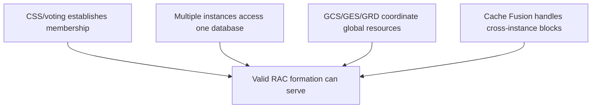
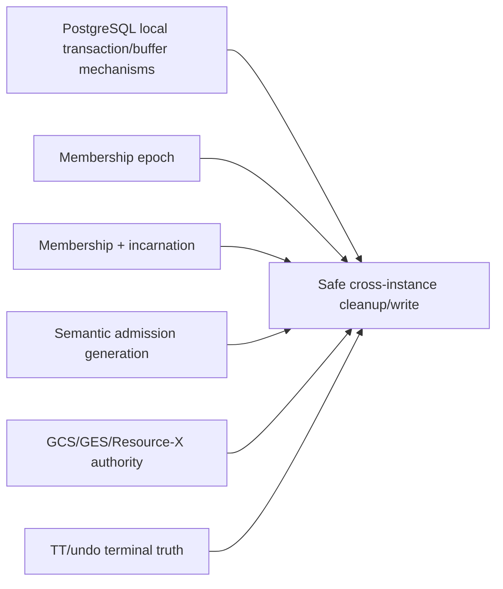
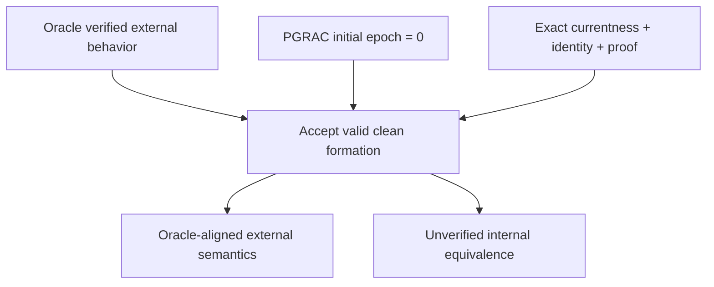
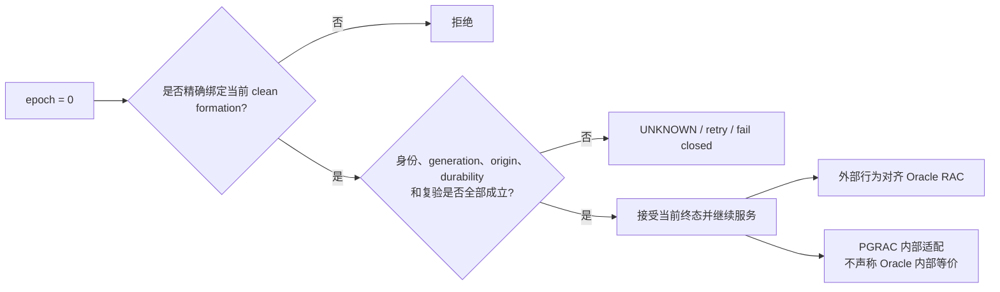

# 04：Oracle RAC 行为对比与证据边界

[上一篇：安全不变量与故障矩阵](03-safety-invariants-and-failure-matrix.md) · [返回索引](README.md)

## 1. 先给最终结论

| 问题 | 结论 |
|---|---|
| Clean formation 完成后是否应能直接进行跨实例服务？ | **与 Oracle RAC 外部行为对齐。** |
| 是否必须先制造一次成员变化，把 epoch 从 0 变成正数？ | **没有 Oracle 公开证据支持这个要求。** |
| Oracle 内部 formation epoch 是否也从 0 开始？ | **未知，不能声称。** |
| Oracle 是否有与 PGRAC terminal census 相同的字段和消息？ | **未知，不能声称。** |
| PGRAC 接受 current epoch 0 是否等于放宽安全性？ | **不等于。** 前提是继续要求 exact membership、incarnation、generation、origin、durability 和前后复验。 |

最准确的表述是：

> **Oracle-aligned external behavior; internal epoch-zero handling is an unverified PGRAC adaptation.**

中文即：**外部服务语义与 Oracle RAC 对齐；epoch-zero 的内部处理是未经 Oracle 内部资料验证的 PGRAC 自研适配。**

## 2. Oracle 官方公开了什么

### 2.1 多实例访问一个数据库

**Oracle 已验证。** Oracle RAC 允许不同节点上的多个实例同时访问一个数据库。这样可以避免单台服务器成为唯一故障点，并提供横向扩展能力。

来源：[Introduction to Oracle RAC](https://docs.oracle.com/en/database/oracle/oracle-database/26/racad/introduction-to-oracle-rac.html)

### 2.2 Cache Fusion、GCS、GES 与 GRD

**Oracle 已验证。** Cache Fusion 自动协调各实例 buffer cache；GCS、GES 与 GRD 共同支持全局缓存和 enqueue 资源协调。跨实例数据块可以经 interconnect 传递，而不是每次都绕共享磁盘完成同步。

来源：[Introduction to Oracle RAC](https://docs.oracle.com/en/database/oracle/oracle-database/26/racad/introduction-to-oracle-rac.html)

### 2.3 CSS 与 voting files 的成员职责

**Oracle 已验证。** Oracle Clusterware 使用 voting files 参与 fencing 和 node membership determination；CSS 控制哪些节点是成员，并在节点 join/leave 时通知成员。

来源：[Introduction to Oracle Clusterware](https://docs.oracle.com/en/database/oracle/oracle-database/26/cwadd/introduction-to-oracle-clusterware.html)

### 2.4 节点加入期间的平滑重配置

**Oracle 已验证。** Oracle 文档描述了 smooth reconfiguration：新节点加入时，GES 与 Cache Fusion 的资源重配置可以按需发生，客户端请求可触发单个资源的 reconfiguration，并与整体重配置并行。

来源：[Smooth Reconfiguration of Oracle RAC Instances](https://docs.oracle.com/en/database/oracle/oracle-database/26/racad/administering-database-instances-and-cluster-databases.html#GUID-35B91770-F55C-4023-B212-DD11A721368A)

### 2.5 实例恢复

**Oracle 已验证。** 一个实例失败时，仍运行的实例可为失败实例执行 instance recovery；若所有实例均失败，后续启动的一个实例可以承担需要的恢复。

来源：[Managing Backup and Recovery in Oracle RAC](https://docs.oracle.com/en/database/oracle/oracle-database/26/racad/managing-backup-and-recovery.html)

## 3. 从公开事实能推断什么

把上面的事实组合起来，可得到一个行为级推断：



**基于公开证据的推断：** 一个已经完成正常成员建立和服务准备的 clean RAC formation，不需要先发生一次虚构的 join/leave 才能处理跨实例资源与事务工作。

这不是在断言 Oracle 的内部 epoch 值。它只是在说明外部行为：启动后的合法 formation 能服务，成员变化发生时再进入相应 reconfiguration。

## 4. Oracle 没有公开什么

公开文档没有给出以下内部细节：

- membership/formation epoch 的字段名、位宽和初始数值；
- “未初始化”与“初始合法版本”的编码方式；
- terminal census 的内部状态名、消息类型或 payload；
- 事务 origin proof 如何与 GCS/GES resource identity 连接；
- provider 调用前后的 generation/epoch 复验算法；
- Oracle 内部是否存在与 PGRAC admission token 相同的结构；
- 内部 retry、timeout、锁序和 exact gate 谓词。

因此，下列说法都不严谨：

```text
“Oracle 的 formation epoch 就是 uint64 0。”
“Oracle 也有 PGRAC 同名的 terminal census。”
“Oracle 使用完全相同的 before/after token recheck。”
“Oracle 的 wire 也允许同样的 zero-valued field。”
```

动态视图或文档中没有公开某字段，不能推导 Oracle 内部不存在这个概念；同样，也不能把 PGRAC 的公开实现反向归因给 Oracle。

## 5. PGRAC 的适配职责

PGRAC 基于 PostgreSQL，需要显式连接原本分散的本地机制：



这导致 PGRAC 必须明确处理：

- 初始 epoch 的合法零值；
- PostgreSQL 结构中历史上常见的 zero-as-invalid 习惯；
- node identity 与 instance incarnation 的分离；
- 页面 ITL、XID、undo/TT locator 与 origin 的精确关联；
- admission generation 和 transition close；
- 跨网络 provider 的前后复验；
- UNKNOWN 保持 fail closed。

这些是 PGRAC 的实现责任，不是 Oracle 公开内部结构的复制。

## 6. 逐项行为对照

| 主题 | Oracle 官方公开行为 | PGRAC 行为模型 | 证据结论 |
|---|---|---|---|
| clean multi-instance service | 多实例访问同一数据库，Cache Fusion 协调缓存 | clean formation 完成后允许 current-path 服务 | 外部目标对齐 |
| membership owner | CSS + voting files 参与成员控制与判断 | membership/quorum/formation 共同提供准入上下文 | 角色映射；内部协议不同或未知 |
| global resources | GCS/GES/GRD 协调 | GCS/GES/Resource-X 与本地 buffer/transaction 层会合 | 外部职责对齐；PG 接线自研 |
| initial epoch | 未公开 | `0` 是首个合法 membership epoch | PGRAC 自研，不能归因 Oracle |
| reconfiguration | join/leave/failure 时重配置；可平滑、按资源推进 | 真实成员变化才推进 epoch 并拒绝旧 formation | 行为目标对齐；算法未知 |
| transaction terminal truth | Oracle 有实例恢复和事务恢复体系，内部 census 未公开 | exact origin + TT/undo + durable outcome + formation recheck | 安全职责映射；proof 机制自研 |
| stale instance | Clusterware membership/fencing 排除不合法成员 | membership + incarnation + epoch + admission 联合拒绝 | 安全目标对齐 |
| uncertain result | 公开资料没有提供“仅凭通信失败即可判定事务终态”的依据 | UNKNOWN 保持 UNKNOWN，保留保护 | PGRAC fail-closed 纪律；不声称内部机制相同 |

## 7. 为什么方案在行为层面对齐

允许 current epoch 0，不是因为“Oracle 也一定用 0”，而是因为：

1. Oracle 的公开行为允许合法 formation 启动并服务；
2. membership change 才有 reconfiguration 的语义；
3. PGRAC 的 `0` 是首个逻辑版本，不代表成员证据缺失；
4. exact equality、incarnation、generation、origin 和 durable proof 已承担 freshness/safety 职责；
5. 强制非零只会要求系统伪造一次不存在的 reconfiguration；
6. 伪造推进既没有 Oracle 证据，也会污染 PGRAC 自己的版本历史。



## 8. 对外应如何表述

推荐表述：

> PGRAC treats the initial membership epoch as a live version. A zero-valued epoch is admissible only when it exactly matches the current clean formation and all membership, incarnation, admission-generation, transaction-origin, durability, and revalidation checks succeed. This is aligned with Oracle RAC's externally documented multi-instance service and reconfiguration behavior, but the internal representation is a PGRAC adaptation because Oracle does not publish an equivalent epoch or terminal-census protocol.

不推荐表述：

- “PGRAC 复刻了 Oracle 的 epoch-zero 协议”；
- “Oracle RAC 的初始 epoch 就是 0”；
- “只要 epoch 相等就可以相信远端事务结果”；
- “节点死亡即可把事务判为 ABORT”；
- “为了兼容 Oracle，把 epoch 强制改成 1”。

## 9. 官方参考

- [Oracle RAC architecture and Cache Fusion](https://docs.oracle.com/en/database/oracle/oracle-database/26/racad/introduction-to-oracle-rac.html)
- [Oracle Clusterware, CSS, OCR and voting files](https://docs.oracle.com/en/database/oracle/oracle-database/26/cwadd/introduction-to-oracle-clusterware.html)
- [Smooth Reconfiguration of Oracle RAC Instances](https://docs.oracle.com/en/database/oracle/oracle-database/26/racad/administering-database-instances-and-cluster-databases.html#GUID-35B91770-F55C-4023-B212-DD11A721368A)
- [Oracle RAC instance recovery](https://docs.oracle.com/en/database/oracle/oracle-database/26/racad/managing-backup-and-recovery.html)

## 10. 最后一张图


