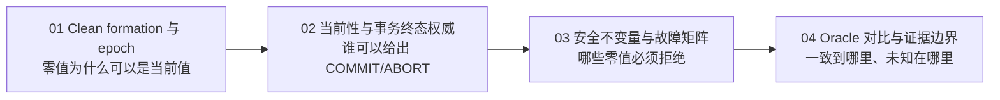
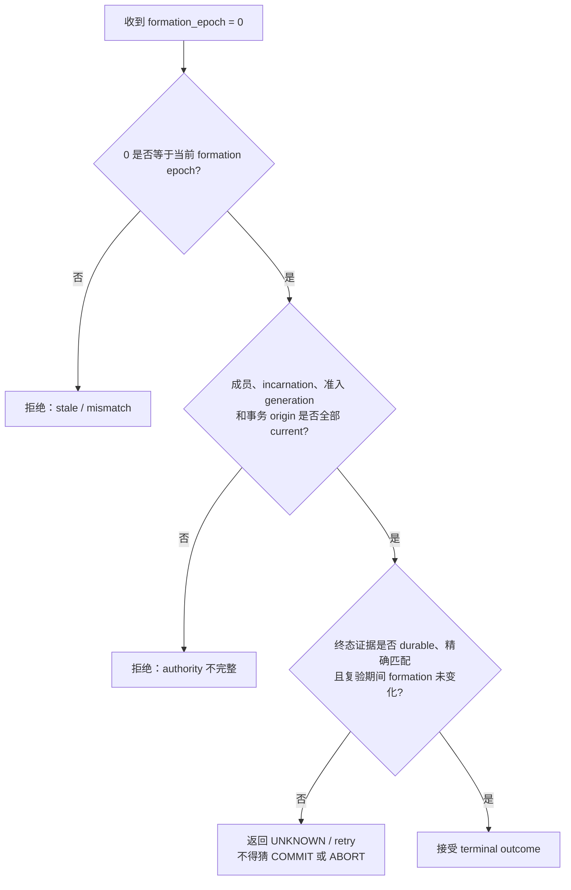

# Clean Formation 的 Epoch 0：Oracle 对齐与 PGRAC 安全边界

这组文档解释一个看似只是“零值判断”、实际横跨成员关系、事务恢复和全局资源服务的问题：

> 一个同构多节点集群首次 clean formation 时，当前 membership epoch 合法地等于 `0`。系统能否在不伪造一次重配置的前提下，安全地完成跨实例事务终态确认并开放正常服务？

结论分为两个层次：

1. **外部行为与 Oracle RAC 对齐。** 一个已经完成成员准入、全局资源协调和恢复准备的 clean RAC formation，应当能够直接服务；没有公开证据要求它先制造一次成员变化，才能处理跨实例工作。
2. **内部机制不能声称相同。** Oracle 没有公开 formation epoch 的初始数值、终态 census 的内部消息或准入谓词。PGRAC 以 `0` 表示首个 current formation，是 PGRAC 自研适配。

换句话说：**`0` 可以是合法的当前版本；安全性来自“精确等于当前 formation”以及配套身份、准入和终态证据，而不是来自“数值必须大于零”。**

## 阅读顺序



- [01：Clean formation、逻辑 epoch 与合法零值](01-clean-formation-and-epoch.md)
- [02：当前性、事务终态与多维权威](02-currentness-and-terminal-authority.md)
- [03：安全不变量、竞态与故障矩阵](03-safety-invariants-and-failure-matrix.md)
- [04：Oracle RAC 行为对比与证据边界](04-oracle-comparison-and-evidence.md)

## 一张图理解核心区别



错误模型是：

```text
epoch == 0  →  未初始化
epoch > 0   →  当前且安全
```

正确模型是：

```text
epoch == current_formation_epoch
    + current membership/incarnation
    + current admission generation
    + exact transaction origin and locator
    + durable terminal proof
    + before/after revalidation
    → 可以接受
```

## 本系列使用的证据标签

| 标签 | 含义 |
|---|---|
| **Oracle 已验证** | Oracle 官方公开文档明确描述了该角色或外部行为。 |
| **基于公开证据的推断** | 多条公开事实共同支持该结论，但 Oracle 没有披露对应内部字段或算法。 |
| **PGRAC 自研适配** | 为 PostgreSQL/PGRAC 的共享内存、事务表、undo 和 interconnect 语义设计的实现。 |
| **不能声称** | 当前证据不足，不能把 PGRAC 的字段、消息、状态名或算法归因给 Oracle。 |

## 讨论范围

本文讨论：

- 同构多节点 clean formation；
- membership epoch 的版本语义；
- 当前 formation 下的事务终态确认；
- 本地 origin 与远端 origin 的权威边界；
- stale、身份错误、generation 漂移和 transition close 时的 fail-closed 行为；
- Oracle RAC 外部语义与 PGRAC 内部适配的证据分级。

本文不讨论：

- Oracle 未公开的私有 wire layout、锁表字段或 recovery 消息；
- 通过伪造 `epoch=1` 绕过初始 formation；
- 用 raw XID、单个 CLOG bit 或节点“看起来活着”替代事务权威；
- 广义 2PC/RECO、滚动升级、异构版本或硬件 fencing 的部署认证；
- 任何私有设计文档、内部开发编号或未公开测试材料。

## 当前公开状态说明

这是一组**行为架构与安全边界说明**，不是某个发行版本的 GA 声明。读者应结合所使用版本的发布说明和公开代码判断具体路径是否已经启用。公开接口锚点包括：

- [`cluster_epoch.h`](../../../src/include/cluster/cluster_epoch.h)：membership epoch 的公共定义；
- [`cluster_membership.h`](../../../src/include/cluster/cluster_membership.h)：成员状态与 incarnation 边界；
- [`cluster_semantic_activation.h`](../../../src/include/cluster/cluster_semantic_activation.h)：语义切换准入 token；
- [`cluster_tx_resolve.h`](../../../src/include/cluster/cluster_tx_resolve.h)：事务终态解析的公共类型。

相关背景：

- [Rejoin、Formation 与节点变化](../rac-node-change/README.md)
- [GCS 架构](../gcs/README.md)
- [GES 架构](../ges/README.md)
- [Resource-X 架构](../resource-x/README.md)
- [Pending transaction authority](../transaction-recovery/pending-transaction-authority.md)
