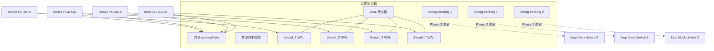
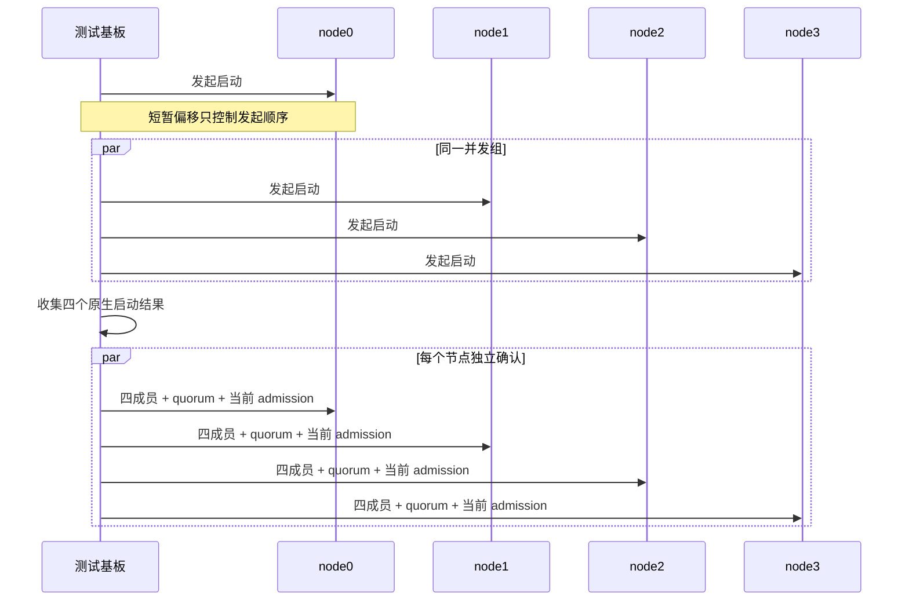

# 生命周期与共享存储

## 1. 为什么需要两个阶段

四节点验证同时需要两种条件：

- 首次集群形成时，要有一组已经格式化、所有节点都能读取的 voting 数据；
- 后续验收又要证明数据库确实通过直接 I/O 块设备访问这组数据。

如果一开始就动态创建 loop device，首次形成和环境准备会互相依赖；如果全程只用普通文件，又无法证明真实块设备访问路径。因此基板先用普通 backing file 完成一次干净形成和停机，再在所有进程退出后把**同一批字节**原位映射成块设备。

这不是数据迁移：backing file 仍是唯一字节来源，loop device 是它的块设备视图。

## 2. 对象关系



四个实例共享数据库数据和控制信息，但每个实例保有独立 WAL thread。三个 voting backing file 从创建时就使用最终容量和固定格式，两个阶段之间不得扩容、截断或重格式化。

## 3. Phase 0：离线 seed

离线准备顺序如下：

1. 分配四个实例的 SQL、互连和数据传输端口；
2. 创建三个最终尺寸的 voting backing file；
3. 初始化 node0 及第一个 WAL thread；
4. 在未启用集群服务的单实例环境建立共享 catalog、数据和控制信息；
5. 正常停止 node0；
6. 克隆其 PGDATA 给 node1、node2、node3；
7. 把三个克隆实例的 `pg_wal` 分别迁入自己的 WAL thread；
8. 写入四节点拓扑和各节点身份；
9. 确认尚未提前生成 R4 激活产物；
10. 在启动任一实例前注册完整清理 owner。

Seed 的作用只是创建共同数据库基线，不能产生四节点成员关系，也不能预先宣布 R4 已激活。

## 4. Phase 1：首次四节点形成

启动形状固定为：



只有每个节点都独立观察到四成员、quorum 和当前启动周期的成员准入，Phase 1 才算形成。不能因为 node0 先启动或已经等待若干秒，就推断其他节点 ready。

## 5. 四实例协调正常停机

基板先向四个实例都发出 fast stop，再等待任一个结果。这样每个实例的协调进程都能在其他三个成员仍存活时完成停机证明。

每个实例必须按顺序留下：

```text
shutdown checkpoint 开始
  → shutdown checkpoint 完成
  → 当前启动周期 WAL 终止状态发布
  → 四成员停机 barrier 完成
  → 最终交付确认完成
  → database system is shut down
```

如果改成“停一个、等它退出、再停下一个”，先退出节点的协调 actor 会过早消失，慢节点就可能无法完成同一轮的成员间确认。

## 6. 离线介质切换

切换只允许发生在：

- 四个停止命令均成功；
- 四份 ordered shutdown evidence 完整；
- 四个 postmaster 及其协调子进程全部退出；
- 没有进程继续持有 voting FD。

每个 loop device 随后必须通过五层认证：

| 层次 | 验证内容 | 防止的问题 |
|---|---|---|
| 类型 | 路径确实是 block device | 把普通文件误当设备 |
| 容量 | device capacity 与 backing size 相等 | 截断或映射错误 |
| I/O | 内核报告 direct I/O 已生效 | 悄悄回退 buffered I/O |
| 内容 | backing 与 device byte-for-byte 一致 | 绑定到错误对象 |
| 身份 | 每份 voting 数据的序号正确 | 三个路径互换或重复 |

部分绑定失败时，已经绑定的设备必须反向解绑，整轮失败；不得使用“两块设备加一个文件”的混合形态。

## 7. Phase 2：仅使用块设备重新形成

Phase 2 复用相同启动并发关系，但配置中的 voting paths 必须全部变成刚认证的 block device。

第二阶段重新采集：

- 当前 formation；
- 当前成员 incarnation；
- 当前连接/session；
- 当前 R4 激活证据。

第一阶段的 PID、连接代际、临时 barrier、内存状态和其他易失身份全部作废。即使 epoch 数值仍是合法初始值，也不能把“值相同”误当成“同一启动身份”。

