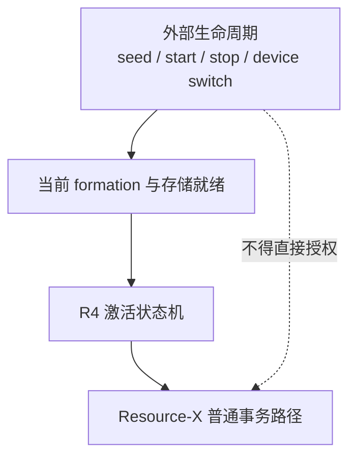
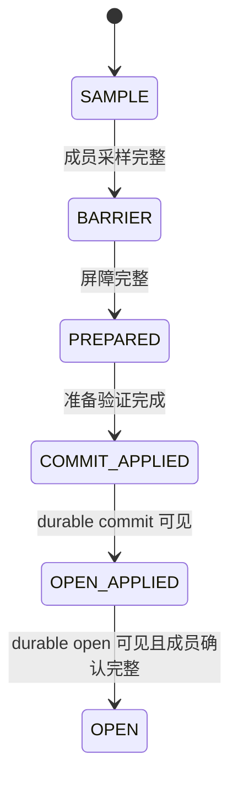
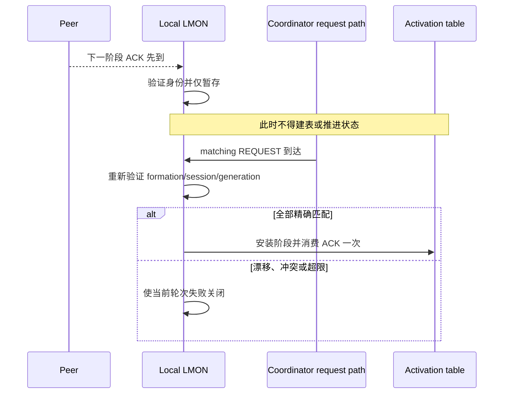
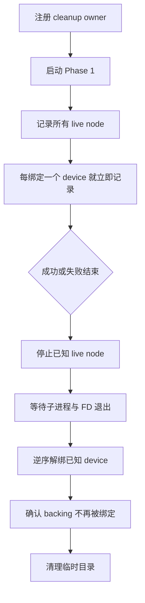

# 启动、停机、消息乱序与故障收束

## 1. 两类顺序不能混淆

这套基板同时存在两种顺序：

- **外部生命周期顺序**：测试进程何时启动/停止实例、何时绑定设备；
- **数据库激活顺序**：R4 从采样、屏障、准备、提交到开放的单调推进。

前者不能制造后者的 authority；后者也不能绕过前者的存储和成员就绪条件。

## 2. 为什么停机需要最终交付确认

“我已经发出了最终回复”和“对端已经消费最终回复”不是一回事。若快节点在本地发送队列刚清空时退出，慢节点可能永远收不到它仍需的确认。

因此协调停机分成三层：

1. 每个实例完成本地 shutdown checkpoint；
2. 所有实例确认彼此都到达当前启动周期的干净终点；
3. 所有实例确认最终回复已被对端消费，然后协调 actor 才能退出。

这套确认是易失、限时、仅用于当前测试轮次的协作证据；它不生成新的数据库 authority，也不会跨重启恢复。

## 3. R4 激活顺序

这里的 `PREPARED` 是功能激活状态，不是 SQL 两阶段提交事务。

## 4. 网络乱序的处理原则

多条 peer connection 会让下一阶段的 ACK 比本地对应 REQUEST 更早到达。PGRAC 允许非常窄的“先到暂存”，但遵循四条底线：

1. REQUEST 始终是安装本地阶段表的唯一入口；
2. 早到 ACK 只能保存在有界、易失的本地集合中；
3. 暂存不能调用阶段动作、写持久状态或打开服务门；
4. matching REQUEST 通过全部当前身份检查后，ACK 才能被消费一次。

### 4.1 合法与非法情况

| 入站情况 | 处理 |
|---|---|
| 当前阶段第一个精确 ACK | 应用 |
| 完全相同的重复 ACK | 幂等吸收 |
| 同一来源、内容不同的第二个 ACK | 整轮失败关闭 |
| 唯一下一阶段的完整 ACK 先到 | 有界暂存 |
| 跨越两个或更多阶段 | 丢弃或失败关闭，不跳级 |
| formation、session、成员身份或 generation 漂移 | 清除暂存并失败关闭 |
| 重启后发现旧暂存 | 必须不存在；易失集合随进程退出清空 |

## 5. 清理 owner 的生命周期

清理责任必须早于第一个实例启动。否则首次 formation、协调停机或第一块设备绑定失败时，会出现无人知道哪些进程或设备已创建的窗口。

## 6. 失败矩阵

| 失败位置 | 收束动作 | 不能做什么 |
|---|---|---|
| 某节点启动失败 | 停止本轮已启动的全部节点 | 让剩余三节点继续测试 |
| formation 超时 | 停止四节点并保留诊断日志 | 延长时间后假定形成 |
| 某节点停机失败 | 停止所有残留进程，不切换设备 | 把异常停机当 clean |
| 某个设备绑定/认证失败 | 逆序解绑已绑定设备 | 混用文件和设备 |
| Phase 2 启动失败 | 先停所有已启动节点，再解绑 | 进程仍持有 FD 时解绑 |
| 资源或事务测试失败 | 保留结果，完整 teardown | 删除失败样本或修改判官 |

清理成功只说明环境恢复干净，不会把失败测试变成成功。

## 7. 可重复清理

正常 teardown 与进程退出兜底可能连续调用。第二次调用必须：

- 看到空的 live-node/device 集后安全返回；
- 不解绑已经被其他任务复用的设备号；
- 不覆盖最初失败的退出码；
- 不掩盖第一次 detach 失败。

