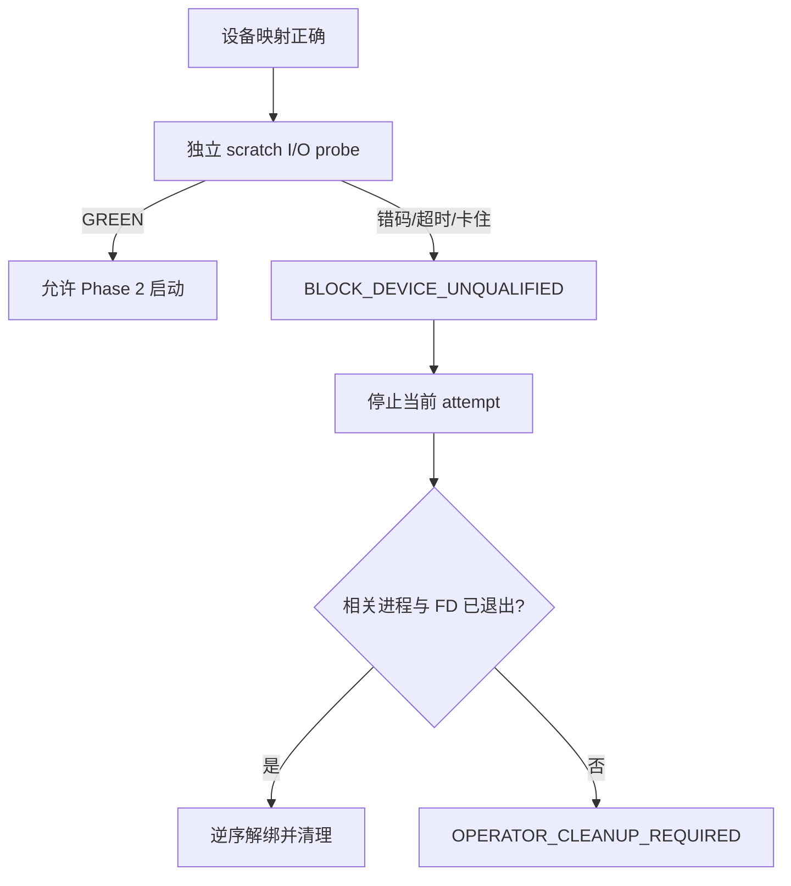

# 块设备预检与卡住 I/O 的安全收束

## 1. 这份说明解决什么问题

两阶段四节点基板把普通 backing file 原位映射成 direct-I/O loop block device。映射成功并不自动证明该存储后端适合随后四个 PostgreSQL 实例的并发访问：设备类型、容量、DIO 标志和字节内容都正确时，实际 I/O 仍可能失败或陷入内核等待。

因此，Phase 2 启动前需要一道独立环境资格门；若进程仍然卡在 I/O 中，清理也必须延迟到它真正退出，不能强行解绑设备。

## 2. 两种证明不能混为一谈

| 证明 | 回答的问题 | 不回答的问题 |
|---|---|---|
| 静态设备认证 | 路径、容量、DIO 标志、字节内容和 voting 序号是否正确 | 并发 direct I/O 是否会完成 |
| 动态 I/O 资格检查 | 同一存储后端能否在有界时间内完成对齐写入、同步、重开、读取和校验 | 数据库内部 formation/R4 是否正确 |



## 3. 为什么使用独立 scratch device

voting 数据参与成员关系判断。直接向 voting device 写测试 pattern 会污染权威数据，也无法在后续判断哪些字节来自产品、哪些来自探针。

预检使用一份独立 scratch file，并要求它和 voting backing 处于等价存储环境：同一挂载点、文件系统、影响 direct I/O 的挂载选项、对齐与分配方式。scratch file 绑定独立 loop device，所有测试写入只落在这块临时设备上。

预检流程是：

1. 创建 fresh scratch backing；
2. 绑定 direct-I/O loop device；
3. 认证类型、容量和 DIO；
4. 四个 probe 并发操作互不重叠的对齐区域；
5. 每轮执行完整写入、持久化、关闭、重开、读取和逐字节校验；
6. 使用一个绝对截止时间；
7. 所有 probe 与 FD 退出后解绑 scratch device；
8. 确认零 mapping、零临时进程和零 FD 残留。

任一短读写、校验差异、非零退出、超时或不可中断 I/O 都使环境资格失败，Phase 2 不启动。

## 4. Phase 2 readiness 的分层观察

通过环境资格检查后，启动仍要逐层观察：


诊断报告应保留每个节点最后成功层和第一个失败层。后续出现的 formation 或总启动超时是级联结果，不能覆盖更早的首错。

## 5. 遇到不可中断 I/O 时怎么办

Linux `D` 状态表示任务在等待不可中断的内核操作，常见于块 I/O。此时正确的收束不是持续发信号或立即解绑：

```text
记录原始失败
  → 发起一次有界停止
  → 等待至原绝对截止时间
  → 采集 PID+启动时间、state、wchan、FD、device/backing 映射
  → 写持久清理清单
  → 当前测试返回失败
  → 原进程稍后退出
  → 显式 reaper 复核身份与 holder
  → 逆序解绑
```

使用“PID + 进程启动时间”是为了防止 PID 已被新进程复用。只要原进程或相关 FD holder 仍存在，device 就必须保持绑定。

## 6. 清理清单与显式 reaper

清理清单存放在测试临时目录之外，因此 TAP 进程退出后仍能保留 ownership。它记录：

- attempt 标识和原始失败类型；
- 相关进程的节点、PID、启动时间和最后状态；
- 每个 loop device 的路径、major/minor、backing 规范路径与绑定顺序；
- 当前清理状态。

它不保存数据库页面、协议消息、密码或外部管理凭据。

reaper 在下一次基板启动前、正常 teardown 或 operator 显式调用时运行。它只能处理清单中的 exact 对象，并遵循：

1. exact 进程仍存在：停止，不解绑；
2. FD holder 非空：停止，不解绑；
3. device/backing 身份漂移：停止并报告冲突；
4. 全部验证通过：按原绑定顺序的逆序解绑；
5. 再次确认零 mapping 后，才把清单标记为已回收。

禁止使用 `losetup -D` 一次性解绑所有 loop device，因为机器上可能还有其他任务的设备。

## 7. 环境恢复与测试结论

若特定文件系统上的 loop direct I/O 预检可重复失败，可以把整套测试 backing 迁移到已知支持该访问形状的专用 ext4/XFS 测试文件系统或直接块设备，再从 Phase 0 创建 fresh attempt。不能复用失败轮次的 voting、formation 或性能身份。

宿主或虚拟 Linux 环境重启可以作为 operator 的最后恢复手段，但发生重启的 attempt 永久无效；重启不是测试步骤，也不能把失败变成成功。

## 8. 验收清单

- [ ] scratch path 与三份 voting backing 均不同；
- [ ] scratch 和 voting backing 的存储后端等价；
- [ ] probe 使用对齐 direct I/O，且所有写入仅在 scratch；
- [ ] probe 使用绝对截止时间，无无限重试；
- [ ] Phase 2 只在 probe 完整成功后启动；
- [ ] 报告保留每节点第一个失败 readiness 层；
- [ ] live process 或 FD holder 存在时零 detach；
- [ ] 清理清单跨 TAP 进程退出保留；
- [ ] reaper 校验 PID 启动时间和 exact device/backing identity；
- [ ] clean/failed attempt 最终均无未解释 loop mapping；
- [ ] 未修改 `t/430`、`t/400` 的 workload、timeout 或成功判定。

## 9. 与 Oracle RAC 的边界

Oracle 公开资料确认，RAC instance 启动依赖 Grid Infrastructure，voting files 是 Clusterware 成员关系基础；voting access 丢失可能造成节点驱逐或服务能力丧失。先确认 voting/storage readiness，再开放数据库全局资源，符合这一外部安全边界。

但 scratch loop probe、清理清单和显式 reaper 是 PGRAC 自动化测试适配，不是 Oracle 已公开的内部实现。

- [Oracle RAC instance administration](https://docs.oracle.com/en/database/oracle/oracle-database/26/racad/administering-database-instances-and-cluster-databases.html)
- [Oracle Cluster Registry and voting files](https://docs.oracle.com/en/database/oracle/oracle-database/26/cwadd/managing-oracle-cluster-registry-and-voting-files.html)
- [Oracle CRS-01672](https://docs.oracle.com/en/error-help/db/crs-01672/)
