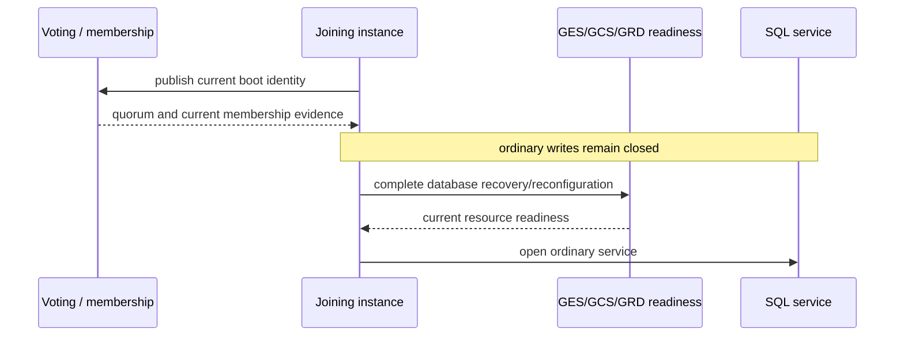

# 四节点启动：成员关系先于数据库服务

本文说明 fresh four-node `t/430` 在进入资源回收负载前，如何判断节点已经具备集群成员
资格，以及为什么“节点可连接”不等于“数据库服务可以开放”。内容面向测试执行者和运维人员，
不描述内部协议实现。

## 1. Oracle RAC 的公开行为基线

Oracle RAC 把集群成员关系与数据库资源服务分层：

- Oracle Clusterware 的 CSS 决定哪些节点是 cluster members，并通知节点加入或离开；
- voting files 保存 node membership 信息；
- 节点上的 Grid Infrastructure stack 必须先运行，RAC database instance 才能启动；
- 数据库实例启动后，GES/GCS/GRD 才负责全局锁、缓存资源和恢复重配置；
- 重配置完成前，新的全局资源请求保持受控，不能因为进程已经存活就提前开放写服务。

参考 Oracle 官方资料：

1. [Introduction to Oracle Clusterware](https://docs.oracle.com/en/database/oracle/oracle-database/21/cwadd/introduction-to-oracle-clusterware.html)
2. [Managing Oracle Cluster Registry and Voting Files](https://docs.oracle.com/en/database/oracle/oracle-database/21/cwadd/managing-oracle-cluster-registry-and-voting-files.html)
3. [Administering Database Instances and Cluster Databases](https://docs.oracle.com/en/database/oracle/oracle-database/21/racad/administering-database-instances-and-cluster-databases.html)
4. [Introduction to Oracle RAC](https://docs.oracle.com/en/database/oracle/oracle-database/21/racad/introduction-to-oracle-rac.html)
5. [Cache Fusion and the Global Cache Service](https://docs.oracle.com/cd/A97630_01/rac.920/a96597/pslkgdtl.htm)

PGRAC 对外遵循相同的安全顺序：先证明 quorum 与成员关系，再完成数据库内部资源恢复，最后
开放普通服务。Oracle 没有公开其内部 wire 和状态机，因此不能据此推断两者使用相同的内部算法。

## 2. t/430 的前 17 项在验证什么

`t/430_pcm_grd_resource_reuse_4node.pl` 的前置阶段可分为三层：


TAP 序号与含义：

| 序号 | 验证内容 | 能证明什么 | 不能证明什么 |
|---:|---|---|---|
| 1–4 | 四个节点均可执行 `SELECT 1` | postmaster 和 SQL 层存活 | quorum、成员准入、资源服务 ready |
| 5–16 | 四个节点互相观察到 12 条有向连接 | interconnect mesh 已建立 | 节点已经成为可写 member |
| 17 | pre-OPEN durable mirror 存在 | 首个持久控制面准备已完成 | t/430 workload 已通过 |

测试可能在输出 16 个成功项后直接退出，而没有打印第 17 条结果。这通常表示第 17 项之前的
quorum、成员准入或 pre-OPEN 关闭语义失败，并不表示 PCM/GRD 回收逻辑失败。

## 3. 合法启动顺序



需要同时满足：

1. 当前节点能够访问 voting majority；
2. 节点身份属于当前启动周期，不复用旧进程或旧成员记录；
3. joining 节点在准入完成前保持写关闭；
4. 数据库恢复/资源重配置不能替代 membership；
5. membership 也不能替代数据库资源 ready；
6. 任一身份或代际发生变化时，本轮启动失败关闭或重新取得完整当前证据。

## 4. 运维检查

### 4.1 Quorum

在每个已能连接的节点执行：

```sql
SELECT in_quorum, disks_ok, disks_total, collision_state
FROM pg_cluster_quorum_state;
```

继续下一阶段前，四个节点的 `in_quorum` 都应为 true。某个节点可执行 SQL 但
`in_quorum=false` 时，不应尝试通过重复 activation 或增大 workload timeout 绕过。

### 4.2 Membership

```sql
SELECT node_id,
       state,
       presented_incarnation,
       last_admitted_incarnation
FROM pg_cluster_membership
ORDER BY node_id;
```

重点检查：

- 声明的四个节点都出现；
- 当前节点最终进入 `member`；
- presented 与 admitted incarnation 属于当前启动周期；
- 不存在长期停留的 `joining`、`rejected` 或旧 incarnation。

短暂 `joining` 是正常的安全关闭状态；只有准入链完成后才能变为 `member`。

### 4.3 pre-OPEN 结果

pre-OPEN activation 请求必须保持关闭，并返回“条件尚未满足”一类结果。以下结果需要区分：

| 结果类别 | 含义 | 操作 |
|---|---|---|
| deferred / condition not yet met | 正常的 pre-OPEN 关闭 | 继续等待既定启动流程 |
| quorum hold | quorum 或当前成员证据不完整 | 检查 voting 与 membership |
| startup timeout | 某个启动 owner 未完成 | 保留四节点日志和首个失败 gate |
| process exit | 启动失败 | 先清理进程、FD 和 device，再 fresh 重跑 |

## 5. 失败定位顺序

当测试稳定停在 16 项之后时，按下列顺序定位：

```text
1. 四节点 pg_cluster_quorum_state
2. 四节点 pg_cluster_membership
3. 当前 boot 的 incarnation 是否一致
4. 第一个未满足的 startup/readiness gate
5. pre-OPEN 请求的准确错误类别
6. durable mirror 是否创建
7. 只有以上全部成立后，才检查 R4、Resource-X 和 PCM reclaim
```

不要首先修改：

- PCM/GRD capacity；
- shared buffers；
- 512-page workload；
- client 数；
- TAP 判官；
- phase timeout。

这些参数不会修复 membership-before-service 的 owner 或身份问题，还可能掩盖首因。

## 6. 测试真实性要求

以下方式不能算通过：

- 手工把 joining 节点标记为 admitted/member；
- 伪造 voting、membership 或 durable mirror；
- 把 quorum hold 加入预期成功结果；
- 延长 timeout 后忽略未完成的成员准入；
- 跳过第 17 项直接运行资源负载；
- 用单节点或 mock 结果替代 fresh four-node run。

有效结果必须来自原样 fresh 流程：

```text
four-node connectivity
→ quorum current
→ membership current
→ pre-OPEN remains closed
→ durable mirror present
→ activation
→ complete t/430 workload
```

第 17 项 GREEN 只是启动控制面闭合的第一个可见锚；只有 `t/430` 全部断言、数据守恒、
协议债务归零且 cleanup 完成，才能宣称整项测试通过。

## 7. 与两阶段块设备基板的关系

Phase 1 和 Phase 2 都要独立完成当前 membership。Phase 2 不能继承 Phase 1 的 PID、session、
incarnation 或成员准入，只能复用经过字节与直接 I/O 认证的持久存储内容。


这也是为什么 `t/429` 通过不能直接保证 `t/430` 第 17 项通过：`t/429` 主要验证 harness
生命周期；`t/430` 使用真实四节点进程重新证明 membership、资源 readiness 和 workload。

## 8. 当前版本的验收范围

`t/429` 和 `t/430` 作为后续阶段的测试基板原样保留，用于覆盖 two-stage restart、rejoin 与
block-device lifecycle。它们不是当前 Stage 8 同构四节点 clean happy-path 的 completion gate，
也不能通过修改 workload、judge、timeout 或成功极性来制造 GREEN。它们后续通过仍不代表产品
已经完成以下更广能力：

- 少于全部配置实例时的正向 OPEN；
- 运行中实例加入后的自动 reformation；
- repeated restart、online rejoin 或 replacement 的完整正向生命周期；
- voting block device 的生产部署认证。

当前正式正向验收仍是同构四节点 clean formation、四节点事务正确性，以及后续四节点自适应
并发性能验收。上述恢复、降级运行和部署认证能力属于后续阶段；当前版本继续保留已有的
fail-closed 检查，但不能把安全拒绝解释为这些能力已经可用。
