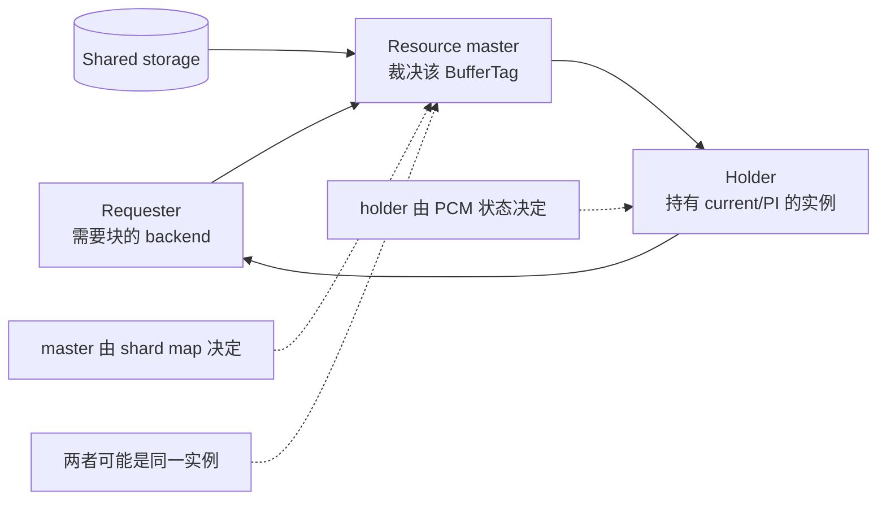
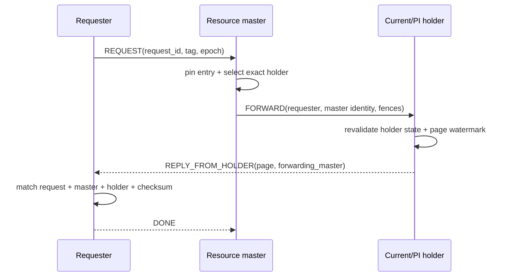
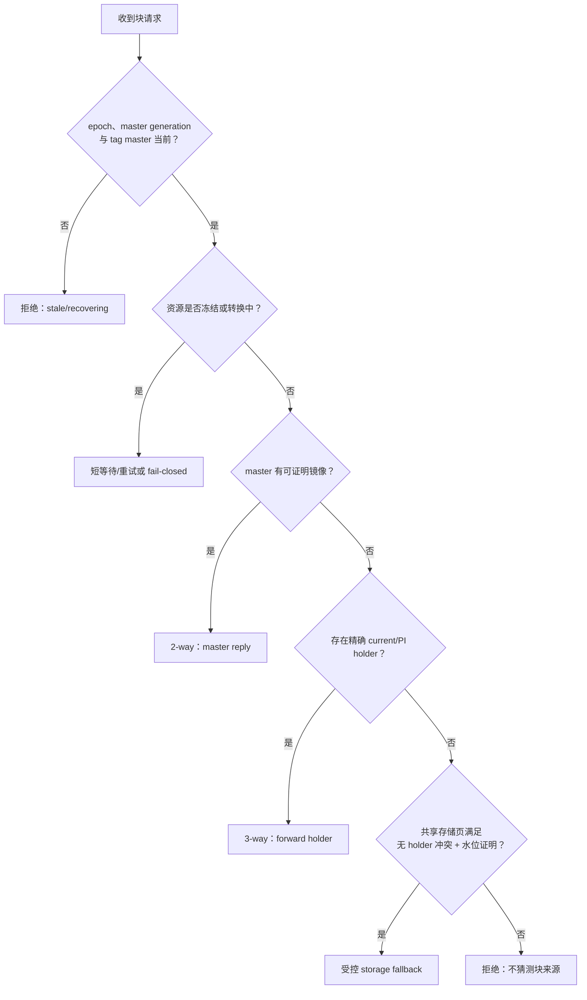

# 01：GCS 架构、角色与路由

[返回索引](README.md) · [下一篇：Current 与 CR](02-current-and-cr-blocks.md)

## 结论先行

一次远程块请求不是“找某台机器读 8 KiB”这么简单。请求端先确定资源 master；master 再依据当前 PCM/GRD 状态决定自己服务、转发给 holder、受控读共享存储，还是拒绝。只有精确请求身份与当前 authority 全部匹配的回复才能被安装。

## 角色不是固定节点

- **Requester**：发起 buffer acquire 的 backend，拥有本次 `request_id` 和等待槽。
- **Resource master**：对该 `BufferTag` 的全局状态作出唯一裁决；master 角色随 remaster 改变。
- **Holder**：当前拥有可发送块镜像或 PI 的实例；它可能不是 master。
- **LMS**：PGRAC 中承接 master-side grant、转发和 data-plane 服务的后台 worker。

`BufferTag` 先映射为 PCM/GRD resource，再映射到 shard 和 master。请求不会因为“某节点以前持有过这页”而直接信任它。

## 从 Buffer Manager 到网络

Buffer Manager 先向本地 PCM client 请求 S/X；client 采样 epoch 与 master
generation。若 master 在本地，请求进入本机 LMS work queue；否则由 GCS
outbound 发送到远端 LMS。master pin 住 GRD/PCM entry、验证 authority 并选择
块来源，requester 最后再验证、安装并提交 ownership。

关键代码入口：

- 客户端状态迁移与等待：[`cluster_gcs.c`](../../../src/backend/cluster/cluster_gcs.c)
- 块请求与回复：[`cluster_gcs_block.c`](../../../src/backend/cluster/cluster_gcs_block.c)
- LMS 服务与 worker 分片：[`cluster_lms.c`](../../../src/backend/cluster/cluster_lms.c)、[`cluster_lms_shard.c`](../../../src/backend/cluster/cluster_lms_shard.c)
- PCM 状态：[`cluster_pcm_lock.c`](../../../src/backend/cluster/cluster_pcm_lock.c)、[`cluster_pcm_own.c`](../../../src/backend/cluster/cluster_pcm_own.c)

## 2-way：master 本身可以服务

这里的 2-way 指两个网络 hop：requester 把请求交给 master，master 直接把结果送回 requester。

消息顺序是 `REQUEST → REPLY → DONE（能力协商后）`：master 校验
epoch/generation/tag 后复制已授权镜像，requester 校验页并安装，随后用 DONE
关闭 dedup 回收窗口。

2-way 不是无锁 fast path。master 仍需确认：

- 它仍是该 tag 的当前 master；
- request 的 epoch 与 master generation 未过期；
- 资源不在 FROZEN/REBUILDING；
- 所需模式与 holder/convert 状态兼容；
- 页身份、LSN/SCN 水位和 checksum 可接受。

## 3-way：master 只裁决，holder 直送

当 master 知道合法镜像在另一个实例时，它给 holder 发 `FORWARD`。holder 把结果直接送给 requester，避免数据再绕 master 一次。

回复中的 forwarding-master identity 很重要：它把“holder 发来的页”绑定到“master 曾经授权的这次转发”，防止旧 holder 或无关节点的合法格式消息被误接。

**Oracle 已验证。** Oracle wait-event 文档公开 `gc current/cr block 2-way` 与 `3-way`，并说明 Cache Fusion 请求在三个 hop 内完成。Oracle 没有在这些页面公开与 PGRAC 相同的消息结构。

## 路由决策树

“读共享存储”是最后的受控分支，不是默认后门。只要尚有 live holder、pending-X、较新 watermark 或无法证明页未落后，master 就不能把磁盘页冒充 current image。

## 一次请求携带哪些安全维度

| 维度 | 防止的问题 |
|---|---|
| `BufferTag` / resource identity | 把 A 页的回复装到 B 页 |
| requester node/backend/request id | 重试或 backend 复用造成 ABA |
| cluster epoch | 上一轮成员关系消息延迟到达 |
| shard master generation | LMS 重启或 remaster 后旧 master 继续答复 |
| requested mode / transition identity | S 与 X、普通读取与 transfer 混淆 |
| forwarding master / exact holder | 未经 master 授权的 holder 回包 |
| page LSN/SCN + ownership generation | 接受落后或不属于本次所有权的镜像 |
| payload checksum | 传输损坏或 frame 拼接错误 |

## Local fast path 也受同一语义约束

master 与 requester 同节点时可以跳过网络，但不能跳过状态机。生产代码仍把本地操作交给同一 master-side transition owner，保证本地与远程不会各自维护一套互相漂移的 grant 规则。

这也是测试 `t/110_gcs_loopback.pl` 的意义：它验证 API active、等待事件与本地发送计数不会伪造远程流量；关闭 cluster 路径时相关请求保持关闭。

下一篇将解释 master/holder 到底在保护什么：current block、CR block、S/X 权限与 PI 为什么不能混成一个“页缓存”。
