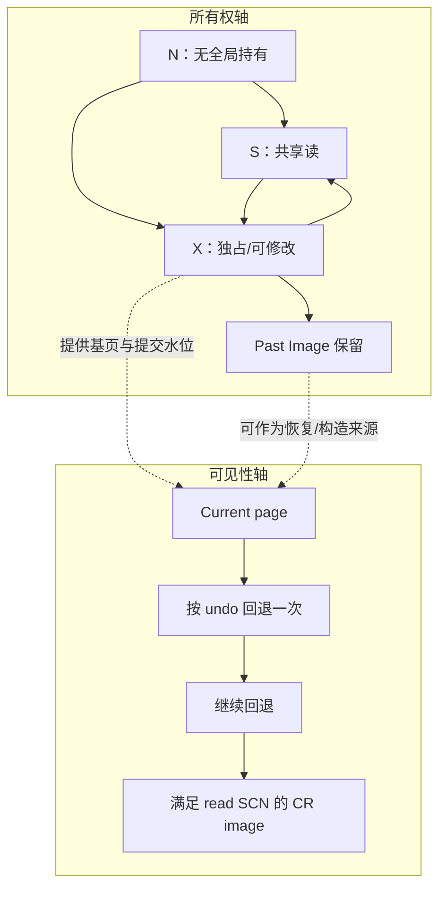
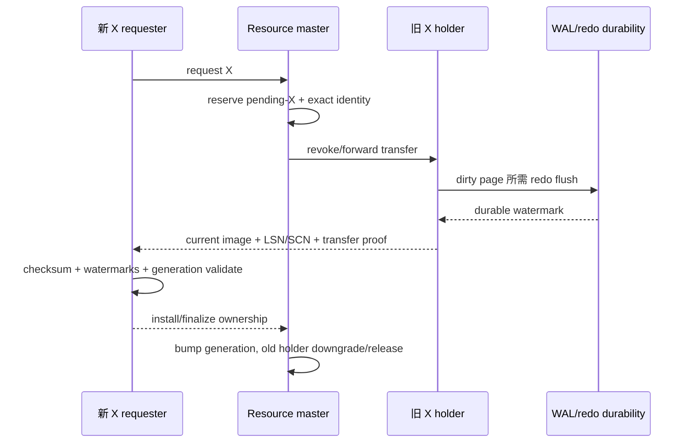
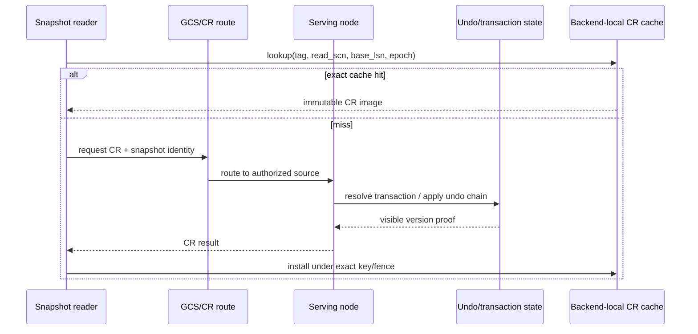

# 02：Current block、CR block 与可见性

[上一篇：架构与路由](01-architecture-and-routing.md) · [返回索引](README.md) · [下一篇：传输与一致性](03-transfer-coherence-and-faults.md)

## 结论先行

Current block 回答“现在这页是什么”，CR block 回答“对这个快照而言这页应该是什么”。GCS 必须同时协调块的物理所有权和 MVCC 可见性；只传最新 8 KiB 不能保证一致读，只回退 undo 又不能替代 current block 的独占修改权。

## 两条相交但不同的轴

PGRAC 的 PCM 将所有权代际与内容 LSN 分开：

- `ownership_generation/token` 证明这次谁获得了修改权；
- `page_lsn`、page SCN 和 PI watermark 描述内容的新旧；
- `GRANT_PENDING`、`REVOKING` 等中间态明确表示传输或切换尚未提交。

如果把 LSN 当 ownership generation，两个内容相同但所有权轮次不同的页会发生 ABA；如果只看 generation 而不看内容水位，又可能把合法拥有但落后的镜像当成最新页。

## Current block 的 X 转移

这条链里最危险的是“页已发出，但 master 与 requester 对所有权提交认知不同”。因此 PGRAC 不是在发送瞬间就把新 holder 当成完成，而是保留 pending/reserved identity，等接收端验证与 finalize 才推进稳定代际。

**Oracle 已验证。** Oracle 将 dirty current/CR block 的 `busy` 等待原因之一解释为必须先完成 redo flush，再处理 Cache Fusion transfer。PGRAC 的具体 pending-X 和 finalize 状态是自身实现，不等于 Oracle 内部枚举。

## CR block 的构造与缓存

PGRAC backend-local CR cache key至少绑定：

- relation file locator；
- fork 与 block number；
- `read_scn`；
- base page LSN；
- 查找时还用当前 cluster epoch 和 relation generation 做 fence。

因此“同一物理块”并不等于“同一个 CR cache entry”。快照、基页或 relation generation 变化都会导致 miss，而不是复用看似相近的旧页。

[`t/216_cluster_3_10_cr_cache.pl`](../../../src/test/cluster_tap/t/216_cluster_3_10_cr_cache.pl) 公开验证了：

- 同一快照首次构造、再次命中；
- current page LSN 变化后仍能按原快照得到旧值；
- 一个块内多条 undo 链共同回退；
- 多次更新按 write-SCN 逆序剥离；
- 容量淘汰与关闭 cache 后仍保持结果正确。

## PI 不是普通第二份缓存

Past Image（PI）表示旧 holder 在所有权变化后仍需保留的历史镜像/责任。它用于关闭“current 已转走，但更早读者或恢复仍需要旧版本来源”的窗口。

它的生命周期是 `Current-X → transfer pending → PI kept → PI retirable →
discard`。身份或水位不匹配时回到 fail-closed 的稳定状态，不能跳到 discard。

PI discard 必须是有条件动作：旧 holder 不能只因为收到任意 invalidate 就丢弃最后一份可证明镜像。PGRAC 的 invalidate ACK 会区分 durable note、PI kept 与 retryable busy，master 据此判断何时可以继续。

## Storage fallback 的正确边界

共享存储页只有在下面事实同时成立时才可能作为结果：

1. 当前 master authority 有效；
2. 没有与请求冲突的 live holder/pending-X；
3. storage page 的 LSN/SCN 不落后于 PCM watermark；
4. 页 checksum 与 identity 正确；
5. 请求类型允许使用该来源。

否则必须返回 lost-write、pending-X、master-not-holder 或 recovering 等拒绝。`t/401_gcs_master_direct_storage_fallback_2node.pl` 同时验证“证明满足时救援成功”和“证明不满足时仍报丢写”，避免 fallback 变成静默读旧页。

## Current 与 CR 的公开能力边界

| 项目 | 当前公开状态 |
|---|---|
| current block 的 S/X、holder transfer、invalidate 与 ownership finalize | 已有生产接线和多节点 TAP |
| backend-local CR cache 与同一快照回退 | 有强 e2e 测试 |
| routed CR reply domain、holder route、transaction/undo 结果类型 | 已进入公开生产代码 |
| 所有 rmgr、所有对象类型、所有故障组合下的远程 CR | 不能由当前测试矩阵推导为穷尽覆盖 |
| 与 Oracle CR server 内部算法逐字段相同 | Oracle 未公开，不能声称 |

下一篇聚焦“传输本身不可靠”时怎样维持这些语义：重复请求、回复丢失、进程重启和竞态如何被收敛。
