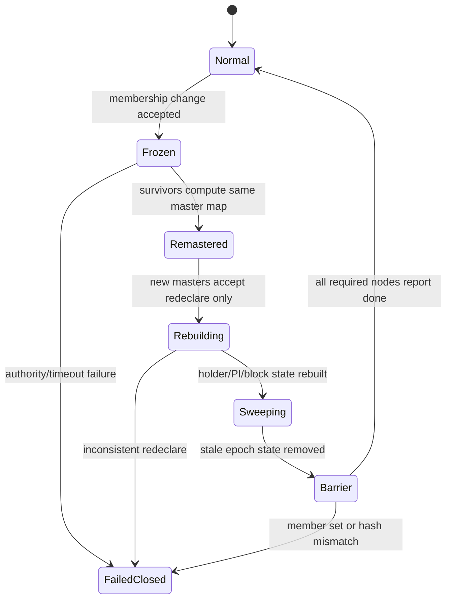
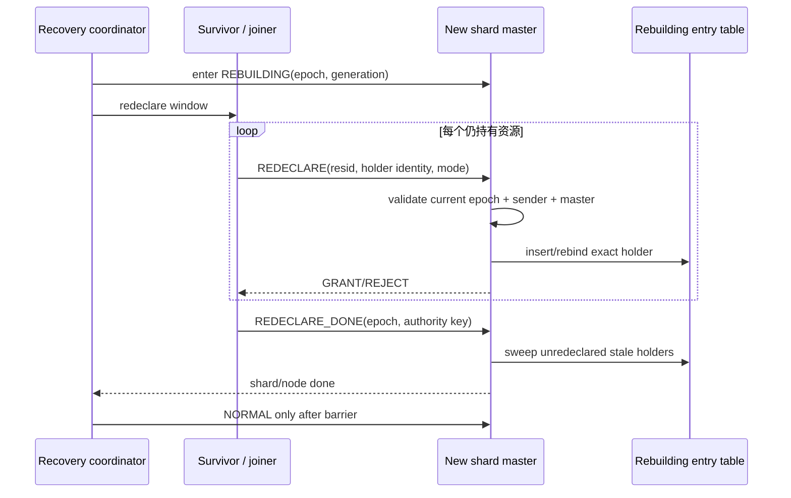
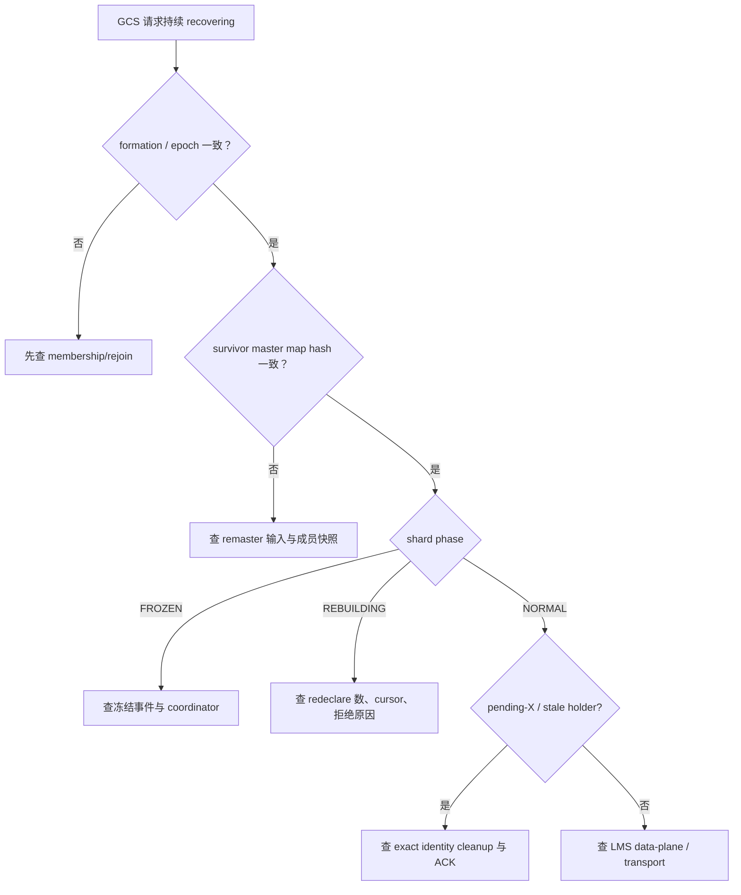

# 04：GCS 恢复、Remaster 与运维排障

[上一篇：传输与一致性](03-transfer-coherence-and-faults.md) · [返回索引](README.md) · [下一篇：Oracle 对比](05-oracle-comparison.md)

## 结论先行

节点死亡或加入会同时改变成员 epoch、资源 master 和 holder 可信范围。正确恢复不是立即重算一张 master map，而是先冻结受影响 shard，重建或重声明 holder/PCM 状态，清理旧代际记录，完成集群 barrier，最后才恢复 grant 与块服务。

## 故障后恢复主链

这条链包含三个不同证明：

- **membership proof**：本轮 survivor/joiner 集合是什么；
- **map proof**：各 survivor 算出相同的 shard→master 映射；
- **resource proof**：新 master 的 holder/PCM 记录已经由当前实例重声明，旧 epoch 残留已清除。

只完成其中一个都不能开放 GCS。

## Fail remaster 与 Join remaster

| 方向 | 触发 | 主要危险 | PGRAC 行为 |
|---|---|---|---|
| failure-driven | 原 master/holder 死亡 | 旧 holder 不会再 release；磁盘可能落后于其内存页 | 冻结受影响 shard，重算 map，survivor 重声明，清理死节点状态 |
| join-driven | 合法实例加入当前 formation | 新旧节点对 master generation 或 holder 集理解不同 | 在 authority barrier 下重分配/重绑定，完成后才让 joiner 服务 |

未受影响 shard 不应被无条件清空。公开三节点测试会分别选择受影响与未受影响资源，验证 survivor map 一致，同时保留能够安全继续的 holder。

## 重声明为什么必须精确

重声明不是“把本地 cache 全抄过去”。每条记录都需当前 epoch、当前 master、当前 incarnation/generation 和合法模式。未被当前 holder 重声明的旧记录在 barrier 前被 sweep；否则 dead node 的 X grant 可能长期阻止服务，或更糟地与新 grant 并存。

## Warm recovery 与块来源

重启节点带来的本地 buffer/PCM 记忆不能直接视为权威：

1. 先由 membership/rejoin 确认它属于当前 formation；
2. 再让当前 master 认可其 holder identity；
3. 对 dirty/current/PI 状态检查 WAL durability 与 page watermark；
4. 不足以证明的镜像丢弃或保持 resource recovering；
5. 完成 barrier 后才恢复普通 request。

[`t/249_grd_recovery_remaster.pl`](../../../src/test/cluster_tap/t/249_grd_recovery_remaster.pl) 和 [`t/250_grd_remaster_3node.pl`](../../../src/test/cluster_tap/t/250_grd_remaster_3node.pl) 是 failure remaster 的主要公开锚点；[`t/251_gcs_pcm_warm_recovery.pl`](../../../src/test/cluster_tap/t/251_gcs_pcm_warm_recovery.pl) 包含 warm recovery 证明，但其中有条件跳过腿，不能写成所有崩溃窗口都已穷尽。

## 运维观测地图

排查顺序固定为“症状 → wait event → 系统视图 → `cluster_debug` dump →
带 epoch/request id 的节点日志”。这样能先确定卡在 transport、资源状态还是恢复
barrier，避免只从单条 SQL 日志倒推整个协议。

建议按层排查，而不是先抓某一条 SQL：

| 现象 | 先看 | 再判断 |
|---|---|---|
| 普遍 `GCS_BLOCK_SHIP_WAIT` 高 | LMS serve histogram、worker dispatch、连接 reset | 服务拥塞还是网络重连 |
| retransmit 上升 | dedup replay、reply late-drop、IC peer | 丢包/拥塞还是 master 变更 |
| epoch stale retry | membership epoch、master generation | 合法重配置余波还是节点未收敛 |
| invalidate ACK wait | pending-X、holder 列表、BAST/invalidate counters | holder 忙还是旧 holder 未清理 |
| lost-write detected | ownership generation、PCM watermark、storage page LSN/SCN | storage 真落后还是错误来源 |
| resource recovering | `grd_recovery` state、done bitmap/hash、redeclare cursor | 卡在冻结、重建还是 barrier |

## 恢复期排障决策树

不要通过强行改 phase、清空 entry 或跳过 barrier 来“恢复服务”。这些动作会删除诊断证据，并可能把旧 holder 与新 grant 同时放进服务面。

## 与 Oracle 运维指标的对应

**Oracle 已验证。** `gc current/cr block busy` 指远端 holder 或 redo flush 造成等待；`congested` 指 LMS 服务进程排队过久；`lost` 通常与互联丢包、拥塞或硬件问题相关并自动重试；`GCS_SERVER_PROCESSES` 可影响服务能力。

**语义映射。** PGRAC 的 wait events 和 LMS histogram 可以定位相似层次，但计数器名称、阈值和诊断视图不是 Oracle AWR/ASH 的复制品。

## 生产边界

- GCS recovery 依赖成员/quorum/formation 已经给出可信 survivor 集；它不能自行解决 split-brain。
- PGRAC 当前 Clusterware-like 进程仍在 postmaster 进程树内；生产 hard fencing 需要部署系统补足。
- RDMA 是否可用取决于构建、网卡与 fallback 配置；协议正确性不能依赖 RDMA。
- 测试通过代表指定拓扑和故障腿，不代表任意规模、任意 rmgr 与任意故障组合已被穷举。

下一篇把完整 PGRAC 路径与 Oracle RAC 的公开行为逐项对齐，并明确哪些相同、哪些只是语义近似。
