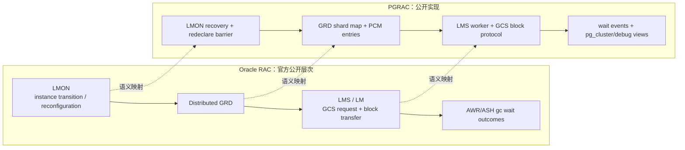

# 05：Oracle RAC 与 PGRAC GCS 对比

[上一篇：恢复与运维](04-recovery-remaster-and-operations.md) · [返回索引](README.md)

## 结论先行

Oracle RAC 与 PGRAC GCS 的共同目标是：共享磁盘多实例间维护缓存一致性，把 current/CR block 直接经互联传输，并在实例变化后重配置全局资源。两者的职责分层相近；PGRAC 的 resource identity、PCM 状态、wire、去重、确认、CR cache 与 remaster FSM 都是公开可审计的自身实现，不能宣称复制 Oracle 内部算法。

## 高层职责映射

## 逐项比较

| 主题 | Oracle 官方公开行为 | PGRAC 当前公开实现 | 判断 |
|---|---|---|---|
| 缓存一致性 | Cache Fusion 自动同步实例 buffer cache | PCM S/X/PI + GCS block transport | 目标一致，内部状态不同 |
| 全局目录 | GRD 分布在活动实例，GCS/GES 协调资源 | 4096 GRD shard + deterministic master map + PCM entry | 语义对应，结构自研 |
| 服务进程 | LMS/LM 收发 GCS 请求和块 | LMS worker pool 处理 grant、forward、reply | 职责相近 |
| 2-way/3-way | current/CR wait outcomes，≤3 hops | master 直返或 master→holder→requester | 外部形状相近，wire 不同 |
| current/CR | 官方区分 current 与 consistent read | current transfer + snapshot/undo CR + CR cache | 语义对应 |
| dirty block | busy 可因 redo flush 或远端 holder | durability/watermark gate 后传输 | 安全目标相近 |
| RDMA | `gc ... block direct read` | tier3 direct-land，配置化 TCP fallback | 能力方向相近 |
| 丢包 | `gc ... block lost` 自动重试 | request identity + dedup + retransmit + DONE | 都重试；具体协议自研 |
| 实例变化 | LMON 重配置 GCS/GES 资源 | freeze→remaster→redeclare→sweep→barrier | 职责相近，FSM 自研 |
| 观测 | AWR/ASH、wait events、GCS server views | PG wait events、GRD/LM*/debug views | 观测体系不同 |

## 哪些是 Oracle 已验证事实

Oracle 官方资料明确支持以下陈述：

- GCS 与 GES 使用分布式 GRD 协调数据块和 enqueue；
- LMS/LM 维护 GCS/buffer-cache resource 的 lock database，并处理 GCS 请求、块传输和消息；
- LMON 检测 instance transition，并重配置 GES/GCS resources；
- current 与 CR 都存在 2-way、3-way、busy、congested、direct read、lost 等 wait outcome；
- dirty block 传输可能等待 redo flush；
- Cache Fusion request 在不超过三个 hop 内完成。

官方依据：

- [Introduction to Oracle RAC](https://docs.oracle.com/en/database/oracle/oracle-database/26/racad/introduction-to-oracle-rac.html)
- [Background Processes](https://docs.oracle.com/en/database/oracle/oracle-database/26/refrn/background-processes.html)
- [Descriptions of Wait Events](https://docs.oracle.com/en/database/oracle/oracle-database/26/refrn/descriptions-of-wait-events.html)
- [`GCS_SERVER_PROCESSES`](https://docs.oracle.com/en/database/oracle/oracle-database/26/refrn/GCS_SERVER_PROCESSES.html)

## 哪些不能说“和 Oracle 一样”

Oracle 当前公开文档没有披露下列内部细节，因此这里只能描述 PGRAC 自身行为：

- Oracle 的 GCS wire layout、request id 组成和 checksum frame；
- Oracle 是否使用与 PGRAC 相同的 dedup entry、DONE quarantine 或重传预算；
- Oracle GRD shard 数、hash、entry 数组与 pin/reclaim 方式；
- Oracle current transfer 的精确 pending/finalize 状态；
- Oracle CR cache key、undo result frame 和 mixed-version compatibility 位；
- Oracle remaster/redeclare barrier 的内部状态枚举与 hash。

## PGRAC 的 PostgreSQL adaptation

PGRAC 不是给 Oracle 内核做兼容层，而是在 PostgreSQL buffer/MVCC/WAL 语义上实现相同类别的集群职责：

- resource identity 以 PostgreSQL `BufferTag`/relation locator 为基础；
- lock mode 与本地 buffer state 需要兼容 PostgreSQL 现有锁序；
- CR 构造依赖 PGRAC 的 SCN、undo 与事务状态扩展；
- WAL/LSN durability 与 ownership generation 分离；
- SQLSTATE、wait event 和系统视图遵循 PostgreSQL 扩展方式。

## 现实差距与判断方式

| 维度 | 当前判断 |
|---|---|
| 核心架构方向 | 与 Oracle RAC 的公开 GCS/GRD/LMS 分层一致 |
| 基本块传输与多节点一致性 | 已有生产代码和 2/3/4 节点测试锚点 |
| 恢复/remaster | 已有双/三节点故障链；仍需按每条测试腿判断覆盖 |
| CR 广度 | 核心 snapshot/undo/cache 与 routed domain 已实现；不能宣称 Oracle 全 rmgr 等价覆盖 |
| 网络与硬件 | TCP 可用；RDMA 依赖构建和环境，不能用配置存在替代实测 |
| 外部 fencing | 不属于 GCS；当前部署仍需外部控制面补足 |

最终判断应基于三件事：生产 caller 是否真的走该路径、失败时是否 fail-closed、正式多节点测试是否覆盖目标拓扑。接口存在、计数器可读或测试中的条件 `SKIP` 都不能单独证明生产闭环。
