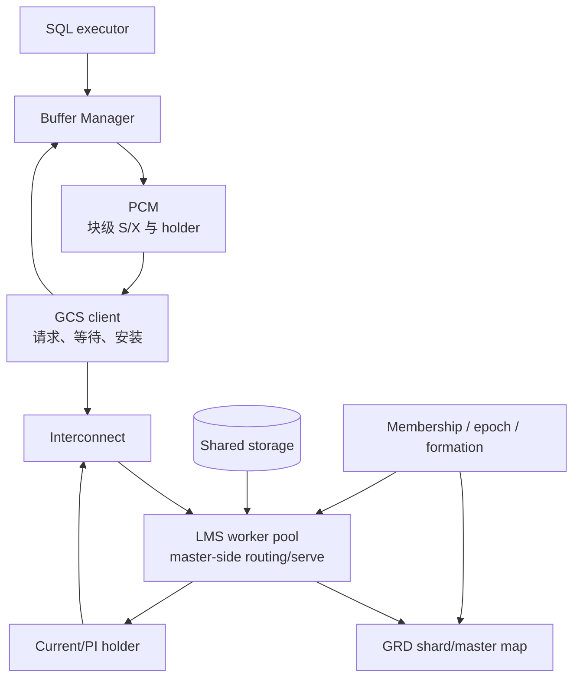

# PGRAC GCS 与 Oracle RAC Cache Fusion 图解

GCS（Global Cache Service）解决的是共享磁盘集群最核心的数据块问题：多个实例都能访问同一份数据文件时，怎样保证某一时刻只有合法实例修改 current block，同时让其他实例获得满足自身快照的 consistent-read（CR）版本。

这组文档从一次 buffer miss 出发，沿着 PCM、GRD、LMS、块传输、确认与恢复一路追踪到重新开放服务。Oracle 部分只陈述官方公开事实；PGRAC 部分以当前公开主线的生产代码和测试为准，不猜测 Oracle 未公开的 wire、状态枚举或队列算法。

## 阅读顺序

- [01：架构、角色与 2-way / 3-way 路由](01-architecture-and-routing.md)
- [02：Current block、CR block 与可见性](02-current-and-cr-blocks.md)
- [03：块传输、去重、重传与一致性保护](03-transfer-coherence-and-faults.md)
- [04：恢复、Remaster 与运维排障](04-recovery-remaster-and-operations.md)
- [05：Oracle RAC 与 PGRAC GCS 对比](05-oracle-comparison.md)

## 一张图定位 GCS

各层职责不能互相替代：

| 层 | 回答的问题 |
|---|---|
| membership / epoch / formation | 哪些实例有资格参与本轮服务？旧消息是否必须丢弃？ |
| GRD master map | 哪个实例负责裁决这个资源？ |
| PCM | 谁持有该块的 S/X 权限、是否正在转换、PI 是否仍需保留？ |
| GCS block transport | 块从哪里取、发给谁、回复属于哪个请求？ |
| Buffer Manager / MVCC | 收到的页能否安装、是否满足当前快照？ |

## 四类证据标识

- **Oracle 已验证**：Oracle 官方文档明确描述。
- **PGRAC 已实现**：公开主线已有生产接线，并可由源码或测试锚定。
- **语义映射**：安全职责相近，但不代表内部协议相同。
- **当前边界**：公开版本只覆盖部分路径、测试含条件腿，或依赖部署环境。

## 先记住五个结论

1. **共享磁盘不等于共享缓存。** 磁盘上的页可能落后于某实例内存中的 current block，不能遇到 miss 就绕过 GCS 读盘。
2. **资源 master 不一定持有块。** master 可以直接服务，也可以把请求转发给真正 holder；这就是 2-way 与 3-way 路由差异的来源。
3. **Current 与 CR 是不同结果。** Current 用于当前修改/读取语义；CR 必须满足请求快照，可能由 undo 链构造。
4. **传输成功不等于所有权提交。** 请求身份、epoch、master generation、checksum、页水位和 DONE 都在关闭不同的重复、延迟与 ABA 窗口。
5. **恢复期间宁可拒绝。** shard remaster、holder 重声明或 authority barrier 未完成时，PGRAC 返回可识别的 recovering/timeout，而不是从不确定来源授予块。

## 当前公开实现与测试锚点

| 能力 | 生产入口 | 代表性测试 | 说明 |
|---|---|---|---|
| GCS request/reply 与 LMS 服务 | [`cluster_gcs_block.c`](../../../src/backend/cluster/cluster_gcs_block.c)、[`cluster_lms.c`](../../../src/backend/cluster/cluster_lms.c) | [`t/110`](../../../src/test/cluster_tap/t/110_gcs_loopback.pl)、[`t/111`](../../../src/test/cluster_tap/t/111_gcs_block_ship_2node.pl) | 本地与跨节点基本链 |
| 2-way / 3-way | GCS routing + holder forward | [`t/113`](../../../src/test/cluster_tap/t/113_gcs_block_2way_2node.pl)、[`t/115`](../../../src/test/cluster_tap/t/115_gcs_block_3way_3node.pl) | 部分较早 TAP 含条件注入腿 |
| CR cache / snapshot version | [`cluster_cr_cache.c`](../../../src/backend/cluster/cluster_cr_cache.c) | [`t/216`](../../../src/test/cluster_tap/t/216_cluster_3_10_cr_cache.pl) | 强验证同一快照和多链回退 |
| 去重、重传、DONE | [`cluster_gcs_block_dedup.c`](../../../src/backend/cluster/cluster_gcs_block_dedup.c) | [`t/112`](../../../src/test/cluster_tap/t/112_gcs_block_retransmit_2node.pl)、[`t/371`](../../../src/test/cluster_tap/t/371_gcs_done_mixed_version_2node.pl) | 混合版本对端保守 pin |
| 丢写检测与安全存储回退 | PCM watermark + page SCN/LSN validators | [`t/116`](../../../src/test/cluster_tap/t/116_gcs_block_lost_write_2node.pl)、[`t/401`](../../../src/test/cluster_tap/t/401_gcs_master_direct_storage_fallback_2node.pl) | 不满足证明时 fail-closed |
| 故障 remaster / warm recovery | GRD recovery + PCM redeclare | [`t/249`](../../../src/test/cluster_tap/t/249_grd_recovery_remaster.pl)、[`t/251`](../../../src/test/cluster_tap/t/251_gcs_pcm_warm_recovery.pl) | 恢复腿的覆盖强度逐项注明 |

## Oracle 官方入口

- [Oracle RAC 架构、Cache Fusion、GCS/GES/GRD](https://docs.oracle.com/en/database/oracle/oracle-database/26/racad/introduction-to-oracle-rac.html)
- [Oracle RAC 后台进程：LMS、LMD、LMON](https://docs.oracle.com/en/database/oracle/oracle-database/26/refrn/background-processes.html)
- [Oracle Cache Fusion wait events](https://docs.oracle.com/en/database/oracle/oracle-database/26/refrn/descriptions-of-wait-events.html)
- [Oracle `GCS_SERVER_PROCESSES`](https://docs.oracle.com/en/database/oracle/oracle-database/26/refrn/GCS_SERVER_PROCESSES.html)

> 这里的“2-way/3-way”用于解释公开可见的网络 hop 形状。PGRAC 消息名、字段和确认协议是自身实现，不能反推为 Oracle 内部 wire。
