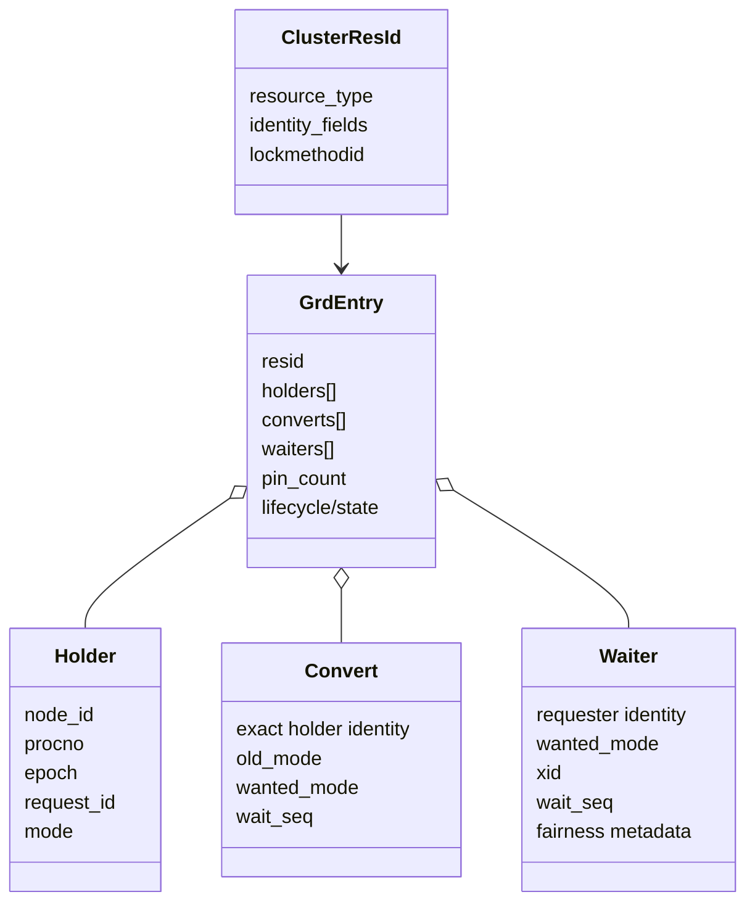
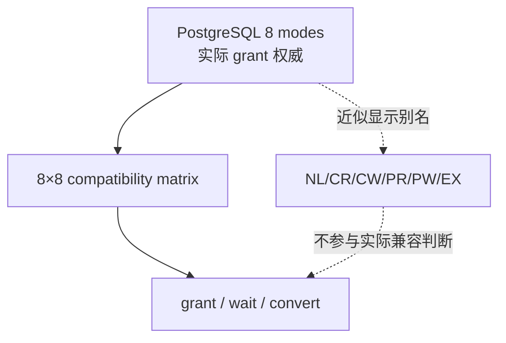

# 01：GES 架构、资源身份与 GRD

[返回索引](README.md) · [下一篇：Grant、Convert、Release 与 BAST](02-grant-convert-release-and-bast.md)

## 结论先行

GES 的核心不是网络锁 RPC，而是“对同一 resource identity，所有实例最终只接受同一个 master 的 holder/waiter/convert 状态”。PGRAC 用固定 shard map 把资源交给唯一 master，在 GRD entry 内完成兼容判断、排队和生命周期管理。

## Resource identity 到 master

```mermaid
flowchart LR
    C[PG lock caller<br/>locktag + method] --> R[ClusterResId<br/>canonical encode]
    R --> H[64-bit hash]
    H --> S[shard 0..4095]
    S --> M[master map[shard]]
    M --> L[LMS worker owning shard]
    L --> E[GRD entry]
```

资源编码必须包含足以区分 PostgreSQL lock namespace 的字段；例如 `lockmethodid` 不能被 hash 前丢掉，否则两个本地语义不同的对象可能在集群层合并。

master lookup 是路由，不是 grant。即使 requester 与 master 同节点，也要在该 shard 的 entry 锁下走同一兼容矩阵和队列规则。

## GRD entry 里有什么



三条队列的语义不同：

- `holders[]` 只保存已经 grant 的事实；
- `converts[]` 保存现有 holder 请求更强/不同模式的转换；
- `waiters[]` 保存尚未持有该资源的新请求。

把 convert 当普通 waiter 会造成两个问题：原 grant 无法精确保留，后来到达的兼容请求还可能无限绕过等待升级者。

## 请求身份为什么是四元组以上

holder 至少由 `node_id + procno + cluster_epoch + request_id` 精确标识；排队/死锁取消再加入 `wait_seq`。这些字段分别防止：

| 字段 | 防护 |
|---|---|
| `node_id` | 不同实例 backend 混淆 |
| `procno` | 同一实例不同 backend 混淆 |
| `cluster_epoch` | 节点变化前的 holder/消息复活 |
| `request_id` | backend 对同资源的旧请求 ABA |
| `wait_seq` | 同一 backend 已结束旧 wait、进入新 wait 后被旧 cancel 命中 |

资源 master generation 还绑定 cluster epoch 与 LMS restart generation，防止同一节点的旧 LMS 在重启/重配置后继续发 grant。

## 本地与远程请求同构

本地 master 请求进入本机 LMS work queue；远程 master 请求先经 interconnect，
再进入目标 LMS 的同类 work item。之后两者都 pin GRD entry、执行 compatibility/
queue decision，并以本地 wake 或 `GES_REPLY` 返回结果。

生产 grant owner 收束到 LMS/GRD master-side 路径，避免 backend 线程在本地自行 grant，而远程请求由另一套逻辑处理。若 work queue、entry、holder、waiter 或 convert 容量不足，路径返回明确容量错误并 fail-closed。

## Entry pin 与冷回收

GRD entry 不能在 caller 取到指针后被 LMON sweep 同时删除。lookup 成功时先增加 pin，caller 完成 entry lock 操作后再 release pin。只有同时满足以下条件才可 cold reclaim：

- 没有 holder；
- 没有 waiter；
- 没有 convert；
- 没有 BAST/pending lifecycle；
- `pin_count == 0`。

[`t/296_grd_entry_lifecycle_reclaim_2node.pl`](../../../src/test/cluster_tap/t/296_grd_entry_lifecycle_reclaim_2node.pl) 用跨节点 advisory lock churn 验证冲突时不能双 grant、release 后可重获、最终 entry 数归零、reclaim 计数增加且 pin high-water 被观察。

## 模式空间：PG 八模式是权威

PGRAC 直接使用 PostgreSQL 八种 lock mode 的 compatibility matrix。代码提供 NL/CR/CW/PR/PW/EX 名称映射，便于理解 Oracle/DLM 语义，但它是 many-to-one、approximate 映射。



`pg_cluster_ges_mode_matrix()` 暴露 64 个 compatibility cell；[`t/276_ges_mode_contract.pl`](../../../src/test/cluster_tap/t/276_ges_mode_contract.pl) 验证它与 PostgreSQL 原生矩阵一致，并验证典型互斥/兼容关系。

下一篇沿 entry 的三条数组走完 grant、convert、release 与 BAST。
