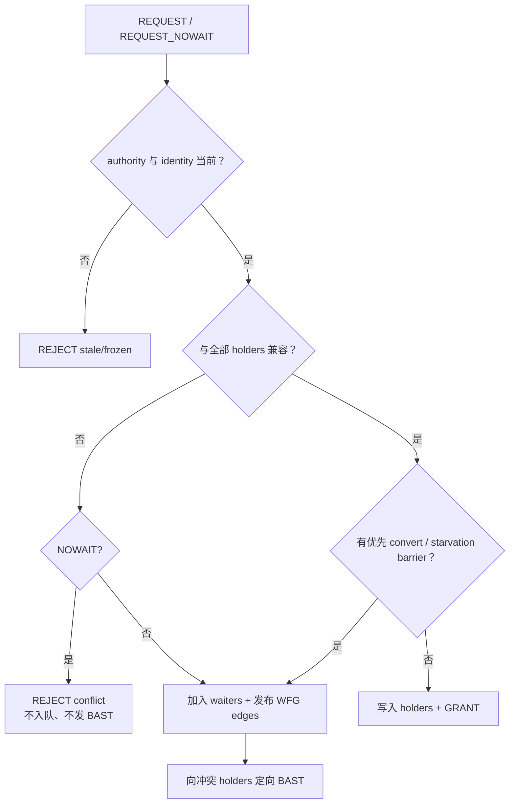
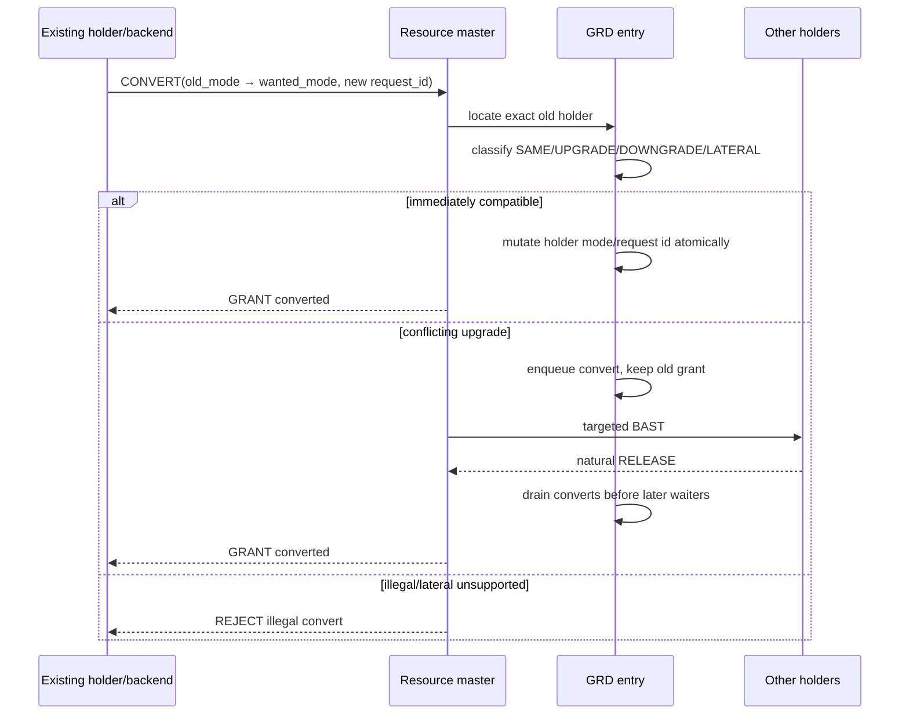

# 02：Grant、Convert、Release 与 BAST

[上一篇：架构与 GRD](01-architecture-and-grd.md) · [返回索引](README.md) · [下一篇：Deadlock 与公平性](03-deadlock-fairness-and-lifecycle.md)

## 结论先行

GES grant 的安全核心是：master 只依据 entry 内已经确认的 holder/convert/waiter 作决定。冲突请求必须排队或立即拒绝；BAST 只是请 blocker 尽快自然释放/降级的通知，不能越过事务语义强制夺锁。

## 新请求：Grant 还是 Wait



兼容判断必须遍历所有已 grant holder；不能只看“最强 mode”而丢失 holder identity，因为 release、BAST 和 deadlock edge 都要指向具体 backend。

## Convert：保留旧 grant 的原子升级



转换按 compatibility-set 的偏序分类：

- **SAME**：模式相同，可做幂等处理；
- **UPGRADE**：目标兼容集合更小，需要更强排他性；
- **DOWNGRADE**：目标更宽松，可释放冲突；
- **LATERAL**：两者不可比较，不能假装成升级或降级。

如果 master 已经原子写入更强 holder，但 caller 随后失败，专用 `CONVERT_ROLLBACK` 会恢复旧 mode/old request identity，而不是用普通 RELEASE 删除整条旧 grant。

## Release：删除事实并 drain

release 不是只删 holder：它还会触发队列重新判断。

master 先按 exact identity 删除 matching holder，再优先 drain compatible
converts，最后在 fairness barrier 下 drain waiters，并向 release caller 返回 ACK
或本地完成结果。

本地 master 与远程 master 的 release 都必须 drain；否则同节点 release 后 waiter 仍沉睡，而远程 release 才会唤醒，形成路径不一致。

## BAST：通知，不是抢锁

Blocking AST（这里简称 BAST）表示“你的 holder 正在阻塞一个更强请求，请在安全点释放或降级”。

```mermaid
sequenceDiagram
    participant R as Waiting requester
    participant M as Master
    participant H as Conflicting holder backend

    R->>M: incompatible REQUEST/CONVERT
    M->>M: enqueue + record blocker set
    M->>H: targeted BAST(resid, exact holder identity)
    H->>H: validate node/proc/epoch/request
    H->>H: mark pending; reach natural release point
    H->>M: RELEASE（同时作为逻辑 BAST_ACK）
    M->>M: clear bast-pending + drain queue
    M-->>R: GRANT
```

PGRAC 对本地 holder 发送 `PROCSIG_CLUSTER_GES_BAST`，对远端 holder 发送 GES message。两种路径都只通知精确 blocker，不广播给同节点所有 backend。

为什么不强制释放？因为 holder 所在 backend 可能仍在执行事务临界区、维护本地 lock table 或修改受保护对象。异步强删 global holder 会让全局目录说“空闲”，而本地事务仍在使用资源。

## BAST 的过期与重试

holder 收到 BAST 后必须校验完整 identity。backend 已退出、epoch 已变或 request id 已换时，这条通知是 stale，应丢弃并计数。master 等不到自然 release 时可以重发/超时，但不能推断 holder 已经释放。

| 情况 | 结果 |
|---|---|
| exact holder 仍活跃 | 置 pending，等待自然 release |
| stale epoch/request | drop，不影响新 holder |
| holder backend 不存在 | recovery/cleanup 路径处理，不伪造 ACK |
| retry budget 用尽 | requester REJECT/timeout，holder 事实保留 |
| NOWAIT conflict | 立即 REJECT，不入队、不发 BAST |

## 测试边界

- [`t/277_ges_convert.pl`](../../../src/test/cluster_tap/t/277_ges_convert.pl) 验证 mode contract、转换 SQL 行为和生产调用形状；其中部分断言是源码接线检查，不是完整跨节点每种转换 e2e。
- [`t/278_ges_bast.pl`](../../../src/test/cluster_tap/t/278_ges_bast.pl) 验证 BAST 目标过滤与实现接线，但文件明确记录跨节点 delivery e2e 的 harness 边界。
- 真正的跨节点等待、release 后推进与取消，会在死锁、公平性和 cold-reclaim TAP 中继续被间接覆盖。

下一篇解释 wait queue 形成环时，LMD 如何在不完整图、旧 wait 和不可安全取消 backend 面前保持 fail-closed。
