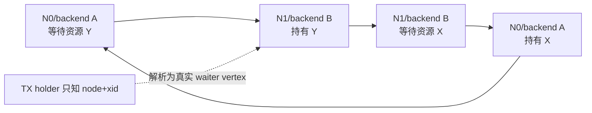
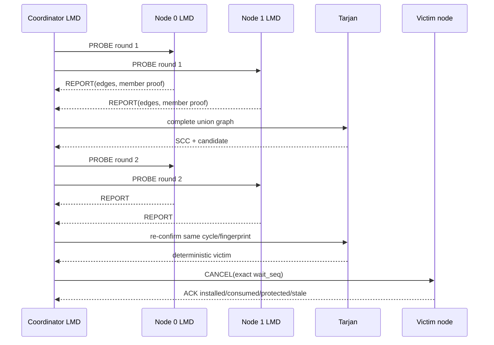
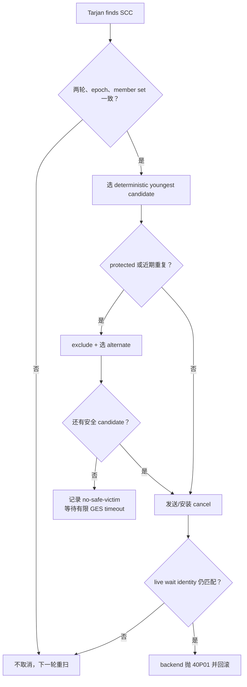

# 03：分布式死锁、公平性与资源生命周期

[上一篇：Grant、Convert、Release 与 BAST](02-grant-convert-release-and-bast.md) · [返回索引](README.md) · [下一篇：恢复与运维](04-recovery-remaster-and-operations.md)

## 结论先行

跨节点 deadlock 不能由任何单节点的本地 lock graph 完整观察。PGRAC 由 LMD 收集当前成员的 wait-for edges，只有完整成员集合连续两轮确认同一环，且 victim 在目标节点仍处于同一次 wait，才安装 cancel。公平性则在 deadlock 之前阻止长期插队，让强请求有机会到达队首。

## Wait-for graph 从哪里来

每个阻塞请求形成“waiter → blocker”边。一个 waiter 可能被多个 holder 阻塞，因此边集必须整体替换，不能更新一条、残留上一轮其他 blocker。

vertex identity 绑定 node、procno、epoch、request id 和 wait sequence；xid 与 start timestamp 作为事务解析/选 victim 元数据，而不是替代 wait identity。

## 两轮完整确认

两个关键 fail-closed 门：

1. expected members 与 received members 不相等时，在 Tarjan 之前丢弃 round；
2. 两轮 cycle/fingerprint 不一致时视为瞬态，不取消任何 backend。

[`t/308_lmd_partial_failclosed_2node.pl`](../../../src/test/cluster_tap/t/308_lmd_partial_failclosed_2node.pl) 真实验证 partial round 只增加 incomplete 计数，不增加 confirmed/cancel，并在正常 lock timeout 后保持节点可用。

## Tarjan 与 victim 安全门

Tarjan 找到 strongly connected component 只证明图中有环，不等于可以立即杀会话。PGRAC 还要：

- 确认 membership/epoch 在 probe 期间未变化；
- 用确定性规则从 cycle vertices 选择 victim；
- 跳过 protected/unsafe-to-cancel backend；
- 避免短窗口内重复选择同一 victim 造成 thrash；
- 在 victim 节点重读 per-proc wait state；
- 精确匹配 `request_id + wait_seq`；
- remote cancel 等 ACK，必要时幂等重传或选择可取消的替代 victim。

[`t/291_lmd_cross_node_deadlock_2node.pl`](../../../src/test/cluster_tap/t/291_lmd_cross_node_deadlock_2node.pl) 是无 SKIP 的真实双节点闭环：两个会话交叉锁表、进入 `ClusterGesReplyWait`、LMD 确认并取消一个 victim、客户端得到 `40P01`、资源释放后两节点继续 DDL/DML。`t/302` 进一步验证 cancel token 安装、消费与 ACK。

## 公平性：先避免“不是死锁的永久等待”

一个 X waiter 可能持续被后来到达、彼此兼容的 S 请求越过。它不是图上的环，却可能永远得不到 grant。

等待者经历 `queued → skipped → boosted → barrier → granted`：skip count 达到
阈值后提升到队首，barrier 阻止新的兼容 jumper 继续越过。

Convert 具有天然优先级；普通 waiter 达到 skip 上限后被提升到 head-of-line，并发布 barrier。若等待边发布/重验证失败，系统不假装公平性已经建立，而是记录失败并保持保守等待。

[`t/299_ges_starvation_2node.pl`](../../../src/test/cluster_tap/t/299_ges_starvation_2node.pl) 验证远端 X waiter 在 S holder 后等待、被 boost、后续 jumper 被挡住，释放后 X 获得资源。

## Entry 生命周期与 orphan 清理

entry 从 first lookup 进入 live；arrays 与 pending state 清空后进入 cold。并发
lookup 持 pin 时不能回收，pin 归零后 sweep 才可 reclaim。backend exit/node death
先按 exact identity 清理 owned state 并 drain，随后 entry 才可能重新变 cold。

backend exit、request timeout、deadlock victim 和 node death 都必须按 exact identity 清除自己的 waiter/convert/holder/WFG edge。宽泛地“按 procno 删”会误删 backend 已经进入的新请求；完全不清则会留下 ghost blocker。

下一篇把这些队列与图放进 shard remaster：master 死亡或新节点加入时如何冻结、重声明和重新开放。
