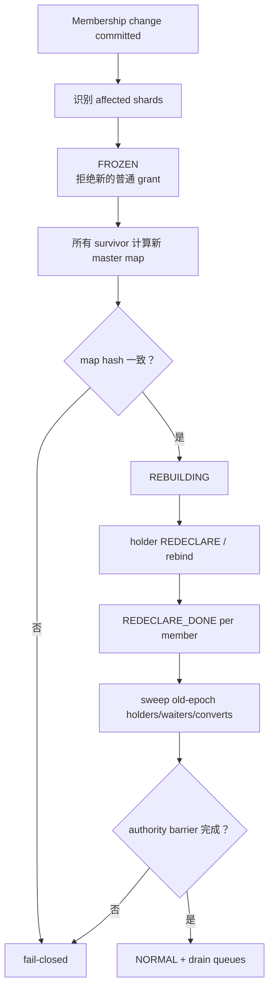
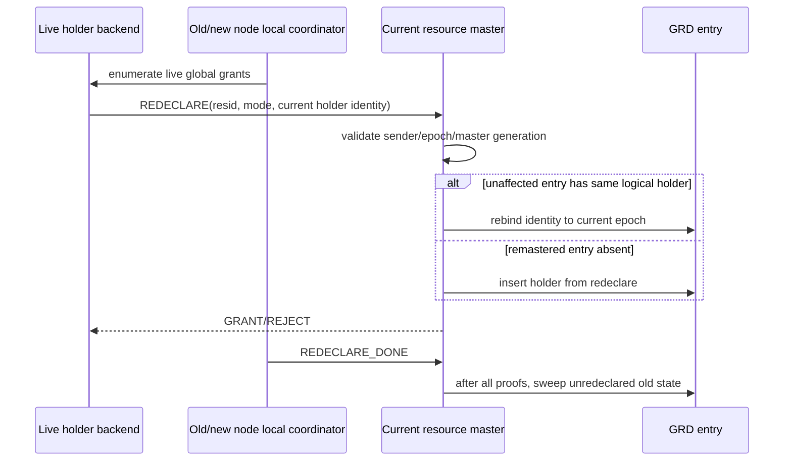
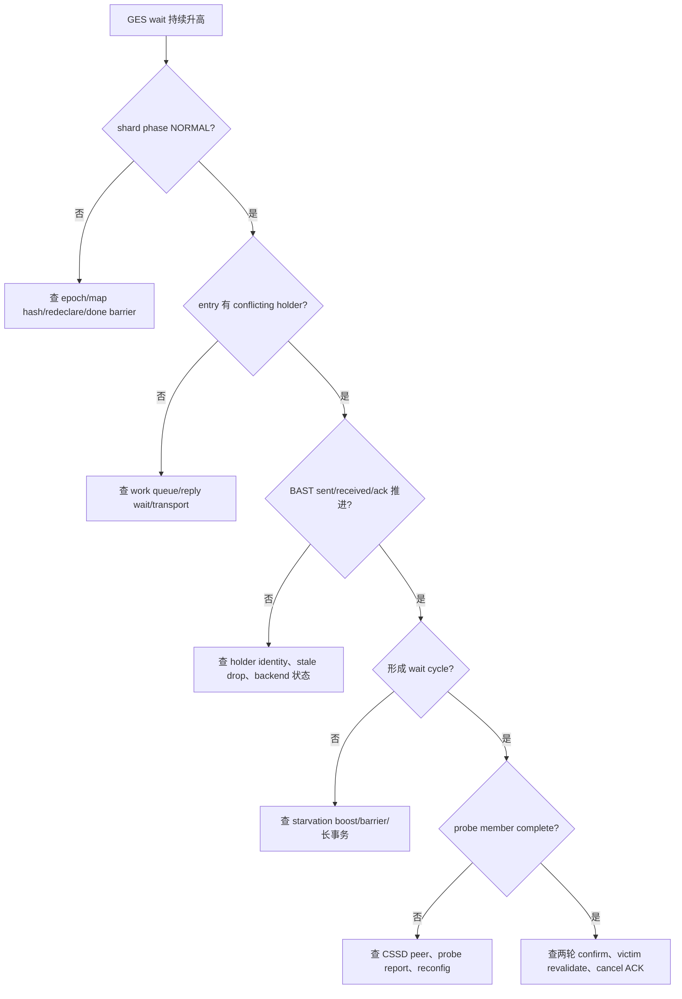

# 04：GES 恢复、Remaster 与运维排障

[上一篇：Deadlock 与公平性](03-deadlock-fairness-and-lifecycle.md) · [返回索引](README.md) · [下一篇：Oracle 对比](05-oracle-comparison.md)

## 结论先行

GES master 死亡后，survivor 不能只把 shard 指针改到自己然后继续 grant。旧 master 持有的 holder/queue 事实必须在当前 epoch 下重建；在此之前 shard 冻结，普通请求短等或拒绝。重声明、旧 holder sweep 和全员完成 barrier 都结束后，grant 才重新开放。

## Remaster 全链

受影响 shard 与未受影响 shard 的处理不同：

- 原 master 死亡的 shard 需要新 master 重建 entry；
- master 仍存活的 shard 可以保留稳定状态，但 holder identity 仍需按新 epoch rebind；
- node join 时 master map 可能主动再分配，但必须在同一 barrier 内完成；
- 任一节点看到不同 map、epoch 或 done key 时，都不能单方面开启。

## Holder 重声明与 sweep

redeclare 只能增加由当前 live backend 自证的 holder。不能从旧 master 的内存快照盲目复制，也不能在 `REDECLARE_DONE` 之前 sweep 远端旧 holder：后者会制造一个短窗口，让尚未重声明的真实 holder 与新 grant 并存。

## Recovery 与死锁图

remaster 会使旧 WFG edge、probe report 和 cancel token 失效。处理原则是：

1. probe round 固定 expected member set 与 epoch；
2. reconfig 发生时丢弃 round，不从旧图选 victim；
3. waiter/convert 重建后发布新的 `wait_seq` edge；
4. 旧 CANCEL/ACK 因 epoch/request/wait_seq 不匹配被拒绝；
5. NORMAL 后 LMD 从新图重新确认。

这保证恢复期最坏是延迟 deadlock detection，而不是误杀已不再等待的 backend。

## 双节点与三节点证据

- [`t/249_grd_recovery_remaster.pl`](../../../src/test/cluster_tap/t/249_grd_recovery_remaster.pl)：杀死节点 postmaster，验证 survivor 进入恢复、master map/phase 收敛、holder release 到当前 master、旧状态清理、资源重新获取。
- [`t/250_grd_remaster_3node.pl`](../../../src/test/cluster_tap/t/250_grd_remaster_3node.pl)：三节点识别 affected/unaffected shard，两个 survivor 计算相同 map；恢复期间请求被拒绝，之后受影响资源与 orphan 资源均可重新获得。

这些测试证明指定拓扑下的 failure remaster 主链；它们不等于任意规模和所有进程崩溃点的穷举证明。

## 运维观测地图

从 backend wait event 先区分 grant、deadlock 与 recovery：普通资源查
`pg_cluster_grd_entries`，master 查 `pg_cluster_grd_shards`，死锁查
`pg_cluster_lmd`，再分别下钻 `grd`、`lms`、`lmd`、`grd_recovery` debug dump。

主要 SQL 面：

- `pg_cluster_grd_shards`：shard 与 master；
- `pg_cluster_grd_entries`：resource、holder/waiter/convert 数量；
- `pg_cluster_lmd`：LMD state、edge、scan、cycle/cancel 等摘要；
- `pg_cluster_debug_info('grd'|'grd_recovery'|'lms'|'lmd')`：详细计数器。

主要 wait event：

- `ClusterGesEnqueueAcquire` / `ClusterGesGrantWait`；
- `ClusterGesEnqueueConvert` / `ClusterGesConvertWait`；
- `ClusterGesEnqueueReleaseAck` / `ClusterGesDrain`；
- `ClusterGesBastWait`；
- `ClusterGesDeadlockProbeWait` / `ClusterGesDeadlockReassemblyWait`；
- `ClusterGesCancelDrain`。

## 排障决策树

## 常见计数器组合

| 组合 | 典型含义 |
|---|---|
| work queue depth/full 上升 | master/LMS 处理能力或容量瓶颈 |
| BAST sent 上升、ack 不动 | holder 未到自然释放点或通知 stale |
| waiter/convert 长期存在、boost 上升 | 强请求被持续绕过，公平 barrier 在介入 |
| probe partial/member incomplete 上升 | 不能构造完整分布式图，系统正确地不取消 |
| cycle detected 上升、confirmed 不动 | 两轮之间图变化，属于瞬态或高 churn |
| confirmed 上升、cancel consumed 不动 | victim protected、identity 已变或 ACK/重传问题 |
| reclaim skipped pinned 上升 | entry 被长时间 pin，检查 caller cleanup/exception path |
| shard frozen/rebuilding 长期不退 | map、redeclare 或 authority barrier 未完成 |

## 不要用这些方式“解锁”

- 手工把 FROZEN/REBUILDING 改成 NORMAL；
- 清空 holders 让新请求通过；
- 忽略 incomplete probe 直接跑 Tarjan；
- 按 procno 宽泛删除 waiter/cancel；
- 把 BAST 改成异步强制释放；
- 为了消除 timeout 扩大到无限等待。

这些操作都可能把可见卡顿变成双 grant、误杀或不可复现的数据破坏。

下一篇将 GES 与 Oracle 的公开 LMD/LMON/GRD/enqueue 行为逐项比较。
