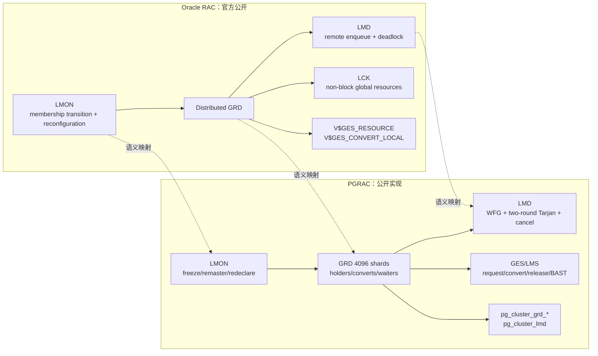

# 05：Oracle RAC 与 PGRAC GES 对比

[上一篇：恢复与运维](04-recovery-remaster-and-operations.md) · [返回索引](README.md)

## 结论先行

Oracle RAC 与 PGRAC 都需要全局 enqueue、分布式资源目录、远程请求处理、分布式死锁检测和实例变化后的资源重配置。Oracle 官方公开了这些职责、六种模式和部分动态视图；PGRAC 的 PostgreSQL 八模式、4096 shard、GRD 数组、BAST wire、两轮 Tarjan 与 victim/cancel 协议是自身可审计实现。

## 职责映射

## 逐项比较

| 主题 | Oracle 官方公开行为 | PGRAC 当前公开实现 | 判断 |
|---|---|---|---|
| Global enqueue | GES 协调全局共享 enqueue | PostgreSQL lock resource 的跨节点 grant/convert/release | 目标一致 |
| Resource directory | GRD 分布于活动实例 | 4096 shard master map + per-shard entry table | 语义对应，结构自研 |
| Remote request | LMD 处理远程 enqueue request | GES message → LMS work queue → GRD | 职责分工不同但目标相近 |
| 非数据块资源 | LCK 管理 library/row cache 等请求 | 按 PGRAC/PG resource type 进入 GES | 资源体系不同 |
| 模式 | NL/SS/SX/S/SSX/X | PostgreSQL 八模式为权威；六模式为近似别名 | 不兼容，不应一一等同 |
| Convert | `V$GES_CONVERT_LOCAL` 暴露转换统计 | 偏序分类、convert queue、rollback | 都有转换；算法未证同 |
| BAST | 当前引用的 Oracle 26ai 文档未公开精确 blocking-AST 协议 | 定向 BAST + natural release-coupled ACK | PGRAC adaptation；不推断 Oracle wire |
| Deadlock | LMD 执行 distributed deadlock detection | member-complete 两轮 probe + Tarjan + exact cancel | 目标一致，算法自研 |
| Recovery | LMON 对 GES/GCS resource reconfiguration | freeze→remaster→redeclare→sweep→barrier | 职责相近，FSM 自研 |
| 观测 | `V$GES_RESOURCE`、`V$GES_CONVERT_LOCAL` 等 | `pg_cluster_grd_*`、`pg_cluster_lmd`、debug dump | 字段体系不同 |

## Oracle 已验证的边界

Oracle 官方资料明确说明：

- GES 协调 globally shared enqueues；
- LMD 处理来自其他实例的 enqueue 请求并执行 distributed deadlock detection；
- LMON 维护 RAC membership，并在 instance transition 时重配置 GES/GCS resources；
- LCK 处理数据块之外的 global enqueue/broadcast；
- `V$GES_RESOURCE` 暴露 master node、grant/convert queue 标志和 next conversion level；
- `V$GES_CONVERT_LOCAL` 统计 NL/SS/SX/S/SSX/X 各类 conversion。

这些当前官方页面没有披露 blocking AST 的精确投递、确认或重试协议，本文
因此不把 PGRAC BAST 实现表述成 Oracle 内部机制的复制。

官方依据：

- [Oracle RAC 架构](https://docs.oracle.com/en/database/oracle/oracle-database/26/racad/introduction-to-oracle-rac.html)
- [Oracle RAC 后台进程](https://docs.oracle.com/en/database/oracle/oracle-database/26/refrn/background-processes.html)
- [`V$GES_RESOURCE`](https://docs.oracle.com/en/database/oracle/oracle-database/26/refrn/V-GES_RESOURCE.html)
- [`V$GES_CONVERT_LOCAL`](https://docs.oracle.com/en/database/oracle/oracle-database/26/refrn/V-GES_CONVERT_LOCAL.html)
- [Global lock mode wait parameters](https://docs.oracle.com/en/database/oracle/oracle-database/26/refrn/descriptions-of-common-wait-event-parameters.html)

## Oracle 没有公开、因此不能等同的部分

- GRD 内部是否使用与 PGRAC 相同的 holder/waiter/convert 数组；
- Oracle resource hash/shard 数和 master map 数据结构；
- compatibility queue 的精确公平算法；
- BAST message identity、ACK 与 retry wire；
- deadlock graph 的采集协议、确认轮数、SCC 实现与 victim policy；
- remaster 的精确 phase、redeclare record 和 barrier key；
- entry pin、cold reclaim 和 backend-exit cleanup 实现。

## 为什么 PGRAC 必须保留 PostgreSQL 八模式

PostgreSQL 的 relation/object lock compatibility 不是 Oracle 六模式矩阵的子集替换。若为了“看起来像 Oracle”直接把八模式压成六模式参与 grant，会把 PostgreSQL 原本不同的冲突关系合并，产生错误 grant 或不必要阻塞。

正确做法是：

1. 以 PostgreSQL 八模式矩阵作执行权威；
2. 用 Oracle/DLM 名称只帮助概念理解和观测；
3. 对照时比较“读共享、写意图、保护读、独占”等强弱职责；
4. 不宣称 mode number、名称或转换表线级兼容。

## 当前能力判断

| 维度 | 结论 |
|---|---|
| 基本跨节点 grant/wait/release | 已进入生产路径，并由多个真实双节点 TAP 间接/直接验证 |
| Convert/BAST | 生产实现存在；专门 TAP 的部分腿仍是源码形状或 harness 边界 |
| 分布式 deadlock | 两节点真实主链、partial fail-closed、cancel robustness 证据较强 |
| Fairness/reclaim | 有真实双节点测试 |
| Failure remaster | 有双/三节点恢复链 |
| 任意规模与全部资源类型 | 当前公开测试不能推导为穷尽覆盖 |
| 与 Oracle 内部实现等价 | 无公开证据，不能声称 |

判断一项 GES 能力是否“完成”，要同时看生产 caller、master-side mutation owner、失败闭锁与真实多节点断言。只有接口、enum、系统视图或静态源码匹配时，应标为 surface/部分覆盖，而不是完整闭环。
