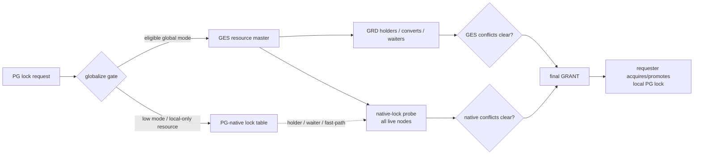
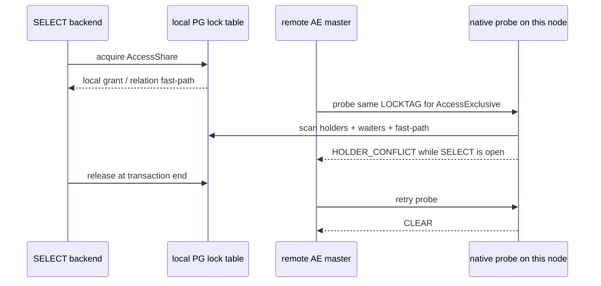
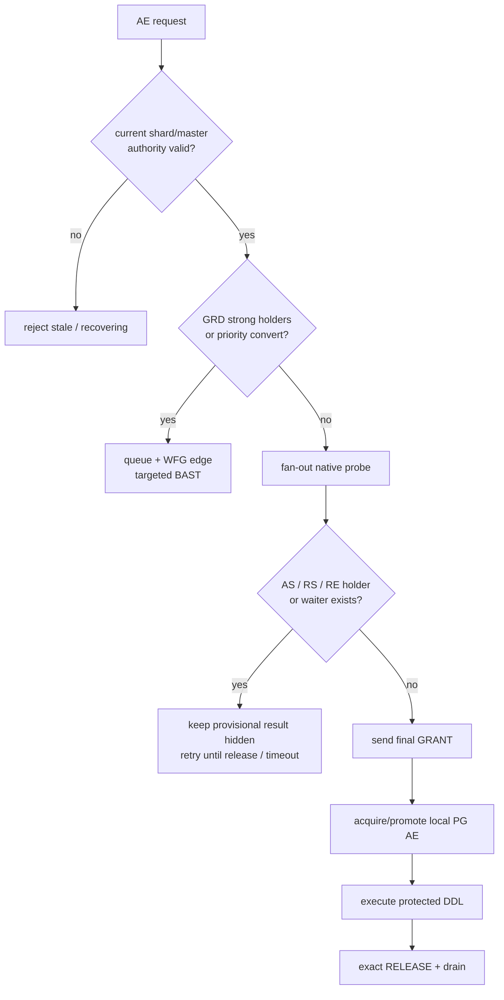
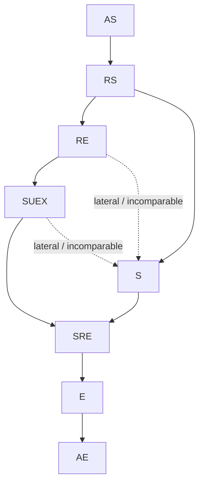

# 专题：PostgreSQL 八种锁模式如何进入 GES

[上一篇：GES 架构与 GRD](01-architecture-and-grd.md) · [返回索引](README.md) · [下一篇：Grant、Convert、Release 与 BAST](02-grant-convert-release-and-bast.md)

## 结论先行

PGRAC 的 GES mode space 是 PostgreSQL 原生八种 heavyweight lock mode，但这
不表示每一次低模式请求都要跨节点 RPC。普通关系上的
`AccessShareLock`、`RowShareLock` 和 `RowExclusiveLock` 保持 PG-native；
eligible relation/object 的强模式进入 GES。强模式最终授权前，resource master
再向所有存活节点探测 PG-native holder、waiter 和 relation fast-path，关闭“GRD
看不到低模式本地锁”的安全缺口。

八种模式也不是从 1 到 8 的线性强度等级。mode number 是 PostgreSQL ABI
编号；真正的升级、降级和 lateral 关系由兼容集合的包含关系决定。
`ShareUpdateExclusiveLock` 的正确编号是 **4**，`ShareLock` 才是 5。

## 三个互相配合的裁决面

- **PG-native lock table** 保留 OLTP 低模式热路径和 PostgreSQL 本地锁语义。
- **GRD** 记录已经进入 GES 的 holder、convert 和 waiter。
- **native-lock probe** 让强模式 master 看见各节点没有注册进 GRD 的低模式。

只有后两项都 clear，master 才能发布最终 global grant。native holder 没有 GES
holder identity，不能伪造成 BAST 目标；probe 会等待它在原事务边界自然释放。

## 完整 8×8 兼容矩阵

下表的行是已有 holder，列是新请求。`✓` 表示可以共存，`—` 表示冲突。
执行权威来自
[`cluster_ges_mode.c`](../../../src/backend/cluster/cluster_ges_mode.c)，节点启动时还会
与 PostgreSQL 当前 `DoLockModesConflict()` 表强制对拍，漂移则 fail-closed。

| Held \ Wanted | AS | RS | RE | SUEX | S | SRE | E | AE |
|---|:---:|:---:|:---:|:---:|:---:|:---:|:---:|:---:|
| AccessShare (AS) | ✓ | ✓ | ✓ | ✓ | ✓ | ✓ | ✓ | — |
| RowShare (RS) | ✓ | ✓ | ✓ | ✓ | ✓ | ✓ | — | — |
| RowExclusive (RE) | ✓ | ✓ | ✓ | ✓ | — | — | — | — |
| ShareUpdateExclusive (SUEX) | ✓ | ✓ | ✓ | — | — | — | — | — |
| Share (S) | ✓ | ✓ | — | — | ✓ | — | — | — |
| ShareRowExclusive (SRE) | ✓ | ✓ | — | — | — | — | — | — |
| Exclusive (E) | ✓ | — | — | — | — | — | — | — |
| AccessExclusive (AE) | — | — | — | — | — | — | — | — |

Oracle 的 NL/CR/CW/PR/PW/EX 只作为显示别名。PGRAC 不能用六模式别名替代这个
矩阵，因为 PG 的 SUEX、S 等模式存在 Oracle 六模式无法逐项表达的偏序关系。

## 哪些请求真正进入 GES

[`cluster_lock_should_globalize()`](../../../src/include/cluster/cluster_lock_acquire.h)
先按 resource type、mode、对象属性和运行态决定路由：

| Resource type | PG-native | 进入 GES | 关键例外 |
|---|---|---|---|
| 普通 permanent/unlogged relation | AS、RS、RE | SUEX、S、SRE、E、AE | temp relation 全部 native |
| shared-catalog system relation | AS、RS；通常 RE | SUEX..AE | mapped relation 的 RE 也 globalize |
| object lock | AS、RS、RE | SUEX..AE | 受 shared-catalog/normal-object 边界约束 |
| transaction lock | 其他模式不进入该门 | S、E | 分别对应 waiter 与 transaction owner |
| advisory lock | 不按 relation 阈值分流 | shared/exclusive advisory | session/xact 都可；保持 additive REQUEST |
| 其他 LOCKTAG | 全部 | 无 | PAGE、TUPLE 等继续 PG-native |

如果运行态证明只有本节点存活、没有 peer 可以形成另一份 authority，eligible
请求也可以短路到 native；这不会把多节点模式下的 global holder 悄悄省略。

## 1. AccessShareLock：普通只读

典型来源是普通 `SELECT`。它只与 AccessExclusive 冲突。

普通 AS 不占 GRD holder slot。AE 请求仍不会越过它，因为 AE 的 native probe
会逐节点检查，包括 relation fast-path holder。

## 2. RowShareLock：带行锁意图的读取

典型来源是 `SELECT ... FOR UPDATE/NO KEY UPDATE/SHARE/KEY SHARE`。它与
Exclusive、AccessExclusive 冲突。

- 普通 relation 上仍走 PG-native；
- E/AE 的 master probe 会看到 holder 和已排队 waiter；
- probe 不是只查当前持有者，避免强模式跳过已经排队的 RowShare 请求；
- 本地 release 后，下一轮 probe 才能返回 CLEAR。

## 3. RowExclusiveLock：普通 DML

`INSERT`、`UPDATE`、`DELETE`、`MERGE` 通常取得 RE。它与 S、SRE、E、AE
冲突，但与 SUEX 兼容。

普通用户关系上的 RE 保持 native，避免每条 DML 把 relation heavyweight lock
变成集群 RPC。需要 S/SRE/E/AE 的节点必须通过 native probe 等所有节点的 RE
释放。`shared_catalog` 下的 mapped relation 是具名例外：其 RE 会直接注册进
GES，让 relmap 改写和跨节点写入共享同一裁决面。

同一事务先持有 native RE、再请求 AE 时，probe 会排除原 requester 自己的
holder；否则升级者会被自己的 RE 永久阻塞。其他 backend 或 peer 的 RE 仍然是
真实冲突。

## 4. ShareUpdateExclusiveLock：维护与并发 DDL

SUEX 的 PostgreSQL mode number 是 4。典型来源包括普通 `VACUUM`、
`ANALYZE`、`CREATE INDEX CONCURRENTLY` 和部分 `ALTER TABLE/INDEX`。

- eligible relation/object 请求进入 GES；
- 它与 AS、RS、RE 兼容，所以低模式 probe 通常为 CLEAR；
- 它与另一个 SUEX 自冲突，并与 S/SRE/E/AE 冲突，这些冲突由 GRD 处理；
- 冲突时进入 waiter/convert 队列，master 可以向具名 GES holder 发送 BAST；
- release 精确删除该 holder，并优先推进 convert、再推进普通 waiter。

## 5. ShareLock：阻止并发数据修改

典型来源是非 concurrent 的 `CREATE INDEX`。S 与 AS、RS、S 自身兼容，但与
RE、SUEX、SRE、E、AE 冲突。

因此一次 S 请求要同时通过两道门：GRD 检查已经 globalize 的强模式，native
probe 检查各节点普通 DML 留下的 RE。多个 S holder 可以共存；任意 native RE
仍会让最终 grant 保持未发布。

Transaction locktag 的 `ShareLock` 也进入 GES，但语义是等待某个 transaction
owner，不使用 relation 的低模式 probe。

## 6. ShareRowExclusiveLock：自排他的共享写屏障

典型来源是 `CREATE TRIGGER` 和部分 `ALTER TABLE`。它只与 AS、RS 兼容，且
自冲突。

- native RE 会被 probe 发现；
- SUEX/S/SRE/E/AE holder 会在 GRD 中形成 blocker；
- blocking acquire 进入队列并发布 wait-for edge；
- BAST 只发给精确 GES blocker；
- blocker release 后 master 重算兼容性，再决定是否 grant。

## 7. ExclusiveLock：只允许普通读取并行

relation 上的典型来源是 `REFRESH MATERIALIZED VIEW CONCURRENTLY`。E 只与
AS 兼容，因此 native RS/RE 会阻塞它，SUEX/S/SRE/E/AE 则由 GRD 阻塞。

Transaction owner 和 exclusive advisory lock 也使用 `ExclusiveLock`，但它们的
resource identity 不同：transaction/advisory 不应套用 relation native-probe 的
解释。advisory shared/exclusive 是两个 additive holder；持有 shared 后再请求
exclusive 不会被重写成 relation-style CONVERT。

## 8. AccessExclusiveLock：完全排他

典型来源包括 `DROP TABLE`、`TRUNCATE`、`REINDEX`、`CLUSTER`、
`VACUUM FULL` 和许多 `ALTER TABLE`。AE 与全部八种模式冲突。

AE 是观察 native/GES 双面的最完整例子。只查 GRD 会漏掉 SELECT/DML；只查
各节点本地锁又会漏掉已经在别的 master 注册的 global holder 和 convert。

## Convert 不是按 mode number 递增

兼容集合构成偏序。下图只画 Hasse cover edge；沿箭头走表示目标兼容集合严格
缩小，是可识别的 UPGRADE。反向是 DOWNGRADE。

这带来三个不同处理结果：

1. **真正 UPGRADE**：已有 `cluster_registered` holder 原地 CONVERT；冲突时旧
   holder 仍保留，convert 排在后来 waiter 前面。
2. **LATERAL**：例如 SUEX→S，不是假升级；PG 允许同一 backend 持有两个不同
   mode，因此发送 additive REQUEST。
3. **native low mode→global high mode**：普通 relation 的低模式没有 GRD holder，
   所以发送新的 REQUEST；native probe 排除 requester 自身，再检查其他 holder。

在 pair 前置条件满足时，真实双节点
[`t/283_tm_table_lock_convert.pl`](../../../src/test/cluster_tap/t/283_tm_table_lock_convert.pl)
覆盖了 S→AE convert、peer S 阻塞、remote native RE 阻塞，以及 SUEX→S 保持
additive 的关键分叉；若节点或共享 relation path 前置条件不成立，测试会在任何
断言前整体 `skip_all`。

## 等待、BAST 与释放如何因 holder 来源而不同

| blocker 来源 | master 如何发现 | 如何推动释放 | 释放后的动作 |
|---|---|---|---|
| GES holder | GRD holder/convert 数组 | 定向 BAST；holder 在安全点自然 RELEASE | 清除 holder，drain converts/waiters |
| PG-native holder | 每节点 native-lock probe | 不伪造 BAST；周期重探测 | 下一轮 probe 变为 CLEAR |
| PG-native waiter | native-lock probe 的 waiter scan | 保持 PG 本地公平顺序 | waiter 消失后才 CLEAR |
| relation fast-path holder | probe 扫描 PGPROC fast-path | 正常事务释放 | fast-path 位清除后才 CLEAR |

任何节点未回复 probe、成员/fence 状态不确定或 collector 超时，都不能当作
CLEAR。安全结果是继续等待或返回可识别错误，而不是假设该节点没有锁。

## 生产与测试证据边界

| 证据 | 已证明 | 没有证明 |
|---|---|---|
| [`cluster_ges_mode.c`](../../../src/backend/cluster/cluster_ges_mode.c) | 八模式 SSOT、兼容集合、convert 分类 | 跨节点消息一定成功 |
| [`t/276_ges_mode_contract.pl`](../../../src/test/cluster_tap/t/276_ges_mode_contract.pl) | 64 cells、名称解析、与 PG live matrix 一致 | 每个 mode pair 的双节点 e2e |
| [`cluster_native_lock_probe.h`](../../../src/include/cluster/cluster_native_lock_probe.h) 与 [实现](../../../src/backend/cluster/cluster_native_lock_probe.c) | native holder/waiter/fast-path 扫描契约 | 所有故障组合的穷尽覆盖 |
| [`t/283_tm_table_lock_convert.pl`](../../../src/test/cluster_tap/t/283_tm_table_lock_convert.pl) | 前置条件满足时的真实双节点 convert、GRD conflict、native RE probe、lateral additive | 前置条件失败时会整体 skip；也未执行全部 64 种组合 |
| [`t/277_ges_convert.pl`](../../../src/test/cluster_tap/t/277_ges_convert.pl) | convert surface 与部分 SQL/接线 | 完整跨节点转换矩阵 |

因此，“PGRAC 使用 PostgreSQL 八模式作 GES 执行权威”是已有实现事实；“八种
模式的所有成对组合和故障窗口均已做真实多节点验证”不是当前公开证据能支持的
结论。
