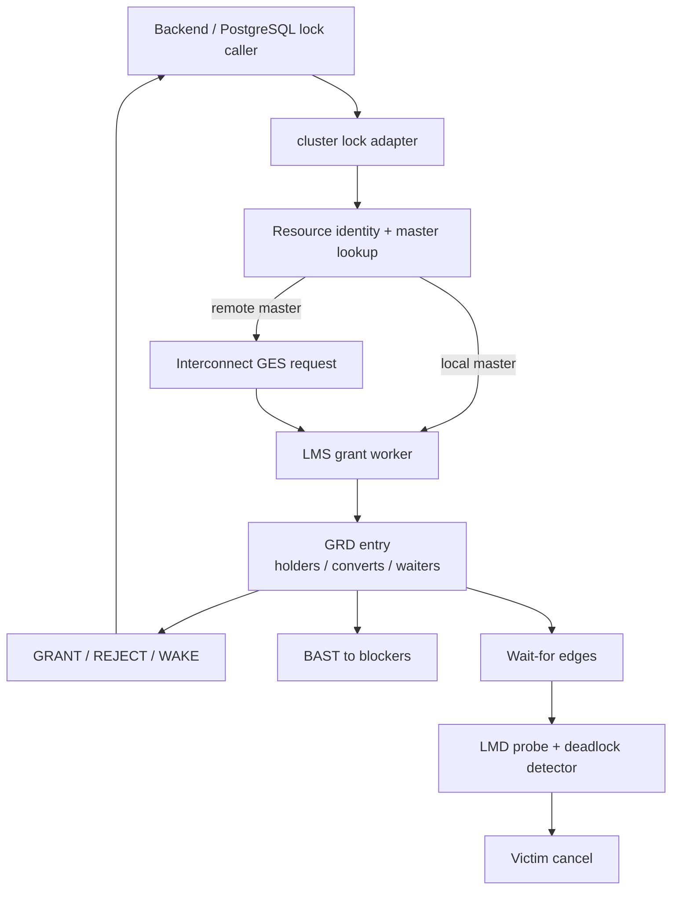

# PGRAC GES 与 Oracle RAC Global Enqueue 图解

GES（Global Enqueue Service）解决的是“全局非数据块资源由谁持有、谁必须等待、什么时候可以转换或释放”。它把 PostgreSQL 原本只在单实例内协调的 relation/object/transaction 等锁请求，扩展成跨实例一致的资源目录与等待关系。

这组文档从 resource identity 和 GRD 出发，解释 grant、convert、release、BAST、分布式死锁、饥饿保护、资源回收以及节点变化后的 remaster。Oracle 部分只引用官方公开资料；PGRAC 的 wire、队列和算法均明确标作自身实现。

## 阅读顺序

- [01：GES 架构、资源身份与 GRD](01-architecture-and-grd.md)
- [专题：PostgreSQL 八种锁模式如何进入 GES](06-eight-lock-modes.md)
- [02：Grant、Convert、Release 与 BAST](02-grant-convert-release-and-bast.md)
- [03：分布式死锁、公平性与资源生命周期](03-deadlock-fairness-and-lifecycle.md)
- [04：恢复、Remaster 与运维排障](04-recovery-remaster-and-operations.md)
- [05：Oracle RAC 与 PGRAC GES 对比](05-oracle-comparison.md)

## 一张图定位 GES

## GES、GCS 与本地锁的边界

| 层 | 保护对象 | 主要结果 |
|---|---|---|
| PostgreSQL local lock manager | 单实例内 backend/process 的锁关系 | local grant/wait/deadlock |
| GES | 跨实例 enqueue resource | global grant/convert/release/BAST |
| GRD | 全局资源的 master、holder、waiter、convert 状态 | 唯一裁决依据 |
| LMD | 跨实例 wait-for graph | deadlock confirm/cancel |
| GCS/PCM | 数据块 current/CR 与块级 S/X | block transfer/coherence |

GES 不能替代本地锁：一次 global grant 之后，backend 仍必须遵守 PostgreSQL 本地对象生命周期与锁序。反过来，只拿到本地锁也不能代表其他实例没有冲突 holder。

## 证据标识

- **Oracle 已验证**：Oracle 官方文档明确公开。
- **PGRAC 已实现**：当前公开主线有生产 caller/handler，并有源码或测试锚点。
- **语义映射**：承担相似的集群安全职责，不表示内部算法相同。
- **当前边界**：测试或生产接线只覆盖部分路径，必须如实注明。

## 当前公开实现与测试锚点

| 能力 | 生产入口 | 代表性测试 | 说明 |
|---|---|---|---|
| 八模式与兼容矩阵 | [`cluster_ges_mode.c`](../../../src/backend/cluster/cluster_ges_mode.c) | [`t/276`](../../../src/test/cluster_tap/t/276_ges_mode_contract.pl) | PG 八模式；Oracle 名称仅概念别名 |
| request/convert/release | [`cluster_ges.c`](../../../src/backend/cluster/cluster_ges.c)、[`cluster_grd.c`](../../../src/backend/cluster/cluster_grd.c) | [`t/277`](../../../src/test/cluster_tap/t/277_ges_convert.pl) | convert 测试含部分源码形状断言 |
| BAST | targeted signal/message + release-coupled ACK | [`t/278`](../../../src/test/cluster_tap/t/278_ges_bast.pl) | 跨节点 delivery e2e 有明确覆盖边界 |
| 分布式死锁 | [`cluster_lmd_tarjan.c`](../../../src/backend/cluster/cluster_lmd_tarjan.c) | [`t/291`](../../../src/test/cluster_tap/t/291_lmd_cross_node_deadlock_2node.pl)、[`t/302`](../../../src/test/cluster_tap/t/302_lmd_cancel_robustness_2node.pl) | 真实双节点、无 SKIP 主链 |
| partial graph fail-closed | probe collector/member completeness | [`t/308`](../../../src/test/cluster_tap/t/308_lmd_partial_failclosed_2node.pl) | 不完整图不选 victim |
| starvation / cold reclaim | queue barrier + entry pin/reclaim | [`t/299`](../../../src/test/cluster_tap/t/299_ges_starvation_2node.pl)、[`t/296`](../../../src/test/cluster_tap/t/296_grd_entry_lifecycle_reclaim_2node.pl) | 真实双节点 |
| failure remaster | freeze/redeclare/sweep/barrier | [`t/249`](../../../src/test/cluster_tap/t/249_grd_recovery_remaster.pl)、[`t/250`](../../../src/test/cluster_tap/t/250_grd_remaster_3node.pl) | 双/三节点资源恢复 |

## Oracle 官方入口

- [Oracle RAC GCS/GES/GRD 架构](https://docs.oracle.com/en/database/oracle/oracle-database/26/racad/introduction-to-oracle-rac.html)
- [Oracle LMD、LMON、LCK、LMS 进程职责](https://docs.oracle.com/en/database/oracle/oracle-database/26/refrn/background-processes.html)
- [Oracle `V$GES_RESOURCE`](https://docs.oracle.com/en/database/oracle/oracle-database/26/refrn/V-GES_RESOURCE.html)
- [Oracle `V$GES_CONVERT_LOCAL`](https://docs.oracle.com/en/database/oracle/oracle-database/26/refrn/V-GES_CONVERT_LOCAL.html)

> Oracle 官方公开六种 global lock mode；PGRAC 的 native 模式是 PostgreSQL 八种 lock mode。两者只能做职责和强弱关系对照，不能宣称模式编号或 compatibility matrix 兼容。
