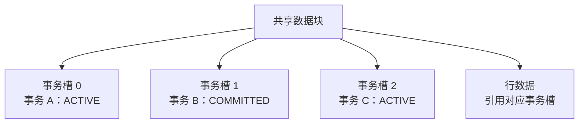
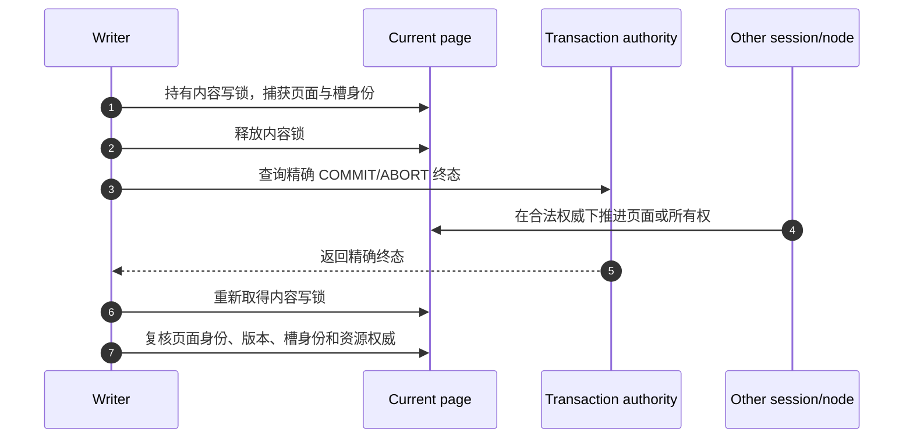
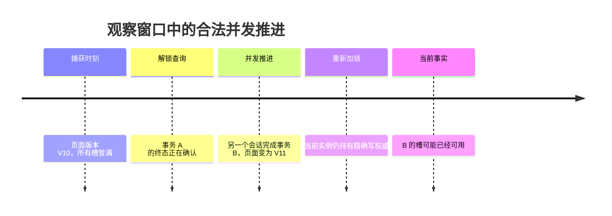
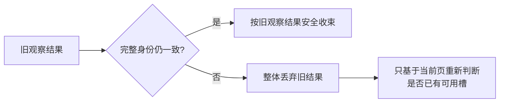
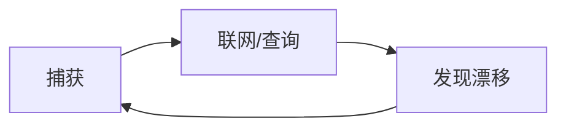

# 01：ITL 压力、终态确认与并发窗口

[返回索引](README.md) · [下一篇：旧证据丢弃与一次当前页重试](02-stale-proof-discard-and-one-shot-retry.md)

## 1. ITL 槽解决什么问题

数据块需要记录哪些事务正在修改其中的行。Oracle 将这类块内事务入口称为 Interested Transaction List（ITL）；PGRAC 的页面事务槽承担相同层次的职责：把页面上的行级变化关联到一个事务身份，并在事务结束后留下可验证的终态。



新事务修改页面前需要一个可用槽。槽可以来自：

1. 尚未使用的预留入口；
2. 页面有足够空间时扩展出的入口；
3. 已经结束且允许安全复用的旧事务入口。

如果三者都不存在，页面进入 ITL 压力状态。Oracle 官方文档将这种情况关联到 `enq: TX - allocate ITL entry` 等待；PGRAC 必须同样避免把“暂时没有可用槽”误判为可以覆盖仍受保护的事务入口。

## 2. 为什么不能一直持有页面内容锁

判断旧槽能否复用，可能需要读取本地事务状态、共享 undo/事务表，或者向事务来源实例查询精确终态。把页面内容写锁跨越这些操作长期持有，会阻塞页面访问，还可能与集群资源推进形成锁序环。

因此流程被拆成三个阶段：



释放锁是必要的，但它也创造了一个并发窗口。在该窗口内，其他合法参与者可能：

- 完成另一个事务并释放一个槽；
- 更新页面内容，从而推进页面日志位置；
- 完成一次当前块所有权转换；
- 替换某个事务槽的身份；
- 进入成员变化或语义切换阶段。

所以“事务终态是真的”还不够；必须证明它仍然适用于重新取得锁后的这一份页面。

## 3. 两种不同的变化

页面变化不能全部归为同一类。

### 3.1 权威丢失

以下变化表示当前调用者已经不能安全修改该页：

- buffer tag 指向了另一个页面；
- 本实例不再持有当前写权威；
- 页面处于转移、撤销或恢复保护状态；
- formation、成员准入或事务解析准入失效；
- 页面不再具有预期的事务槽格式。

这类变化必须立即拒绝，不能借“重试一次”继续。

### 3.2 当前页合法推进

另一类情况是：调用者重新取得锁后，仍然持有当前页的精确写权威，但页面版本或日志位置已由合法操作推进。



此时旧快照已经不能用于写回事务 A 的结果，但当前页可能已经凭自己的状态出现了可用槽。把两件事分开处理，才能同时保持安全与活性。

## 4. TOCTOU 的正确处理方式

这是典型的检查时与使用时（TOCTOU）问题：

```text
检查时：页面版本 V10，槽 S 属于事务 A
查询后：页面版本 V11，槽或所有权可能已经变化
使用时：不能把针对 V10 的结果直接写入 V11
```

正确处理不是忽略版本变化，也不是把当前页永久判死，而是：



“丢弃旧结果”与“读取当前页”之间没有矛盾。前者阻止过期事实污染页面；后者允许并发进展被当前调用者看见。

## 5. 为什么需要有界而不是循环重试

如果每次变化都重新释放锁、查询事务终态并再次复核，持续写入的热点页可能形成无界循环：



这种循环会带来三个问题：

- 一个前台 DML 可以无限占用恢复和网络资源；
- 重试风暴会放大热点页竞争；
- 错误路径很难证明不会累积锁、pin 或远端请求。

因此公开合同只允许一次**无网络、无新终态查询、只看当前页**的本地重试。若当前页仍满，调用者返回既有的 ITL 压力结果，由上层等待、重试事务或报错策略处理。
