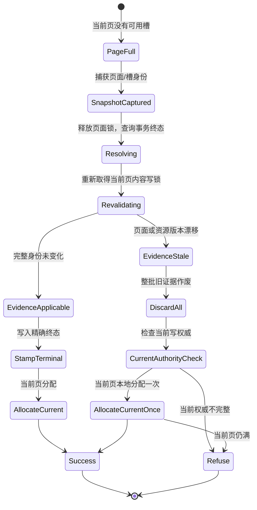
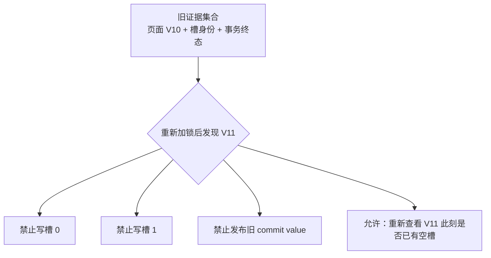
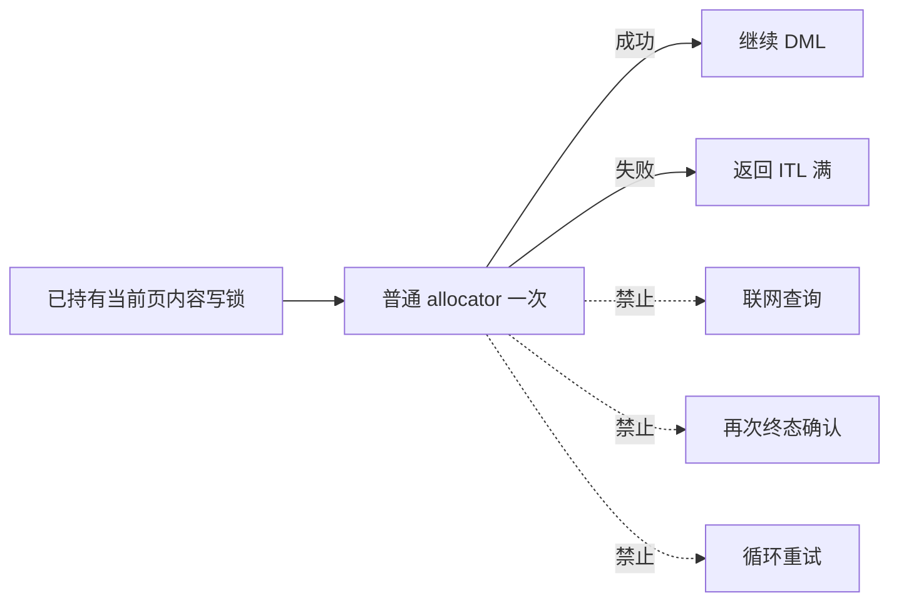
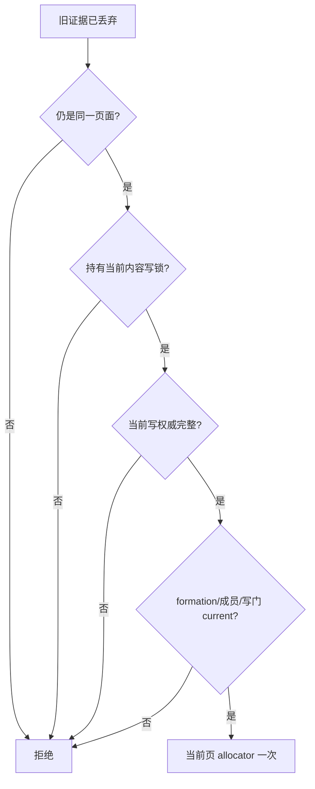

# 02：旧证据整体丢弃与一次当前页重试

[上一篇：ITL 压力与观察窗口](01-itl-pressure-and-observation-window.md) · [返回索引](README.md) · [下一篇：安全边界与故障矩阵](03-safety-boundaries-and-failure-matrix.md)

## 1. 公开行为合同

有界重试由两条互不替代的规则组成：

1. **旧终态证据必须全有或全无。** 页面或权威身份任一关键部分变化，整批旧结果作废，不得选择性写入“看起来还对”的槽。
2. **当前页可以自证可继续。** 在当前内容写锁和当前写权威下，可以调用一次普通槽分配逻辑；它只能看到当前页面，不得读取或恢复旧证明。



## 2. “整体丢弃”具体意味着什么

旧快照中可能同时包含多个事务槽的身份和终态查询结果。只要页面级复核失败，就必须把它们视为不可发布：

- 不更新任何槽的 COMMITTED/ABORTED 标志；
- 不写入旧查询返回的提交序号；
- 不利用旧结果清除锁或复用标记；
- 不把旧结果缓存成后续请求的权威；
- 不把“事务确实已经结束”偷换成“当前页上的这个槽仍属于该事务”。



这是防止 ABA 和错槽写入的核心。即使事务身份在逻辑上相同，只要无法证明当前页仍是捕获时的同一对象，就不能写入。

## 3. 单次重试读取什么

单次重试只读取重新取得内容写锁后的当前页面状态。它与普通页面槽分配使用相同的规则，例如：

- 是否存在未使用槽；
- 是否存在已经由其他合法路径收束、当前即可复用的槽；
- 页面格式和空间是否允许继续；
- 当前事务是否已经拥有适用的槽。

它明确不读取：

- 旧快照中的终态数组；
- 旧页面版本或旧资源 generation；
- 旧提交序号；
- 旧槽到事务 locator 的绑定。

## 4. 为什么只能重试一次

“一次”不是性能调参，而是资源边界：



这样可以证明：

- 重试不会新增网络债务；
- 不会再次释放并重取页面锁；
- 不会把一次 DML 变成无界恢复循环；
- 失败成本与普通 allocator 调用同阶；
- 当前页仍满时，既有 fail-closed 行为保持不变。

## 5. 当前权威必须重新成立

页面发生变化后，不能只检查“仍然是 X 状态”这一项。公开语义要求当前调用点具备完整的可写条件：

```text
同一当前页面
AND 当前内容写锁
AND 当前集群写权威
AND 无转移/撤销/恢复保护
AND 当前 formation 与成员准入有效
AND 当前写入门已开放
```

任一条件不满足，都不能进入本地重试。



## 6. 三个例子

### 6.1 并发事务释放了槽

```text
捕获：8 个槽全部占用
窗口：事务 B 完成，另一个合法路径收束其槽
复核：页面版本变化，旧证据作废
当前页：已经存在可用槽
结果：一次本地分配成功
```

这是有界重试的主要活性收益。

### 6.2 页面变化但仍然满

```text
捕获：8 个槽全部占用
窗口：页面发生其他合法更新，但没有释放槽
复核：旧证据作废
当前页：仍无可用槽
结果：一次本地分配失败，维持 ITL 满
```

有界重试不会把真正的资源耗尽伪装成成功。

### 6.3 当前写权威已经转移

```text
捕获：本实例持有当前块写权威
窗口：资源转换把当前写权威交给另一实例
复核：发现当前权威不再属于本实例
结果：直接拒绝，不调用 allocator
```

即使本地 buffer 中碰巧看见一个空槽，也不能越过集群写权威。
