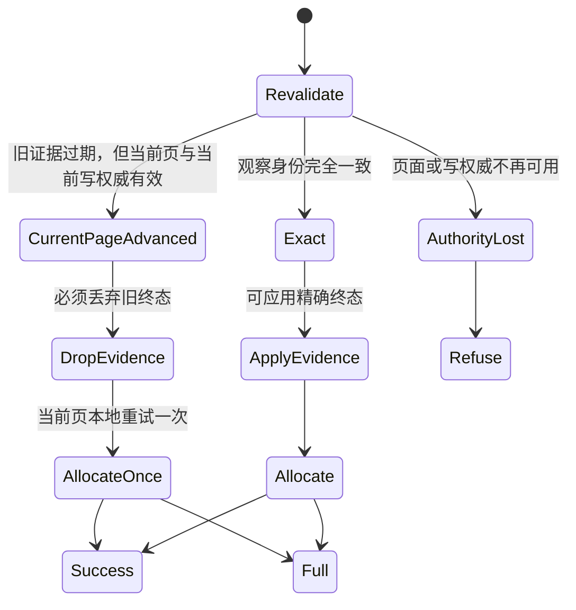
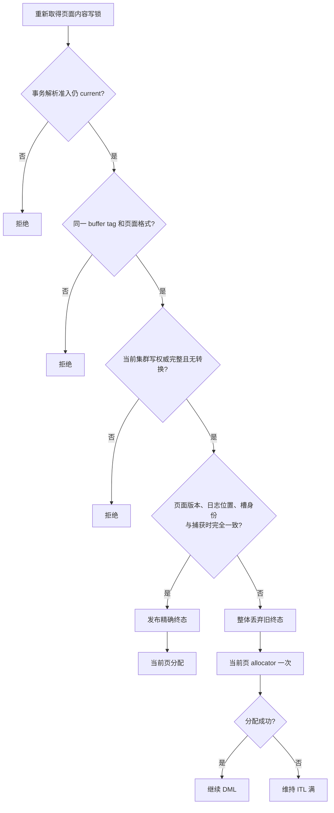
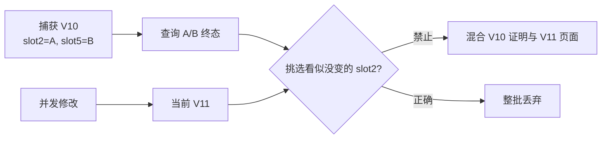

# 03：安全不变量、判定树与故障矩阵

[上一篇：旧证据丢弃与一次当前页重试](02-stale-proof-discard-and-one-shot-retry.md) · [返回索引](README.md) · [下一篇：验证、观测与 Oracle 对比](04-validation-observability-and-oracle-comparison.md)

## 1. 八条安全不变量

### I1：旧证明不能跨页面版本发布

页面版本、日志位置或资源身份发生关键变化后，旧终态结果只能丢弃。

### I2：事务终态与页面槽身份必须同时精确

“事务 A 已提交”不能单独证明“当前槽 3 仍属于事务 A”。两者必须在同一个未漂移页面身份下会合。

### I3：重试不使用旧证明

漂移后的本地 allocator 不读取旧终态、旧提交序号或旧 locator。

### I4：重试只能发生一次

禁止循环、递归、再次终态查询或再次联网。

### I5：重试必须持有当前内容写锁

没有当前页面排他保护时，不得判断或占用事务槽。

### I6：页面写锁不能替代集群写权威

本地锁只序列化本地 buffer 访问；当前块写权威、formation 和成员准入仍需独立成立。

### I7：不确定不能升级为成功

无法读取当前权威、页面格式异常、资源处于转换中或当前页仍满，都维持拒绝。

### I8：成功只证明当前分配完成

一次本地重试成功不追认旧终态证明，也不对其他槽或其他页面产生副作用。

## 2. 三态判定模型

为了避免把不同失败混成一个布尔值，公开概念模型把复核结果分成三类：



这三个结果不能互相降级：

- `Exact` 才能发布旧终态；
- `CurrentPageAdvanced` 只能读取当前页；
- `AuthorityLost` 不能进入任何写路径。

## 3. 决策树



## 4. 故障矩阵

| 场景 | 旧终态能否写入 | 当前页能否重试一次 | 结果 |
|---|---:|---:|---|
| 页面、槽、权威全部精确一致 | 是 | 不需要特殊重试 | 应用终态后分配 |
| 页面版本推进，当前写权威仍精确 | 否 | 是 | 只读当前页分配一次 |
| 页面日志位置推进，当前写权威仍精确 | 否 | 是 | 只读当前页分配一次 |
| buffer tag 改变 | 否 | 否 | 拒绝 |
| 页面事务槽格式消失或损坏 | 否 | 否 | 拒绝 |
| 本实例不再持有当前写权威 | 否 | 否 | 拒绝 |
| 资源正在转移、撤销或恢复 | 否 | 否 | 拒绝 |
| formation 或成员准入失效 | 否 | 否 | 拒绝 |
| 事务解析准入在查询期间关闭 | 否 | 否 | 拒绝 |
| 当前页已由其他路径释放槽 | 否 | 是 | 一次分配可以成功 |
| 当前页变化但仍然满 | 否 | 是 | 一次失败后维持 ITL 满 |
| 终态查询返回 UNKNOWN | 否 | 否 | 保留保护并拒绝 |
| COMMIT 缺少有效提交序号 | 否 | 否 | 拒绝 malformed proof |
| ABORT 携带矛盾提交序号 | 否 | 否 | 拒绝 malformed proof |

## 5. 为什么不能“部分应用”

假设一次捕获包含两个槽：

```text
slot 2 -> transaction A -> COMMITTED
slot 5 -> transaction B -> ABORTED
```

查询返回后页面已经变化。即使重新读取后 slot 2 的原始字节碰巧相同，也不能只写 slot 2、放弃 slot 5。页面级版本变化意味着捕获期间的整体因果关系已经失效；部分应用会制造难以证明的混合时刻。



整批丢弃虽然保守，却把证明边界保持得非常清晰。

## 6. 为什么当前页重试不是 stale publication

本地 allocator 的输入只有当前页：

```text
stale publication:
    old transaction result + old slot identity -> write current page   [禁止]

current allocation:
    current page under current lock -> find current free slot           [允许一次]
```

前者跨越了版本边界，后者没有。只要实现确保两条数据流不相交，一次当前页重试不会削弱 stale-proof 保护。

## 7. Fail-closed 的最终边界

有界重试不是“保证成功”的机制。它只消除一种虚假失败：页面已经由其他合法参与者推进并释放了槽，但调用者仍依据旧的“页满”观察直接失败。

以下情况依然会失败：

- 当前页确实仍满；
- 所有可见槽仍属于活动或未决事务；
- 当前写权威无法证明；
- 页面正处于资源转换；
- formation 或事务终态权威发生变化；
- 当前页面身份无法精确确认。
