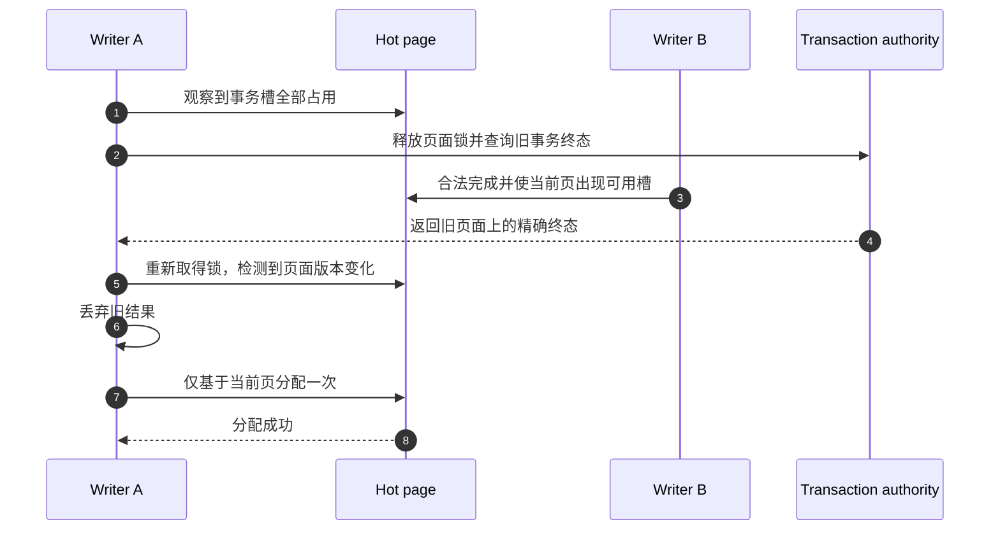
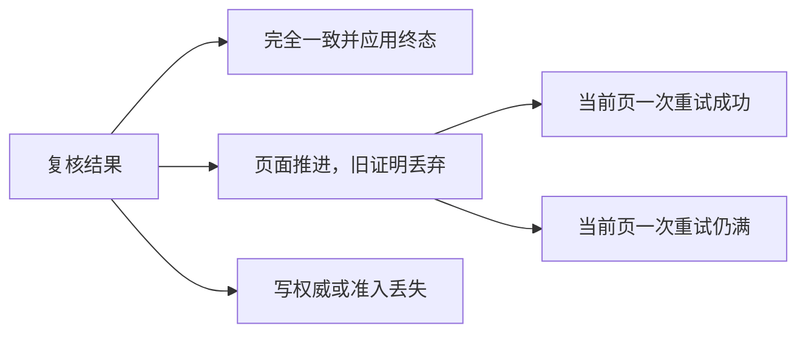
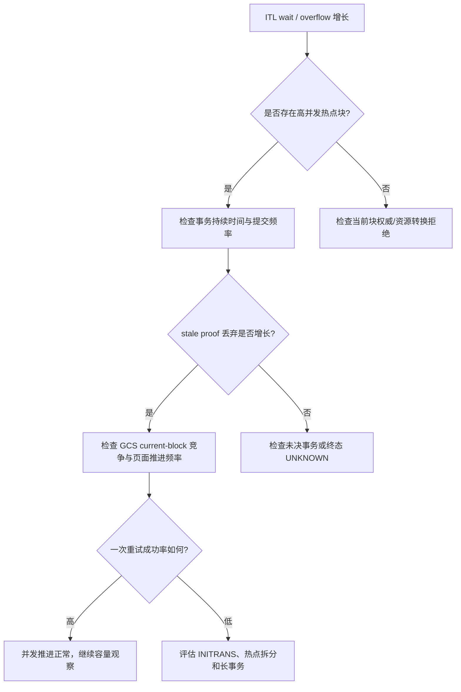

# 04：验证、可观测性及 Oracle RAC 对比

[上一篇：安全边界与故障矩阵](03-safety-boundaries-and-failure-matrix.md) · [返回索引](README.md)

## 1. Oracle 已经公开了什么

Oracle 官方资料明确说明：

- 每个修改数据块的事务需要一个 ITL entry；
- `INITRANS` 为块头预留初始事务入口；
- 没有可用 ITL 槽时，会出现 `enq: TX - allocate ITL entry` 等待；
- 这种压力可能在其他事务结束或块内能够增加入口后解除；
- RAC 中 current block 访问还会受到 `gc current block busy`、`gc buffer busy acquire/release` 等全局缓存竞争影响。

因此，Oracle 的公开外部行为支持一个基本判断：**ITL 不足通常是可等待、可随并发进展解除的状态，而不是第一次观察失败后永久固定的页面事实。**

Oracle 没有公开：

- 内部是否使用与 PGRAC 相同的终态批量确认；
- 页面复核具体比较哪些字段；
- 是否采用“一次”这一重试上限；
- RAC current block 与 ITL allocator 的内部锁序；
- 对应的消息布局、状态名或实现函数。

所以证据结论必须写成：

```text
Oracle ITL 等待/解除的外部语义：已验证
页面发生并发推进后应重新面对当前事实：公开证据支持的推断
旧证据整体丢弃 + 一次本地 allocator：PGRAC 自研适配
Oracle 内部采用相同算法：不能声称
```

## 2. 行为对比

| 维度 | Oracle 公开行为 | PGRAC 公开行为 | 证据等级 |
|---|---|---|---|
| 块内事务入口 | ITL entry | 页面事务槽 | Oracle 已验证 / PGRAC 公开实现 |
| 槽不足 | TX mode-4 allocation wait | ITL 压力，保持保护或返回上层策略 | 外部行为对齐 |
| 并发结束后继续 | 等待可以随槽可用而解除 | 当前页可用时允许继续 | 外部行为对齐 |
| RAC 当前块竞争 | GCS current block 与 gc busy waits | 当前写权威与内容锁共同约束 | 角色级对齐 |
| 旧观察失配处理 | 未公开 | 整体丢弃旧证明 | PGRAC 自研 |
| 重试上限 | 未公开 | 无网络的本地一次 | PGRAC 自研 |

## 3. 最小正向验证

正向测试必须制造真实的“观察期间页面推进”，而不是直接调用一个返回成功的测试桩。



应同时证明：

- 旧终态没有写入任何当前槽；
- 成功来自当前页已经存在的可用槽；
- 没有发生第二次终态查询；
- 没有新增网络请求；
- DML 最终完成且页面事务身份正确。

## 4. 必须覆盖的负向验证

| 测试 | 预期结果 |
|---|---|
| 页面变化后仍然满 | 本地重试一次后失败 |
| 当前写权威转移到其他实例 | 不调用 allocator，立即拒绝 |
| buffer tag 被复用 | 不调用 allocator，立即拒绝 |
| 页面格式变化或损坏 | 不调用 allocator，立即拒绝 |
| formation/成员准入变化 | 不调用 allocator，立即拒绝 |
| 事务解析准入关闭 | 不调用 allocator，立即拒绝 |
| 旧 COMMIT/ABORT 结果仍在内存 | 任何当前槽都不得被旧结果 stamp |
| allocator 第一次仍失败 | 不得再次 census、联网或循环 |
| 并发反复推进热点页 | 前台操作成本保持有界 |

## 5. 建议的可观测性

公开运维面应区分“安全拒绝”和“有界活性尝试”，避免所有情况只显示成 ITL overflow。建议至少能够观察下列类别：



运维指标可以按实现版本映射为：

- 完整复核成功次数；
- stale proof 丢弃次数；
- 当前页有界重试次数；
- 有界重试成功/仍满次数；
- authority/admission 拒绝次数；
- ITL allocation wait/overflow 次数。

这些指标只能用于诊断，不能反向成为写入授权。

## 6. 排障顺序

看到热点页 ITL 压力时，建议按以下顺序检查：



不要通过以下方式“消除”问题：

- 把 UNKNOWN 猜成 ABORT；
- 忽略页面版本或资源权威变化；
- 循环联网查询直到成功；
- 仅为了通过测试而扩大重试次数；
- 用统计计数器代替事务终态或当前块写权威。

## 7. Oracle 官方参考资料

- [Oracle Database 19c Performance Tuning Guide：TX mode 4 与 ITL entry allocation](https://docs.oracle.com/en/database/oracle/oracle-database/19/tgdba/database-performance-tuning-guide.pdf)
- [Oracle Database 19c：Instance Tuning Using Performance Views](https://docs.oracle.com/en/database/oracle/oracle-database/19/tgdba/instance-tuning-using-performance-views.html)
- [Oracle RAC 19c：Monitoring Performance](https://docs.oracle.com/en/database/oracle/oracle-database/19/racad/monitoring-performance.html)
- [Oracle Database 10g：Managing Space for Schema Objects](https://docs.oracle.com/cd/B19306_01/server.102/b14231/schema.htm)

这些来源支持 ITL、TX allocation wait、current-block/global-cache contention 等公开行为，不支持对 Oracle 私有重试算法、字段或锁序作断言。
