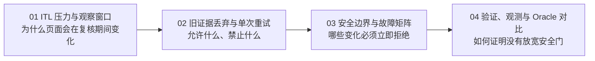
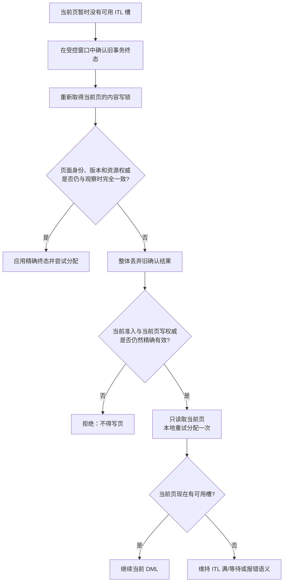

# ITL 终态复核与有界重试

当多个实例并发修改同一个数据块时，块头中的事务槽可能暂时耗尽。PGRAC 可以在不持有页面内容锁的窗口中确认旧事务是否已经结束，但在重新取得页面写锁之前，页面版本或资源所有权也可能被其他会话推进。

这组文档解释 PGRAC 面向用户公开的处理原则：

> 旧快照一旦失配就整体作废，绝不把旧终态写回当前页；如果当前页仍由本实例精确持有、当前准入仍有效，则只基于当前页状态做一次本地分配重试。重试仍失败时保持 fail closed。

这解决的是一个典型的并发语义问题：**证据过期不等于当前页一定仍然没有空槽**。安全性来自“不使用过期证据”，活性来自“允许当前状态自己证明已经可以继续”。

## 阅读顺序

- [01：ITL 压力、终态确认与并发窗口](01-itl-pressure-and-observation-window.md)
- [02：旧证据整体丢弃与一次当前页重试](02-stale-proof-discard-and-one-shot-retry.md)
- [03：安全不变量、判定树与故障矩阵](03-safety-boundaries-and-failure-matrix.md)
- [04：验证、可观测性及 Oracle RAC 对比](04-validation-observability-and-oracle-comparison.md)

## 一张图理解核心规则

左侧“完全一致”路径可以使用刚取得的终态证明；右侧“发生变化”路径绝不使用该证明。右侧唯一允许的动作，是在当前页面写锁和当前资源权威下重新查看页面此刻是否已经存在可用槽。

## 三个容易混淆的概念

| 概念 | 含义 | 能否授权写入旧终态 |
|---|---|---:|
| 终态确认结果 | 某个精确事务已经 COMMIT 或 ABORT 的证明 | 仅在完整复核一致时可以 |
| 当前页重新分配 | 在当前内容写锁下查找此刻已经可用的槽 | 可以，但不依赖旧终态结果 |
| 再次终态查询 | 重新释放锁并访问事务权威或远端节点 | 不属于这次有界重试 |

## 公开范围与证据标签

本文是**公开行为架构说明**，不定义内部 wire ABI、私有状态布局、开发编号或源码级实现合同。

| 标签 | 含义 |
|---|---|
| **Oracle 已验证** | Oracle 官方资料明确描述 ITL、TX mode 4 等外部行为。 |
| **基于公开证据的推断** | Oracle 的并发和等待语义支持该判断，但未公开内部算法。 |
| **PGRAC 自研适配** | PGRAC 为 PostgreSQL 页面锁、事务终态和集群资源权威设计的机制。 |
| **不能声称** | 不能把 PGRAC 的重试次数、复核字段或内部流程归因于 Oracle。 |

## 当前状态说明

本文描述目标行为、安全边界和验证方法，不构成某个发行版已经完成生产认证的声明。具体可用性应以对应版本的发布说明、公开代码和测试结果为准。

相关背景：

- [GCS / Cache Fusion](../gcs/README.md)
- [GES / GRD](../ges/README.md)
- [Clean formation 的 epoch 0](../formation-epoch-zero/README.md)
- [Resource-X](../resource-x/README.md)
- [事务恢复权威](../transaction-recovery/pending-transaction-authority.md)
