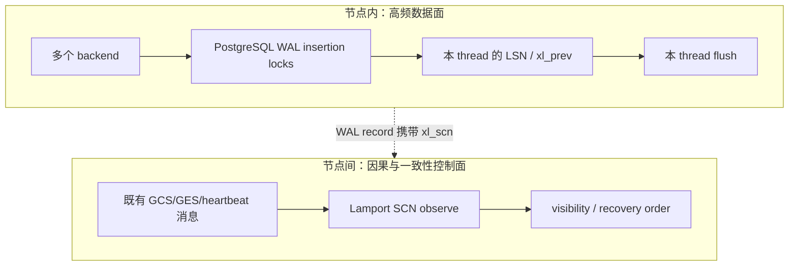
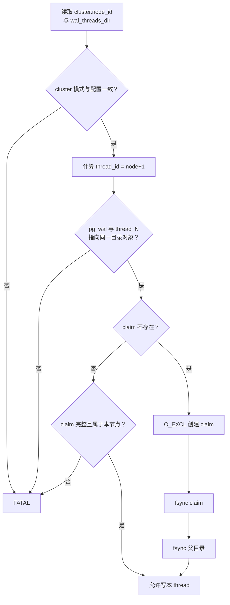
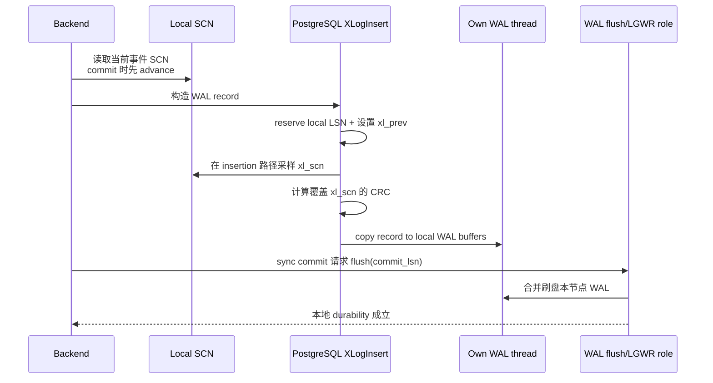

# 01：每节点独立 WAL thread 与并行写路径

[返回索引](README.md) · [下一篇：Lamport SCN](02-lamport-scn-clock.md)

## 结论先行

PGRAC 的多个实例不会争写同一个 WAL byte stream。每个节点保留 PostgreSQL 成熟的本地 WAL insertion、group commit、segment switch 和 flush 机制，只把自己的 `pg_wal` 映射到共享 WAL 根目录中的专属 `thread_<node_id+1>`。跨节点协调发生在 SCN 和数据块/锁消息层，不发生在每条 WAL record 的空间预留层。

**Oracle 已验证。** Oracle RAC 同样让每个实例写自己的 redo thread；官方文档明确说明，这避免了所有实例竞争同一组 redo log，恢复实例则可以访问其他实例的 redo thread。PGRAC 对这一外部形状做 PostgreSQL 化适配，但目录、claim 文件和 WAL header 字段是 PGRAC 自研格式。

## 为什么不能让四节点直接争写一个 WAL stream

单个 PostgreSQL 实例的 WAL insertion 已经为本机 backend 做了高度优化；把四个实例强行接到同一 byte stream，会额外引入跨机问题：

- 每次 WAL space reservation 都需要远程串行化；
- `xl_prev`、segment switch、insert/flush pointer 变成分布式共享变量；
- 网络抖动会直接进入本地提交临界路径；
- 某节点失联后必须先判断它是否保留了未完成 reservation；
- 一个全局 WAL 锁会把节点扩展变成锁争用扩展。

独立 thread 把问题拆成两层：



节点内依旧按照 PostgreSQL 的 WAL 规则工作；节点间只交换紧凑的逻辑时间和业务协议证据。

## 共享目录布局

四节点的典型共享 WAL 根如下：

```text
<cluster.wal_threads_dir>/
├── thread_1/                 # node 0 独占写
│   ├── pgrac_thread.claim
│   └── 000000010000...
├── thread_2/                 # node 1 独占写
│   ├── pgrac_thread.claim
│   └── 000000010000...
├── thread_3/                 # node 2 独占写
│   ├── pgrac_thread.claim
│   └── 000000010000...
├── thread_4/                 # node 3 独占写
│   ├── pgrac_thread.claim
│   └── 000000010000...
└── pgrac_wal_state           # per-thread 恢复/检查点状态注册表
```

映射规则是：

```text
wal_thread_id = cluster.node_id + 1
node_id       = wal_thread_id - 1
wal_thread_id = 0 仅表示 legacy / 未启用 per-thread WAL
```

引擎不在每次 WAL 写入时重写路径。部署/初始化阶段把实例自己的 `pg_wal` 引导到对应 thread 目录；运行期继续使用 PostgreSQL 原生 WAL 文件访问路径。这样可以让高频写入避免额外的路径解析和“这是哪个节点的日志”判断。

## 启动时如何证明“这是我的 thread”

目录名不是 authority。PGRAC 启动时同时核对配置、实际目录对象与持久 claim：



claim 的设计目标不是做运行期租约，而是把 thread identity 变成 crash-safe、write-once 的磁盘事实。关键失败语义如下：

| 发现 | 处理 | 原因 |
|---|---|---|
| `pg_wal` 映射到错误 thread | `FATAL` | 继续运行会把两节点日志写进同一 stream |
| claim 属于其他 node | `FATAL` | 目录名不能覆盖持久 owner 事实 |
| claim 内容 torn / CRC 无效 | `FATAL` | 不能猜测旧 owner，也不能静默重建 |
| claim 首次创建后只 fsync 文件、未 fsync 目录 | 不允许视为完成 | crash 后目录项可能丢失 |
| `wal_threads_dir` 未配置 | 保留 legacy thread 0 语义 | 不把普通 PostgreSQL 实例伪装成多 thread |

生产实现位于 [`cluster_wal_thread.c`](../../../src/backend/cluster/cluster_wal_thread.c) 和 [`cluster_wal_thread.h`](../../../src/include/cluster/cluster_wal_thread.h)。

## WAL page 与 WAL record 如何自描述

独立目录解决“写到哪里”，header 则解决“读到的字节属于谁、处于什么逻辑时间”。

### WAL page：保存 thread identity

PGRAC 在 WAL page header 原有尾部 padding 中放入 thread id 和 flags，保持 page header 总大小 24 字节不变：

| 字段 | 含义 |
|---|---|
| `xlp_magic` / `xlp_info` | PostgreSQL WAL page 格式与标志 |
| `xlp_tli` / `xlp_pageaddr` | timeline 与 page address |
| `xlp_rem_len` | 跨页 record 的剩余长度 |
| `xlp_thread_id` | PGRAC WAL thread identity |
| thread flags | thread header 版本/状态 |

每次初始化新 WAL page 时，只有本地 `cluster_wal_thread_stamp()` 负责写入 thread identity。reader、RFS 或恢复代码如果发现 header thread 与预期 stream 不一致，必须拒绝，而不是按目录名继续解析。

### WAL record：保存逻辑时间

PGRAC 把 WAL record header 从 24 字节扩为 32 字节，在 offset 16 保存 8 字节 `xl_scn`；CRC 字段仍在 header 末尾，并覆盖 `xl_scn`：

```text
offset  0  xl_tot_len
offset  4  xl_xid
offset  8  xl_prev
offset 16  xl_scn        # PGRAC
offset 24  xl_info/rmid
offset 28  xl_crc        # 覆盖 header + payload
```

对应定义见 [`xlogrecord.h`](../../../src/include/access/xlogrecord.h) 和 [`xlog_internal.h`](../../../src/include/access/xlog_internal.h)。CRC 覆盖 SCN 的意义是：损坏或篡改的排序键不能在恢复阶段被当作合法逻辑时间。

## 一次本地 WAL 写入发生了什么



这里没有“向其他三个节点申请下一个 LSN”的步骤。每个节点的 LSN 只在自己的 thread 内有意义，因此 `thread_1:0/500` 与 `thread_2:0/500` 不能直接比较先后。跨 thread 的逻辑关系由下一篇介绍的 SCN 负责。

## 一个容易踩错的细节：同一 thread 的 SCN 不保证按 LSN 单调

多个 backend 可以通过不同的 PostgreSQL WAL insertion lock 并发准备、保留和复制 record。某条较大 LSN 的记录可能更早采样当前 SCN，另一条较小 LSN 的记录随后遇到一次 commit advance，因而拥有更大的 SCN。

所以合法情况可能是：

```text
thread 1:
LSN 100 -> SCN counter 41
LSN 120 -> SCN counter 40
```

这不是 WAL 损坏。同一 stream 的因果顺序由 `xl_prev`/LSN 保证；`xl_scn` 是跨 stream 的归并提示。reader 只禁止“已经出现非零 SCN 后又出现零 SCN”，不会用严格 SCN 单调检查误杀合法并发 WAL。该纠偏逻辑可见 [`xlogreader.c`](../../../src/backend/access/transam/xlogreader.c)。

## 并行性来自哪里

四节点并行写入时：

- 四套 backend 分别竞争本机 WAL insertion locks；
- 四套 WAL buffers 分别推进本 thread insert/flush pointer；
- 四个 thread 可同时向共享存储的不同文件/extent 写入；
- 每节点仍可使用 PostgreSQL 本地 group commit，把多个本地 backend 的 flush 合并；
- 节点之间不因分配 LSN、复制 WAL record 或 group commit 互相等待。

这消除了“所有节点争一条 redo byte stream”的结构性瓶颈，但不意味着存储无限扩展。共享存储吞吐、fsync 延迟、interconnect、GCS block ownership、hot page 和本节点 WAL lock 都仍可能成为瓶颈，必须以实际 profile 判断。

## 本篇边界

- 独立 WAL thread 解决写入并行和 stream ownership，不自行解决跨节点读一致性。
- 共享目录让恢复节点可读取 peer stream，不代表任何节点可以写 peer stream。
- `xl_scn` 给恢复与可见性提供逻辑时间，不替代 WAL CRC、LSN chain 或 commit flush。
- Oracle 公开的是 per-instance redo thread 行为；PGRAC 的 `thread_<id>`、claim、header 布局和测试均为自研适配。

下一篇进入跨节点协调核心：为什么 Lamport SCN 可以不依赖中心授时器，又怎样避免把 node id 位误当成时间高位。
