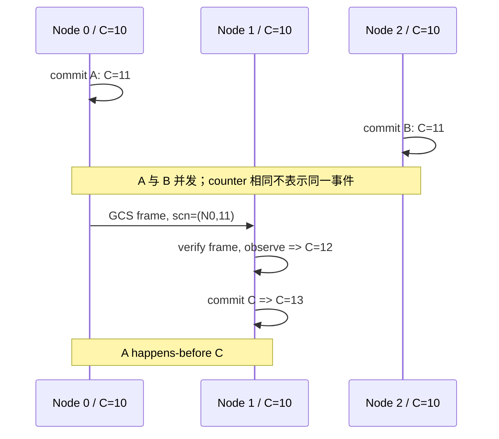
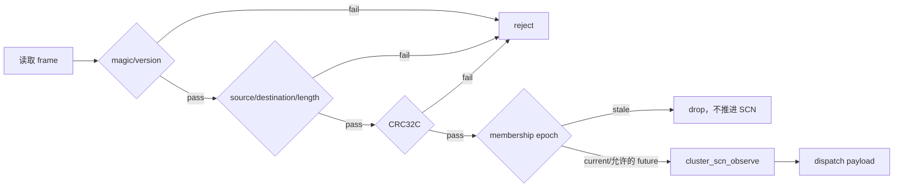

# 02：Lamport SCN 编码、推进与全序规则

[上一篇：独立 WAL thread](01-per-node-wal-threads.md) · [返回索引](README.md) · [下一篇：提交与持久化](03-commit-durability-and-visibility.md)

## 结论先行

PGRAC 的 SCN 是分布式逻辑时钟，不是墙上时间，也不是全局 sequence service。每个节点独立执行原子递增；发送跨节点消息时捎带当前值；接收端只有在完整验证消息后，才把本地 counter 推进到严格大于远端 counter。这样，发生过通信的事件保留因果先后，没有通信关系的并发事件用稳定 tie-break 得到可重复全序。

**Oracle 已验证。** Oracle 官方把 SCN 描述为数据库内部的逻辑时间戳，并用它排序事务和恢复事件。Oracle 历史 RAC 官方资料还明确列出 Lamport SCN 方案：所有实例可并行生成 SCN，实例间消息携带 SCN，不需要为 SCN 生成增加额外通信。PGRAC 下文的位编码、CAS 算法和三套 comparator 是自研实现，不代表 Oracle 内部字段格式。

## 64 位编码

```text
 63                     56 55                                      0
+-------------------------+------------------------------------------+
| origin node_id（8 bit） | Lamport local counter（56 bit）          |
+-------------------------+------------------------------------------+
```

公式为：

```text
SCN(node, counter) = (node << 56) | counter
node(SCN)          = SCN >> 56
counter(SCN)       = SCN & ((1 << 56) - 1)
```

约束：

- `node_id` 0..127 有效，128..255 保留；
- counter 0..`2^56-1`，0 SCN 整体永久表示 `InvalidScn`；
- 接近 counter 上界会先告警，达到安全边界时拒绝继续推进，绝不能掩码回绕复用旧 SCN；
- SCN 保持 8 字节，便于写入 WAL record、page、ITL 与事务状态结构。

为什么需要 node bits？两个未通信节点可以同时产生 counter 101。node id 让 `(101,node0)` 与 `(101,node3)` 拥有稳定、唯一的全序身份，但 **node id 不是时间高位**。

## 三类事件怎样推进时钟

### 1. 本地逻辑事件

提交、需要排序的 abort 或显式逻辑事件执行：

```text
C_i := C_i + 1
event_scn := encode(node_i, C_i)
```

生产实现使用本地原子 `fetch_add`，不获取跨节点锁。

### 2. 发送消息

发送方不专门申请一个“网络 SCN”，而是在构造统一 envelope 时快照当前 SCN：

```text
envelope.scn := current_scn
```

因此 heartbeat、GCS、GES、fence、reconfiguration 等原本就要发送的消息，都可成为因果时间载体。

### 3. 接收消息

通过 envelope 完整性与 epoch 校验后，接收方保证自己的 counter 严格大于远端：

```text
if C_local <= C_remote:
    C_local := C_remote + 1
else:
    C_local 保持不变
```

这是对 Lamport receive 的热路径优化：若本地已经严格领先，就不再制造无意义的 bump；若落后或相等，则 CAS 到 `remote+1`。CAS 竞争失败表示另一个本地 backend 已经推进 counter，重新读取后继续判断即可。

## 四节点因果示例

假设各节点初始 counter 均为 10：

| 步骤 | 事件 | Node 0 | Node 1 | Node 2 | Node 3 | 解释 |
|---:|---|---:|---:|---:|---:|---|
| 1 | N0 本地 commit A | 11 | 10 | 10 | 10 | A=`(11,N0)` |
| 2 | N2 本地 commit B | 11 | 10 | 11 | 10 | A 与 B 尚无因果关系 |
| 3 | N0 发 GCS 消息给 N1 | 11 | 10 | 11 | 10 | 消息携带 `(11,N0)` |
| 4 | N1 验证并 observe | 11 | 12 | 11 | 10 | N1 必须严格大于 11 |
| 5 | N1 commit C | 11 | 13 | 11 | 10 | `A → message → C`，故 C>A |
| 6 | N3 收到 N2 的旧消息 counter=9 | 11 | 13 | 11 | 10 | 本地已大于 9，不推进 |



## 为什么绝不能直接比较 64 位整数

node id 位于高 8 位。如果直接执行 `a < b`，node 3 的 counter 1 会被错误判断为晚于 node 0 的 counter 一百万：

```text
raw(node3, 1) > raw(node0, 1,000,000)  # 仅因 node bits 在高位
```

PGRAC 因此定义三种明确语义：

| Comparator | 排序键 | 使用场景 |
|---|---|---|
| `scn_time_cmp(a,b)` | `counter` | MVCC/可见性时间比较 |
| `scn_total_cmp(a,b)` | `counter → node_id` | ITL、唯一全序、pending identity |
| `scn_recovery_cmp(a,b)` | `counter → LSN → node_id` | 多 WAL stream 当前 head 的确定性归并 |

CI 的 comparison gate 禁止业务代码在 SCN 上使用原始 `<`、`==`、`>`。实现与注释见 [`cluster_scn.h`](../../../src/include/cluster/cluster_scn.h) 和 [`cluster_scn.c`](../../../src/backend/cluster/cluster_scn.c)。

## 因果顺序、全序与物理时间的区别

### 因果顺序

如果事件 A 的 SCN 被消息携带到另一节点，另一节点 observe 后再产生 B，则 `counter(B) > counter(A)`。这是 Lamport clock 的核心承诺。

### 并发事件的确定性全序

如果 A、B 没有通信关系，它们可能拥有相同 counter。`node_id` 或恢复时的 `LSN → node_id` 只负责给它们一个稳定顺序，**不是证明 A 在真实世界中早于 B**。

### 物理时间

SCN 不编码微秒、时区或 NTP 时间。墙钟倒退不会让 SCN 倒退；节点暂停很久后恢复，也不能仅凭系统时间跳过 observe。监控中的时间戳只用于测量传播间隔，不参与事务排序。

## 为什么消息校验必须发生在 observe 之前

如果先执行 `observe(frame.scn)` 再检查 CRC 或 source，攻击者或损坏 frame 可以发送接近 `2^56` 的 counter，把节点逻辑时钟永久推高。PGRAC 的接收顺序是：



统一 envelope 的实现见 [`cluster_ic_envelope.h`](../../../src/include/cluster/cluster_ic_envelope.h) 和 [`cluster_ic_envelope.c`](../../../src/backend/cluster/cluster_ic_envelope.c)。

## SCN 不是 commit durability

一次 commit 分配 SCN 后，仍可能处在以下窗口：

1. SCN 已分配，但 commit WAL record 尚未构造；
2. record 已插入 WAL buffer，但尚未获得 LSN；
3. 已获得 commit LSN，但还未刷盘；
4. WAL 已持久化，但远端尚未收到 durable frontier；
5. 远端收到 frontier，但本地 snapshot 是否可见仍需检查事务/ITL 状态。

所以 SCN 模块同时维护 pending commit 和 durable frontier。逻辑时钟回答“顺序”，flush proof 回答“落盘”；下一篇会把两条链精确合起来。

## 与 Oracle RAC 的对齐边界

| 主题 | Oracle 公开事实 | PGRAC |
|---|---|---|
| SCN 角色 | 数据库逻辑时间，排序事务/恢复事件 | 相同目标 |
| RAC 全局性 | SCN 跨实例协调 | 通过 envelope observe 收敛 |
| Lamport 形态 | 历史官方资料明确描述消息携带 SCN、实例并行生成 | 本地原子 counter + verify-before-observe |
| 位布局 | 官方资料未在上述页面披露 | 8-bit node + 56-bit counter，自研 |
| comparator | 内部细节未公开 | 三套显式 comparator + CI gate，自研 |
| wire | 内部细节未公开 | 36B envelope，自研 |

下一篇解释最容易出错的部分：为什么“SCN 最大值”不能直接作为“已经持久化到哪里”，以及同步/异步提交怎样关闭 pending gap。
