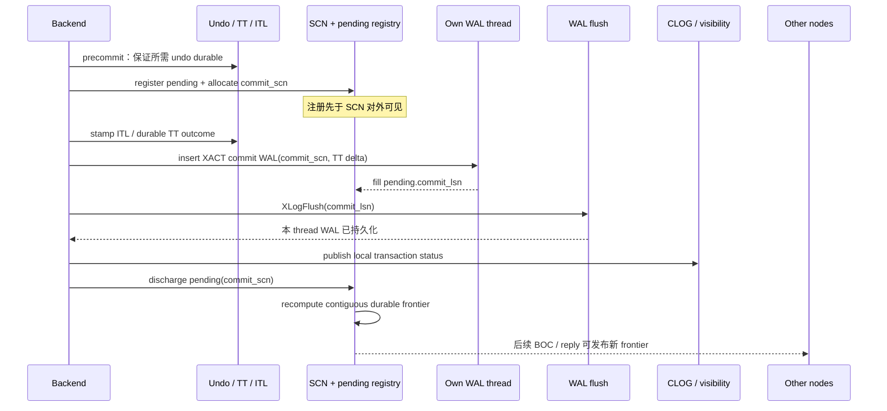
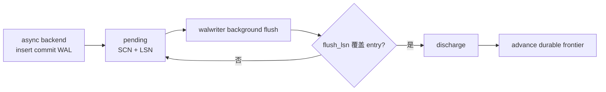

# 03：事务提交、WAL 持久化与可见性边界

[上一篇：Lamport SCN](02-lamport-scn-clock.md) · [返回索引](README.md) · [下一篇：消息捎带与收敛](04-message-piggyback-and-convergence.md)

## 结论先行

PGRAC 把一次提交拆成可审计的证据链：先让 undo 达到要求的持久状态，再把即将分配的 commit SCN 注册为 pending，然后更新 ITL/事务表证据并插入带 SCN 的 XACT WAL record；只有实际 WAL flush 覆盖 commit LSN 后，才允许从 pending registry 移除并推进连续 durable frontier。

这一设计关闭了最危险的窗口：较大的 SCN 已经通过节点消息传播，但对应事务的 commit WAL 尚未持久化。远端绝不能仅因为“见过更大的 SCN”就推断该事务已提交。

## 一次同步提交的完整路径



生产接线主要在 [`xact.c`](../../../src/backend/access/transam/xact.c)、[`cluster_scn.c`](../../../src/backend/cluster/cluster_scn.c)、cluster undo/TT/ITL 模块与 PostgreSQL WAL flush 路径中。

## 为什么必须“register before allocate/observable”

设本地 durable frontier 已到 99。两个 backend 并发提交：

```text
T1 分配 SCN 100，但尚未写 commit WAL
T2 分配 SCN 101，很快写完并刷盘
```

如果系统只记录“最大已刷盘 SCN”，看到 101 已刷盘就发布 frontier=101，会错误声称 100 也已持久化。此时节点崩溃，T1 的 commit 记录可能根本不存在。

PGRAC 在 commit SCN 被返回给事务之前，把它放进 pending registry：

```text
pending = {100, 101}
last_allocated = 101
```

T2 刷盘后移除 101：

```text
pending = {100}
durable_frontier = predecessor(min(pending)) = 99
```

T1 刷盘并移除 100 后：

```text
pending = {}
durable_frontier = last_allocated = 101
```

这就是 **连续 frontier**：它不是“见过的最大 durable 点”，而是“在该 origin 的 commit SCN 序上，没有未证明缺口的最大点”。

## durable frontier 的形式化定义

对本节点 origin：

```text
P = 当前所有已分配、尚未完成 durability/abort discharge 的 commit SCN 集合
L = 最后分配的 commit SCN

frontier =
    predecessor(min(P)),  P 非空
    L,                    P 为空
```

`predecessor()` 只对 counter 做时间前驱并保留合法 origin 语义，业务代码不能自己用原始整数减一。

registry 满时，系统把 frontier 标为 frozen。它不会覆盖旧条目，不会丢掉 pending，也不会把 `last_allocated` 当安全值。远端必须回退到更直接的事务状态/回复证明，直到安全状态恢复。

## pending entry 的生命周期

每个 durable pending entry 至少经历：

```mermaid
stateDiagram-v2
    [*] --> REGISTERED: commit SCN allocated
    REGISTERED --> LSN_KNOWN: XACT WAL insert returns commit_lsn
    LSN_KNOWN --> DURABLE: sync XLogFlush or walwriter flush >= lsn
    REGISTERED --> ABORTED: commit construction fails before record
    LSN_KNOWN --> ABORTED: transaction takes abort path
    DURABLE --> [*]: discharge + frontier recompute
    ABORTED --> [*]: remove; no commit durability claim
```



它同时保存 SCN 和之后补入的 commit LSN，因为两者属于不同坐标系：

- SCN 用于跨节点逻辑顺序；
- LSN 用于判断本 WAL thread 的实际 flush pointer 是否覆盖该 record。

## 同步提交与异步提交

### 同步提交

提交 backend 调用 `XLogFlush(commit_lsn)`。返回后，它拥有本事务 commit WAL 的直接持久化证明，可以按 SCN discharge 自己的 pending entry，再推进 frontier。

### 异步提交

backend 不能在 WAL 仍只位于内存时 discharge。它把 commit LSN 留在 registry；walwriter 后台刷盘后读取真实 flush horizon，批量移除 `pending_lsn <= flushed_lsn` 的 entry，并重新计算 frontier。



这保留 PostgreSQL 异步提交的延迟特性，也不把“backend 已返回”误写成“全局 durable”。

## undo、ITL、TT、XACT WAL 各自证明什么

多节点可见性不能只靠一个 commit bit：

| 证据 | 主要职责 | 不能替代什么 |
|---|---|---|
| undo durable state | 崩溃后仍能重建旧版本或回滚 | 不能证明事务已 commit |
| ITL commit/write SCN | 页上行版本与事务结果的连接 | 不能单独证明 commit WAL 已刷盘 |
| durable TT outcome | 保存事务身份、状态与 commit SCN | 不能绕过 origin/WAL authority |
| XACT commit WAL | 恢复时重建正式 commit decision | 尚未 flush 时不能视为 durable |
| CLOG / projection | 本地快速事务状态查询 | 需要由 canonical durable evidence 支撑 |
| durable frontier | 批量证明某 origin 的连续 commit durability | 不包含每个事务的完整身份与页面可见性 |

PGRAC 可以把 TT commit delta 折叠进同一 XACT commit WAL record，从而减少额外 WAL record 和额外 flush 依赖；这是一种写放大优化，不改变“commit record 必须先持久化”的边界。

## commit SCN 如何进入 WAL

真实 cluster commit 的 XACT record 带 `XACT_XINFO_HAS_SCN`，payload 中保存 commit SCN；WAL record header 的 `xl_scn` 还记录插入时的通用逻辑时钟。两者职责不同：

- `xl_scn`：所有 WAL record 都可使用的跨 stream 归并键；
- transaction commit SCN：该事务正式 outcome 的语义字段。

恢复不能把“record header 上有一个 SCN”自动解释成“这是 commit”。它仍按 rmgr/opcode 解码 XACT record，并验证事务语义字段。

## 从 durability 到 visibility 还差什么

远端读到某事务版本时，需要回答至少三件事：

1. 这个 tuple/page 上的事务身份属于哪个 origin/incarnation？
2. canonical TT/XACT evidence 给出的 outcome 与 commit SCN 是什么？
3. 该 commit SCN 是否落在 origin 已证明的 durable frontier 内，或者是否有等价的直接 durable proof？

只有第三项成立并不够：frontier=101 不能告诉你某个损坏或错误绑定的 transaction id 就是 commit 100。反过来，TT 中有 commit SCN=100，但 durable frontier 仍停在 99，也不能越过持久化缺口。

可把最终判断简化为：

```text
visible(candidate, snapshot) =
    identity_matches(candidate)
    AND canonical_outcome == COMMITTED
    AND commit_durability_proven(candidate.commit_scn)
    AND scn_time_cmp(candidate.commit_scn, snapshot.read_scn) <= 0
```

实际路径还会加入 incarnation、page/ITL generation、authority 与 retention 等约束。

## 崩溃窗口矩阵

| 崩溃点 | 恢复后应见结果 | 理由 |
|---|---|---|
| pending 注册前 | 没有新 commit SCN | 事务尚未进入 commit decision |
| pending 已注册、commit WAL 未插入 | 不得判 commit；entry 随 abort/restart 重建 | 只有逻辑号，没有 durable outcome |
| commit WAL 已插入、未 flush | 同步提交未完成；崩溃后由 WAL durable tail 决定 | 内存 WAL 不构成持久化 |
| WAL 已 flush、frontier 尚未广播 | 本地可恢复 commit；远端继续保守等待/查询 | durable truth 已有，缓存传播滞后 |
| frontier 已广播、远端 frame 重放 | 只接受同 epoch 单调值 | duplicate 不改变结论，regression 被拒绝 |

## Group commit 为什么仍然有效

同一节点多个 backend 可以等待同一个 WAL flush；一次物理 flush 覆盖多个 commit LSN。每个 pending entry 再按 `lsn <= flushed_lsn` 批量 discharge。于是：

- 物理 I/O 可以合并；
- 每个事务的 SCN/LSN identity 仍独立；
- frontier 只在所有更早缺口关闭后跃迁；
- 不需要跨节点 group commit coordinator。

## 与 Oracle 提交语义的对齐边界

Oracle 官方资料说明，commit 生成 SCN，LGWR 将剩余 redo 与事务 SCN 写入 online redo，写入完成构成 commit 的持久点。PGRAC 对齐这一外部语义：commit SCN 与 WAL durability 必须绑定。

PGRAC 的 pending registry、frontier 公式、TT fold 和 BOC 发布是 PostgreSQL/RAC 适配。Oracle 公开资料没有披露与这些结构相同的数组、容量或消息 payload，因此不能称其为 Oracle 内部算法。

下一篇说明 durable frontier 和普通 SCN 怎样搭乘现有 interconnect 消息传播，walwriter 为什么不直接持有网络 fd，以及事件丢失时如何靠 sweep 收敛。
