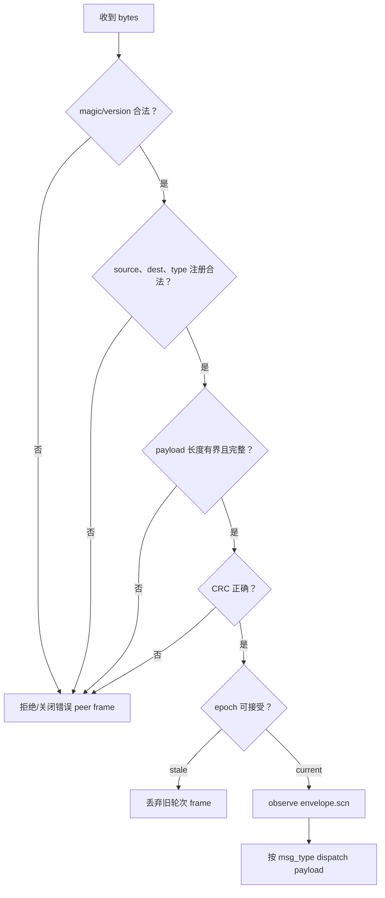
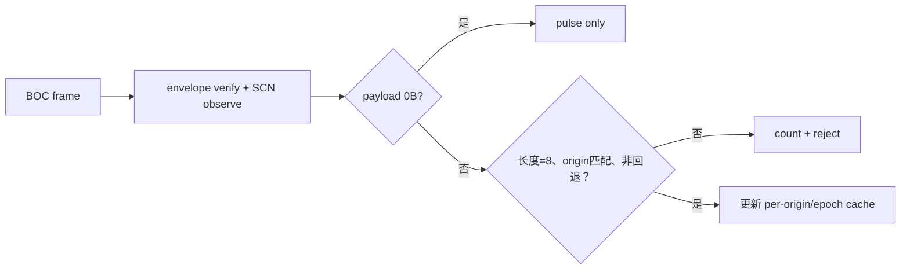
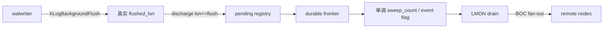

# 04：Interconnect 捎带、BOC 与无中心收敛

[上一篇：提交与持久化](03-commit-durability-and-visibility.md) · [返回索引](README.md) · [下一篇：恢复与 Oracle 对比](05-recovery-failure-and-oracle-comparison.md)

## 结论先行

PGRAC 不为每次 SCN 分配发送“请给我一个全局时间”的 RPC。所有跨节点消息统一携带发送方当前 SCN，接收端先验证 frame，再执行 Lamport observe。commit durability 则通过 BOC（broadcast on commit）通道传播连续 frontier：事件通知提供低延迟，周期 sweep 提供最终收敛，walwriter 负责判断刷盘，LMON 负责网络 fan-out。

这条路径有两个不同数据：

- `envelope.scn`：发送时的普通 Lamport logical clock，用于因果推进；
- BOC payload：该 origin 已连续持久化的 commit frontier，用于 durability 快速证明。

二者不能互换。

## 36 字节统一 envelope

```text
offset  size  field
0       2     magic
2       1     version
3       1     msg_type
4       4     source_node_id
8       4     dest_node_id
12      8     membership epoch
20      8     SCN
28      4     payload_length
32      4     CRC32C(header-prefix + payload)
total   36
```

同一个 envelope 包装 heartbeat、SCN/BOC、GES、GCS、cache block、sinval、fence 与 reconfiguration 消息。ABI 定义在 [`cluster_ic_envelope.h`](../../../src/include/cluster/cluster_ic_envelope.h)。

发送过程是：


因此 Lamport 协调的正常网络增量接近 0 个额外 round trip：SCN 搭已有业务流量传播。空闲期间如果没有业务消息，heartbeat/BOC 仍能逐步让节点观察彼此时间，但系统不要求所有节点在每个 counter 上同步。

## 接收端为何必须严格分层



顺序不是实现细节。若 CRC 或 source 尚未验证就推进 SCN，损坏/伪造 frame 会污染本地逻辑时钟。若 epoch 未验证，上一轮 formation 的延迟消息可能在新成员关系中制造虚假因果边。

stale epoch 消息应被丢弃，但不必因为一个合法延迟 frame 就摧毁健康连接；真正的格式、身份或完整性错误则按 transport policy 处理。

## 普通 piggyback 如何建立因果链

以一次远程 current block transfer 为例：

```mermaid
sequenceDiagram
    participant A as Node A requester
    participant M as Node M master
    participant H as Node H holder

    A->>M: REQUEST, envelope.scn=A:80
    M->>M: verify; local counter -> >80
    M->>H: FORWARD, envelope.scn=M:83
    H->>H: verify; local counter -> >83
    H-->>A: BLOCK_REPLY, envelope.scn=H:90
    A->>A: verify; local counter -> >90
    A->>A: later commit gets A:92
```

最终 commit 的 counter 大于这条请求链中已观察到的事件。系统无需单独问“全局 SCN server 现在是多少”。如果 A 与另一个完全无通信的 Node D 同时提交，它们可以有相同 counter，再用 node id 得到确定性全序。

## BOC：传播的不是“当前最大 SCN”，而是 durable frontier

BOC envelope 自身仍携带普通 `envelope.scn`。payload v1 额外携带 8 字节 little-endian：

```text
origin_durable_safe_scn
```

兼容形态允许 0 字节 payload，它只是 pulse，不能更新 durable frontier。8 字节 payload 被接受前必须满足：

- 值不是 `InvalidScn`；
- SCN 的 origin node bits 等于 envelope `source_node_id`；
- envelope epoch 已经通过统一校验；
- 对相同 `(origin, epoch)`，新 frontier 不得低于已缓存值；
- payload 长度必须恰好等于 8。



handler 不会再次调用 `cluster_scn_observe()`，因为统一 envelope 层已经完成一次 observe。重复推进会人为放大逻辑时间。

## walwriter 与 LMON 为什么要分工

walwriter 最清楚本节点 WAL 实际刷到哪个 LSN，却不拥有 tier-1 interconnect socket；LMON 拥有网络连接，却不应自行猜测 WAL durability。PGRAC 用共享状态把职责衔接起来：



- **walwriter**：后台 flush 后 discharge 已覆盖的 async commit，计算 frontier，推进 sweep/event marker；
- **shared state**：提供进程间单调 handoff，不传递网络 fd；
- **LMON**：发现 marker 后用自己持有的连接向 alive peers fan-out；
- **receiver LMON**：验证 envelope、更新 per-origin/epoch durable cache。

这避免了让 walwriter 跨越进程所有权直接操作 LMON socket，也避免 LMON 读取瞬时 WAL buffer 状态自行推断 durability。

## event + sweep：低延迟与最终收敛同时成立

只有事件通知：极端竞争或通知丢失会让新 frontier 长时间不广播。只有周期扫描：每次 commit 都可能额外等待一个完整 sweep interval。

PGRAC 同时使用两条腿：

| 机制 | 目标 | 失败时 |
|---|---|---|
| commit/event publish | frontier 变化后尽快唤起 fan-out | 周期 sweep 补偿 |
| walwriter periodic sweep | 定期重新发布最新状态 | 下一 sweep 再试 |

当 alive peer 数为 0 时，LMON 不消费 pending event；将来 peer 出现仍能发送最新 frontier。一次 fan-out 中某 peer `WOULD_BLOCK`、down 或 hard error 不会把“已发送给至少一个 peer”和“所有 peer 都收到”混成同一计数。

## 远端 cache 是加速器，不是新的真值源

每个 origin 的 remote durable cache 用 seqlock 风格读取：writer 发布奇数 sequence、写 epoch/SCN、再发布偶数 sequence；reader 有界重试，防止读到 torn pair。

```text
read seq1
if seq1 odd: retry
read epoch + scn
read seq2
if seq1 != seq2: retry
```

如果缓存不存在、SCN 无效或有界重试耗尽，API 返回“不可用”，调用方回退到直接 fetch/reply 证明。这里的 fallback 不是把未知当成功，而是改走更昂贵、authority 更直接的路径。

## 延迟、重复、乱序与损坏场景

| 场景 | 正确处理 |
|---|---|
| 同一 BOC frame 重复到达 | 幂等保留相同 frontier |
| 新 frontier 105 先到，旧 frontier 103 后到 | 同 epoch regression 被计数并拒绝 |
| 上一 epoch 的 200 延迟到达 | envelope epoch gate 丢弃，不污染新 cache |
| source=N1，但 payload SCN origin=N2 | node mismatch 拒绝 |
| CRC 错误且 SCN 很大 | CRC 阶段拒绝，不能 observe |
| LMON 暂时无法写 socket | 保留最新状态，由后续事件/sweep 重发 |
| receiver 读取 cache 时 writer 正更新 | seqlock retry；耗尽则走直接证明 |
| mixed-version peer 发 0B BOC | 只作为 pulse，不伪造 durable frontier |

## 性能模型

设四节点每秒业务消息总数为 `M`，每节点提交数为 `T`，BOC sweep 频率为 `S`：

- Lamport SCN 的网络往返增量不是 `O(T)`，因为普通 SCN 搭载在已有 `M` 条消息上；
- SCN 本地 advance 是原子操作，不经过 leader；
- BOC 可把多个 commit 的 frontier 变化合并在一次 event/sweep fan-out 中；
- 四节点 fan-out 成本与 alive peer 数相关，但不进入每次本地 WAL space reservation；
- remote cache 命中可避免按事务发起额外 durability query，cache miss 仍保留正确 fallback。

“没有额外 SCN RPC”不等于 interconnect 免费。高频 BOC、heartbeat、GCS/GES 消息仍会消耗 CPU 和带宽，真实瓶颈应从 fan-out、batch size、observe gap、WAL flush 和业务 wait events 联合判断。

## 可观测性

[`cluster_debug.c`](../../../src/backend/cluster/cluster_debug.c) 暴露的 SCN 维度包括：

- advance / commit / abort / observe bump 计数；
- BOC sweep、fan-out、event publish、sweep fallback 与 batch size；
- durable pending 数、frontier frozen/overflow/regression；
- BOC payload accept、bad length、node mismatch、regression；
- per-origin remote durable epoch/SCN；
- 最近 observe 时间与最大 observe gap。

这些指标应成组解释。例如 fan-out count 增长但 remote accept 不增长，优先检查连接、epoch 或 payload 拒绝；pending 长期不归零，则先看 WAL flush 和 async discharge，而不是盲目调高广播频率。

下一篇把并行日志重新合到故障恢复：为什么算法是“每 stream 保 LSN、跨 stream 比 head”，以及 Oracle redo thread 行为与 PGRAC 自研恢复边界分别是什么。
