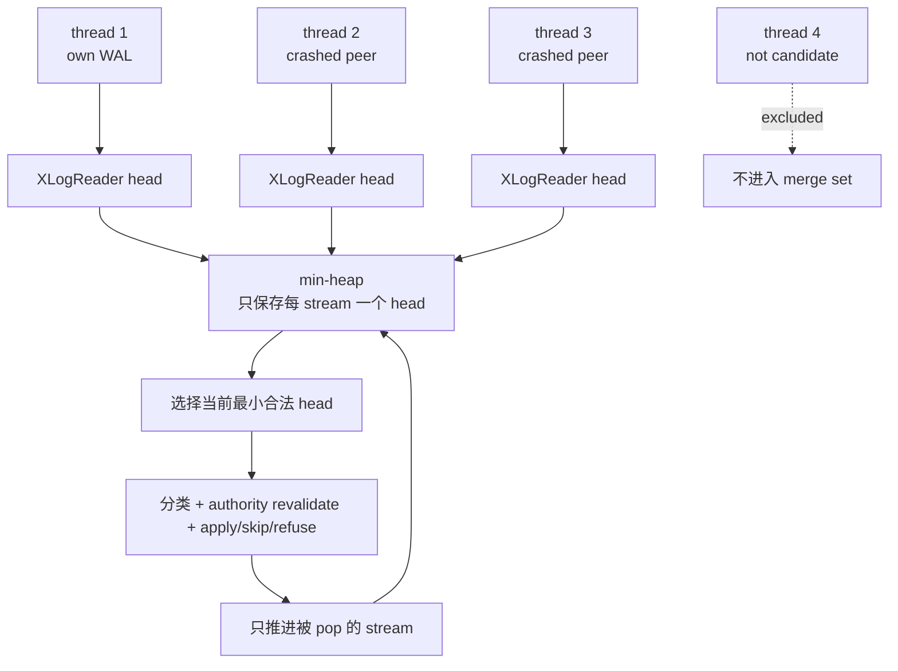
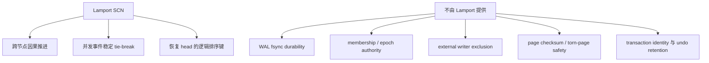

# 05：多流恢复、故障边界与 Oracle RAC 对比

[上一篇：消息捎带与收敛](04-message-piggyback-and-convergence.md) · [返回索引](README.md)

## 结论先行

多节点并行写 WAL 的代价不是提交期全局串行，而是恢复期必须同时尊重两种顺序：每个 WAL thread 内不可破坏的 LSN 因果链，以及不同 thread 当前可执行记录之间的 Lamport SCN 顺序。PGRAC 用 one-head-per-stream 最小堆做受约束的 k-way merge；每 pop 一条才推进对应 stream，绝不把同一 thread 的后续记录提前。

恢复引擎也不是“看见 peer WAL 就重放”。只有共享存储、crash candidate、stream 完整性、checkpoint、full-page-write、参与者与写排他权等前置证明成立时才进入 foreign replay；证据不足则 fail closed。

## 从四条 WAL stream 构造恢复输入



若共有 `k` 条 stream、`N` 条 record，每次 heap push/pop 为 `O(log k)`，总排序开销为 `O(N log k)`；四节点时 `k` 很小。每条 stream 只保留一个 head，也避免把全部 WAL record 预读到内存排序。

## 最重要的排序规则

### 同一 stream：LSN 永远优先

同一 thread 必须按 `xl_prev`/LSN 链读取。即使后一条 record 的 `xl_scn` counter 小于前一条，也不能倒置。并发 WAL inserter 会让这种 SCN 交错合法出现。

### 不同 stream：比较当前 head

heap 对不同 stream 的当前 head 使用：

```text
SCN counter → record LSN → origin node_id
```

LSN 在不同 stream 之间不表示共同物理位置，只在 counter 相同时提供稳定 tie-break；node id 再关闭完全相等时的歧义。

因此该算法应理解为 **受 stream 因果约束的确定性 Lamport merge**，而不是把所有 record 打散后按 SCN 全排序：

```text
thread 1: A(counter=10, LSN=100) -> B(counter=8, LSN=120)
thread 2: C(counter=9,  LSN=80)

合法输出：C -> A -> B
不合法输出：B -> C -> A   # B 不能越过同 stream 的 A
```

合法输出中的 counter 可以从 10 回到 8；这不表示逻辑时钟倒退，而是恢复必须先满足 stream 内 LSN 依赖。该边界避免用一个不成立的“thread 内 SCN 单调”假设破坏 PostgreSQL WAL 因果链。

## 为什么 replay 每条 record 还要 observe SCN

恢复重放会把磁盘上已有事件重新引入运行节点。如果恢复结束后的本地 counter 仍低于已重放 record，节点可能分配出看似更早的新 SCN。PGRAC 在安全的恢复阶段调用 `cluster_scn_recovery_replay_observe(record->xl_scn)`，把本地 logical clock 推到已重放历史之后。

该 wrapper 会处理 early startup 中 shared memory 尚未初始化、无效 SCN 与合法 cluster 模式边界；不能在任意 redo callback 中绕过它直接修改时钟。

## 进入 merged recovery 前的 fail-closed 门

典型前置条件包括：

| 门 | 防止的问题 |
|---|---|
| per-thread WAL 已配置，非 legacy thread 0 | 把单流 PostgreSQL WAL 当多流读取 |
| 明确 crash candidate 集合 | 重放仍存活实例正在写的 stream |
| cold/online recovery 形态与调用路径匹配 | 两套 recovery authority 混用 |
| shared-data backend 可证明 | 在各节点私有数据目录上重放 peer block |
| peer 是同一 shared root 的已知参与者 | 合并来自另一集群/另一存储根的 WAL |
| stream 预扫描、CRC、thread header、claim 合法 | 接受损坏、错绑或 foreign stream |
| checkpoint redo start 可用 | 从无法证明的中间位置开始 |
| full-page-write 历史满足恢复要求 | 缺少 torn-page 保护 |
| foreign mutation 前写排他/authority 仍 current | 旧 writer 与 recoverer 同时改共享页 |

只要计划中有 unknown、stream validation 失败或 authority 在第一次 foreign mutation 前失效，恢复就停止。静默退化为“只恢复自己的 stream”可能漏掉 peer 已提交的共享修改，因此不是安全 fallback。

## torn tail 与中段损坏如何区分

WAL stream 尾部可能因 crash 只写了一部分 record。PGRAC 先预扫描得到最后一个完整、已验证的位置 `valid_end`：

- replay 已达到 `valid_end` 后再遇到 short/torn read：可视为自然尾部；
- replay 在 `valid_end` 之前就无法解码：说明预扫描后内容变化或中段损坏，必须 fail closed；
- 不能把任意 decode error 都解释为“正常 crash tail”，否则会静默丢掉 committed WAL。

## foreign record 不能一律 ApplyWalRecord

peer WAL 中既有共享数据页修改，也有仅属于 peer 本地目录的状态。恢复引擎先分类：

| 类别 | foreign stream 处理 | 例子/原因 |
|---|---|---|
| Global logical | 应用或投影到 origin-scoped store | XACT/CLOG 类信息需要保留 peer origin，不能污染本地 xid 空间 |
| Shared block | 在 authority 成立时应用 | 修改共享数据页 |
| Local | 跳过 foreign record | peer 的本地 housekeeping/目录不能覆盖本节点文件 |
| Materialize-local | 按 record 中 owner 落到 origin 专属本地路径 | 例如为远端事务读取物化 peer undo |
| Unclassifiable | `FATAL` / blocked | 无法证明目标是 shared 还是 local |

分类表的 pure core 在 [`cluster_recovery_merge.h`](../../../src/include/cluster/cluster_recovery_merge.h)，backend 驱动在 [`cluster_recovery_merge.c`](../../../src/backend/cluster/cluster_recovery_merge.c)，实际 redo loop 接入 [`xlogrecovery.c`](../../../src/backend/access/transam/xlogrecovery.c)。

## foreign LSN 为什么不能写进本地 page LSN

`thread_2:0/900` 与 `thread_1:0/500` 属于两个独立坐标系。Node 1 恢复 thread 2 的共享页修改时，如果把 peer `EndRecPtr=0/900` 直接写入本节点 materialized page 的 `pd_lsn`，最终 checkpoint 可能要求本节点把自己的 WAL flush 到 `0/900`——但本节点 thread 根本没有对应 record。

PGRAC 在 foreign replay window 中把 page LSN 约束到本节点已持久化的 recovery checkpoint 基准，用 page/block SCN 保存跨 thread freshness 关系。原则是：

```text
本地 pd_lsn 只能引用本 WAL thread 可证明的 LSN
跨 thread 新鲜度使用 SCN / authority，不伪造可比较 LSN
```

## 故障场景与预期行为

| 故障 | 正确结果 |
|---|---|
| node 2 crash，thread 3 尾部 torn | 重放到预验证完整尾部，不读取 torn record |
| node 2 仍 alive 却被列为 crash candidate | preflight/plan 拒绝 merged recovery |
| thread 目录被错误映射到 node 3 | claim/header validation FATAL |
| BOC frontier 丢失 | 从 WAL/事务直接证明恢复，不把 cache miss 当 commit |
| 旧 epoch BOC 或 redo authority 到达 | epoch/authority gate 拒绝 |
| foreign record 目标无法分类 | fail closed，不猜 shared/local |
| recovery 中 authority 变化 | 在 foreign mutation 前/期间 revalidate，停止部分恢复 |
| 同一 stream SCN counter 回退 | 仍按 LSN 顺序；只禁止非零后出现零前缀 |

## Oracle RAC 与 PGRAC 逐项对比

| 主题 | Oracle 官方公开事实 | PGRAC 公开实现 | 判断 |
|---|---|---|---|
| 日志写入 | 每实例独立 redo thread | 每节点独立 `thread_<node+1>` | 外部形状一致 |
| 存储可达性 | 实例恢复可访问其他 redo thread | 共享 WAL 根 + per-thread reader | 语义映射 |
| 写入瓶颈 | 独立 thread 避免共享 redo log contention | 不做跨节点 WAL reservation | 目标一致 |
| 全局逻辑时间 | SCN 跨实例排序 | 64-bit Lamport SCN | 目标一致、编码自研 |
| SCN 协调 | 历史官方资料公开 Lamport 消息携带方案 | 统一 envelope piggyback + CAS observe | 行为对齐、wire 自研 |
| commit 持久性 | LGWR 写 redo 与 transaction SCN 构成 commit | commit LSN flush + pending discharge | 外部语义一致 |
| 恢复其他实例日志 | 恢复实例处理失败实例 redo thread | authority-gated k-way merge | 目标一致、算法自研 |
| 内部消息/状态 | 官方未在上述资料公开 | 36B envelope、BOC、claim、分类矩阵 | 不声称 Oracle 等同实现 |

## 哪些能力来自 Lamport，哪些绝对不是



Lamport SCN 解决“先后关系”；WAL/flush 解决“是否持久”；membership/fencing 解决“谁还能写”；GCS/ITL/undo 解决“哪个页面版本对谁可见”。任何一层都不能凭一个较大的 SCN 绕过其他层。

## 运维与诊断清单

遇到“提交卡住、远端看不到 commit、恢复不前进”时，建议按证据链排查：

1. 核对每节点 `node_id → thread_id → pg_wal target → claim` 是否一致；
2. 查看本地 SCN current、advance 与 observe bump 是否推进；
3. 检查 durable pending 是否长期非零、frontier 是否 frozen/overflow；
4. 对照本 thread flush LSN 与 pending commit LSN；
5. 查看 BOC event、sweep、fan-out、remote accept/reject 计数；
6. 确认 peer durable cache 的 origin、epoch 与 SCN；
7. 恢复时核对 candidate、shared-root participant、checkpoint、FPW 与 stream verdict；
8. 若是 foreign replay，检查 record class 和 authority revalidation，而不是直接跳过失败 record。

代表性自动化覆盖包括：

- SCN 本地/observe/比较：[`test_cluster_scn.c`](../../../src/test/cluster_unit/test_cluster_scn.c)
- durable frontier：[`test_cluster_scn_frontier.c`](../../../src/test/cluster_unit/test_cluster_scn_frontier.c)、[`t/387`](../../../src/test/cluster_tap/t/387_cluster_7_4_durable_frontier.pl)
- WAL thread identity：[`test_cluster_wal_thread.c`](../../../src/test/cluster_unit/test_cluster_wal_thread.c)、[`t/242`](../../../src/test/cluster_tap/t/242_wal_thread_routing.pl)、[`t/243`](../../../src/test/cluster_tap/t/243_wal_thread_2node_shared_root.pl)
- SCN 消息传播：[`t/100`](../../../src/test/cluster_tap/t/100_scn_broadcast_2node.pl)、[`t/101`](../../../src/test/cluster_tap/t/101_piggyback_scn_advance_2node.pl)
- k-way recovery：[`t/247`](../../../src/test/cluster_tap/t/247_merged_recovery.pl)、[`t/248`](../../../src/test/cluster_tap/t/248_shared_merged_recovery.pl)

## 最终总结

PGRAC 的多节点 wallog 并行写机制不是“把 PostgreSQL WAL 改成分布式共享队列”，而是：

1. 每节点独立 WAL thread，保留节点内 WAL 热路径与 group commit；
2. 用消息捎带 Lamport SCN 建立跨节点因果顺序；
3. 用 pending registry + flush LSN 发布连续 durability frontier；
4. 故障时保持 stream 内 LSN 顺序，对不同 stream 的 head 做确定性归并；
5. 用 claim、CRC、epoch、authority 与 record classification 阻止错误日志和错误 writer 进入恢复。

它与 Oracle RAC 在“每实例 redo thread、全局 SCN、提交必须 redo durable、失败实例日志可由其他实例恢复”的外部原则上对齐；具体编码、消息、缓存和恢复状态机是 PGRAC 为 PostgreSQL 架构做的透明自研适配。

## Oracle 官方资料

- [Oracle RAC：Redo Threads](https://docs.oracle.com/en/database/oracle/oracle-database/26/adrac/rac_redo_threads.html)
- [Oracle Database：Managing the Redo Log](https://docs.oracle.com/en/database/oracle/oracle-database/26/admin/managing-the-redo-log.html)
- [Oracle Database Concepts：Transactions、SCN 与 Commit](https://docs.oracle.com/en/database/oracle/oracle-database/18/cncpt/transactions.html)
- [Oracle9i RAC：Global SCN 与 Lamport SCN](https://docs.oracle.com/cd/A91202_01/901_doc/rac.901/a89867/pscomps.htm)

> Oracle 没有在这些公开资料中披露 PGRAC 的 `xl_scn`、thread claim、36B envelope、BOC payload 或 k-way heap。本文对 Oracle 的描述止于官方可验证行为，不从结果反推其内部实现。
