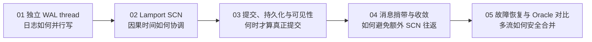
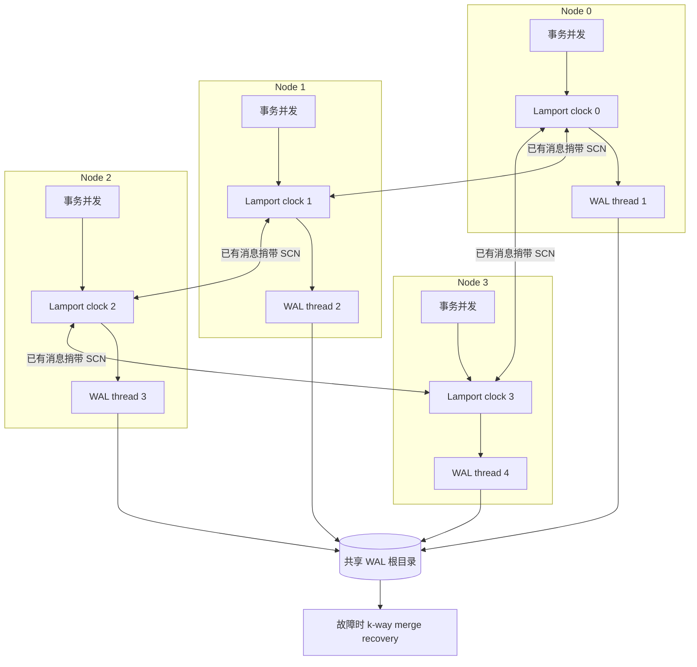

# PGRAC 多节点 wallog 并行写机制图解

这里的 **wallog** 是项目文档目录使用的名字，正文中的正式术语是 **WAL log / redo thread**。它描述 PGRAC 如何让多个数据库实例各写自己的 WAL thread，同时用 Lamport SCN 建立跨节点因果顺序，再把“逻辑顺序”“本地 WAL 持久化”和“全局可见性”严谨地连接起来。

核心结论是：**并行写日志不需要一把全局 WAL 锁，全局顺序也不需要每次提交都访问中心授时器。** 每个节点只在自己的 WAL stream 上执行 PostgreSQL 原生插入和刷盘；节点间已有消息携带当前 SCN，接收端按 Lamport 规则推进本地时钟。需要合并恢复时，同一 stream 保持 LSN 顺序，不同 stream 的当前记录头才按 SCN 做确定性归并。

## 阅读顺序



- [01：每节点独立 WAL thread 与并行写路径](01-per-node-wal-threads.md)
- [02：Lamport SCN 编码、推进与全序规则](02-lamport-scn-clock.md)
- [03：事务提交、WAL 持久化与可见性边界](03-commit-durability-and-visibility.md)
- [04：Interconnect 捎带、BOC 与无中心收敛](04-message-piggyback-and-convergence.md)
- [05：多流恢复、故障边界与 Oracle RAC 对比](05-recovery-failure-and-oracle-comparison.md)

## 一张图看懂总体机制



这套架构把三个经常被混淆的概念分开：

| 维度 | 回答的问题 | 权威依据 |
|---|---|---|
| WAL thread / LSN | 某个节点自己的日志记录先后顺序是什么？ | 该 thread 的 `xl_prev` 与 LSN 链 |
| Lamport SCN | 不同节点事件之间已经观察到哪些因果关系？ | 本地 advance + 已验证消息的 receive rule |
| durable frontier | 哪些 commit SCN 已经有连续的刷盘证明？ | pending registry + 实际 flush LSN |

因此，下列等式都不成立：

```text
SCN 已分配   ≠ commit WAL 已插入
commit WAL 已插入 ≠ commit WAL 已刷盘
某个较大 SCN 已刷盘 ≠ 它之前的所有 commit 都已刷盘
SCN 数值较大 ≠ 物理时间一定更晚
```

## 八条核心不变量

1. **一个节点只写自己的 WAL thread。** `thread_id = node_id + 1`；thread 0 永久保留给 PostgreSQL legacy 形态。
2. **目录身份必须可证明。** 启动时验证 `pg_wal` 映射、thread 目录和 write-once claim；映射错误、foreign claim 或 torn claim 均拒绝启动。
3. **本地热路径不取全局锁。** SCN allocation 是本地原子递增；远端消息只在接收时执行 Lamport observe。
4. **消息先验真，后推进时钟。** magic、版本、源/目标、长度、CRC 和 epoch 未通过前，frame 中的 SCN 不能影响本地时钟。
5. **WAL LSN 与 SCN 各司其职。** 同一 thread 由 LSN 保序；跨 thread 只比较当前 head，不能用 SCN 重排同一 thread。
6. **提交 SCN 必须先登记 pending。** 注册发生在 SCN 对其他参与者可见之前，关闭“SCN 已传播但 commit WAL 尚未持久化”的窗口。
7. **durable frontier 必须连续。** 有缺口时停在最小 pending commit 的前驱；容量不足时冻结，不把未知状态发布成 durable。
8. **恢复不猜测。** stream、共享存储、候选身份、checkpoint、full-page-write 或 authority 证明不足时 fail closed。

## 证据标识

本文统一使用以下口径：

- **Oracle 已验证**：Oracle 官方资料明确描述的外部行为。
- **PGRAC 已实现**：当前公开主线可由生产源码与测试定位。
- **PGRAC 自研适配**：为 PostgreSQL WAL、shared memory、进程模型和 interconnect 构造的具体机制。
- **Oracle 未公开**：不能从公开行为反推出 Oracle 的内部 wire、位布局、锁序或状态机。

Oracle 官方资料确认了三件对本系列最重要的事：RAC 每个实例有独立 redo thread；SCN 是跨实例排序所需的逻辑时间；历史官方资料公开描述过 Lamport SCN 形态——实例并行生成 SCN，并在实例间消息上携带 SCN，而不为每次分配增加额外通信。PGRAC 的 64 位编码、36 字节 envelope、BOC payload、pending registry 和归并算法则是公开可审查的自研实现，不声称复制 Oracle 内部格式。

## 公开实现与测试锚点

| 能力 | 生产入口 | 代表性测试 |
|---|---|---|
| SCN 编码、比较与 Lamport advance/observe | [`cluster_scn.h`](../../../src/include/cluster/cluster_scn.h)、[`cluster_scn.c`](../../../src/backend/cluster/cluster_scn.c) | [`test_cluster_scn.c`](../../../src/test/cluster_unit/test_cluster_scn.c) |
| durable pending 与连续 frontier | [`cluster_scn.c`](../../../src/backend/cluster/cluster_scn.c) | [`test_cluster_scn_frontier.c`](../../../src/test/cluster_unit/test_cluster_scn_frontier.c)、[`t/387`](../../../src/test/cluster_tap/t/387_cluster_7_4_durable_frontier.pl) |
| per-node WAL thread 与 claim | [`cluster_wal_thread.c`](../../../src/backend/cluster/cluster_wal_thread.c) | [`test_cluster_wal_thread.c`](../../../src/test/cluster_unit/test_cluster_wal_thread.c)、[`t/242`](../../../src/test/cluster_tap/t/242_wal_thread_routing.pl)、[`t/243`](../../../src/test/cluster_tap/t/243_wal_thread_2node_shared_root.pl) |
| WAL record/page 标记 | [`xlog.c`](../../../src/backend/access/transam/xlog.c)、[`xlogrecord.h`](../../../src/include/access/xlogrecord.h)、[`xlog_internal.h`](../../../src/include/access/xlog_internal.h) | [`t/068`](../../../src/test/cluster_tap/t/068_wal_xl_scn.pl) |
| interconnect SCN 捎带 | [`cluster_ic_envelope.c`](../../../src/backend/cluster/cluster_ic_envelope.c) | [`t/100`](../../../src/test/cluster_tap/t/100_scn_broadcast_2node.pl)、[`t/101`](../../../src/test/cluster_tap/t/101_piggyback_scn_advance_2node.pl) |
| k-way merged recovery | [`cluster_recovery_merge.c`](../../../src/backend/cluster/cluster_recovery_merge.c) | [`t/247`](../../../src/test/cluster_tap/t/247_merged_recovery.pl)、[`t/248`](../../../src/test/cluster_tap/t/248_shared_merged_recovery.pl) |

## Oracle 官方入口

- [Oracle RAC：Redo Threads](https://docs.oracle.com/en/database/oracle/oracle-database/26/adrac/rac_redo_threads.html)
- [Oracle Database：Managing the Redo Log](https://docs.oracle.com/en/database/oracle/oracle-database/26/admin/managing-the-redo-log.html)
- [Oracle Database Concepts：Transactions、SCN 与 Commit](https://docs.oracle.com/en/database/oracle/oracle-database/18/cncpt/transactions.html)
- [Oracle9i RAC：Lamport SCN 公开说明](https://docs.oracle.com/cd/A91202_01/901_doc/rac.901/a89867/pscomps.htm)

> 本系列解释当前公开代码的机制与边界，不把 Oracle 未公开的内部实现细节当作事实，也不以 Lamport 顺序替代 commit durability、membership authority 或 recovery safety。
