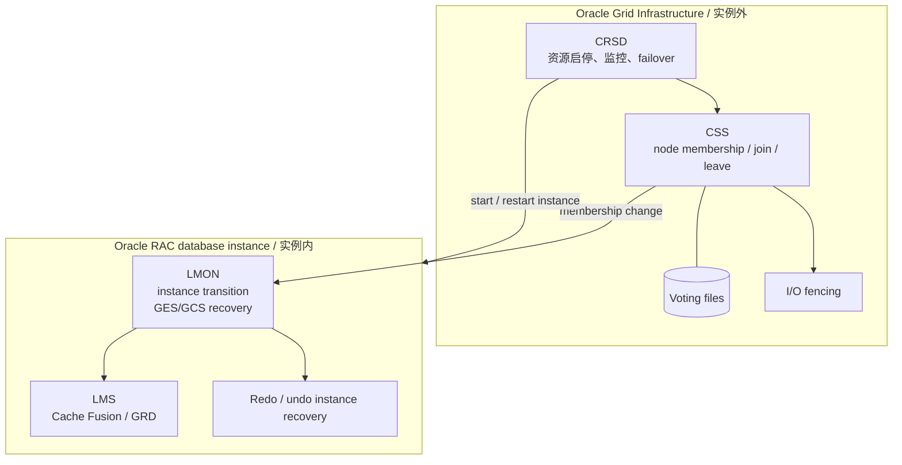
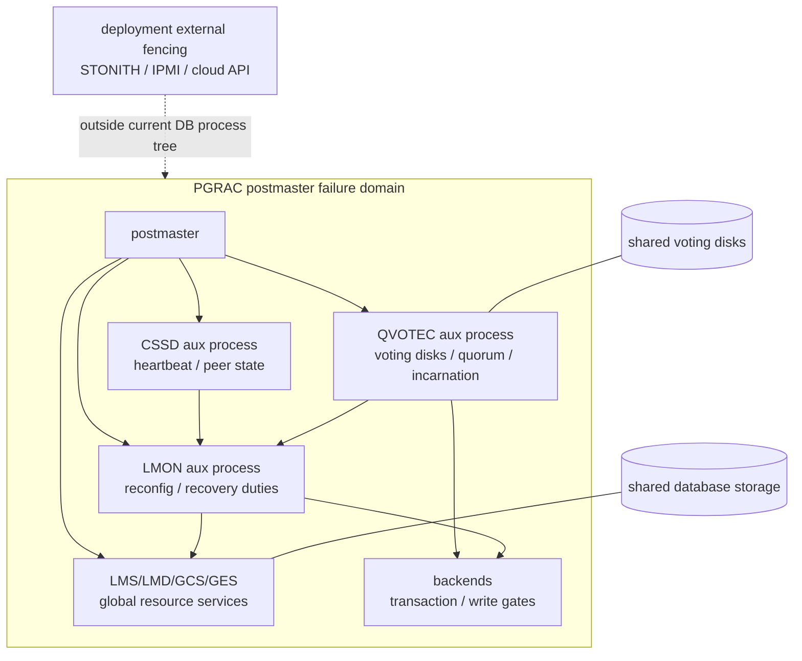
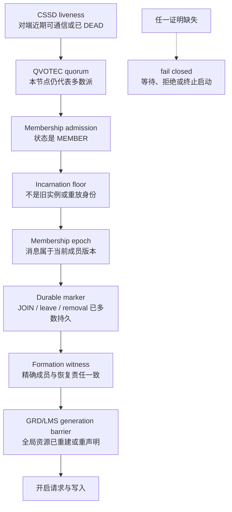
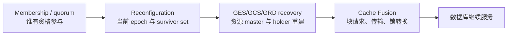

# 01：架构、职责与权威边界

[返回索引](README.md) · [下一篇：Rejoin 与 Formation](02-rejoin-and-formation.md)

## 结论先行

Oracle RAC 与 PGRAC 都把节点变化分成两类职责：一类判断“谁属于当前集群”，另一类在数据库实例内恢复 GES/GCS/GRD、缓存块和事务。两者最大的差异不是有没有这些职责，而是**职责所在的进程边界和故障域**。

## Oracle：实例外 Clusterware + 实例内 RAC 后台进程

**Oracle 已验证。** Oracle Clusterware 的 CSS 维护 cluster node membership，并通知节点加入或离开；CRSD 管理数据库、listener、service 等资源的启动、停止、监控与 failover；voting files 为成员关系裁决提供共享持久基础。数据库实例内部的 LMON 则监控 RAC instance transition，并执行 GES/GCS global resource reconfiguration。LMS 负责 Cache Fusion 数据块传输及 GRD 相关记录。

这解释了一个常见误区：**Oracle 的 LMON 也在数据库实例内。** 因此，节点变化并非完全由 Clusterware 在数据库外部完成；外部层提供 node membership、资源管理和 fencing，实例内层负责数据库全局资源与数据恢复。

官方依据：

- [Clusterware architecture](https://docs.oracle.com/en/database/oracle/oracle-database/26/cwadd/introduction-to-oracle-clusterware.html)
- [Oracle RAC background processes](https://docs.oracle.com/en/database/oracle/oracle-database/26/refrn/background-processes.html)
- [Oracle RAC architecture and Cache Fusion](https://docs.oracle.com/en/database/oracle/oracle-database/26/racad/introduction-to-oracle-rac.html)

## PGRAC：当前是 postmaster 内嵌集群协调层

**PGRAC 已实现。** 当前公开主线中，CSSD、QVOTEC 与 LMON 都从 postmaster 启动，并由 `AuxiliaryProcessMain` 分派。它们有独立 PID 和共享内存状态，但仍属于同一个数据库实例的进程树。

源码锚点：[`auxprocess.c`](../../../src/backend/postmaster/auxprocess.c)、[`postmaster.c`](../../../src/backend/postmaster/postmaster.c)、[`cluster_qvotec.h`](../../../src/include/cluster/cluster_qvotec.h)、[`cluster_lmon.h`](../../../src/include/cluster/cluster_lmon.h)。

**语义映射。** PGRAC LMON 对 global-resource recovery 的职责与 Oracle instance-side LMON 相近；PGRAC CSSD/QVOTEC 承担 Oracle CSS/voting 的一部分安全职责，但它们当前并不具备 Oracle Grid Infrastructure 那样独立于数据库实例的 failure domain。

**当前边界。** 对不遵守数据库内 cooperative fence 的故障实例，生产环境仍需部署层的外部 hard fencing。PGRAC 的[永久删除节点手册](../../cluster/node-removal.md#production-note-external-fencing)明确把 STONITH、IPMI 或云控制面归为外部运维职责。

## 权威不是一个布尔值

PGRAC 的服务准入是多个独立事实的合取。每一层解决不同问题：

因此下列判断都不成立：

- “能收到 heartbeat，所以它一定能写。”
- “它带来的 epoch 更大，所以它一定是合法新成员。”
- “JOIN marker 已落盘，所以 GRD 一定已经可以服务。”
- “所有进程都启动了，所以 formation 已经完成。”

`epoch` 负责隔离旧一代消息；`incarnation floor` 防止相同 `node_id` 的旧实例复活；durable marker 证明成员变化已经被多数持久接受；formation/recovery barrier 则证明资源恢复责任与当前成员集合一致。这几层不能互相替代。

## 与 Cache Fusion 的关系

成员关系是 Cache Fusion 的前置安全基础，而不是 Cache Fusion 的替代品：

- membership/quorum 决定谁能参与重配置和提交；
- GES/GCS/GRD recovery 决定全局锁与缓存资源现在由谁管理；
- Cache Fusion 在这个已证明的拓扑上继续传输块并协调访问。

节点失效时，如果直接跳到 Cache Fusion 服务而不先完成成员与资源恢复，旧 master、旧 holder 或旧 epoch 的消息可能和新请求并存。PGRAC 因而在恢复完成前冻结相关资源并关闭写门。

## 职责对照表

| 安全职责 | Oracle 公开机制 | PGRAC 当前公开机制 | 是否等价 |
|---|---|---|---|
| node liveness / membership | CSS、voting files | CSSD、QVOTEC、membership table | 目标相近；进程故障域不同 |
| 资源启停与实例重启 | OHASD/CRSD 及 agents | 主要依赖 postmaster 与外部部署系统 | 不等价 |
| split-brain 隔离 | CSS/I/O fencing 与集群驱逐 | quorum/write gates、cooperative fence；hard fence 由外部部署补足 | 部分覆盖 |
| RAC instance transition | instance-side LMON | instance-side LMON aux process | 职责相近，内部协议不作推断 |
| GES/GCS/GRD 恢复 | LMON/LMS 等 RAC processes | LMON + GES/GCS/GRD/LMS 子系统 | 语义相近，结构为 PGRAC 自有 |
| instance redo recovery | survivor/next opener 执行 instance recovery | per-thread WAL plan、owner claim、merged replay 与 PG native recovery | 目标相近，恢复格式与算法不同 |

下一篇将沿着这套权威链，解释一个实例从 `DEAD` 到重新成为 `MEMBER` 为什么需要 rejoin 与 formation 两个不同概念。
