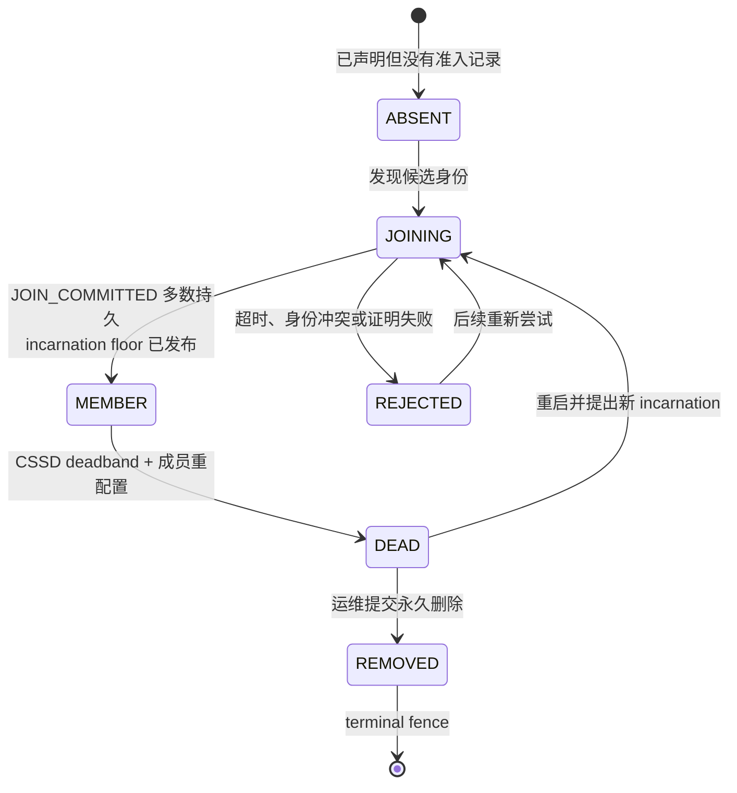
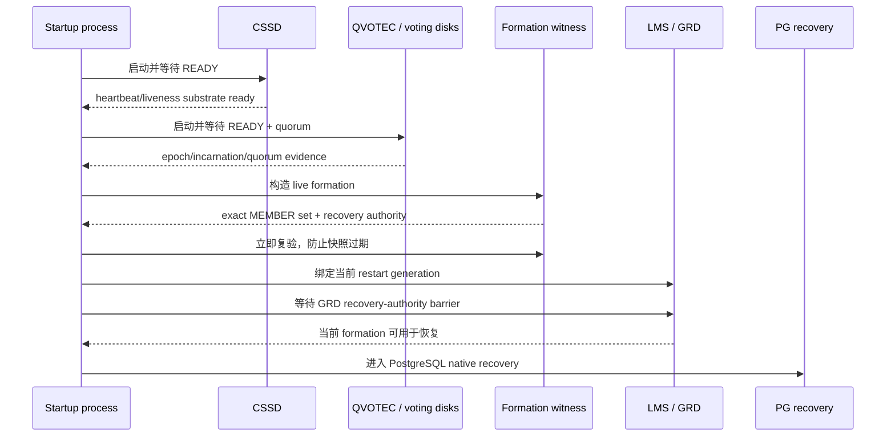
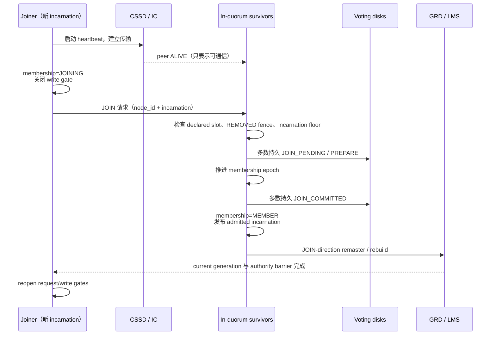
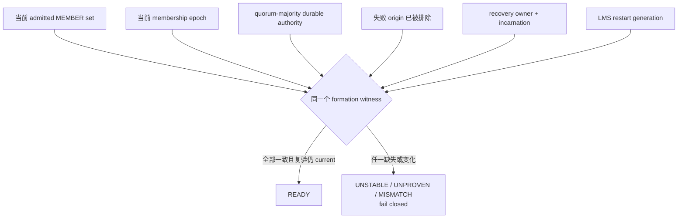
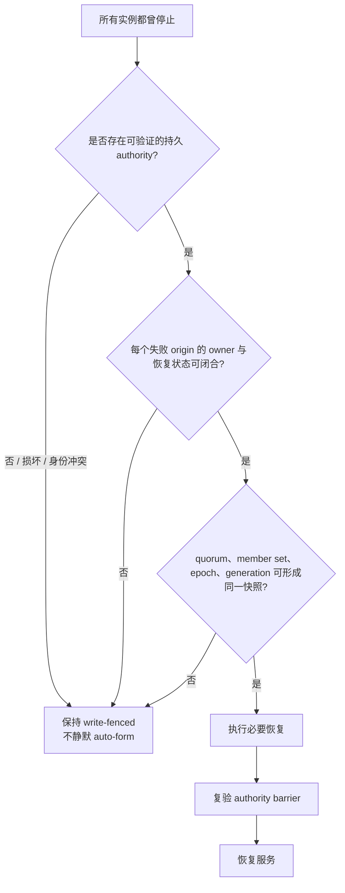

# 02：Rejoin、Formation 与成员状态机

[上一篇：架构与权威](01-architecture-and-authority.md) · [返回索引](README.md) · [下一篇：Recovery 与节点变化](03-recovery-and-node-change.md)

## Rejoin 不是“进程重新连上”

一个重启实例可以同时满足以下事实：进程已启动、TCP 已连通、heartbeat 正常，却仍然没有资格处理全局资源或写共享存储。原因是旧实例可能延迟复活、相同 `node_id` 可能发生冲突、survivor 可能已经推进成员 epoch，或者失败实例遗留的资源尚未恢复。

**语义映射。** Oracle 官方资料描述 CSS 的 join/leave 通知、cluster reorganization、实例重启和 RAC instance recovery，但没有公开 PGRAC 这种 `JOIN_PENDING`、JCMK 或 formation witness 的内部结构。本文用 rejoin 描述两者共同的外部目标，不声称 wire protocol 相同。

## 先区分三种“加入”

| 场景 | 操作对象 | 关键动作 | 是否是本文 rejoin |
|---|---|---|---|
| 物理节点扩容 | 新 node、Clusterware home、数据库软件 | 安装、配置、纳管、创建实例和 service | 否 |
| cold formation | 已配置的一组实例共同冷启动 | 读取持久身份与 quorum 证据，建立首个可服务成员集合 | 否 |
| online rejoin | 曾属于集群、随后重启的 instance | 用新 incarnation 重新准入，追赶 epoch，恢复全局资源后开门 | 是 |

**Oracle 已验证。** Oracle 的节点添加文档把“把 node 加入 Clusterware”“扩展 RAC home/创建 instance”“配置 service”作为不同步骤。它们不能和一个已配置实例的运行时 rejoin 混为一谈。参见 [Adding and Deleting Oracle RAC from Nodes](https://docs.oracle.com/en/database/oracle/oracle-database/21/racad/adding-and-deleting-oracle-rac-from-nodes-on-linux-and-unix-systems.html)。

## PGRAC 成员状态机

**PGRAC 已实现。** 决策状态来自 [`cluster_membership.h`](../../../src/include/cluster/cluster_membership.h)。只有 `MEMBER` 会被计入 survivor、quorum-related membership 与 coordinator 计算。

图中最后一条不是“进程结束”，而是表示 `REMOVED` 对普通 rejoin 是终态：重启不会自动撤销 tombstone 或 write fence。

### incarnation floor 为什么必要

每个 node slot 保存单调的 `last_admitted_incarnation`：

- 候选 incarnation 必须比已准入 floor 更新；
- 相同或更旧的身份被视为 stale replay；
- JOIN 提交后，新 incarnation 发布为新的 floor；
- 永久删除还会固化 removal fence，不能靠更大的普通 JOIN 请求绕过。

因此，`node_id` 是配置槽位，incarnation 才是一次具体实例生命期的身份。

## Cold formation：从“配置节点”到“当前成员”

PGRAC 的 startup phase 3 按固定依赖顺序收敛。缺少任何必要证据时启动 fail closed，而不是猜一个成员集合继续运行。

**PGRAC 已实现。** 这条顺序可在 [`cluster_startup_phase.c`](../../../src/backend/cluster/cluster_startup_phase.c) 中核对。formation 不是“所有配置节点都在线”，而是“当前可以共同承担恢复与服务责任的精确 admitted member set 已有一致证据”。

## Online rejoin：两阶段准入 + 资源恢复

运行中的集群必须先保护 survivor，再接纳 joiner。PGRAC 的正常顺序如下：

这里有两条容易忽略的规则：

1. 为了让消息能继续交换，joiner 可以先追赶 survivor 已观察到的 epoch；这只是 transport liveness，不会让它自动成为 `MEMBER`。
2. `JOIN_COMMITTED` 证明成员变化已经持久接受；它仍不等于所有 GRD/LMS 状态都已重建，所以写门要等后续 barrier。

公开定义见 [`cluster_reconfig.h`](../../../src/include/cluster/cluster_reconfig.h)；两节点 rejoin/remaster 的端到端证据见 [`t/325_cluster_5_16_join_remaster.pl`](../../../src/test/cluster_tap/t/325_cluster_5_16_join_remaster.pl)。

## Formation 到底证明什么

formation witness 把多个“看起来都对”但可能属于不同瞬间的事实绑定为同一快照：

[`cluster_recovery_duty.h`](../../../src/include/cluster/cluster_recovery_duty.h) 暴露了 `READY`、`UNSTABLE`、`MARKER_UNPROVEN`、`ORIGIN_NOT_EXCLUDED`、`OWNER_MISMATCH`、`FULL_OUTAGE_UNRECOVERED` 等结果。这说明 formation 是恢复权威屏障，而不是网络健康检查。

## Full outage 为什么更难

有 survivor 时，恢复者可以从 survivor 的当前成员视图、epoch 和资源状态取证。所有实例同时失效后，这个在线见证消失，只能依赖持久证据和可证明的恢复责任。

**PGRAC 已实现。** [`t/404_crash_rejoin_stale_read_write_2node.pl`](../../../src/test/cluster_tap/t/404_crash_rejoin_stale_read_write_2node.pl) 证明双节点 crash 后立即共启不会静默 auto-form 或开放 stale write；之后 clean full restart 可以恢复服务。

**Oracle 已验证。** Oracle 官方说明：一个实例失败时 survivor 可读取失败实例 redo 执行 instance recovery；若全部实例失败，则下一次打开数据库的实例负责恢复所有失败实例。公开资料没有给出可与 PGRAC formation witness 逐字段对应的 Oracle 内部结构。参见 [Managing Backup and Recovery in Oracle RAC](https://docs.oracle.com/en/database/oracle/oracle-database/26/racad/managing-backup-and-recovery.html)。

## 判断 rejoin 卡在哪里

按下面顺序看，能避免把后置 barrier 的失败误判成 heartbeat 问题：

1. CSSD 是否把 peer 观察为 ALIVE/DEAD；
2. 本节点是否仍有 quorum；
3. joiner 是 `JOINING`、`MEMBER`、`REJECTED` 还是 `REMOVED`；
4. presented incarnation 是否高于 `last_admitted_incarnation`；
5. JOIN marker 是否多数持久、epoch 是否收敛；
6. formation witness 的具体拒绝原因；
7. JOIN remaster、holder redeclare 与 generation barrier 是否完成；
8. joiner 的 request/write gate 是否最终开放。

下一篇会展开第 6～8 步：成员集合改变后，全局资源和数据恢复如何共同决定“可以重新服务”。
