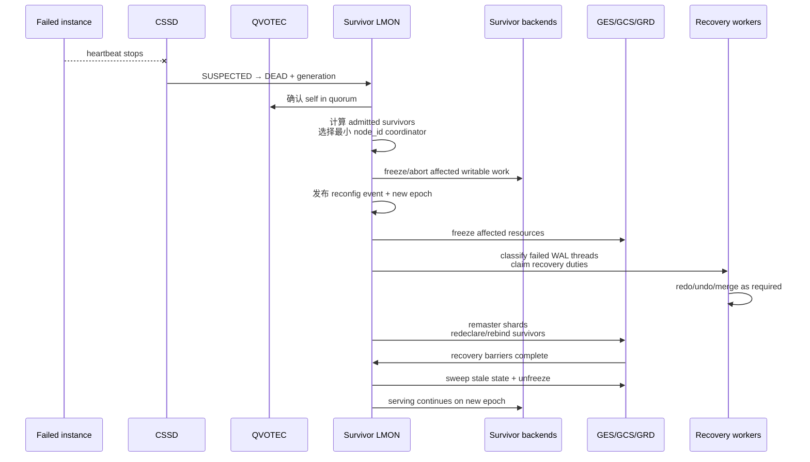
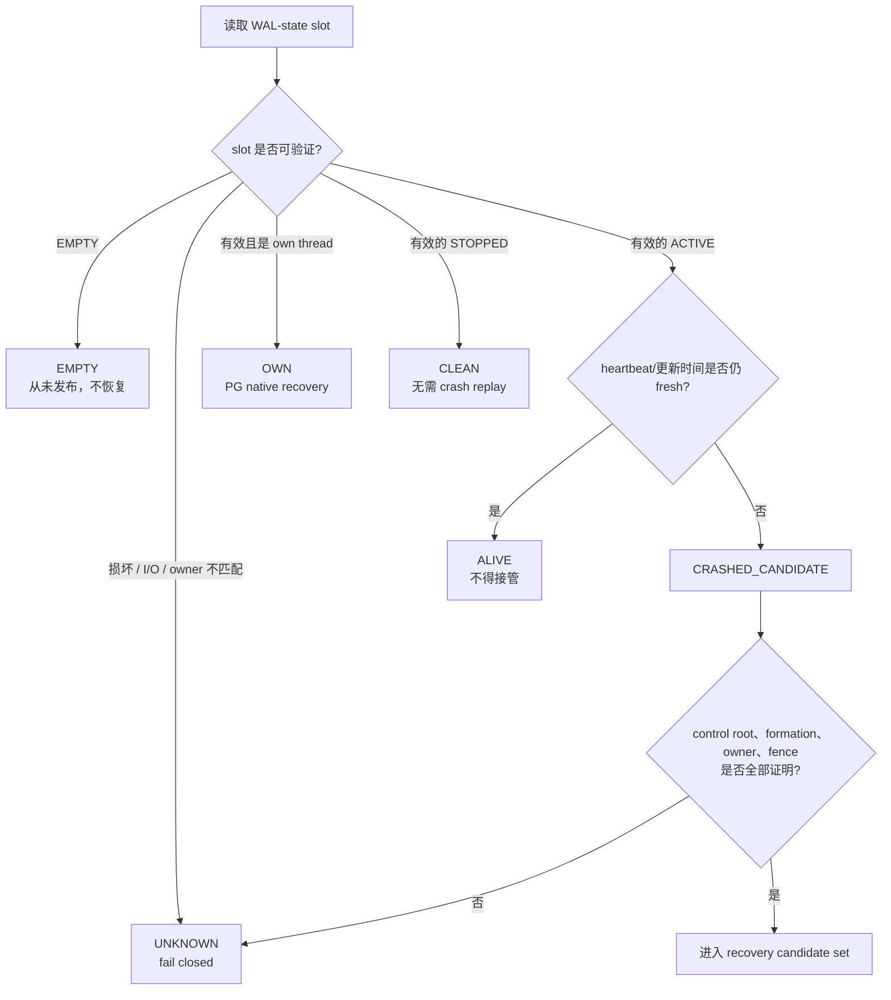
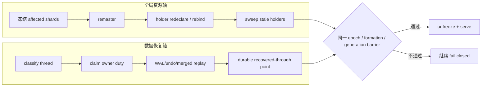
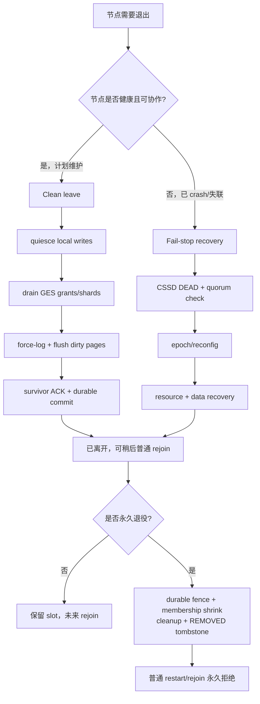
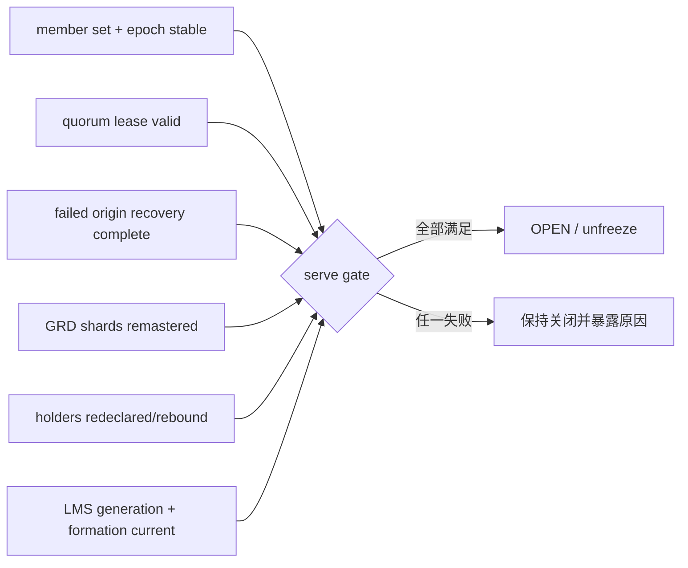

# 03：Recovery、故障重配置与节点生命周期

[上一篇：Rejoin 与 Formation](02-rejoin-and-formation.md) · [返回索引](README.md) · [下一篇：差异与运维](04-differences-and-operations.md)

## Recovery 至少有四层

“节点挂了，开始 recovery”是一句过度压缩的话。真实链路包含四个彼此依赖、却不能互相替代的层次：

| 层次 | 要回答的问题 | 典型结果 |
|---|---|---|
| membership reconfiguration | 谁还属于当前集群？ | survivor set、coordinator、new epoch |
| global resource recovery | 失败节点掌握的锁、GRD shard、holder 怎么处理？ | remaster、redeclare、sweep |
| data/transaction recovery | redo、undo、脏页和失败事务怎么收敛？ | replay、rollback、shared-storage truth |
| service recovery | 什么时候可以重新接受请求和写入？ | authority barrier 通过、unfreeze/open |

## Fail-stop 主链

**PGRAC 已实现。** reconfig coordinator 只从 in-quorum `MEMBER` 中产生；survivors 独立计算相同 survivor set，最小 `node_id` 是确定性 coordinator。CSSD 的 `DEAD` 只是触发器，真正的事件还绑定 dead generation、成员状态和 epoch。

事务在窗口内不会被一刀切地同样处理：

- read-only/idle 可以吸收不相关的成员变化；
- 已触及失败节点资源的写事务必须回滚并重试；
- reconfig 窗口内的 writable transaction 以 `53R60` fail closed；
- quorum 丢失则由 commit gate 和本地 freeze 以 `53R40`/`53R50` 拒绝继续提交。

## 先分类，再决定谁可以恢复

PGRAC 不把“看起来很久没更新”直接等同于“我可以接管它”。恢复计划对每条 WAL thread 使用闭表分类：

公开 classifier 见 [`cluster_recovery_plan.h`](../../../src/include/cluster/cluster_recovery_plan.h)，生成与发布见 [`cluster_recovery_plan.c`](../../../src/backend/cluster/cluster_recovery_plan.c)。

这个设计防止两类错误：

1. 把仍活着但暂时延迟的 foreign thread 当成 crashed，导致双重恢复；
2. 把读失败、文件损坏或身份不明当成“没有证据，所以可以接管”。PGRAC 对后一类选择 `UNKNOWN → fail closed`。

## GRD/GES/GCS 恢复与数据恢复为何必须会合

global resource recovery 决定“下一次请求由谁仲裁”，data recovery 决定“仲裁时看到的数据是否已经达到正确恢复点”。只完成前者会让新 master 在旧 redo 尚未落到 shared storage 时服务 stale block；只完成后者则可能让请求继续发往 dead master。

[`t/249_grd_recovery_remaster.pl`](../../../src/test/cluster_tap/t/249_grd_recovery_remaster.pl) 的两节点 fail-stop 路径验证了 dead-owner shard remaster、surviving holder 重声明/重绑、completion gate，以及完成后新请求和释放恢复。恢复能力的总览测试 [`t/273_stage4_recovery_acceptance_capability.pl`](../../../src/test/cluster_tap/t/273_stage4_recovery_acceptance_capability.pl) 明确区分真实执行、接口接线检查和 cross-node 可跳过项；本指南沿用这个证据边界，不把“接口存在”写成“多节点端到端已证明”。

## 三类退出：clean leave、fail-stop、permanent removal

### Clean leave

**PGRAC 已实现。** 离开节点在退出前 quiesce 写事务、移交 GES grants 和 mastered shards、把 dirty pages 强制记录并刷新到共享存储，等待 survivors 确认后提交 leave。若中途死亡或超时，协议放弃 clean 路径并升级为普通 crash recovery，不会为了“优雅退出”降低安全门。操作方法见 [Cooperative Clean Leave](../../cluster/clean-leave.md)。

### Fail-stop

故障节点无法交付内存状态，所以 survivor 必须依赖 DEAD 观测、quorum、持久身份、WAL/control-root 和 formation 证据来恢复。它比 clean leave 多出 resource reconstruction 与 crash replay 的不确定性。

### Permanent removal

**PGRAC 已实现。** removal 不是“更强的 stop”，而是运维提交的终态变更：只允许删除已经离开的节点，先建立 durable fence，再收缩 membership，最后清理 GRD/PCM/marker 残留并等待 survivor ACK。`REMOVED` 节点不能靠普通重启返回。操作方法见 [Permanent Node Removal](../../cluster/node-removal.md)。

## Oracle 对应行为

**Oracle 已验证。** Oracle RAC 中一个 instance 失败时，surviving instance 可读取失败实例的 online redo，保留已提交事务、回滚失败时仍活动的事务并释放资源；Clusterware 可负责重新启动失败实例。若所有实例均失败，下一次打开数据库的实例执行所有失败实例的恢复。[Oracle RAC backup and recovery guide](https://docs.oracle.com/en/database/oracle/oracle-database/26/racad/managing-backup-and-recovery.html)

Oracle 公开资料还描述了 failure detection、cluster membership reorganization、LMON 驱动 GES/GCS remaster 与 instance recovery 的宏观链路。这份资料属于历史版本，可用于理解职责顺序，不能用来断言现代版本仍采用相同内部消息或每一步状态名。[Oracle cluster reorganization and instance membership recovery](https://docs.oracle.com/cd/A91202_01/901_doc/rac.901/a89867/pshavdtl.htm)

**语义映射。** 两者共享如下安全目标：

- 失败成员先从当前服务集合排除；
- 全局资源要从失败 owner 迁移或重建；
- 失败事务与 redo/undo 要收敛；
- 恢复完成前阻止冲突的新服务；
- 恢复后的实例作为新生命期重新加入。

PGRAC 的 WAL thread、control root、formation witness、JCMK 与具体 barrier 是项目自有实现，不能解释成 Oracle 的物理文件或私有协议。

## 四节点证据应该怎样理解

[`t/331_stage5_4node_reconfig_matrix.pl`](../../../src/test/cluster_tap/t/331_stage5_4node_reconfig_matrix.pl) 已覆盖四节点 clean leave、idle fail-stop、写负载下 fail-stop 和 leave/remove，并验证 epoch 单调、唯一 coordinator、removed node fail closed 与 survivor committed data 一致。

**当前边界。** 该测试中的四节点 JOIN/JOIN-remaster 腿是 PASS-or-SKIP，而不是强制必须执行。因此可以说四节点节点退出与故障重配置已有真实矩阵证据，不能仅凭该文件宣称“四节点 online rejoin 已被这条测试强制闭环”。两节点 online rejoin 的实证锚点是 [`t/325_cluster_5_16_join_remaster.pl`](../../../src/test/cluster_tap/t/325_cluster_5_16_join_remaster.pl)。

## 重新开放服务的最终条件

无论哪类节点变化，正确终点都不是“某个状态变绿”，而是同一事件的所有依赖同时 current：

下一篇把这些机制转换为具体运维动作：该选 clean leave、restart、remove 还是 external fence，以及每一步该看哪些 SQL 状态。
