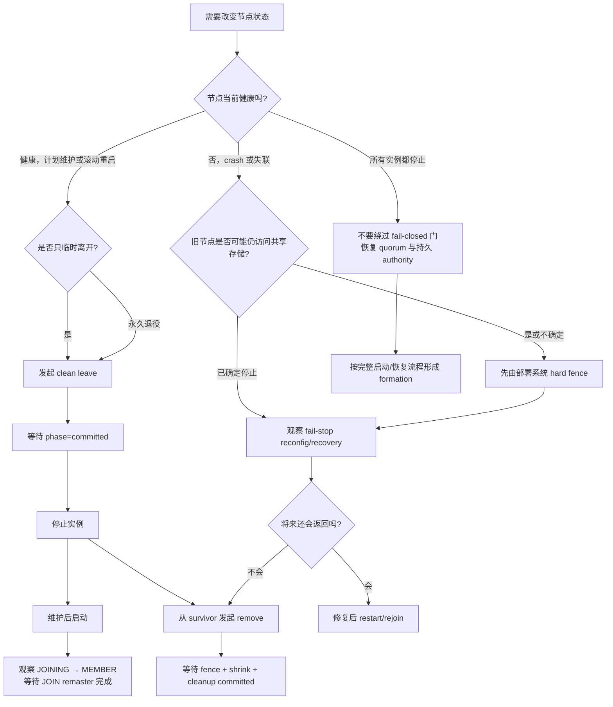
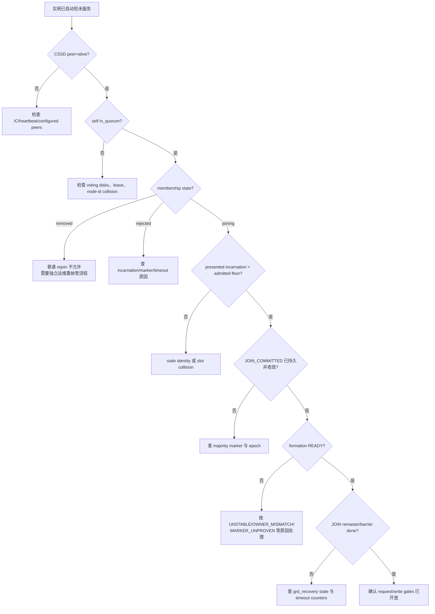

# 04：差异矩阵、运维流程与当前边界

[上一篇：Recovery 与节点变化](03-recovery-and-node-change.md) · [返回索引](README.md)

## 相同的是安全目标，不是内部协议

Oracle RAC 与 PGRAC 都必须在节点变化时避免 split-brain、旧成员继续写、全局资源双主和未恢复数据被提前读取。两者都采用“成员裁决 → 资源重配置 → 数据恢复 → 恢复服务”的总体顺序。

差异主要在产品边界、failure domain、持久格式、自动化成熟度和公开可观察面。下面的“相近”只表示安全职责相近，不表示 PGRAC 复刻了 Oracle 的私有实现。

## 详细对比矩阵

| 维度 | Oracle RAC（官方公开事实） | PGRAC（当前公开实现） | 判断 |
|---|---|---|---|
| 集群基础设施 | Grid Infrastructure 独立运行，OHASD/CRSD/CSS 等管理 node membership 与资源 | CSSD/QVOTEC/LMON 是 postmaster auxiliary processes | 目标相近，failure domain 不同 |
| node membership | CSS 控制节点成员关系并通知 join/leave；voting files 参与成员裁决 | CSSD liveness + QVOTEC quorum + membership table | 语义相近 |
| 数据库 instance membership | LMON 维护 RAC instance transitions 并重配置 GES/GCS resources | LMON 驱动 reconfig、JOIN 和 recovery duties | 职责相近，状态与 wire 为 PGRAC 自有 |
| 资源管理 | CRSD/agents 启停、监控、重启 database/listener/service | postmaster 管理数据库子进程；跨实例资源编排依赖部署系统 | 当前不等价 |
| quorum 持久层 | Oracle voting files；OCR 存集群资源配置 | voting slots、incarnation、epoch、durable event markers | 安全用途相近，物理格式完全不同 |
| split-brain/fencing | Clusterware 驱逐与 I/O fencing，可结合 server weight 等策略 | quorum/write gates、self/cooperative fence；hard fence 由外部 STONITH/IPMI/cloud 控制面提供 | 部分覆盖 |
| rejoin 身份 | 官方公开 join/restart 行为，内部 incarnation/marker 细节未公开 | `node_id + incarnation floor`，`JOIN_PENDING → JOIN_COMMITTED` | 不能逐字段对照 |
| formation | cluster membership/reorganization；未公开 PGRAC 同名结构 | exact MEMBER set + epoch + durable authority + owner/incarnation + generation witness | PGRAC 项目术语 |
| GRD/GES/GCS recovery | LMON/LMS 等进程处理 global resource recovery/remaster | freeze、remaster、redeclare/rebind、sweep、barrier、unfreeze | 目标相近 |
| redo/undo instance recovery | survivor 读取失败实例 online redo；全停后由 next opener 恢复 | per-thread WAL classification、owner duty、merge/native replay | 目标相近，算法不同 |
| planned maintenance | Clusterware/SRVCTL 与 RAC 运维流程协调 service/instance | SQL 发起 clean leave，完成后由 operator 停实例 | PGRAC 管理面更轻 |
| permanent decommission | 分层删除 RAC instance、home、Clusterware node、service | 已离开节点可 durable fence + membership shrink + cleanup；普通 rejoin 被永久拒绝 | 操作模型不同 |
| 自动服务迁移 | Clusterware 管理 service relocation/failover | 不把数据库 membership 机制宣称为完整 service manager | 当前边界 |
| 可观察性 | CRSCTL/SRVCTL、alert/log、GV$/V$ 等 | `pg_cluster_*` views、`pg_cluster_state`、日志、TAP evidence | 接口体系不同 |

## 运维决策树



## 操作前检查

在发起 clean leave、故障处置或 removal 前，先从每个仍可连接的节点采集同一组快照：

```sql
SELECT node_id, state,
       presented_incarnation, last_admitted_incarnation,
       admitted_epoch, removed, removed_epoch
  FROM pg_cluster_membership
 ORDER BY node_id;

SELECT node_id, state,
       last_heartbeat_recv_at, heartbeat_recv_count,
       suspected_since, dead_since
  FROM pg_cluster_cssd_peers
 ORDER BY node_id;

SELECT in_quorum, quorum_size, disks_ok, disks_total,
       current_epoch_at_boot, collision_state
  FROM pg_cluster_quorum_state;

SELECT event_id, coordinator_node_id, old_epoch, new_epoch,
       observer_role, cssd_dead_generation, reconfig_kind, applied_at
  FROM pg_cluster_reconfig_state;
```

观察重点不是某一行孤立地“正常”，而是所有 survivor 对以下事实收敛：

- 同一个节点集合处于 `member`；
- 没有 `collision_state`；
- 都在 quorum 中；
- 最新 reconfig event/epoch 能解释当前 `dead/joining/member/removed` 状态；
- `presented_incarnation` 与 `last_admitted_incarnation` 的关系符合预期。

## 计划维护：clean leave → stop → rejoin

1. 在所有成员上启用 clean-leave 配置并按[用户手册](../../cluster/clean-leave.md)要求重启生效。
2. 在准备离开的节点执行：

   ```sql
   SELECT pg_cluster_clean_leave_request();
   ```

3. 等待完成，不能只看请求返回 `accepted`：

   ```sql
   SELECT phase, leave_epoch,
          ges_drained_count, gcs_flushed_count,
          shards_remastered, survivor_ack_count,
          barrier_deadline, escalate_count
     FROM pg_cluster_clean_leave_state;
   ```

4. 只有 `phase = 'committed'` 后才停止实例。若为 `aborted_escalate`，按 fail-stop recovery 处置，不要把它当作成功 clean leave。
5. 节点再次启动时，按 online rejoin 检查：`joining → member`、incarnation floor 更新、`reconfig_kind = 'join_committed'`，随后确认 JOIN remaster 完成。

## 非计划故障：先隔离风险，再等恢复闭环

当 survivor 把 peer 置为 `dead` 时，不要立即把它永久删除。`DEAD` 表示当前服务成员排除了该实例，`REMOVED` 表示运维承诺它不再普通返回，两者语义不同。

故障处理顺序：

1. 如果无法证明故障实例已经失去共享存储写能力，先通过部署系统执行 hard fence。
2. 确认 survivor 仍在 quorum，且 reconfig event 的 `reconfig_kind = 'fail_stop'`。
3. 观察 GRD 与 thread recovery：

   ```sql
   SELECT category, key, value
     FROM pg_cluster_state
    WHERE category IN ('grd_recovery', 'recovery')
    ORDER BY category, key;
   ```

4. 重点检查：

   - `grd_recovery.state` 是否退出恢复中间态；
   - `remaster_failed`、`rebuild_timeout`、`cluster_gate_timeout` 是否增加；
   - `plan_n_unknown`、`thread_recovery_replay_failclosed` 是否为零或有明确解释；
   - `remaster_done`、`holders_redeclared/rebound` 和 recovered-through 证据是否推进；
   - survivor 的写门是否在同一新 epoch 上恢复。

5. 只有在决定节点永久退役时，才进入 removal 流程。

## 永久删除：只针对已经离开的节点

在 survivor 上执行：

```sql
SELECT pg_cluster_remove_node(<node_id>);
```

随后观察：

```sql
SELECT phase, target_node_id, coordinator_node_id, remove_epoch,
       fence_armed, membership_shrunk, grd_cleaned, pcm_cleaned,
       ack_count, cleanup_blocked_count, leftover_detected_count,
       zombie_write_rejected_count
  FROM pg_cluster_node_removal_state;
```

完成条件是 `phase = 'committed'`，且 fence、membership shrink、GRD/PCM cleanup 都已完成。`cleanup_blocked` 是可恢复中间态，不是成功；重新发起相同 remove 可恢复 cleanup。完整错误码和返回值见[永久删除节点手册](../../cluster/node-removal.md)。

> `REMOVED` 是 terminal fence。当前公开版本没有把 removed node 自动解除隔离并重新纳入成员的命令。不要通过删除共享 marker、重用 slot 或修改本地文件来绕过它。

## Rejoin 排障顺序



这个顺序有意把 liveness、membership、durability、formation 和 resource recovery 分开。直接从“heartbeat 正常”跳到“为什么不能写”，通常会在错误层面排障。

## Full outage 恢复纪律

所有实例同时停止时：

- 不手工伪造 `MEMBER`、epoch、incarnation floor 或 recovery-complete 状态；
- 不删除 voting/authority/control 文件来换取启动；
- 先恢复共享存储和 voting 可读性，再按完整 cold-start 流程启动；
- 如果 formation/recovery 返回 owner mismatch、unknown/corrupt 或 full-outage-unrecovered，应修复证据来源或从可信备份恢复，而不是放宽 gate；
- 确认所有失败 thread 的恢复责任闭合，再恢复对外写服务。

[`t/404_crash_rejoin_stale_read_write_2node.pl`](../../../src/test/cluster_tap/t/404_crash_rejoin_stale_read_write_2node.pl) 是当前公开主线的 fail-closed full-outage 行为锚点。

## 当前公开边界

以下能力不要从本指南推导为“已与 Oracle RAC 完全等价”：

- PGRAC 当前没有 Oracle Grid Infrastructure 等价的独立 Clusterware failure domain；
- external hard fencing 与跨实例资源启动/重启编排需要部署系统提供；
- Oracle 的 server-weight eviction、完整 service relocation 和 Clusterware 运维生态不由 membership 模块自动获得；
- 四节点 reconfiguration 测试已真实覆盖 clean leave、fail-stop 和 removal，但其中 JOIN legs 仍可跳过；
- 某个 view、counter 或函数存在，不等于相应多节点路径已端到端执行；能力声明应以不可跳过的生产路径测试为准。

## 推荐的证据包

遇到问题时，保存以下信息，通常足以把故障定位到正确层：

1. 所有可连接节点的 `pg_cluster_membership`；
2. `pg_cluster_cssd_peers` 与 `pg_cluster_quorum_state`；
3. `pg_cluster_reconfig_state`；
4. `pg_cluster_state` 中 `cluster_cssd`、`grd_recovery`、`recovery` 类别；
5. clean leave 或 removal 专用 state view；
6. 各节点日志中同一时间窗口的 incarnation、epoch、event id 与 formation failure reason；
7. 如果涉及 stale instance，部署层 hard-fence 的执行记录。

把这些快照按时间排序后，节点变化不再是一团“恢复日志”，而是一条可验证的因果链：

```text
liveness → quorum → membership/incarnation → durable event → formation
         → resource/data recovery → authority barrier → serving
```

## Oracle 官方参考

- [Oracle Clusterware architecture](https://docs.oracle.com/en/database/oracle/oracle-database/26/cwadd/introduction-to-oracle-clusterware.html)
- [Oracle RAC architecture and background processes](https://docs.oracle.com/en/database/oracle/oracle-database/26/racad/introduction-to-oracle-rac.html)
- [Oracle Database background processes](https://docs.oracle.com/en/database/oracle/oracle-database/26/refrn/background-processes.html)
- [Oracle RAC instance recovery](https://docs.oracle.com/en/database/oracle/oracle-database/26/racad/managing-backup-and-recovery.html)
- [Oracle OCR and voting files](https://docs.oracle.com/en/database/oracle/oracle-database/19/cwadd/managing-oracle-cluster-registry-and-voting-files.html)
- [Oracle RAC node add/delete operations](https://docs.oracle.com/en/database/oracle/oracle-database/21/racad/adding-and-deleting-oracle-rac-from-nodes-on-linux-and-unix-systems.html)
