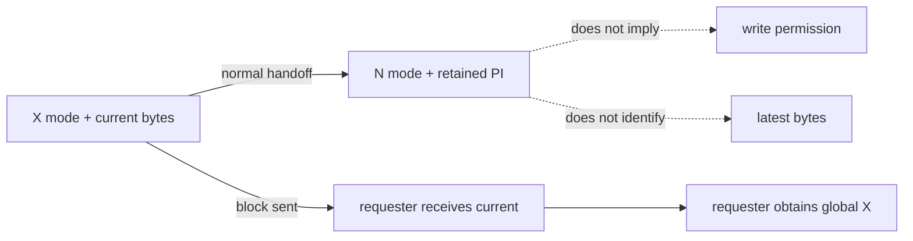
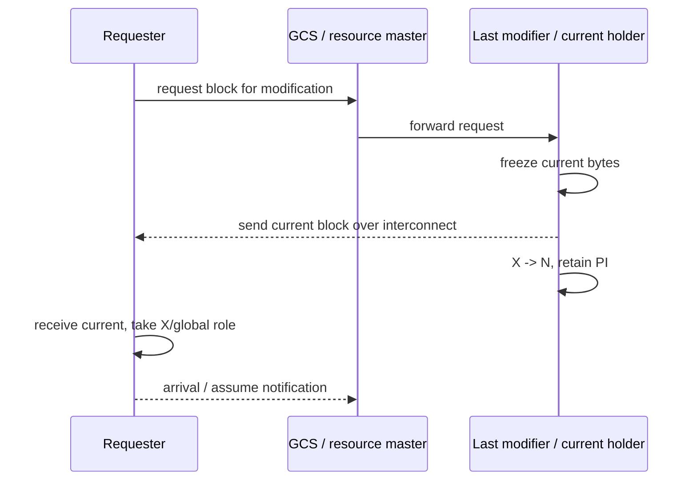
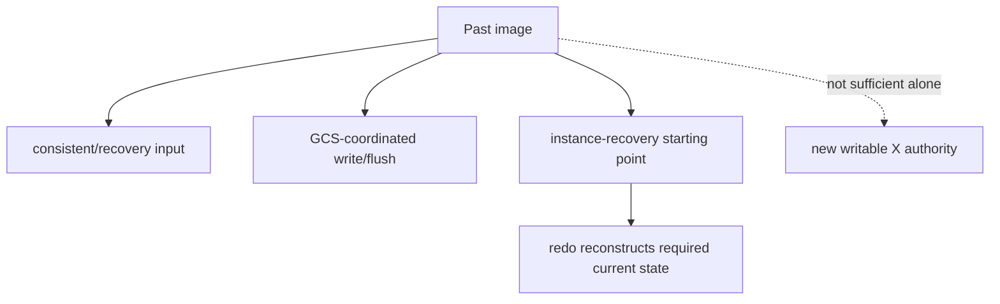
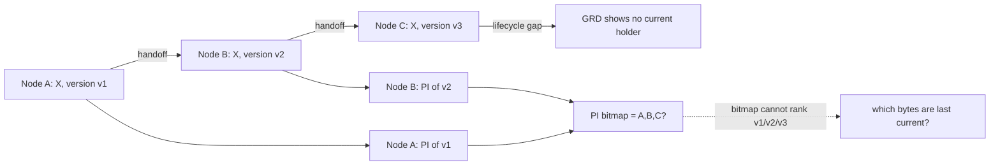
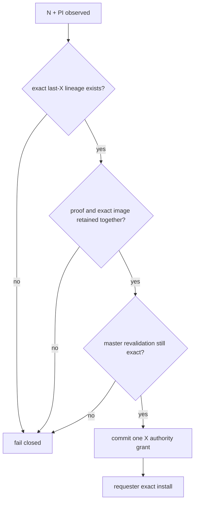

# 01：N+PI 问题、Oracle 公开行为与设计边界

## 1. 先区分 mode、buffer state 与版本身份

讨论 `N+PI` 时，最危险的误区是把“节点持有某份字节”与“节点拥有修改权限”混为一谈。

| 概念 | 回答的问题 | 能否单独授权写入 |
|---|---|---:|
| resource mode | 节点当前拥有什么全局访问权 | 只有经协调的 X 才可能进入写路径 |
| buffer state | 本地缓存中的块处于 current、shared current、PI 等哪种状态 | 不能脱离全局 authority 单独授权 |
| page/image identity | 这份字节属于哪个块、哪个版本边界 | 只能证明内容身份，不能证明 holder 权限 |
| lineage | 这份字节是否是最后一次 current 转换的直接产物 | 是候选必要条件，但仍需 master grant |

`N + PI` 因而表达的是：节点没有当前修改权限，但本地保留了一份过去镜像。它没有回答这份 PI
是否晚于其他 PI，也没有回答最后 current holder 是否已经安全完成交接。

## 2. Oracle 已公开的正常 Cache Fusion 路径

**Oracle 已验证：** 对 changed block 的修改请求，GCS 把请求转发给最后修改该块的实例；该实例
通过 interconnect 发送 current block，降级其资源并保留 PI，请求者取得 X/global 角色。Oracle
还明确说明，一个块在集群中同时只能有一个 XCUR 副本，修改块前必须取得 XCUR。

这个公开流程的重要含义不是某个具体消息顺序，而是三个角色必须同时成立：

1. GCS/resource master 协调全局资源；
2. last modifier/current holder 提供 current bytes；
3. requester 在 acquisition 完成后成为唯一 XCUR。

Oracle 官方资料还说明，当一个实例只有 PI、没有 most-recent current buffer，却发起写盘相关
请求时，GCS 会把请求转发给 current/most-recent holder，而不是把“拥有 PI”直接解释为 current
authority。

## 3. PI 的公开用途和边界

**Oracle 已验证：** PI 是 changed block 在转移后由原 holder 保留的过去镜像。PI 参与写协议、
checkpoint/flush 协调以及实例失败后的块恢复；实例恢复会使用在线 redo，PI 可作为相关块恢复的
起点。

**Oracle 未公开：** Oracle 官方资料没有披露一种“当目录中没有 current holder 时，从任意 PI
中挑出最新一份，直接提升为新 current-X”的内部算法、wire 字段或版本证书。这里应当表述为
“没有公开证据”，而不是“Oracle 一定没有这种内部优化”。

## 4. 为什么 N+PI 是歧义状态

同一块可能经历多轮 holder 转移：

位图可以说“谁可能持有 PI”，但不能回答：

- 哪一份 PI 对应最后一次 X owner；
- PI 是否在转换后又被刷新、替换或失效；
- page identity 与全局 authority generation 是否仍属于同一轮；
- formation、source incarnation 或 master session 是否已经变化；
- 这份 PI 是否只是较早恢复起点，而非可直接安装的 current bytes。

普通 watermark 也只能证明某个数值边界或发现倒退。如果它没有原子绑定到具体转换、具体 source
和具体 image，就不能补足上述缺口。

## 5. PGRAC 的窄适配：last-current carrier

PGRAC 不建立“PI 可晋升”的通用规则，而只承认下面这个窄命题：

> 如果一份 retained image 能被证明是最后一个 X owner 在最后一次 `X -> N+PI` 转换中原子
> 冻结的 exact bytes，并且该血缘到 grant 时仍然 current，那么它可以作为 current bytes 的
> carrier；写 authority 仍只能由 resource master 单独提交。

这条路径与 Oracle 的外部安全约束一致：由 master 协调、N 不可写、块走 cache-to-cache、全局只有
一个可修改 current。它的 certificate、retained pair 和复核算法是 **PGRAC 自研适配**。

## 6. 三条路径不能混为一谈

| 路径 | 输入 | 输出 | 适用条件 |
|---|---|---|---|
| 正常 current-holder transfer | 明确的 current/most-recent holder | current bytes + 新 X grant | 首选正常路径 |
| exact last-current carrier | 最后 X→N+PI 原子证书和同快照 image | 经复核的 carrier + 新 X grant | 仅窄 N+PI gap |
| PI+redo recovery | 恢复起点、redo 与 recovery authority | 重建后的 current | 无法证明直接 carrier 或发生故障恢复 |

exact carrier 不是 recovery 的替代品。只要 lineage 不完整、source 已漂移、页面版本有冲突或
formation 已变化，就必须返回 fail-closed/recovery 分支。

## 7. Oracle 官方资料

- [Oracle9i RAC：Cache Fusion and the Global Cache Service](https://docs.oracle.com/cd/A91202_01/901_doc/rac.901/a89867/pslkgdtl.htm)
- [Oracle9i RAC：Write Protocol、PI 与 Recovery](https://docs.oracle.com/cd/A97630_01/rac.920/a96597/pslkgdtl.htm)
- [Oracle RAC Administration Guide：GCS、GES、GRD 与 Cache Fusion](https://docs.oracle.com/en/database/oracle/oracle-database/21/racad/real-application-clusters-administration-and-deployment-guide.pdf)
- [Oracle RAC：Managing Backup and Recovery](https://docs.oracle.com/en/database/oracle/oracle-database/26/racad/managing-backup-and-recovery.html)
- [Oracle RAC：Monitoring Cache Fusion Performance](https://docs.oracle.com/en/database/oracle/oracle-database/18/racad/monitoring-performance.html)
