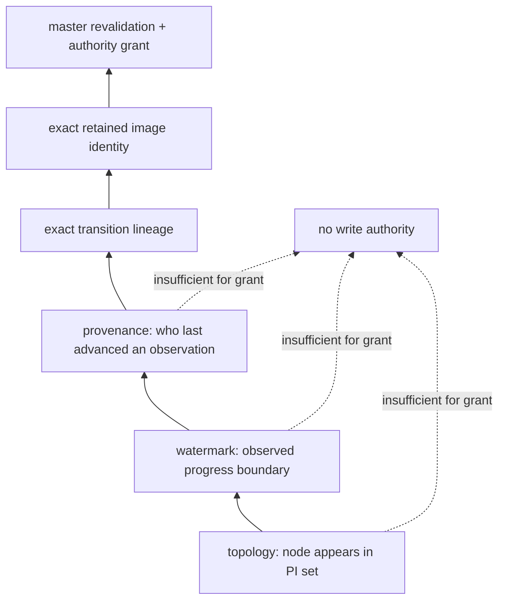
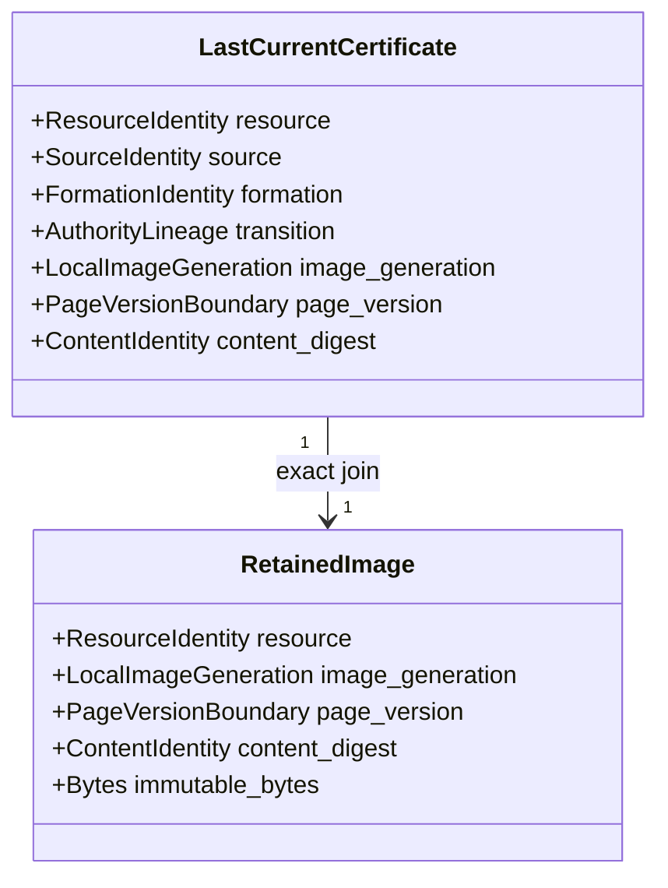
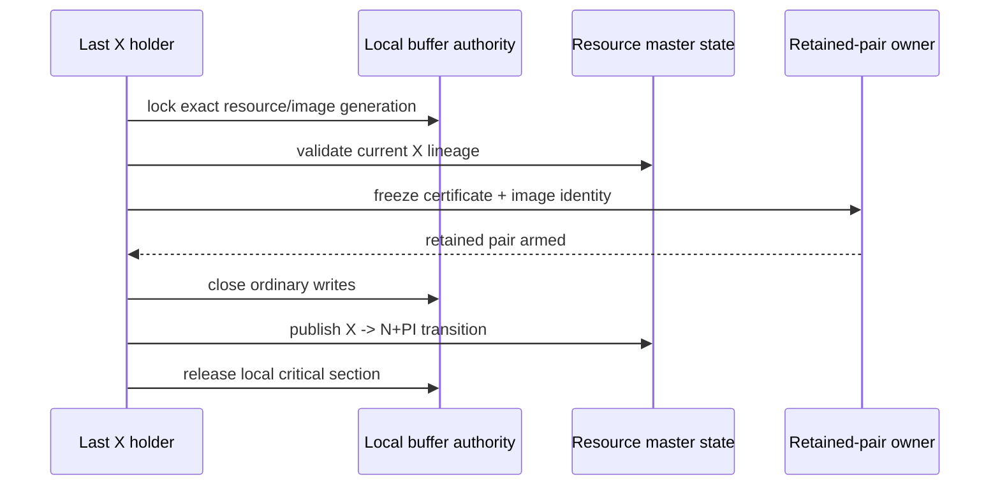
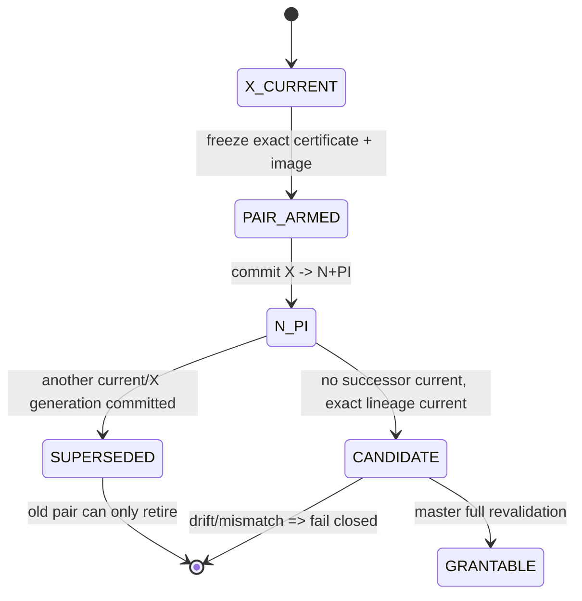
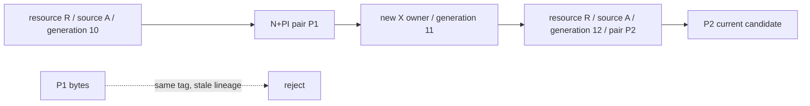

# 02：最后 current 血缘证书

last-current carrier 的关键不是多记录一个版本号，而是证明一条不可拼接的因果链：

```text
某个节点确实是最后 X owner
        ↓
它在关闭写权限的同一次转换中冻结了这份 image
        ↓
image、source identity 和 authority transition 属于同一快照
        ↓
此后没有新的 current owner、formation 或 authority generation 取代它
```

只有整条链成立，PI 才是“last-current carrier 候选”；它依然不是 X authority。

## 1. 证据强度阶梯

不同观测的证明力不能混用：



| 证据 | 可以证明 | 不能证明 |
|---|---|---|
| PI holder set | 哪些节点可能保存某个 PI | 哪个 PI 最新、内容是什么 |
| watermark | 某个观察值未低于已知边界 | 该值对应哪份 image、谁仍拥有它 |
| historical provenance | 某次观察由哪个 source 推进 | source 当前仍保留同一份字节 |
| transition lineage | image 与某次 X→N+PI 转换同源 | 当前 master 尚未被新轮次替代 |
| retained image identity | proof 指向同一冻结 image | 可以绕过 master 直接写 |
| current master grant | authority 在当前轮次被唯一提交 | requester 已完成本地安装 |

因此，topology、watermark 和历史 provenance 都只能做**辅助复核**；它们不能互相拼凑成
last-current authority。

## 2. 证书的语义内容

公开架构只规定语义，不冻结具体 C struct、字节偏移或消息布局。一个 last-current lineage
certificate 至少要把以下事实绑定为一个不可分割对象：

| 语义域 | 必须回答的问题 |
|---|---|
| resource identity | 这是哪个数据库块/逻辑资源？ |
| source identity | 哪个节点、哪次启动/连接上下文冻结了它？ |
| formation identity | 它属于哪一轮集群成员关系？ |
| master/authority lineage | 哪次 authority transition 把最后 X 关闭并产生 N+PI？ |
| local image generation | source 本地缓存对象在冻结前后是否为同一代？ |
| page version boundary | image 对应哪个页面版本、SCN/LSN 边界？ |
| content identity | proof 与 image 内容是否可用 checksum/摘要精确 join？ |
| transition identity | duplicate/retry 是否仍指向同一次 X→N+PI？ |

这里的 generation 都属于各自域。不得把 page SCN、ship boundary、BufferDesc generation、
master generation 等不同量塞入同一个字段后假定它们可比较。



## 3. 证书必须在转换点产生

如果系统在看到 `N+PI` 后才回头组合历史记录，会遇到经典的 time-of-check/time-of-use
问题：source 可能已经转移过多次，buffer slot 可能被重用，watermark 也可能由另一条路径推进。

正确的线性化点是：最后 X owner 仍拥有关闭写权限所需的本地与全局上下文时，在同一转换
critical section 内冻结证书和 image identity，然后才发布 X→N+PI。



顺序约束：

1. arm 失败时，不能先丢失最后 X 或释放 image；
2. certificate 与 image identity 必须在写关闭前后做同代复核；
3. X→N+PI 发布后，任何修改都必须通过新的 authority acquisition；
4. duplicate 只能重放同一 immutable pair，不能重新采样一份“看起来相同”的页面。

## 4. 如何证明它是“最后一次”

“source 曾经是 X holder”不够。master 必须能证明这次 transition 在当前 resource lineage 上没有
后继 current owner：



需要同时成立：

- transition 是该 resource 当前 authority lineage 的末端；
- source identity、formation 和 master session 仍然匹配；
- source 节点仍被当前成员关系承认；
- 该 source 的 PI membership 仍存在；
- 没有 X/S holder 或更晚的 transition 与之冲突；
- retained image 的本地 generation 和内容 identity 未发生漂移。

任何一项无法证明，都不能退化成“选择 watermark 最大的 PI”。

## 5. ABA 与重用防护

相同 BufferTag、相同节点甚至相同页面 SCN 都可能在不同 acquisition 中再次出现。证书必须区分：



- tag 相同不代表 transition 相同；
- source node 相同不代表 incarnation 相同；
- page SCN 相同不代表 BufferDesc generation 相同；
- retry request 相同不代表 master session 未变化；
- checksum 相同只能证明内容相同，不能证明 authority 相同。

## 6. Lineage diagnostic gate

在启用该 fast path 前，应先有确定性诊断证明当前 `N+PI` 问题确实来自“最后 X holder 已完成
X→N+PI，但 current-holder 生命周期没有留下可直接路由的 holder”。诊断应区分三类结果：

| 诊断结果 | 行为 |
|---|---|
| exact immediate lineage | 允许进入 retained-pair 路径 |
| lineage 被后继 current 取代 | 丢弃旧 pair，路由到新 holder |
| lineage 缺失或无法判定 | fail closed；修复 holder lifecycle 或进入 recovery |

这道 gate 防止把一个 current-holder 记账缺陷隐藏成“PI promotion”。如果根因是 holder 本应仍在，
优先修复 holder 生命周期，而不是扩大 fast path。
