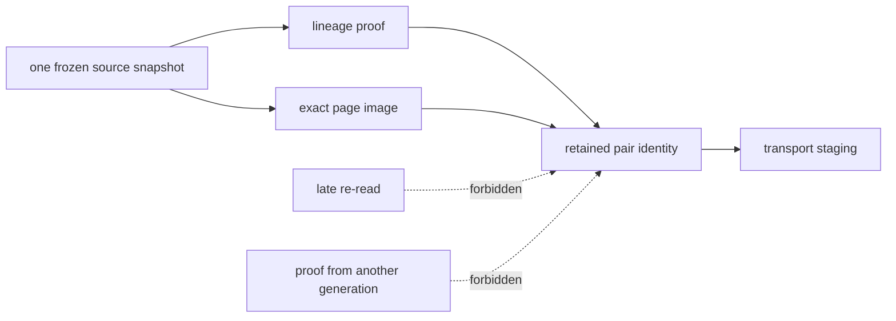
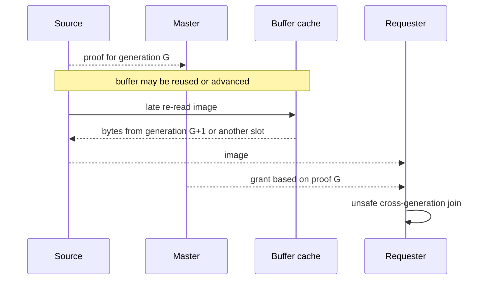
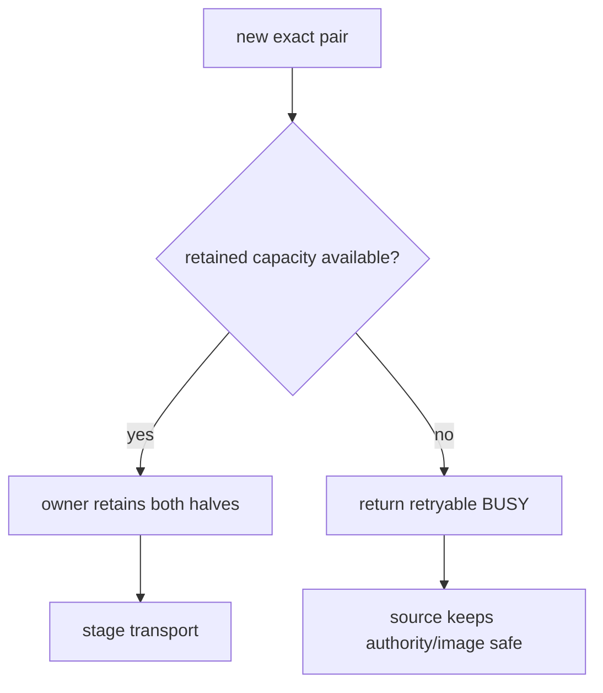
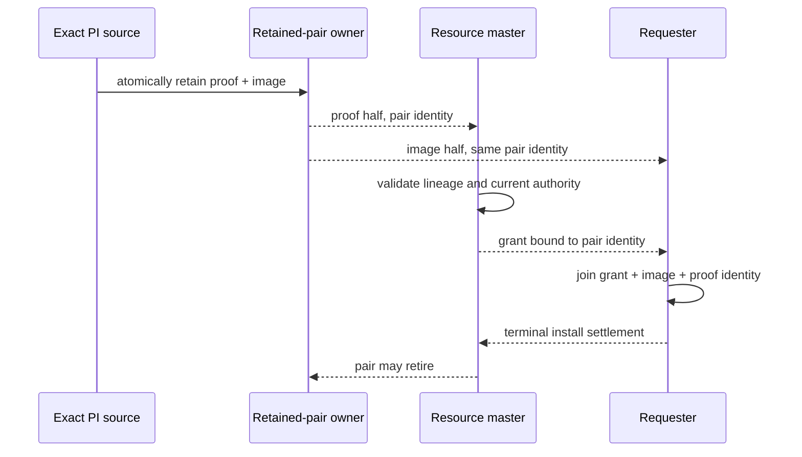
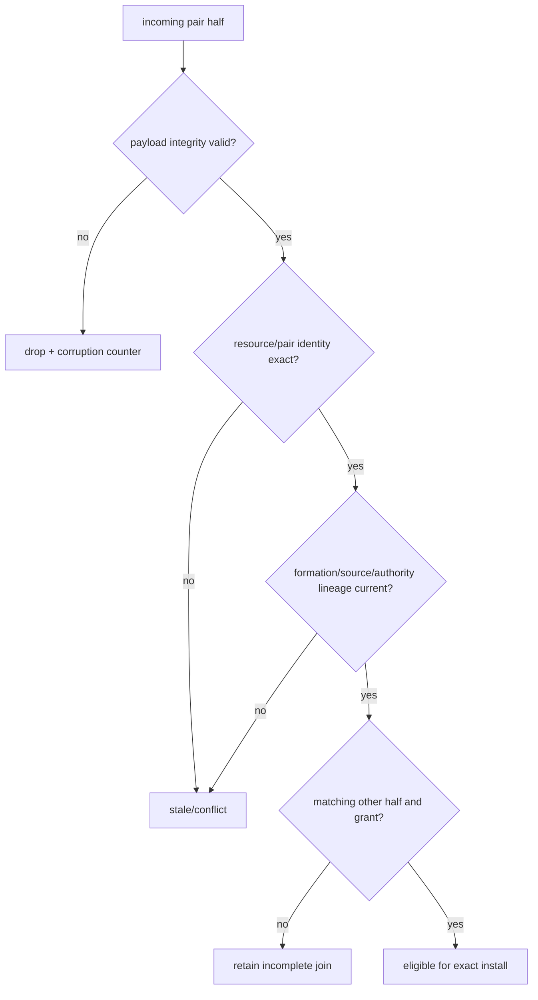

# 03：proof 与 image 的原子 retained pair

lineage certificate 说明“为什么这份 image 是候选”，image 本身提供“要安装的 exact bytes”。两者
必须共同存在。只发送 proof、之后临时重取页面，或者先发 image、之后重新构造 proof，都会打开
跨 generation 拼接窗口。

## 1. Pair 的基本模型

pair 需要满足：

- 同一个 resource identity；
- 同一个 source、formation 和 transition lineage；
- 同一个本地 image generation；
- 相容的 page version boundary；
- proof 中的内容 identity 与 image 的实际摘要一致；
- 两半在任何一半进入 transport 前都已被 retained owner 接管。

“原子”指语义所有权原子，不要求 proof 与 image 必须塞在同一个网络包里。它们可以经不同物理
消息到达、甚至乱序到达，但发送方在首包发出前已经冻结完整 pair，接收方只接受 exact join。

## 2. 为什么禁止临时重取 PI

即使 late re-read 得到相同 checksum，也不能证明它仍由同一 authority transition 保留。正确方案
是在 source 仍拥有原始上下文时一次性冻结 proof 与 image，之后只重发 immutable pair。

## 3. Retained pair 生命周期

```mermaid
stateDiagram-v2
    [*] --> EMPTY
    EMPTY --> CAPTURING: exact X->N+PI transition begins
    CAPTURING --> ARMED: proof + image frozen and joined
    CAPTURING --> EMPTY: capture/revalidation fails
    ARMED --> STAGED: transport accepts one physical copy
    ARMED --> ARMED: route busy / bounded owner full
    STAGED --> ARMED: physical send expires; same bytes rearmed
    STAGED --> DELIVERED: pair halves delivered exactly
    DELIVERED --> CONSUMED: master grant + requester exact install
    DELIVERED --> ARMED: retryable delivery loss
    ARMED --> RETIRED: lineage superseded or request cancelled
    DELIVERED --> RETIRED: master rejects stale pair
    CONSUMED --> RETIRED: terminal settlement
    RETIRED --> EMPTY: safe reclamation
```

关键所有权规则：

1. `CAPTURING` 期间 source 仍保持原 authority，失败可安全回退；
2. 只有完整 pair 才能进入 `ARMED`；没有“proof-only armed”或“image-only armed”；
3. transport slot 只拥有物理 copy，logical pair 义务仍由 retained owner 追踪；
4. ring full、route busy 或短暂断连不能清除 pair，也不能重新采样；
5. lineage 被取代后，pair 只能退休，不能改绑到新 request；
6. 只有 terminal settlement 或明确 stale/cancel 结论才能回收。

## 4. 有界 owner 与反压

retained pair 不能无限增长。实现应使用每个服务执行域内的小型有界 owner：

容量耗尽时返回 BUSY，而不是：

- 发送 proof 后丢弃 image；
- 只保留 image、不保留 certificate；
- 覆盖尚未 terminal 的旧 pair；
- 绕过 retained owner 直接借用 BufferDesc 指针；
- 把 BUSY 当成“对端已经收到”。

有界反压把内存消耗转换成可观察、可重试的等待，同时保持 source 的旧 authority/证据不丢失。

## 5. 两半如何路由与 join

概念上，proof 需要到达 resource master 供 authority 复核，image 需要到达 requester 供安装。物理
优化可以让 holder 直接把 image 发给 requester，但语义上仍是一对：

网络允许的乱序：

- image 先到：requester 只能保留，不能安装为可写；
- grant 先到：requester 只能保留，不能凭 grant 猜 image；
- duplicate：内容完全一致时幂等；
- 同 identity、不同内容：协议冲突并 fail closed；
- 只有一半最终到达：保持等待或超时回收，不产生写权限。

## 6. 内容完整性和 authority 完整性是两件事

checksum 只能发现内容损坏；它不能证明 source 被授权、master 没有变化或 pair 属于当前
acquisition。反过来，authority identity 正确也不能容忍 image checksum 失败。两类验证必须合取。

## 7. Source 崩溃时的处理

| 崩溃位置 | 可恢复事实 | 安全动作 |
|---|---|---|
| pair arm 前 | source 仍应保留旧 X/写栅栏上下文 | 正常重试或 recovery；不得假定已降级 |
| pair arm 后、X→N+PI 前 | 完整 pair 已保留，transition 未提交 | 取消/重放同一 transition，不能直接 grant |
| X→N+PI 后、发送前 | retained pair 是继续路径的唯一候选 | 由存续 owner 重发；owner 不可证明则 recovery |
| proof 已送、image 未送 | 完整 pair 仍必须存在 | 重发 exact image，不临时重取 |
| image 已送、proof 未送 | requester 不可写 | 重发 exact proof；超时则丢弃 requester staging |
| grant 后、安装前 | authority 可能已提交 | 保留 pair 和 grant，进入 exact retry/orphan 分类 |

“进程死亡”或“socket 断开”都不是释放 retained pair 的充分条件。系统必须根据 logical identity 与
terminal effect 做精确分类。
