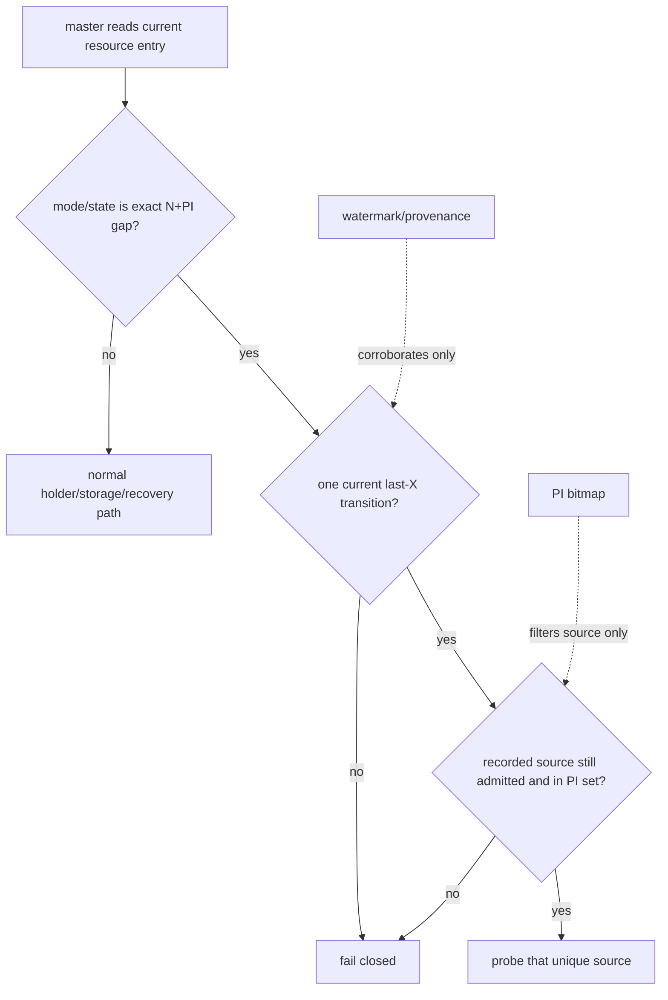
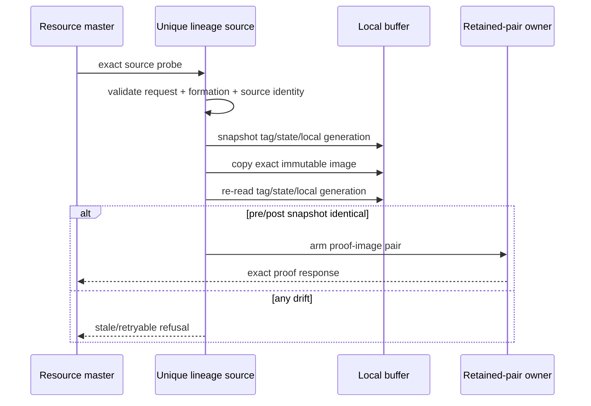
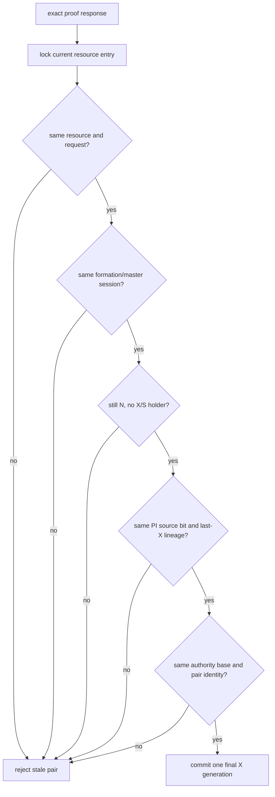
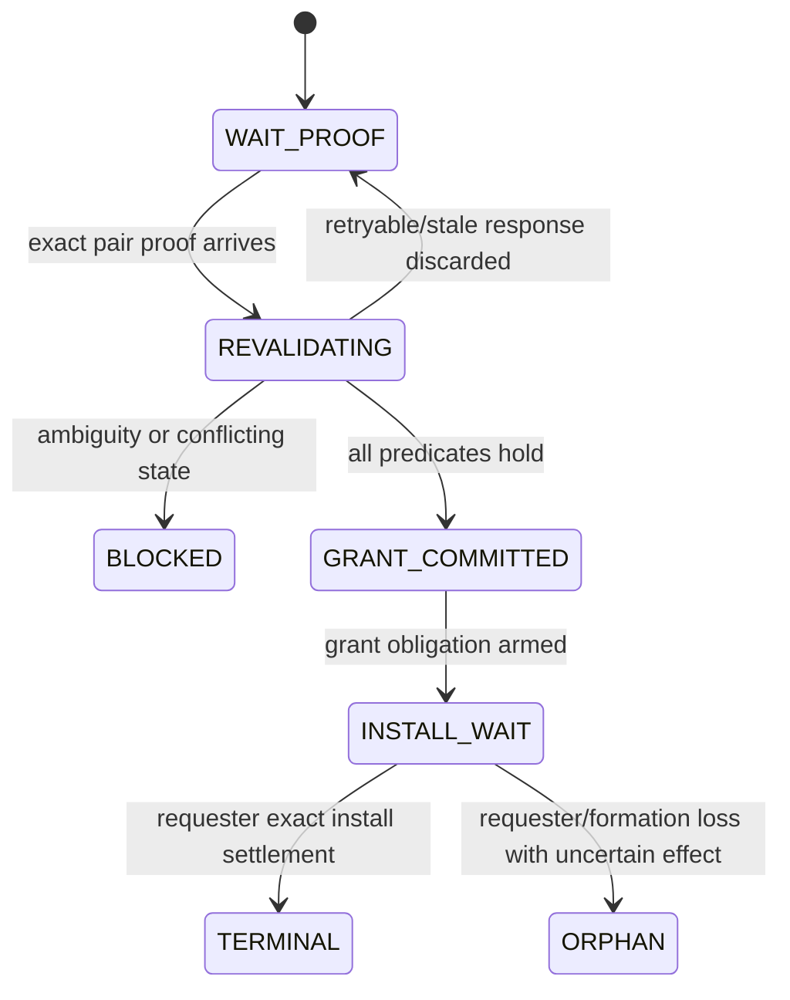
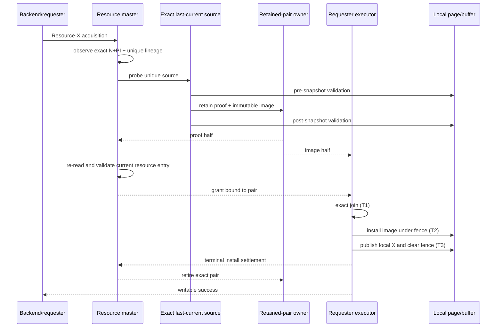

# 04：master 完整复核、唯一 X grant 与 requester 安装

retained pair 只是一个候选载体。resource master 必须在当前 authority 上重新证明它仍然有效，
然后才能提交唯一 X grant。requester 收到 grant 后，还必须完成本地 image 安装和写栅栏解除。

完整链路是：

```text
候选选择 → source 捕获 → pair 返回 → master 复核 → authority commit
        → requester exact join → image install → local X → writable terminal
```

任何中间结果都不能跳过后续阶段。

## 1. Master 不能从 PI bitmap 任意选节点

PI bitmap 的语义只是“这些节点可能持有 PI”。候选 source 必须由当前 resource lineage 中最后一次
X→N+PI transition 唯一导出：



禁止做法包括：

- 选择 PI bitmap 中 node id 最小或响应最快的节点；
- 选择 watermark 最大但没有 exact transition lineage 的节点；
- 多个候选并行返回后“取最大版本”；
- source 不响应时换另一个 PI 并沿用原 grant；
- 把 source 仍在 membership 中当成 image currentness 证明。

## 2. Source probe 的前后复核

source 需要在读取 image 前后验证本地对象没有漂移：



source-side 合取条件至少包括：

- BufferTag 与请求资源完全一致；
- buffer 仍处于 PI/不可写语义；
- image generation 前后相同；
- page version boundary 前后相同；
- source identity、formation 和 transition identity 与 certificate 一致；
- image 内容通过完整性校验；
- pair owner 已接管两半后，响应才可见。

如果 source 本地已有 current/X，说明 master 观察与 source 状态不一致，应重新走 holder
reconciliation，而不是把它伪装成 N+PI fast path。

## 3. Master 收到 proof 后必须重新读当前状态

probe 发出到响应返回之间，resource 可能 remaster、formation 可能变化、其他路径可能已经建立
current holder。master 不能依据 probe 前的快照提交 grant。



复核合取项：

1. resource identity 与请求一致；
2. requester acquisition 仍是 FIFO/current head；
3. formation、master session 和 admission 仍 current；
4. resource 仍为允许该窄分支的 N 状态；
5. X/S holder 集合仍为空；
6. exact source 仍是 PI holder；
7. last-X transition 仍是 lineage 末端；
8. authority base、source identity 和 pair identity 未变化；
9. proof 内容身份与 requester 将接收的 image 相同；
10. capability/route 仍允许 Resource-X target path。

## 4. Authority commit 的线性化点

所有复核通过后，master 在 resource-entry critical section 内一次性完成：

- 消耗当前 N+PI candidate；
- 为 FIFO head 提交新的唯一 X authority generation；
- 把 grant 绑定到 exact retained pair；
- 阻止同一 base 上第二个 requester 再次提交；
- arm 可重发的 grant obligation。



commit 后不能因网络 timeout 简单“撤回然后 grant 给别人”。如果 requester 是否已安装不确定，必须
保留 authority/pair，按 retry 或 orphan 规则处理。

## 5. Grant、proof、image 可以乱序，但不能缺省

```mermaid
stateDiagram-v2
    [*] --> WAIT_ALL
    WAIT_ALL --> HAVE_GRANT: grant first
    WAIT_ALL --> HAVE_IMAGE: image first
    HAVE_GRANT --> READY: matching image + pair identity
    HAVE_IMAGE --> READY: matching grant + pair identity
    READY --> T1: authority accepted
    T1 --> T2: exact image installed under closed write fence
    T2 --> T3: local X published; exact fence cleared
    T3 --> WRITABLE: wake local requesters

    HAVE_GRANT --> BLOCKED: conflicting image
    HAVE_IMAGE --> BLOCKED: conflicting grant
    READY --> BLOCKED: formation/authority drift
```



- grant 不携带或替代页面字节；
- image 不携带或替代全局 X authority；
- proof 说明两者为何可以 join，但不能自行开放写入口；
- T1 只表示 authority 已接受；
- T2 安装 exact bytes，并保持普通写栅栏关闭；
- T3 发布本地 X、解除 exact fence，之后 backend 才能修改页面。

## 6. 完整时序



## 7. 失败时不能留下 half-open

| 失败点 | 结果 |
|---|---|
| source probe 前 topology 已变 | 不发 probe，刷新 resource/master |
| source 快照前后漂移 | 不 arm pair，返回 retryable/stale |
| retained owner 满 | BUSY；source 不先丢 authority/image |
| proof 到达但 master 状态漂移 | 整对 stale，零 grant mutation |
| grant 到达但 image 缺失 | requester 等待/超时，不开放写 |
| image 到达但 grant 缺失 | requester 只保留 staging，不开放写 |
| T2 失败 | 写栅栏保持关闭，pair/authority 进入精确恢复 |
| T3 前进程退出 | 不把“可能安装”猜成成功或失败，保留 terminal 分类 |
| formation 变化 | freeze acquisition/activation，按旧轮次 sweep |

最终不变量是：任何时刻要么存在一个可证明的 writable X owner，要么系统明确不可写；不存在“没有
证据但为了活性暂时放行”的中间态。
