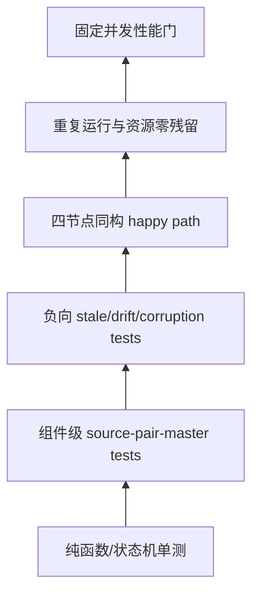
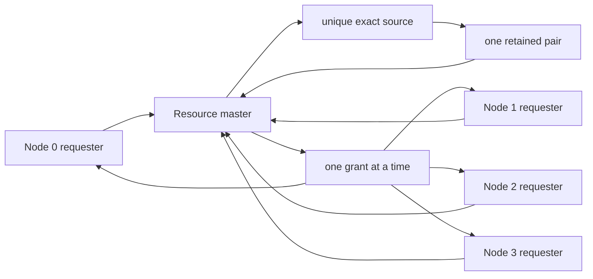
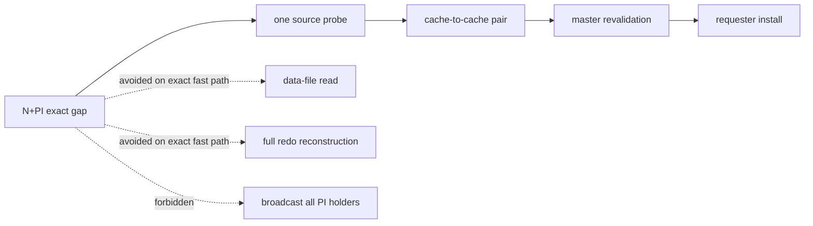
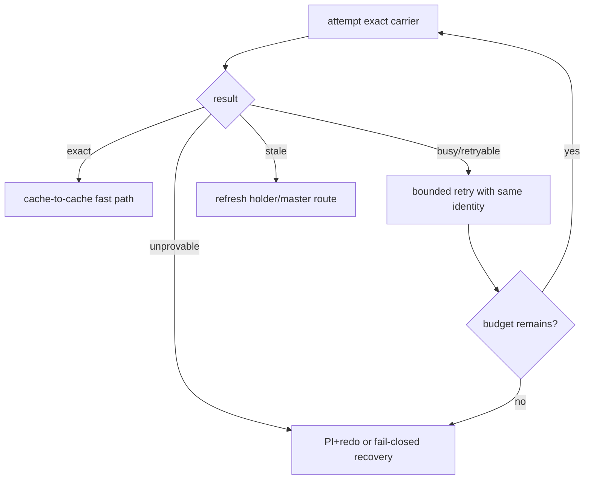

# 05：故障矩阵、验证、可观测性与性能

last-current carrier 的价值是避免在一个极窄、可精确证明的 N+PI 场景中不必要地回盘或做完整
redo reconstruction；它的第一目标仍是正确性。任何性能收益都必须建立在 lineage、pair 与 grant
三层证明全部成立之后。

## 1. 故障矩阵

| 故障/漂移 | 检测点 | 必须保留 | 安全结果 |
|---|---|---|---|
| PI bitmap 有节点但无 lineage | master candidate selection | 当前 resource 状态 | fail closed；不 probe 任意 PI |
| watermark 存在但 transition 不精确 | master lineage validation | diagnostics | watermark 仅用于诊断 |
| source 已退出当前 membership | probe 前/响应后复核 | retained recovery evidence | stale；进入 holder repair/recovery |
| source incarnation/session 变化 | source/master identity check | exact old pair | 拒绝旧响应，不改绑 |
| formation/remaster 变化 | master revalidation | pair + old authority | freeze/sweep；不跨轮 grant |
| BufferTag 或 local generation 漂移 | source pre/post snapshot | 原有安全状态 | 不 arm pair |
| page version/content identity 冲突 | pair join | 冲突双方用于诊断 | protocol conflict，fail closed |
| retained owner 满 | pair arm | source authority/image | BUSY + bounded retry |
| proof 发送成功、image 丢失 | requester join | 完整 retained pair | 重发同一 image；不可临时重取 |
| image 发送成功、proof 丢失 | master/requester join | 完整 retained pair | 重发同一 proof；requester 不可写 |
| proof duplicate 相同 | master dedup | 一个 logical pair | 幂等 replay |
| 同 identity、不同 proof/image | ingress/join | 冲突证据 | corruption/protocol mismatch |
| grant 前 resource 出现 holder | master revalidation | current holder state | 返回正常 holder path |
| grant 后 requester 超时 | terminal classification | grant + pair + request identity | retry/orphan；不得二次 grant |
| image install 失败 | T2 | 写栅栏、pair、authority | recovery blocked |
| T3 前 executor 退出 | terminal observer | exact install/authority state | 精确恢复，不能猜测 |

## 2. 验证金字塔

### 2.1 单元与组件验证

- PI bitmap 不能直接选 source；
- 多个 lineage 候选必须拒绝；
- exact transition 能唯一导出 source；
- source pre/post generation 漂移不产生 pair；
- proof/image identity mismatch 不 join；
- master revalidation 任一谓词失败都不推进 authority generation；
- duplicate exact pair 幂等，不产生第二个 grant；
- retained capacity 用尽返回 BUSY，不留下 half pair；
- T1/T2/T3 不能乱序开放写栅栏。

### 2.2 四节点验证

四节点 hot-block 场景至少需要证明：

1. 多个 requester 仍由一个 resource master 串行化；
2. 正常 current-holder transfer 继续优先，不被 N+PI 分支劫持；
3. 只有构造出的 exact N+PI gap 进入 last-current carrier；
4. candidate source 唯一，其他 PI 即使响应更快也不会被选择；
5. remote install 的 image 与 grant 属于同一 acquisition；
6. 每个成功事务都观察到唯一 X，最终数据精确守恒；
7. 所有 queue、pair、wait edge、grant 与 local fence 最终归零；
8. 日志中没有 FATAL/PANIC、owner-plane violation 或 silent fallback。

## 3. 必须可观察，但观测值不是 authority

推荐公开语义级指标：

| 指标族 | 说明 |
|---|---|
| N+PI candidate | master 观察到窄状态的次数 |
| lineage exact/missing/conflict | candidate 是否有唯一 last-X 血缘 |
| pair capture/arm/busy | source 是否成功冻结完整 pair |
| pre/post drift | source 本地快照为何拒绝 |
| master revalidation reject | formation、holder、authority 或 pair 哪一类漂移 |
| pair replay/conflict | duplicate 幂等与同 identity 内容冲突 |
| grant committed | exact carrier 最终提交的次数 |
| install terminal/blocked | requester T3 成功或 fail-closed 次数 |
| retained live/high-water | retained owner 当前和峰值占用 |
| recovery fallback | 无法证明时进入 holder repair/PI+redo 的次数 |

这些计数用于诊断和容量规划，不能反向成为 grant 条件。例如“某 source 成功过很多次”不等于这次
也是 current；“lineage exact counter 增加”也不替代当前 resource-entry 复核。

## 4. 性能模型

### 4.1 快路径成本

成功的 exact last-current carrier 路径增加：

- 一次唯一 source probe；
- 一次 source 本地 pre/post snapshot 校验；
- proof 与 image 的 retained ownership；
- master 返回后的完整 revalidation；
- requester 的 grant/image exact join。

它避免的是：

- 因无法路由 current holder而立即回读 data file；
- 对已知 exact bytes 进行不必要的完整 PI+redo reconstruction；
- 多 PI 广播搜索；
- 选择错误 PI 后造成的重试、lost-write 风险和恢复放大。

### 4.2 为什么不会把普通路径拖慢

- 正常 current holder 存在时不进入本分支；
- source 由 exact lineage 唯一定位，不扫描所有 PI；
- retained owner 有界，满时快速 BUSY，不做无界分配；
- watermark/provenance 只做已有状态上的复核，不建立新的全局目录；
- proof/image 可以沿现有 Resource-X carrier 与 install 框架传递；
- 不引入 data-file I/O 作为 fast-path 前置条件。

### 4.3 最坏情况边界

证据不足时性能可能退化到 recovery，但不能退化为错误成功：

不得在证据不足时反复联网遍历 PI，形成无界重试风暴。

## 5. Oracle 对照

| 主题 | Oracle 官方公开行为 | PGRAC last-current carrier | 结论 |
|---|---|---|---|
| 全局协调 | GCS/GRD 跟踪资源状态并协调请求 | resource master 提交唯一 grant | 外部职责对齐 |
| 写权限 | 集群中同一块仅一个 XCUR；修改需要 XCUR | N/PI 永不直接可写，T3 后才开放 | 安全目标对齐 |
| 正常传输 | last modifier/current holder 经 Cache Fusion 发送 current | 正常 holder path 继续优先 | 行为对齐 |
| PI | dirty transfer 后保留过去镜像；用于写协议/恢复 | PI membership 只是候选信息 | 语义对齐 |
| 无 current holder | Oracle 公开资料强调 most-recent holder 或 recovery/redo | exact last-X certificate 可走窄 fast path | PGRAC 自研适配 |
| 具体证书/wire | 未公开 | lineage certificate + retained pair | 不归因于 Oracle |
| 失败语义 | recovery/reconfiguration 期间相关请求受控 | 任一漂移 fail closed | 目标一致，算法自研 |

## 6. 完成判据

该设计只有同时满足以下条件，才可以宣称闭环：

- 代码只在 exact N+PI gap 触发；
- lineage 由最后 X→N+PI transition 原子产生并可验证；
- proof 与 image 在首个发送动作前已完整 retained；
- master grant 前后不接受跨 formation、跨 generation 或跨 source 拼接；
- requester 只有完成 exact T1/T2/T3 才可写；
- 所有负向场景 fail closed，且不修改成功判官；
- 四节点事务数据守恒、进程无错误、终态资源全部排空；
- 固定负载下，新增 fast path 没有把普通 current-holder transfer 变成额外磁盘路径。

如果只能做到“测试继续前进”，但留下 pair、grant、wait edge 或 local X 残留，就不算完成。
