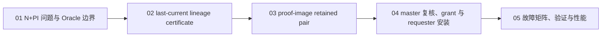
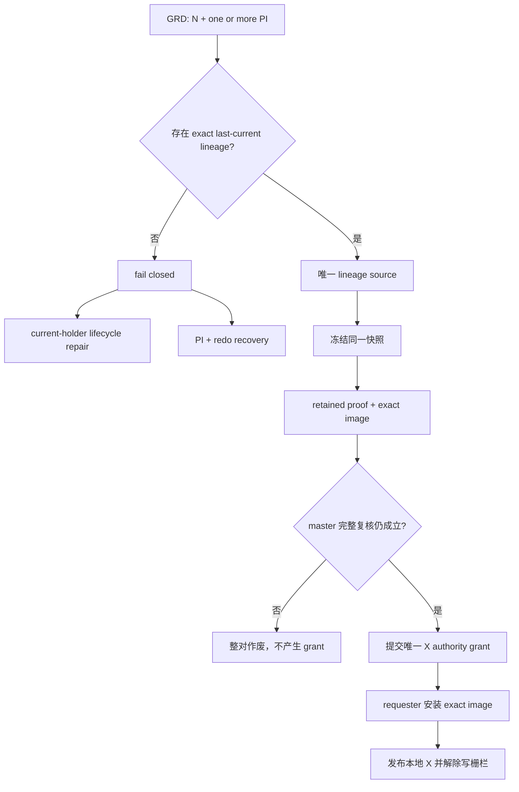

# Resource-X Last-Current Carrier：从 N+PI 到唯一可写 X

在多实例共享块协议中，`N + PI` 是一个容易被误读的状态：某个节点仍保存
past image（PI），但全局资源目录没有可直接使用的 current holder。PI 说明“这里曾经有过
一个相关版本”，却不自动说明“这里保存的就是最后 current bytes”，更不赋予修改权限。

本专题解释 PGRAC 如何处理这类窄场景：只有当某个 PI 能被证明是**最后一次
`X -> N+PI` 转换的直接产物**，并且证明与页面镜像从同一冻结快照原子保留时，才允许它作为
last-current carrier 参与新的 Resource-X 获取。否则系统继续 fail closed，返回
current-holder 修复或 PI+redo 恢复路径。

> 这不是“任选一个 PI 晋升为 current”，也不是对 Oracle 内部算法的逆向声明。
> 它是保持 Oracle RAC 公开安全语义的一项 PGRAC 自研适配。

## 阅读顺序

- [01：N+PI 问题、Oracle 公开行为与设计边界](01-n-plus-pi-and-oracle-boundary.md)
- [02：最后 current 血缘证书](02-last-current-lineage-certificate.md)
- [03：proof 与 image 的原子 retained pair](03-atomic-proof-image-pair.md)
- [04：master 完整复核、唯一 X grant 与 requester 安装](04-master-revalidation-and-grant.md)
- [05：故障矩阵、验证、可观测性与性能](05-failure-matrix-validation-and-performance.md)

## 一张图看完整路径

## 五条核心不变量

1. **N 不可写。** `N` 模式和 PI 存在都不能单独产生修改权限。
2. **PI 位图不是版本目录。** 它只能表示候选节点集合，不能证明哪个候选保存最后 current。
3. **lineage 必须来自最后转换。** 可授权证据必须与最后一次 `X -> N+PI` 原子产生，而不是事后从历史 watermark 猜测。
4. **proof 与 image 不可拆分。** 两者必须来自同一冻结快照；缺一、漂移或冲突都整对作废。
5. **grant 之后仍不可立即写。** requester 完成 exact image 安装、本地 X 发布和写栅栏解除后，才成为唯一可写 holder。

## 与 Resource-X 主文档的关系

本专题是 [Resource-X 总体架构](../resource-x/README.md) 中 proof carrier 与
grant/image join 的一个窄分支。逻辑请求身份、FIFO、T1/T2/T3、formation freeze、旧路径退役等
通用机制仍以主文档为准；本专题只回答：**没有显式 current holder、只看到 N+PI 时，什么证据
足以继续，什么证据必须拒绝？**

## 证据标签

| 标签 | 含义 |
|---|---|
| **Oracle 已验证** | Oracle 官方资料明确描述了该角色或外部行为。 |
| **Oracle 未公开** | 官方资料没有披露内部字段、消息和具体选择算法；不等于 Oracle 不存在相应机制。 |
| **PGRAC 自研适配** | 为 PostgreSQL buffer、Resource-X 与 fail-closed 语义设计的机制。 |
| **禁止推断** | 该事实只能辅助诊断，不能单独授权 current/X。 |

## 非目标

- 不把所有 PI 建成一个通用版本目录；
- 不从 PI 位图任选 holder；
- 不把普通历史 watermark 提升为写 authority；
- 不改变 Oracle、PostgreSQL 或 PGRAC 已公开的页面格式；
- 不声称 Oracle 使用相同的 certificate、pair owner、generation 或 wire protocol；
- 不用本路径替代实例恢复、redo apply 或损坏页面修复。
