# Resource-X 请求代际：让重试、重连和恢复始终指向同一次获取

> 状态：公开架构概念说明。本文描述目标语义和故障边界，不表示所有路径均已完成生产接线。

Resource-X 负责把一次“我要获得某个共享数据块的独占写权限”安全地推进为本地可写状态。
这条链路可能跨越多个 PostgreSQL backend、资源主控节点、当前块持有者、网络重传、连接重建
以及成员变化。只要其中任意一环把旧请求和新请求混在一起，就可能出现两类严重问题：

- 旧授权、旧页面或旧完成消息被新请求误收；
- 一个已经结束的请求错误清除了后继请求仍在使用的本地写保护。

为避免这种混淆，PGRAC 在公开架构模型中把一次 Resource-X acquisition 绑定到一个不可分裂的
**请求代际**，本文把它记作 `G`：

```text
一次 acquisition episode = 一个固定的 G
重试、重传和重连       = 继续使用原来的 G
真正的后继 acquisition = 使用新的 G
```

`G` 是 PGRAC 为 PostgreSQL buffer、进程和 interconnect 生命周期设计的自研适配。Oracle RAC
公开资料描述了资源 master、转换队列、blocking/acquisition 通知以及 Cache Fusion 当前块传输，
但没有披露 Oracle 内部是否存在等价字段、如何编号或怎样编码报文。因此本文只比较公开行为，
不把 PGRAC 的 generation 模型归因于 Oracle 私有实现。

> 本文是公开概念说明。它不定义内部 wire ABI、字段偏移、私有状态结构或未发布的实现合同。
> 完整 Resource-X 阅读路线见
> [Resource-X：从逻辑资源到可写 X 的完整链路](../resource-x/README.md)。

## 1. 一张图理解请求代际

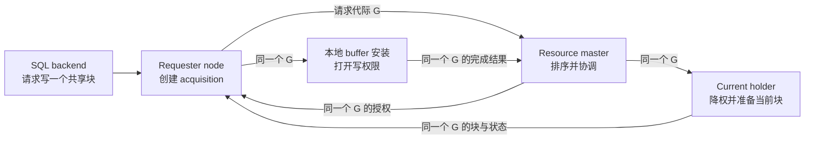

图中每个箭头承载的物理消息可能重发多次，也可能经过新连接再次发送，但它们仍属于同一个
logical acquisition。`G` 的作用就是让每个参与者回答：

> 我现在处理的是不是同一个请求过程，而不是“看起来像同一个块”的另一次请求？

## 2. 为什么资源标识本身还不够

设节点 1 连续两次更新同一个数据块：

```text
第一次：UPDATE A，获取块 B 的 X，提交并释放
第二次：UPDATE C，再次获取同一个块 B 的 X
```

两次操作拥有相同的块标识和 requester node，却不是同一次 acquisition。网络中的第一次授权、
页面传输或完成消息如果迟到，不能被第二次请求采用。

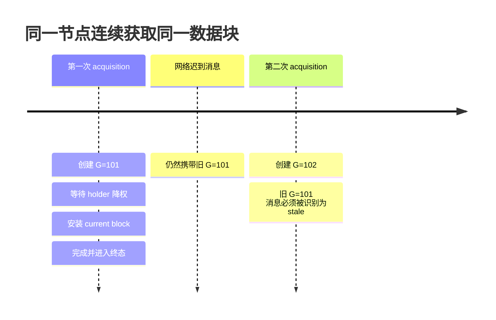

因此需要同时区分“资源是谁”和“这是第几次获取”。

## 3. 五层身份各自解决什么问题

Resource-X 的公开概念模型将相关信息分成五层：

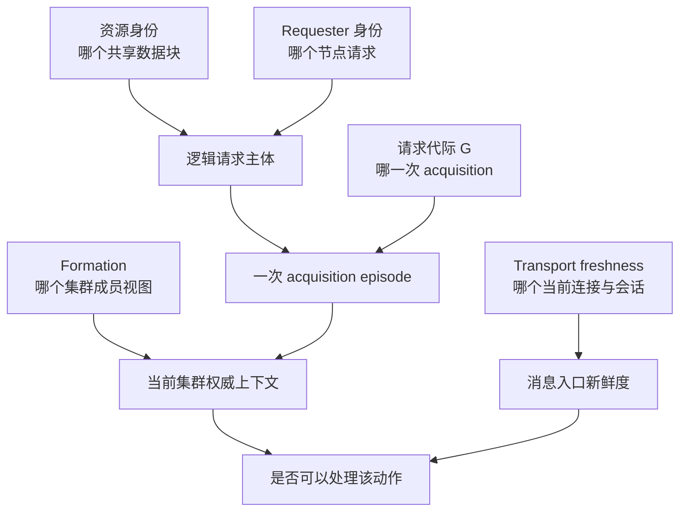

| 层次 | 回答的问题 | 变化时意味着什么 |
|---|---|---|
| 资源身份 | 操作的是哪个数据块 | 资源不同，当然是不同请求 |
| requester node | 哪个节点希望成为写者 | requester 不同，是不同 claimant |
| 请求代际 `G` | 这是该 requester 的哪一次获取 | `G` 不同，是 predecessor/successor 或 stale |
| formation | 当前认可哪些成员和 authority | formation 不同，不能跨代继承授权 |
| transport freshness | 消息来自哪个当前连接/会话 | 可随重连变化，但不能创造新请求 |

这五层不能互相替代：

- 不能用连接编号当请求身份，因为 reconnect 会换连接；
- 不能只用块标识，因为同一节点会连续获取同一块；
- 不能只用 formation，因为一个 formation 中会发生大量 acquisition；
- 不能用事务 ID 或 backend ID 当全局资源 authority，因为本地进程可能退出、复用或由共享 actor
  接续进度。

## 4. 一个 `G` 的完整生命周期

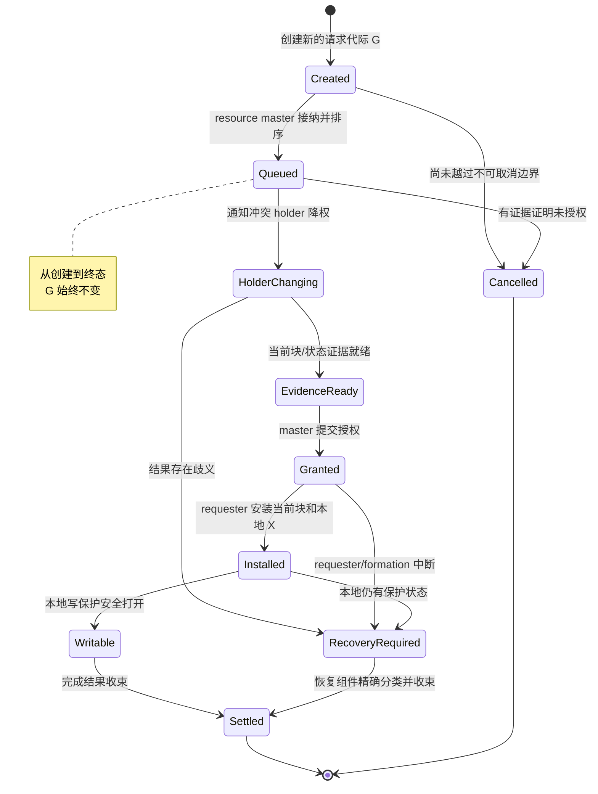

关键规则只有三条：

1. **一次过程不换 `G`。** 队列等待、holder 降权、页面传输、授权、本地安装和完成都属于原代际。
2. **重发不换 `G`。** 网络重试只是再次传递同一逻辑动作。
3. **后继必须换 `G`。** 前一个过程结束后，再次获取同一块属于新的 acquisition。

## 5. 正常获取为何需要“授权 + 当前块 + 本地写门”

Resource master 说“你可以获得 X”并不等于 PostgreSQL backend 已经可以立刻修改 BufferDesc
中的页面。requester 还需要确认收到的 current block 属于同一 acquisition，并把它安全地安装到
本地 buffer，最后才打开普通写入口。

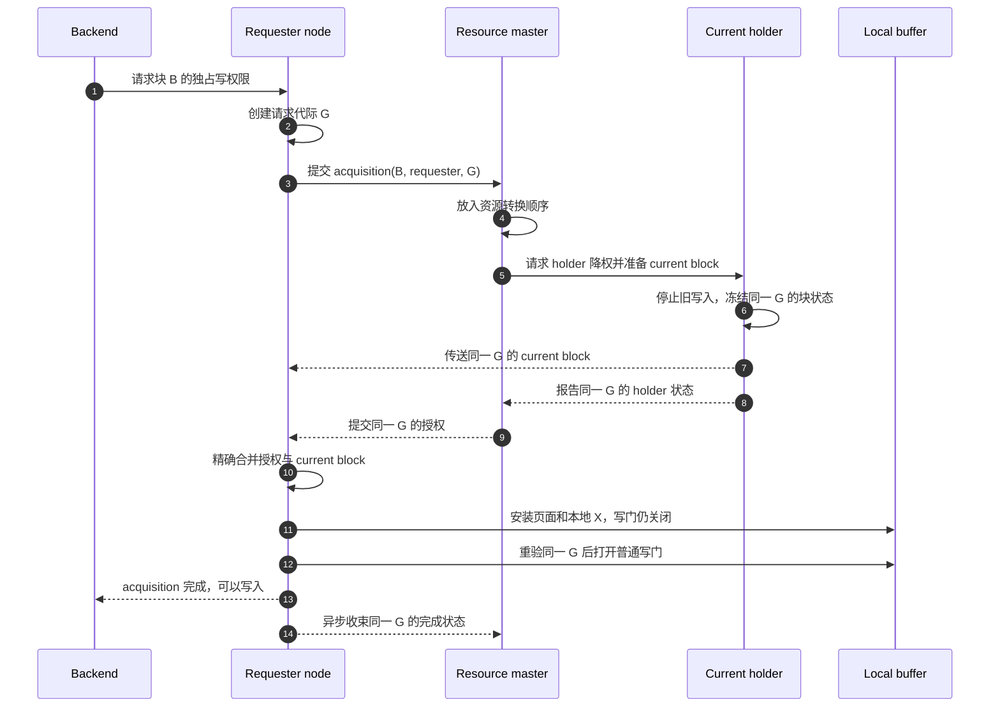

如果授权与页面来自不同 `G`，即使它们指向同一个块，也不能拼在一起。这样可以防止：

- 新授权采用旧页面；
- 旧授权打开后继请求的本地写门；
- 页面已安装但 authority 尚未成立时提前写入；
- 一个迟到的完成动作清理正在运行的 successor。

## 6. Duplicate、retry、reconnect 与 successor

这些词经常被混为一谈，但 generation 规则完全不同。

| 场景 | `G` 是否变化 | 正确行为 |
|---|---|---|
| 同一物理消息重复到达 | 不变 | 幂等识别，不重复建立资源债务 |
| outbound ring 暂时满后重试 | 不变 | 保留 logical intent，稍后再次发送 |
| TCP/RDMA 连接重建 | 不变 | 更新 transport freshness，继续原 acquisition |
| requester backend 退出但共享请求仍存在 | 不变 | 本地 waiter 脱离，共享 actor 继续推进或恢复 |
| master 尚未授权且请求被明确取消 | 原 `G` 进入终态 | 后续真正重试需创建新 `G` |
| 同节点再次获取同一块 | 变化 | 创建 successor generation |
| formation 改变 | 旧 `G` 不重写 | 冻结、分类、终结或恢复；新请求用新上下文 |

### 6.1 重连：连接变化，请求不变

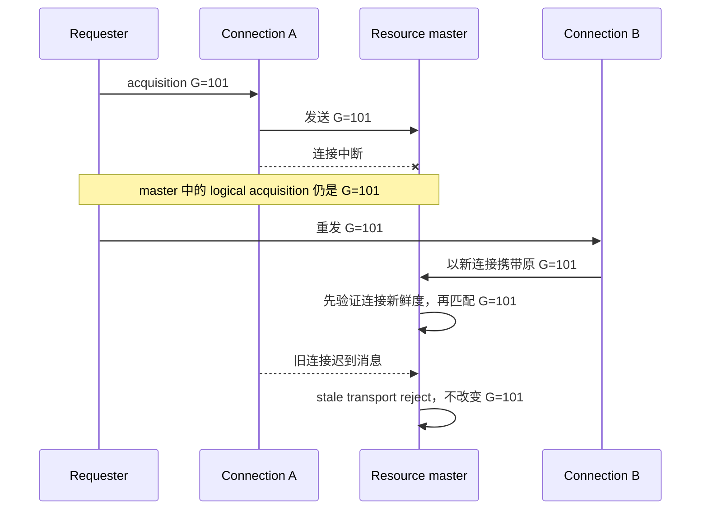

若 reconnect 创建新 `G`，master 会把同一逻辑操作看作两个 claimant；若完全忽略 transport
freshness，旧连接上的迟到消息又可能污染当前状态。正确做法是让两类信息独立：连接可以换，
请求代际不换。

### 6.2 Successor：资源相同，请求代际变化

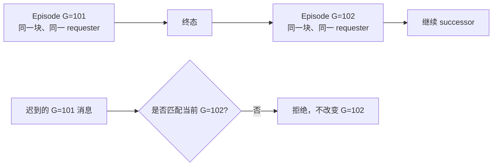

`G` 不能在可用数值空间耗尽后悄悄回绕，因为回绕会让非常旧的消息重新看起来像当前请求。
如果实现不能安全地产生新的 generation，正确结果是停止该路径并进入恢复，而不是复用旧值。

## 7. 本地 backend 合并与请求代际

同一节点上的多个 backend 可能同时需要同一个块。Resource-X 可以把它们合并到一个 cluster
acquisition，但仍保留每个 backend 的本地 pin、lock、transaction 和取消语义。

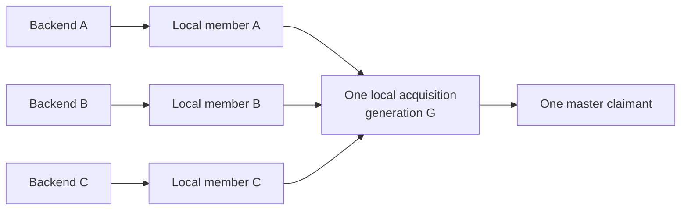

这意味着：

- follower 取消，只能移除自己的本地等待，不能取消其他 member 的 acquisition；
- leader backend 退出后，共享状态可以继续代表相同 `G` 推进；
- master 看到的是节点级 acquisition，而不是每个 backend 一份全局 claimant；
- 当最后一个本地 member 在安全取消边界前退出时，才可能取消该 episode；
- 一旦 authority 可能已经提交，就必须完成或恢复，不能用 timeout 假装它从未发生。

## 8. Formation 改变时为什么不能“原地换代”

成员变化可能同时改变 resource master、current holder 和消息路由。系统不能简单把旧请求的
formation 标签改成新值后继续，因为旧 master 是否授权、旧 holder 是否降权、本地页面是否已经
安装都可能未知。

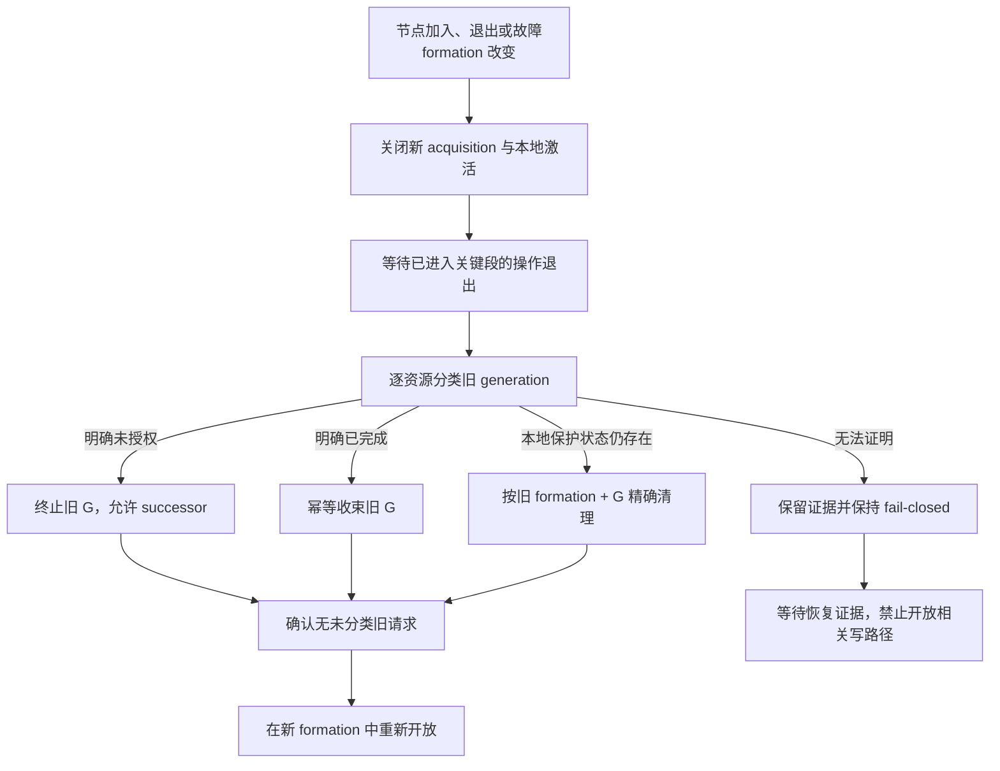

这里最重要的不是扫描速度，而是**精确性**：恢复动作必须同时确认资源、requester、旧 formation
和请求代际。只按资源或节点批量清理，可能误伤已经属于新 formation 的 successor。

## 9. Fail-closed 决策树

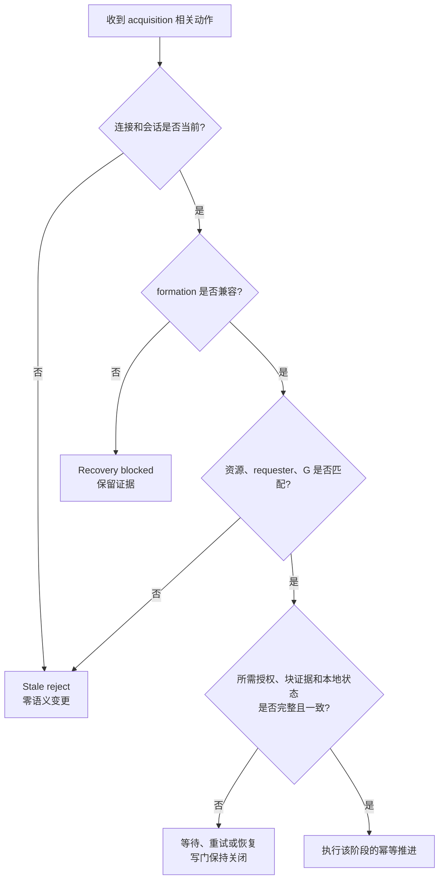

在以下情况下，Resource-X 不应“猜一个最可能成功的结果”：

- generation 缺失、损坏或与当前 episode 不同；
- current block 与授权属于不同请求；
- formation 或 resource master 上下文已变化；
- 本地 buffer 已绑定另一个 acquisition；
- 无法证明旧 holder 已停止写入；
- 无法判断请求是否越过不可取消边界；
- recovery 扫描尚未覆盖全部旧状态。

Fail closed 的含义是保持相关写入口关闭并保存足够证据供恢复继续判断，而不是把未知状态转换成
“失败且什么都没发生”。

## 10. 操作者能看到什么

请求 generation 本身是协议关联概念，运维更关心它体现出的行为：

| 现象 | 正常解释 | 需要关注的信号 |
|---|---|---|
| 同一资源请求出现多次网络发送 | 可能是同一 `G` 的重传 | 重发长期不收敛、持续 route/session 变化 |
| 连接重建后请求继续 | logical acquisition 未丢失 | 旧连接消息被错误接受或产生第二 claimant |
| master grant 后仍短暂不可写 | requester 正在安装块并重验本地写门 | 页面/授权长期无法 join，或本地 gate 一直关闭 |
| formation 改变时相关写请求暂停 | 系统正在冻结和分类旧 generation | 未分类残留长期存在、反复 recovery-blocked |
| 相同资源紧随出现下一请求 | 正常 successor 使用新 generation | successor 被旧完成消息清理或被旧页面授权 |

观察指标应回答“请求卡在哪个阶段、是 retry 还是 successor、为什么 fail closed”，但计数器不能
替代资源状态本身。把 counter 清零也不能证明旧 acquisition 已安全消失。

## 11. 与 Oracle RAC 公开行为的关系

### 11.1 对齐的外部职责

Oracle 官方资料公开描述：

- GCS/GES 与 Global Resource Directory 维护跨实例资源信息；
- 资源由 master 协调，请求可处于 granted/convert 等队列角色；
- 冲突 holder 可接收 blocking notification；
- requester 在条件满足后获得 acquisition/completion notification；
- Cache Fusion 可以把 current block 直接从一个实例传到另一个实例；
- 实例变化后的恢复会重建资源角色，并在恢复期间限制相关新工作。

PGRAC Resource-X 的 requester、resource master、current holder、本地块安装与 formation freeze
遵循这些公开角色和安全顺序。

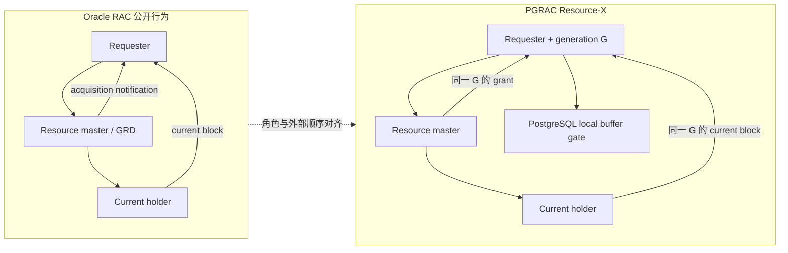

### 11.2 不能声称相同的内部机制

Oracle 公开资料没有说明：

- 内部 request identity 由哪些字段组成；
- 是否存在等价于 PGRAC `G` 的对象；
- generation 如何分配、持久化、回收或处理耗尽；
- 私有 interconnect 报文布局和校验规则；
- grant 与 current block 在 Oracle 内部如何精确关联；
- local buffer write gate 的字段、锁序或回调；
- reconfiguration 内部如何扫描和分类未完成 acquisition。

因此准确说法是：

> PGRAC 用单一请求代际 `G` 实现与 Oracle RAC 公开资源协调行为一致的 episode 关联；具体
> generation、PostgreSQL buffer gate 和恢复分类属于 PGRAC 自研适配。

而不是：

> Oracle RAC 也使用相同的 generation 字段或算法。

## 12. 常见问题

### `G` 是事务 ID 吗？

不是。事务与 backend 是本地执行主体；一个节点已经获得的块 authority 可能被多个本地操作
复用，事务 ID 也可能在很长时间后复用。`G` 标识的是一次资源获取过程。

### `G` 是连接编号吗？

不是。连接可以在 acquisition 期间重建。新连接需要通过 freshness 校验，但仍可继续原 `G`。

### `G` 是资源版本吗？

不是。资源 authority 会随 holder、master 和状态转换演进；请求 generation 标识的是 claimant
episode。两者需要一起验证，但不能互相代替。

### 收到 master grant 后为何不能立即写？

因为 PostgreSQL 本地还必须拥有与该 acquisition 对应的 current block，并在 buffer 锁保护下
确认本地写门可以打开。grant、page 和 local gate 三者缺一不可。

### 为什么 timeout 不能总是取消请求？

如果 master 可能已经提交 authority，单方面把 requester 标记为“从未发生”会制造分裂。此时
只能继续完成，或者保留证据交给恢复组件。

### Formation 变化后能否沿用原 `G` 继续写？

不能直接沿用写 authority。旧 `G` 必须在旧 formation 上被精确分类和收束；新 formation 只有
在没有未分类旧状态后才能重新开放相关资源。

### 一个请求能否同时拥有两个 `G`？

不能。多个物理副本、多个 retry actor 或多个本地 waiter 可以共同服务一个 acquisition，但它们
都必须指向同一逻辑 generation。出现两个 generation 意味着两个不同 episode。

## 13. 阅读路线

- 想先理解 Resource-X 全貌：
  [总体架构与资源模型](../resource-x/01-architecture-and-resource-model.md)
- 想理解资源身份、attempt 与 transport：
  [身份、attempt 与 transport freshness](../resource-x/02-identity-attempt-and-transport.md)
- 想理解 retry、本地 buffer 安装和写门：
  [有界重试、执行器与本地写栅栏](../resource-x/04-retry-terminal-and-executor.md)
- 想理解 formation 变化和旧请求清理：
  [Reconfiguration sweep 与零残留](../resource-x/06-reconfiguration-sweep-and-zero-residual.md)
- 想看完整 Oracle/PGRAC 边界：
  [Oracle RAC 行为对照](../resource-x/08-oracle-rac-comparison-and-boundaries.md)

## 14. Oracle 官方资料

- [Introduction to Oracle RAC：GCS、GES、GRD 与 Cache Fusion](https://docs.oracle.com/en/database/oracle/oracle-database/26/racad/introduction-to-oracle-rac.html)
- [Cache Fusion and the Global Cache Service](https://docs.oracle.com/cd/A91034_01/DOC/rac.901/a89867/pslkgdtl.htm)
- [Distributed Lock Manager：resource master 与 blocking/acquisition AST](https://docs.oracle.com/cd/A57673_01/DOC/server/doc/SPS73/chap8.htm)
- [`V$GES_ENQUEUE`：requested/granted level、queue 与 owner node](https://docs.oracle.com/en/database/oracle/oracle-database/23/refrn/V-GES_ENQUEUE.html)

[返回 Architecture overview](../overview.md) ·
[继续阅读 Resource-X 系列](../resource-x/README.md)
