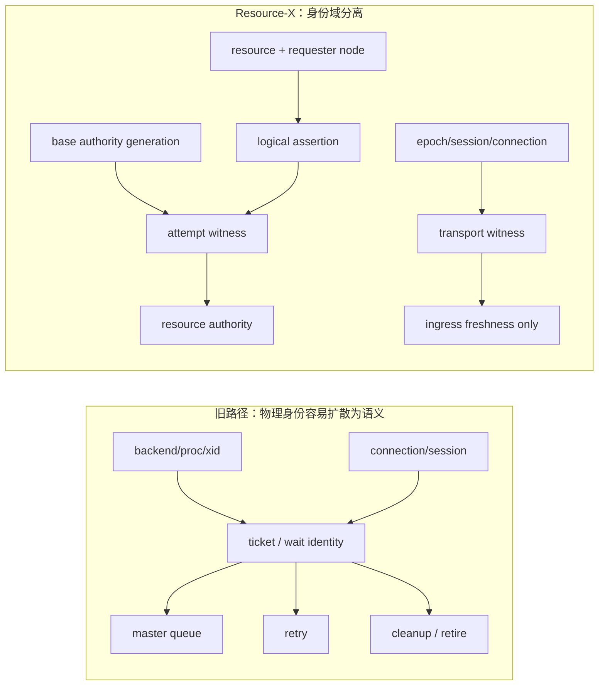
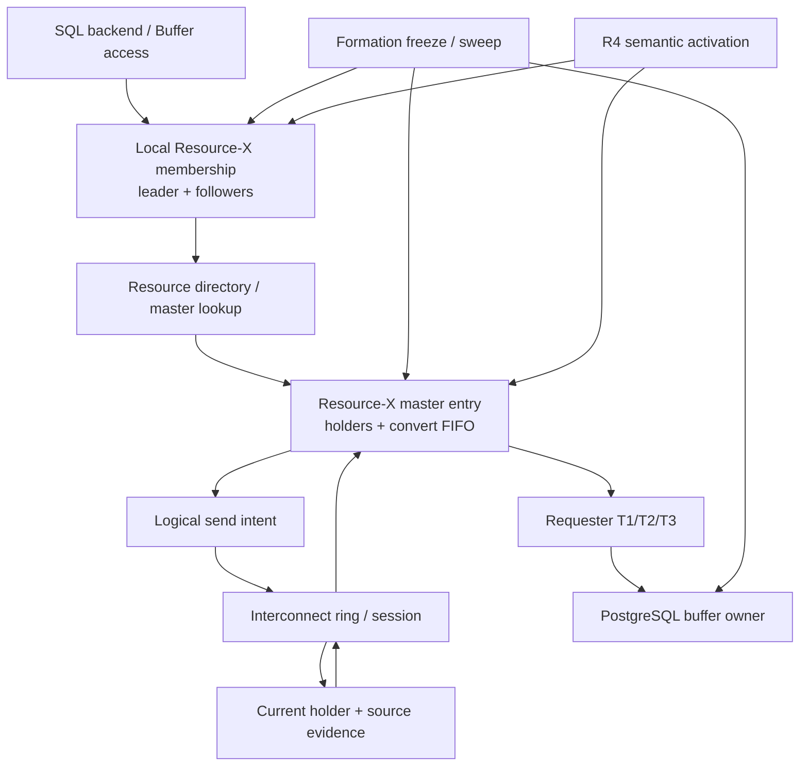
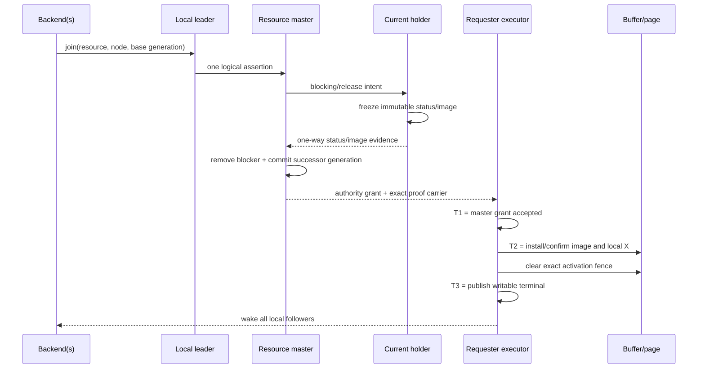
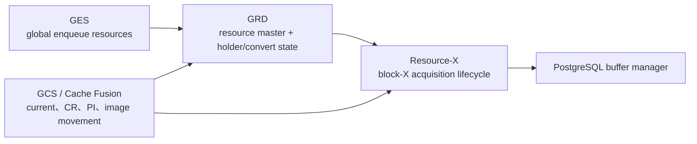

# 01：总体架构、资源模型与权威边界

Resource-X 的核心变化，是把“请求是从哪个 backend、哪条连接、哪张临时 ticket 发出来的”降级为本地或传输细节，把“哪个节点正在为哪个数据块申请哪一代 X 权威”提升为唯一的集群级语义。

## 1. Resource-X 解决什么问题

旧 PCM-X 路径已经具备请求、blocker、image、grant、terminal、drain 与 retire 等大量机制，但其物理请求身份承载了过多职责：



只要 ticket、连接代次或 backend 身份参与全局 equality，就容易产生四类错误：

- 同一节点多个 backend 对同一块发出多个全局 claimant，形成不必要的 fan-out；
- 网络重连后同一次 acquisition 被误认为新请求；
- ticket 复用造成 ABA：新一轮请求与旧一轮残留被错误合并；
- recovery 看到物理对象消失，就误判逻辑义务已经完成。

Resource-X 用四个正交域关闭这些漏洞。

## 2. 四个身份与证据域

| 域 | 典型内容 | 回答的问题 | 能否授权写入 |
|---|---|---|---|
| logical assertion | 完整块资源标识、requester node | “哪个节点正在申请哪个资源？” | 否，只定义 claimant |
| attempt witness | assertion、base authority generation | “这是该 claimant 的哪一轮 acquisition？” | 否，只防止跨轮合并 |
| transport witness | cluster epoch、peer session、connection generation、lane | “这条消息来自当前有效传输上下文吗？” | 绝对不能 |
| image/authority proof | master grant、source/image provenance、generation | “grant 与 current image 是否精确对应？” | 仍需本地 T2/T3 |

另有 backend-local membership，它只回答“本节点有哪些本地 waiter 共享这次 cluster assertion”。它不进入 cluster-wide claimant equality，也不转移 PostgreSQL backend 自己的 pin、local lock、事务或错误处理责任。

## 3. 组件分层



各层的唯一职责是：

| 层 | 唯一职责 | 不允许做的事 |
|---|---|---|
| local membership | 同节点 fan-in、leader/follower、backend detach | 决定全局 grant、取消已提交 cluster assertion |
| resource master entry | holder/convert 排序、generation、grant/release/reclaim | 依据连接或 ticket 猜资源身份 |
| transport | 搬运 byte-exact frame、验证会话新鲜度 | 把“已发送/已 ACK”当作语义完成 |
| holder/source | 在 relinquish 前冻结 status/image evidence | 先丢本地 X，再尝试创建证据 |
| requester executor | 把 grant 与 image 安装成可写本地 X | T1 后直接开放写入口 |
| buffer owner | 维护 tag、image、PCM mode、activation fence、dirty state | 在持有 buffer lock 时回取 resource lock |
| reconfiguration owner | freeze、drain、sweep、orphan/zero proof | 猜测 successor 或伪造 T3 |
| R4 | 集群范围切换 source/target 语义 | 替代逐资源 grant 或 sweep |

## 4. 一次正常 acquisition 的端到端链路



这条链中没有任何单个事件可以独立等价于“可写”：

- master 已决定 grant，但 requester 可能还没有 current image；
- image 已到达，但可能属于旧 generation；
- transport 已确认投递，但 receiver 可能尚未应用；
- buffer 已装入 image，但 Resource-X entry 可能在随后重校验时发生变化；
- 本地 follower 被唤醒，只是获得了重新检查的机会。

真正的本地写权限是一个合取：

```text
WritableX(resource, generation) =
    exact logical assertion
AND exact master authority generation
AND T1 master grant
AND T2 current-image/local-X install
AND exact activation fence cleared
AND T3 resource terminal published
AND current formation admission is open
```

## 5. Resource-X 与 GCS、GES、GRD 的关系



- Resource-X 不是整个 GES；它专注数据块 X acquisition 的目标语义。
- Resource-X 不是整个 GCS；它消费 current image 和 authority evidence，但不定义 CR/MVCC/undo。
- Resource-X 使用 resource-scoped master/queue 状态，但不能把 GRD entry lock 本身当作 image 或 durability proof。
- Resource-X 最后落到 PostgreSQL buffer manager，因此必须额外处理 Oracle 公共资料不会涉及的 BufferDesc、content lock、dirty bit 与 error unwind。

## 6. Authority、progress 与 observation 必须分开

| 类型 | 示例 | 可以驱动正确性吗 |
|---|---|---|
| authority state | master holder/convert、final generation、T1/T2/T3 | 可以，但必须满足其拥有者的精确条件 |
| progress state | frame staged、retry due、CV wake、scan cursor | 只能驱动调度，不能授予权限 |
| observation | counter、last timestamp、latency bucket | 只能诊断；不能成为 gate |
| proof reference | exact image/authority/zero-residual artifact | 只有验证内容、owner、token 和 generation 后才可消费 |

一个常见错误是用“看到过一个正向事件”替代完整状态。例如：`grant_count > 0` 不能证明当前 acquisition 已 grant；`queue_depth == 0` 不能证明所有旧 transport copy 已终止；`retry_count == 4` 不能证明请求一定未提交。

## 7. Oracle 行为映射

**Oracle 已验证：** GCS/GES 与 GRD 负责跨实例块和 enqueue 协调；资源有 master，锁请求存在 granted/convert 等队列角色；changed current block 可以从旧 holder 传给 requester；GRD 重配置期间新的 GCS resource/write 请求会暂时挂起。

**PGRAC 自研适配：** assertion/attempt/transport 三域拆分、同节点 leader/follower、T1/T2/T3、BufferDesc sidecar、bounded sweep、R4 双路径切换和 source-removal census。

因此正确表述是“Resource-X 对齐 Oracle 公开的 resource-master 与 Cache Fusion 行为顺序”，而不是“Resource-X 复制了 Oracle 的内部协议”。更完整的逐项对照见[第 08 篇](08-oracle-rac-comparison-and-boundaries.md)。

## 8. 明确不在 Resource-X 内的职责

- SQL 可见性、snapshot、MVCC 和 CR 构造；
- undo/TT/2PC/RECO 的真值判定；
- page recovery 的 CURRENT/PI/STORAGE provenance；
- 节点是否具备 current recovery authority；
- 外部 I/O fencing 的物理终止证明；
- R4 的 quorum-majority durable record；
- Oracle 未公开的内部消息或锁表布局。

Resource-X 可以消费这些组件产生的 typed proof，却不能通过 resource location、message arrival、page presence 或超时去“推断”缺失的 proof。

[返回目录](README.md)
