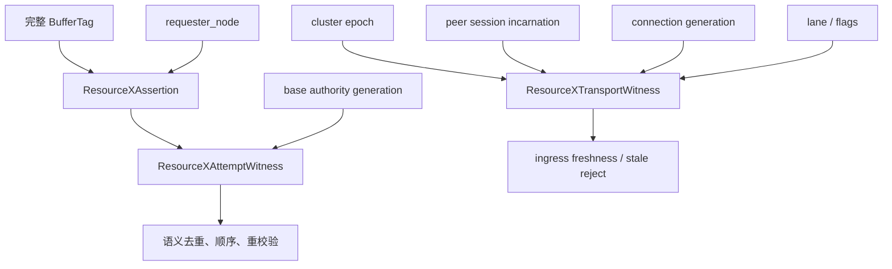
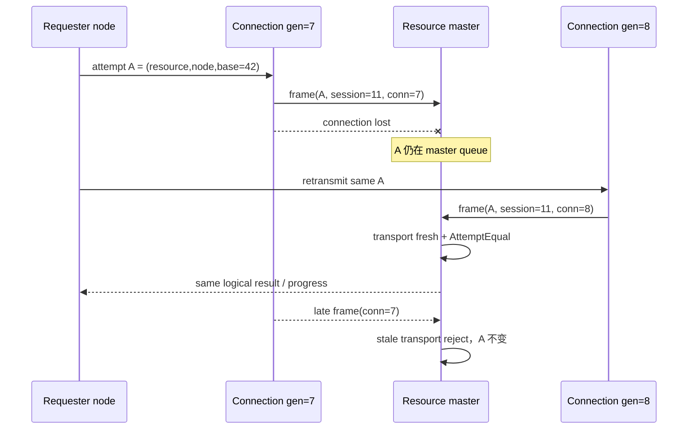
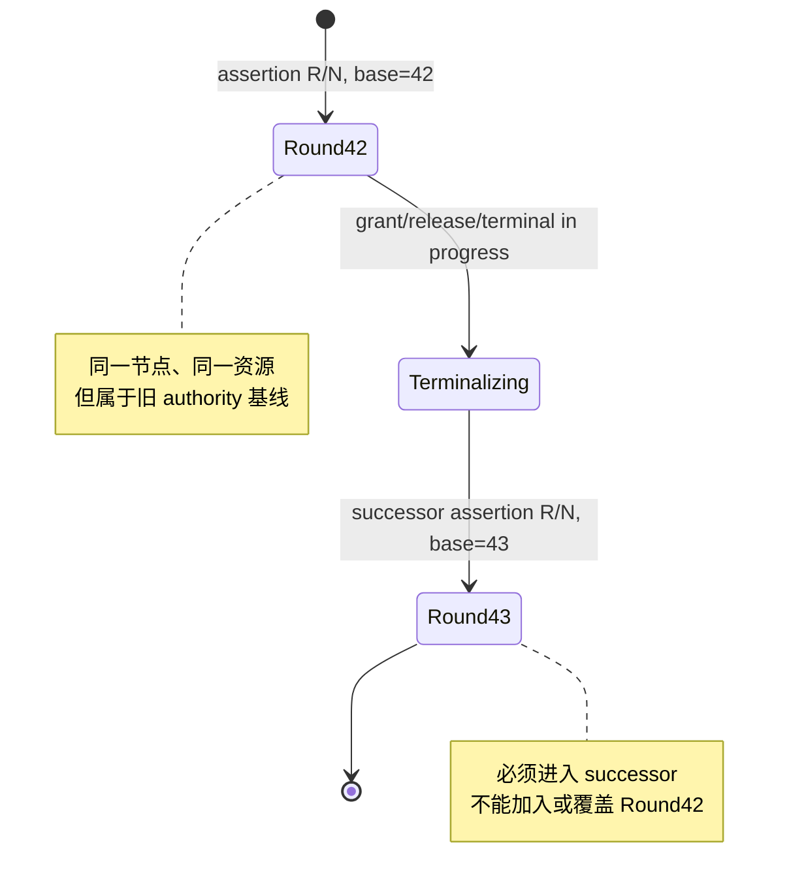
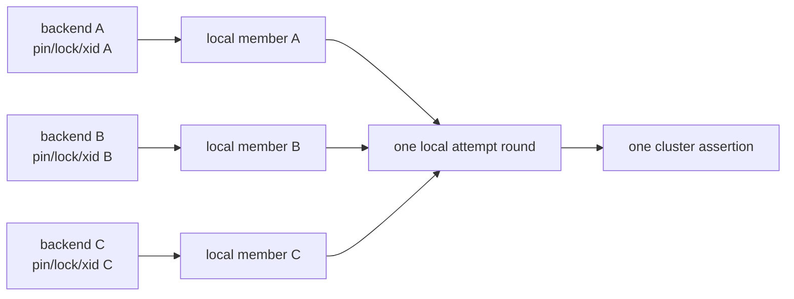
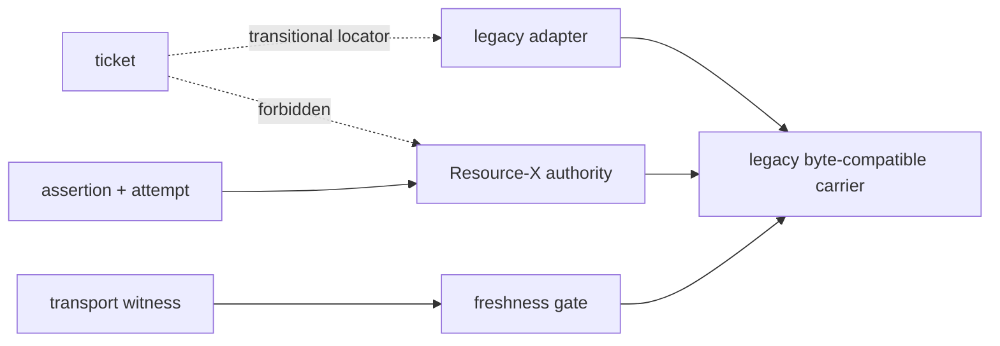

# 02：逻辑身份、attempt witness 与 transport freshness

Resource-X 最关键的设计是把 equality 拆成三层：**资源断言相等**、**acquisition attempt 相等**、**传输上下文新鲜**。这三者相关，但任何两者都不能互相替代。

## 1. 三个概念结构

下面是语义形状，不承诺最终公开 C ABI 的字段偏移：

```c
ResourceXAssertion {
    BufferTag resource;
    int32     requester_node;
}

ResourceXAttemptWitness {
    ResourceXAssertion assertion;
    uint64             base_authority_generation;
}

ResourceXTransportWitness {
    uint64 cluster_epoch;
    uint64 peer_session_incarnation;
    uint32 connection_generation;
    uint16 lane_id;
    uint16 flags;
}
```



## 2. 精确 equality

### 2.1 Assertion equality

```text
AssertionEqual(A, B) =
    BufferTagEqual(A.resource, B.resource)
AND A.requester_node == B.requester_node
```

完整 `BufferTag` 必须使用 PostgreSQL 原生字段语义；不能为了方便只比较 relation OID 或 block number，也不能把共享 catalog 中合法的特殊数据库标识误判为非法。

### 2.2 Attempt equality

```text
AttemptEqual(A, B) =
    AssertionEqual(A.assertion, B.assertion)
AND A.base_authority_generation == B.base_authority_generation
```

base generation 把“同一个节点再次申请同一个块”区分成不同轮次。没有它，先前 acquisition 完成或失败后，后来恰好相同的 `(resource,node)` 可能错误加入旧 round，形成 ABA。

### 2.3 Transport freshness

transport witness 在入口处独立验证：

```text
TransportFresh(frame) =
    epoch matches admitted formation policy
AND session incarnation matches authenticated peer
AND connection generation matches current route
AND lane/flags belong to the accepted domain
```

`TransportFresh` 为 false 时，frame 被拒绝；已经存在的 logical assertion 不因此被删除或改写。

## 3. 哪些字段明确不进入逻辑身份

| 字段 | 为什么存在 | 为什么不能进入 assertion/attempt equality |
|---|---|---|
| backend id / procno | 本地 waiter 与清理定位 | backend 退出不应取消已经提交的 cluster obligation |
| xid | 事务归属 | 多个事务可共享节点级已获得的块权威；xid 复用也会产生 ABA |
| request id / wait sequence | 本地等待与调试 | 调度标识不是资源 authority |
| ticket id | 旧路径物理 locator | 临时对象可回收、复用或在切换中消失 |
| cluster epoch | 消息与 formation 新鲜度 | epoch 变化不自动创造新 resource claimant |
| peer session / connection generation | 拒绝旧连接上的 frame | reconnect 不应复制逻辑 acquisition |
| lane / ring slot | 物理传输位置 | staged/ACK 只证明 transport 生命周期 |
| retry count / deadline | 调度与终止 | 不能改变资源是谁、哪一轮 |
| page LSN/SCN | image provenance | image 证据不是 lock acquisition 身份 |

## 4. 重连场景：身份不变，transport 更新



如果把 connection generation 放进 attempt equality，重连会创建第二个 claimant；如果完全不验证 connection generation，旧 socket 上的迟到 frame 又可能污染当前轮次。分离两者同时解决这两个问题。

## 5. 顺序 attempt 场景：assertion 相同，base 不同



规则很简单：

- assertion 与 base 都相同，才是同一 attempt 的 duplicate/join；
- assertion 相同但 base 不同，是 ordered successor；
- resource 相同但 requester node 不同，是 master queue 上不同 claimant；
- resource 不同，当然是不同 resource entry。

## 6. 本地 membership 与 cluster assertion

同节点多个 backend 会共享 cluster assertion，但不共享 PostgreSQL 本地所有权：



一个 follower 取消等待，只能 detach 自己的 local member。leader 在 cluster submission 后退出，也不能把全局 assertion 当成本地对象直接删除；剩余进度由共享状态和既有 retry/reconfiguration actor 接管。

## 7. 过渡期 ticket 的唯一合法角色

在旧消息与 adapter 尚未退役时，ticket 可以暂时作为：

- 找到旧 payload 或旧 slot 的物理 locator；
- 匹配旧 handler 所需的兼容字段；
- 在 source semantics 下维持 byte-exact 行为。

ticket 不得再用于：

- 判断两个请求是否是同一 logical assertion；
- 决定 master queue 顺序或唯一 grant；
- 证明 authority generation；
- 在 reconnect 后创建新 claimant；
- 证明 release、terminal 或 recovery 已完成。



## 8. 无 wire 变化的语义迁移

身份分离可以先于最终 wire carrier 落地。过渡阶段保持旧 message type、长度、版本和 payload byte 不变，但在发送前投影出 canonical assertion/attempt，在接收后用新 equality 解释同一批字段。

这不是允许混合语义：

1. 新代码先以 feature disabled 部署，全部节点继续 source equality；
2. R4 验证所有 admitted member 的 feature/capability 集合一致；
3. source admission 关闭，旧 identity-bearing work 与 transport debt 清零；
4. R4 发布一次集群级 OPEN；
5. 所有节点从同一 generation 开始使用 target equality。

如果一部分节点按 ticket 相等、另一部分节点按 assertion 相等，即使 wire byte 完全一致，也会出现“双协议解释同一帧”的分裂，所以必须由 R4 做集群范围语义切换。

## 9. 失败矩阵

| 输入或状态 | 结果 | 是否改变 logical assertion |
|---|---|---|
| 同 attempt、同 current transport 的 duplicate | 幂等 replay/继续已有进度 | 否 |
| 同 attempt、新 authenticated connection | transport rebound 后继续 | 否 |
| 同 attempt、旧 session/connection 的迟到帧 | stale reject | 否 |
| 同 assertion、不同 base generation | 排入 successor round | 创建新的有序 attempt，不覆盖旧轮 |
| leader 在 submit 前退出且无 follower | 可撤销空 local round | 尚未发布 cluster assertion |
| leader 在 submit 后退出 | detach 本地 member；共享 actor 继续 | 否 |
| formation 变化 | admission freeze，交给 sweep 分类 | 不原地 rebase |
| generation 耗尽或结构损坏 | fail-closed / recovery blocked | 否，禁止 wrap |
| proof 尚不可用 | observation 显式 unavailable | 不能用零值或 topology 代替 |

## 10. 验证重点

身份层的测试不应只验证 struct equality，还必须覆盖生产行为：

- 同节点 N 个 backend 对同一 tag 只产生一个 master claimant；
- 同 assertion 不同 base 严格形成 predecessor/successor；
- reconnect 只更新 transport witness；
- 旧 connection 的迟到消息不改变 authority；
- ticket/backend/xid/session 改变不影响 assertion equality；
- 任何全局 comparison 重新读取上述禁用字段时，静态门立即失败；
- wire layout 在身份迁移阶段保持 byte-exact；
- proof 尚未接线时字段是 absent/unavailable，而不是伪造为 0。

[上一篇：总体架构](01-architecture-and-resource-model.md) · [返回目录](README.md) · [下一篇：本地合并与 master admission](03-local-coalescing-and-master-admission.md)
