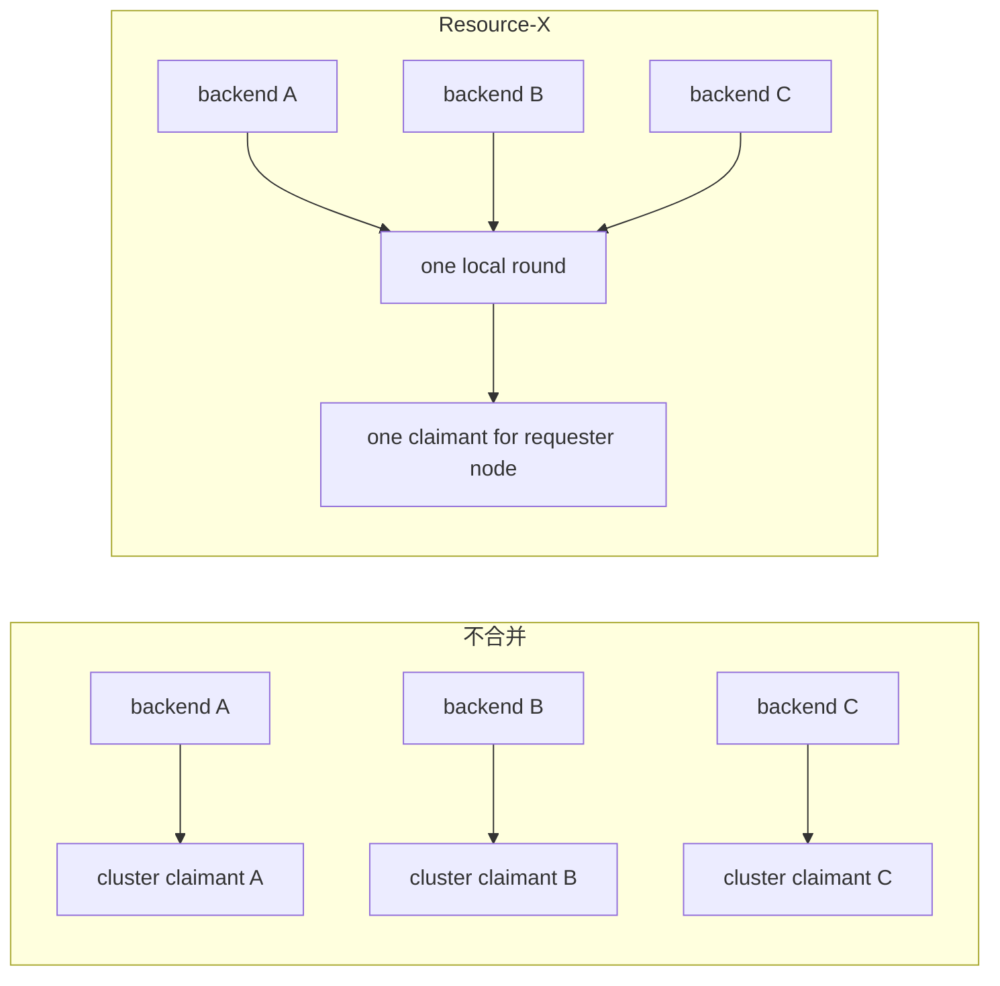
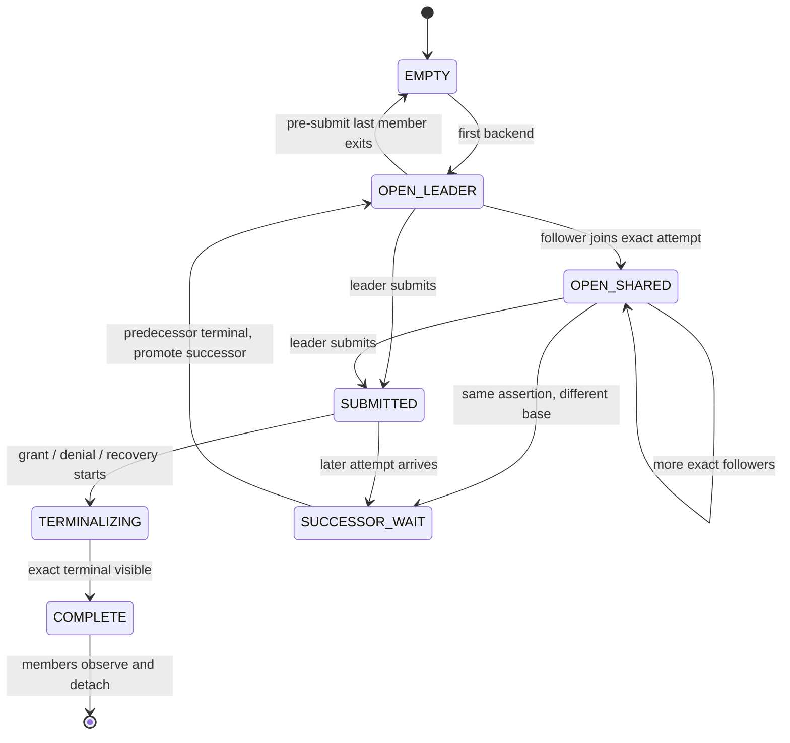
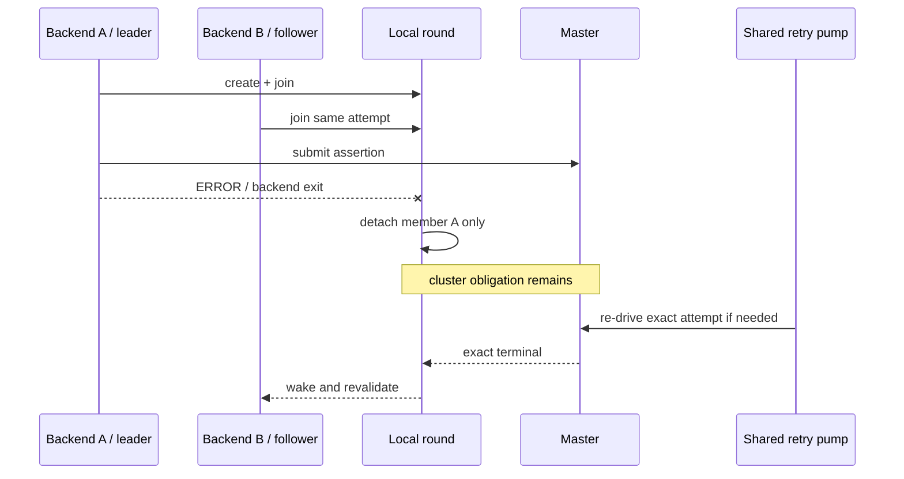
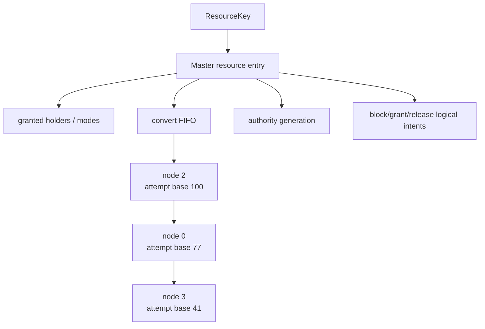
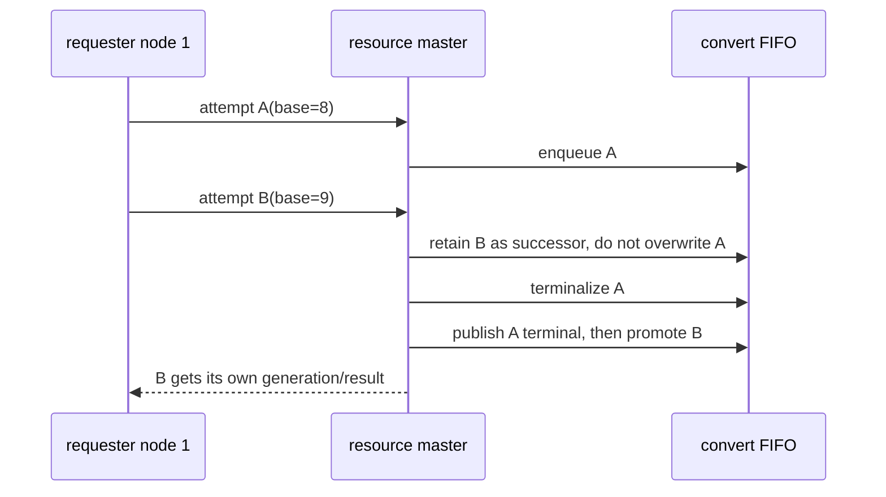
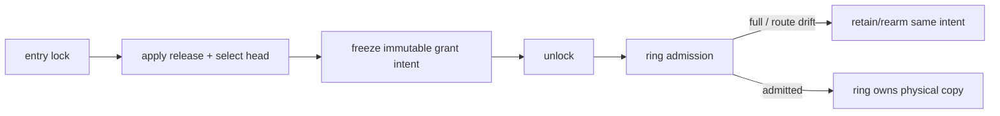

# 03：同节点请求合并、master admission 与 FIFO

Resource-X 在两个位置做“合并”，但语义不同：requester 节点上的 local coalescing 把多个 backend 汇聚为一个 cluster assertion；resource master 上的 duplicate admission 则保证同一 attempt 的重发不会产生第二个队列节点。

## 1. 为什么按节点合并

一个 PostgreSQL 实例内，多个事务可能同时访问同一个已经或即将成为本地 current 的块。如果每个 backend 都创建跨节点 X acquisition，会把本地并发放大成全局队列压力：



这与 Oracle 公开描述的行为方向一致：同一实例已经获得并缓存某块后，后续本地事务可以利用本实例的缓存状态，而不是每次都创造新的跨实例所有者。PGRAC 的 local round、leader 选取和 member 表是自身实现。

## 2. Local round 的最小状态

一个 local round 至少绑定：

- 完整 resource tag；
- requester node；
- 目标模式；
- base authority generation；
- 当前 round generation；
- leader 状态；
- backend-local member 集；
- 是否已向 cluster 提交；
- terminal 或 successor 状态。

它不接管 backend 的 transaction、pin、content lock 或 ResourceOwner。



这里的 `OPEN_SHARED` 只表示多个本地 waiter 共用 acquisition；它不是 cluster authority 的 OPEN，也不是本地可写。

## 3. Local join 算法

在已有 local tag partition lock 内，join 过程按以下顺序执行：

1. 验证完整 tag、requester node 与目标 mode；
2. 从 canonical local authority snapshot 读取当前 base generation；
3. 构造 assertion 与 attempt witness；
4. 查找该 tag 的当前 round；
5. 如果 attempt 和 mode 精确相同，登记 backend-local member，返回 follower；
6. 如果 assertion 相同但 base 不同，或者当前 round 已 terminalizing，登记/等待 successor；
7. 如果没有 round，创建一个 leader round；
8. 只有 leader 可以发出 cluster assertion；
9. 释放 local lock 后才允许进入 GRD、buffer 或 transport 域。

概念返回值为：

| 结果 | caller 行为 |
|---|---|
| leader must submit | 发送唯一 cluster assertion；失败时按是否已发布决定撤销还是交给共享终止路径 |
| joined local assertion | 不发送第二个全局请求，等待同一 round 的共享进度 |
| wait successor round | 不覆盖 predecessor；等前一轮 terminal 后再成为新 round |
| changed/stale | 重新读取 formation 与 base generation，不沿用旧 snapshot |

## 4. Leader 退出不等于 assertion 取消



只有在 cluster submission 之前、并且最后一个 member 已离开时，空 round 才能安全消失。提交之后，逻辑义务已经可能影响 master queue，不能由一个 backend 的生命周期决定。

## 5. Master entry 的资源级模型

master 以 resource 为索引，维护 holder 与 convert FIFO。对同一 requester node，当前 open attempt 只能有一个 authoritative queue identity。



master admission 的顺序是：

1. 先在 transport 层验证 authenticated source、session、connection、长度和 domain；
2. 独立 decode 并验证 logical assertion/attempt；
3. 只用 resource key 定位 master entry；
4. 在 entry lock 下检查同 node 的 current attempt；
5. exact duplicate 返回已有 adapter/result，不追加队列节点；
6. 同 node、不同 base 是 successor，不能覆盖 predecessor；
7. 新 claimant 按既定 FIFO 进入 convert queue；
8. grant 只能依据 holder compatibility、队列顺序和精确 authority generation；
9. unlock 后才能 stage 网络消息。

## 6. Duplicate、retry 与 successor 的区别

| 观察 | 分类 | master 动作 |
|---|---|---|
| assertion 相同、base 相同、transport 相同 | exact duplicate | 幂等返回/继续同一 attempt |
| assertion 相同、base 相同、transport 更新 | retransmit over fresh transport | 重校验后绑定同一 attempt，不追加 FIFO |
| assertion 相同、base 不同 | successor | 保留 predecessor，按序等待 promotion |
| resource 相同、requester node 不同 | another claimant | 进入 resource convert FIFO |
| ticket 相同但 assertion/attempt 不同 | unrelated/stale adapter data | ticket 不得覆盖 canonical comparison |
| assertion 相同但 payload 内容冲突 | protocol mismatch | fail-closed，保留诊断证据 |

## 7. FIFO 与同节点 successor

same-node successor 必须遵守两个约束：

1. predecessor 的 terminal publication 先对所有 observer 可见；
2. successor promotion 与新 generation 分配在 master entry 的同一序列化域内完成。



不能用“请求来自同一个 node”把 B 直接并入 A，因为 B 的 base generation 说明它观察到的是后继 authority 世界。

## 8. Master 的 grant 原子区

当 blocker 全部释放后，master 需要在一个 entry-lock critical section 内完成：

- 应用最后一个 exact release/status；
- 从 holder 集移除对应 holder；
- 重新计算 incompatible holder set；
- 选择 FIFO head；
- 固化 proof kind 与 source evidence reference；
- 分配/提交新的 authority generation；
- arm grant logical intent。

网络发送不在这个 critical section 内。正确模式是“锁内冻结不可变 intent，锁外尝试交给 ring”：



因此 ring full 只影响物理发送时机，不能回滚已经提交的 master queue 事实，也不能丢弃 logical obligation。

## 9. 锁序与禁止嵌套

目标锁序遵循 snapshot → unlock → other domain → relock/revalidate：

```text
local tag lock
  -> copy assertion/attempt/local handle
  -> unlock

resource entry lock
  -> copy immutable action/ref
  -> unlock

buffer mapping/header/content OR transport staging
  -> complete local action
  -> unlock

original authority domain
  -> generation-exact revalidation
  -> publish
```

以下嵌套一律禁止：

- local tag lock → master/GRD entry lock；
- resource entry lock → buffer mapping/header/content lock；
- buffer content lock → resource entry lock；
- authority lock → network send、ring wait、I/O 或 condition sleep；
- stats/readout lock → authority lock。

## 10. 活性与公平性

local coalescing 减少全局请求数，但不能让一个 stuck round 阻塞所有资源。master/requester 驱动需要使用有界、可恢复的 scan cursor：每次访问有限数量的 entry，cursor 从上次位置继续；一个 BUSY 资源不能让扫描每次从 slot 0 重启。

公平性的检查包括：

- 同一 resource 的 FIFO 不被 retry 重排；
- duplicate 不占新 queue node；
- dead non-head 精确 unlink，不改变 survivor 顺序；
- dead head 被回收后，safe successor 在同一 master critical section 启动；
- 一个资源反复 NOT_READY 不饿死其他资源；
- counter 与日志只观察行为，不参与 successor 选择。

## 11. 测试场景

至少需要覆盖：

1. 一个节点 1、2、N 个 backend 同时请求相同 tag，只产生一个 cluster assertion；
2. follower 在 leader submit 前后分别退出；
3. leader submit 后崩溃，shared pump 仍能推进；
4. 同 node 同 attempt 多次重发，master queue cardinality 不变；
5. reconnect 后 old frame 被拒，fresh frame 加入同一 attempt；
6. 同 node 不同 base 严格形成 successor；
7. 多 node FIFO 在 duplicate、retry、holder release 和 requester death 后保持顺序；
8. ring full 不清除 logical intent；
9. 移除任一 production join/dedup edge 后，动态测试必须变红。

[上一篇：身份分离](02-identity-attempt-and-transport.md) · [返回目录](README.md) · [下一篇：重试与 T1/T2/T3](04-retry-terminal-and-executor.md)
