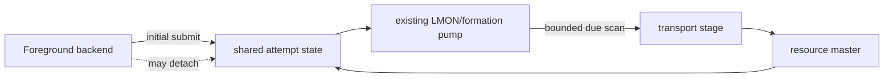
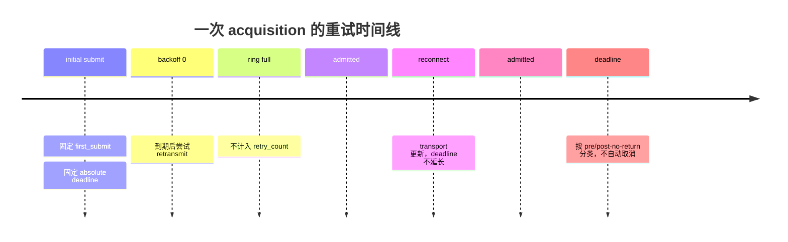
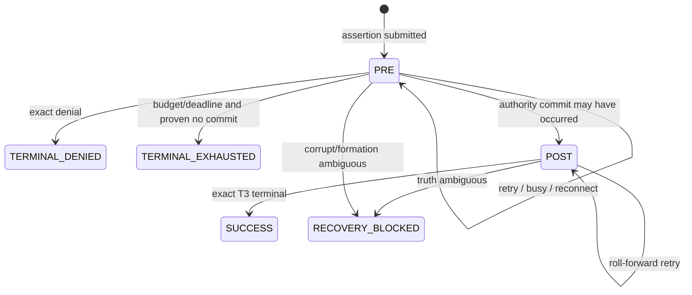
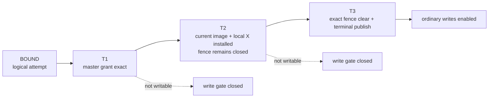
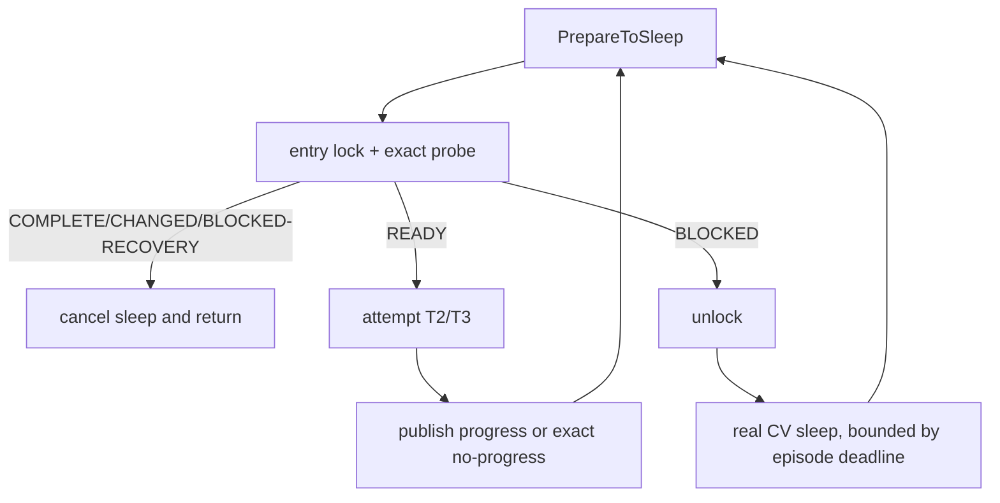

# 04：有界重试、T1/T2/T3 执行器与本地写栅栏

一次 Resource-X acquisition 可以跨越 backend 退出、连接重建、ring pressure、holder 处理延迟和本地 buffer 安装。因此它需要两个互补机制：共享 actor 负责有界重试与终止；requester executor 负责把 master grant 安全地变成本地可写 X。

## 1. 为什么 foreground 不能独占进度

如果只有最初发起 SQL 的 backend 负责 retry，它一旦 cancel、ERROR 或退出，master 上的 convert 可能永久悬挂。目标模型把“首次提交”和“持续推进”分开：



- foreground 创建/加入 attempt，可以阻塞等待；
- 已有 periodic Resource-X pump 是唯一的生产重试者；
- 不增加第二个 worker、timer service 或无限循环；
- waiter 全部离开也不表示 cluster obligation 消失。

## 2. Retry state 与两个时钟概念

一个 active attempt 维护概念上的：

```text
attempt witness
first submit monotonic time
next retry due time
absolute terminal deadline
admitted retransmit count
pre/post-no-return phase
typed terminal result
state generation
```

`next retry due` 是调度提示，`absolute terminal deadline` 是生命周期上限，二者不能混用。



当前设计复用已有配置语义：默认最多四次**已成功进入 outbound ring 的重发**，初始 backoff 为 10 ms，并以既有 GCS reply timeout 作为绝对上限。BUSY、NOT_READY、尚未到期或 ring-full-before-admission 都不消耗 retry count，但真实时间继续接近 deadline。

## 3. Retry classifier 不直接发送

分类器应是纯函数：输入 exact current attempt、fresh transport、当前单调时钟与状态快照，输出一种动作。

| 分类 | 含义 | 后续动作 |
|---|---|---|
| not due | 尚未到下一次 due | 保留状态，下一轮扫描 |
| stage exact | 可重发同一 immutable attempt | unlock 后尝试 ring admission |
| wait scheduler | ring/route 暂不可用 | 保留 logical intent，不消耗 count |
| terminal denied | 收到 exact allowlisted denial | 原子发布 terminal，唤醒 waiter |
| terminal exhausted | pre-no-return 且预算/期限耗尽 | 发布 generic bounded exhaustion |
| roll forward | 可能已提交或已越过 no-return | 继续完成，禁止 timeout cancel |
| recovery blocked | corruption、formation ambiguity、generation exhaustion | 保留证据并 fail-closed |

producer 的标准模式是：entry lock 下 snapshot → unlock → stage/send → entry lock 下按 state generation 精确 apply。迟到的 send result 不能更新已经换代的 attempt。

## 4. Pre-no-return 与 post-no-return



no-return 的关键不是“发了几次消息”，而是 master authority 是否可能已经提交：

- **pre-no-return**：有正向证据证明 current-owner change 尚未 commit，才允许 bounded exhaustion/cancel；
- **post-no-return**：commit 已发生或无法排除，只能 roll forward 或交给 recovery；
- timeout 不能把 post-no-return 请求改写成“肯定没发生”。

更具体的 terminal denial 优先于 generic exhaustion；corrupt、generation exhaustion 和 formation ambiguity 不能被归类为普通重试耗尽。

## 5. T1/T2/T3 为什么必须分三步



### T1：master grant

master 在 entry lock 下验证 assertion、target node、formation 与 acquisition generation，然后只把 exact T1 从 0 推进到 1。duplicate 是幂等的，mismatch 零修改。T1 不触碰 BufferDesc，也不开放写入。

### T2：current image 与 local X 安装

requester 在不持有 resource entry lock 的情况下：

1. 用 tag 定位 buffer；
2. 在 mapping/header 保护下验证 descriptor identity 并取得 raw pin；
3. foreground 获取 content EXCLUSIVE；LMS 只能 conditional acquire，不能阻塞；
4. 重验 tag、buffer generation、image proof、PCM lifecycle 与 activation token；
5. 必要时安装已验证的 current image；
6. 提交 local PCM X；
7. 在释放 content lock 之前写入 exact `resource_x_activation_generation`；
8. 释放 buffer 域后回到 resource entry，精确重校验并发布 T2。

这时 buffer 已有正确 image 与 local X，但 activation token 和 Resource-X generation 仍非零，因此普通写入口继续关闭。

### T3：清栅栏并发布可写 terminal

1. entry lock 下 snapshot exact T1+T2 ref，然后 unlock；
2. 再次定位并锁定 exact buffer；
3. 验证 tag、local X、activation token 与 acquisition generation；
4. 先清 Resource-X generation，再清 exact activation token；
5. 释放 buffer locks/pin；
6. entry lock 下再次验证完整 identity、T1、T2 和 buffer proof；
7. 首次发布 T3/writable terminal 并广播 CV。

先清 buffer fence、后发布 resource terminal，保证任何观察到 T3 的普通 writer 都不会再撞到旧 fence；两个 lock domain 不做危险嵌套。

## 6. 两域提交为什么不是“一个大锁”

```mermaid
sequenceDiagram
    participant E as Resource entry
    participant X as Executor
    participant B as Buffer owner

    X->>E: snapshot exact ref under entry lock
    E-->>X: immutable ref
    X->>E: unlock
    X->>B: install/clear under buffer locks
    B-->>X: exact typed proof
    X->>E: relock + full generation revalidation
    alt still exact
        E-->>X: publish T2 or T3
    else changed
        E-->>X: no publish; retain closed evidence for sweep
    end
```

Resource entry 与 BufferDesc 属于不同的高竞争锁域。用一个大锁跨网络、I/O 或 buffer content 操作，会引入 master/holder/LMS/backend 之间的环形等待。Resource-X 采用 value snapshot 与 generation-exact revalidation，宁可在 race 后保留闭合 residue，也不通过锁嵌套换取伪原子性。

## 7. Canonical write fence

对 cluster-tracked buffer，普通写权限要求两个 activation 字段都为零，并且当前 image/lifecycle 允许写：

```text
OrdinaryWriteAllowed =
    cluster runtime inactive
 OR buffer not cluster-tracked
 OR (
      current writable image
  AND lifecycle permits caller
  AND writer_activation_token == 0
  AND resource_x_activation_generation == 0
 )
```

必须被 gate 覆盖的入口包括：

| 写入口 | fence closed 时 |
|---|---|
| cached-X fast path | 不得直接返回可写 content X；重驱动同一 attempt 或等待 |
| content-lock 后重校验 | 释放并回到 exact probe |
| conditional lock | 释放并返回 false |
| `MarkBufferDirty` | dirty bit 改变前 ERROR |
| hint dirty | 不发布 dirty/hint WAL state |
| direct page mutation | 返回 typed BUSY/STALE，页面零修改 |
| full-page copy / storage refresh | copy 前拒绝 |
| current-MultiXact 或 successor proof capture | 不从 fenced image 生成 proof |
| writeback/flush | 若看到新 dirty fenced page，按 corruption fail-closed |

只允许一个闭合集合的 typed protocol owner 绕过 ordinary gate，例如 T2 image install、exact T3 clear、formation neutralize 和已验证 source-image prepare。绕过点必须由静态分析按 AST 和 dominance 证明，不能靠人工维护一份容易漂移的函数名白名单。

## 8. Wait、wake 与 no-progress

executor 的等待循环必须避免丢 wake 和热自旋：



如果 T1 后 buffer helper 返回 BUSY/ABSENT/STALE，executor 先在 entry 中发布 `(acquisition_generation, reason)` no-progress observation，再广播 CV。没有新的同 generation progress 时，下次 probe 必须返回 BLOCKED 并真实睡眠，不能每个 tick 都把旧 T1 解释为 READY。

## 9. 错误、取消与崩溃边界

| 事件 | 正确行为 |
|---|---|
| backend ERROR before T2 | 精确 unwind admission token；共享 attempt 可继续 re-drive |
| cancel after T2 before T3 | 不能开放 fence；必须由 normal T3 或 formation neutralize 收尾 |
| LMS content lock busy | conditional return BUSY，不阻塞 LMS |
| descriptor reuse/tag mismatch | STALE，页面零修改 |
| image proof contradiction | recovery blocked，不发布 local X/T3 |
| same-generation duplicate T2 | 验证 exact sidecar，幂等补齐缺失 resource T2 |
| same-generation duplicate T3 | 观察 COMPLETE，不清 successor 字段 |
| different generation | STALE，不能凭 token 碰巧相同而采纳 |
| formation freeze races executor enter | 二次 gate 检查失败后平衡 inflight count，零修改 |
| postmaster restart | volatile sidecar 清零，但必须先重建 cluster authority 才能写 |

## 10. 验证闭包

重试与 executor 的最低验证集合包括：

- kill 初始 requester backend 后，attempt 仍由 shared pump terminalize；
- ring full、route drift、reconnect 和 physical deadline 都保留同一 logical attempt；
- absolute deadline 不被 duplicate/retry/reconnect 延长；
- pre-no-return exhaustion 与 post-no-return roll-forward 不混淆；
- T1-only、T2-fenced、T3-active 的每个写入口都按预期允许或拒绝；
- T2/T3 在每个 buffer/resource race 点注入 crash 或 generation change；
- 同 generation duplicate 幂等，不同 generation 零修改；
- static/AST census 证明所有 ordinary mutation path 被 canonical fence 支配；
- 任何“移除 gate 后测试仍绿”的路径都不算覆盖。

[上一篇：本地合并与 master admission](03-local-coalescing-and-master-admission.md) · [返回目录](README.md) · [下一篇：proof carrier 与释放](05-proof-carrier-release-and-reclaim.md)
