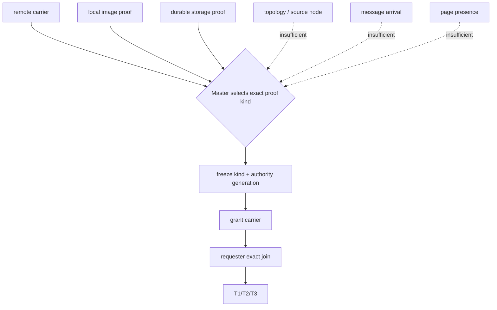
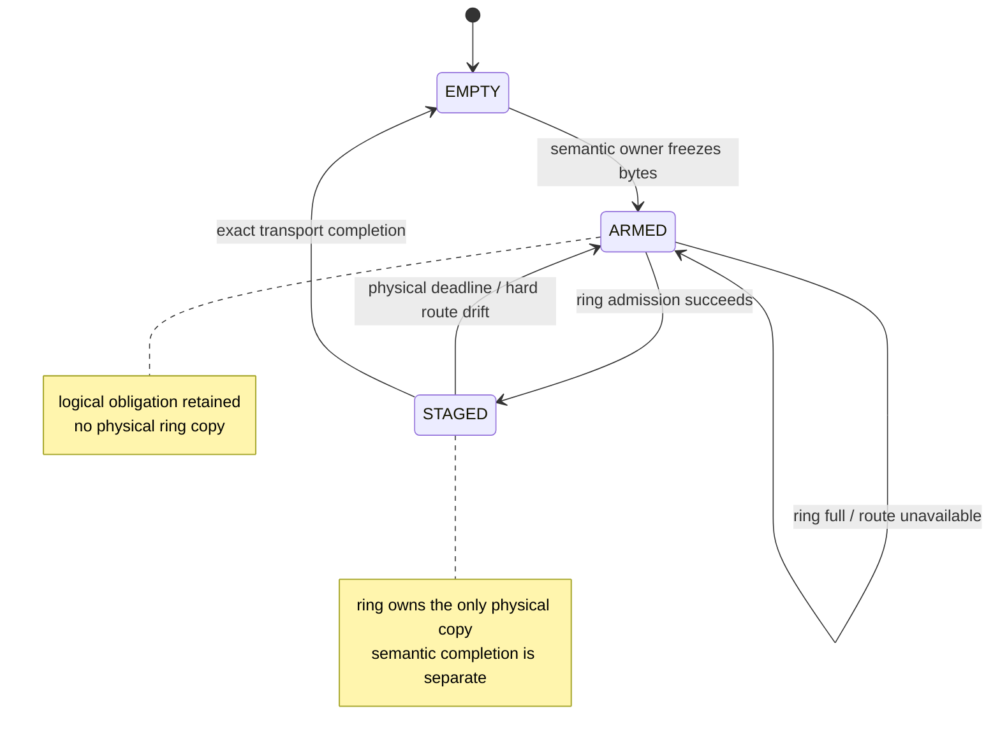
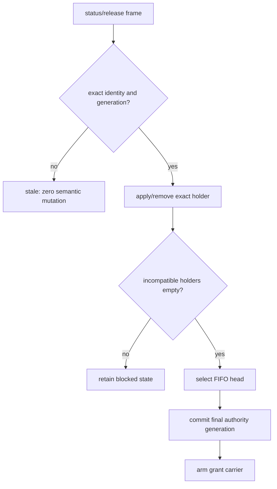
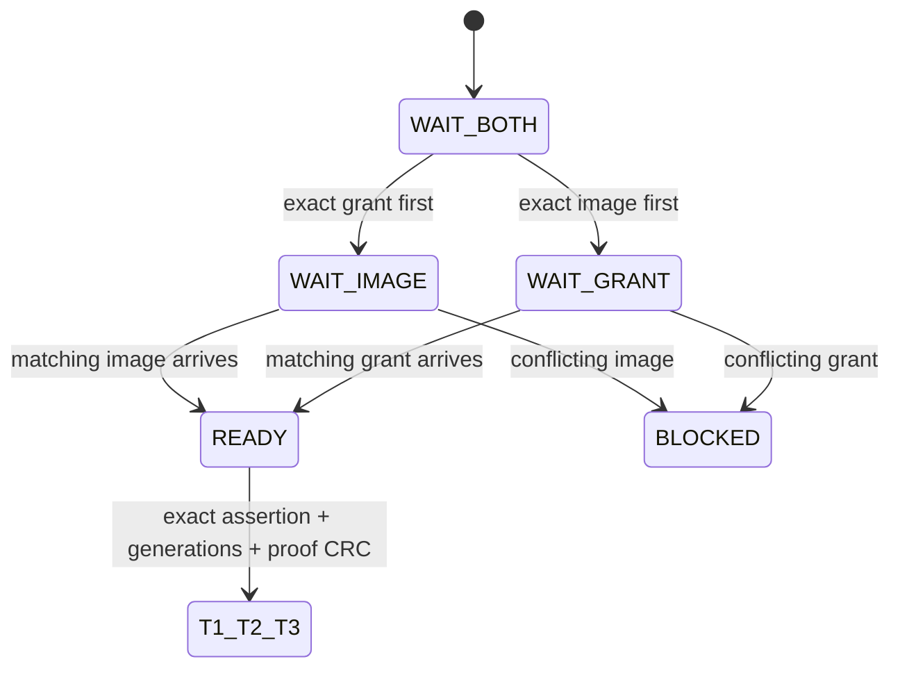
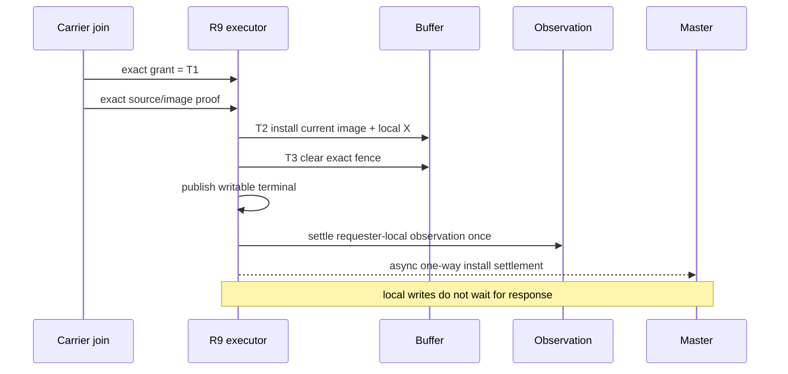
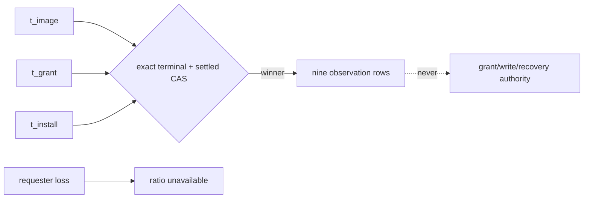
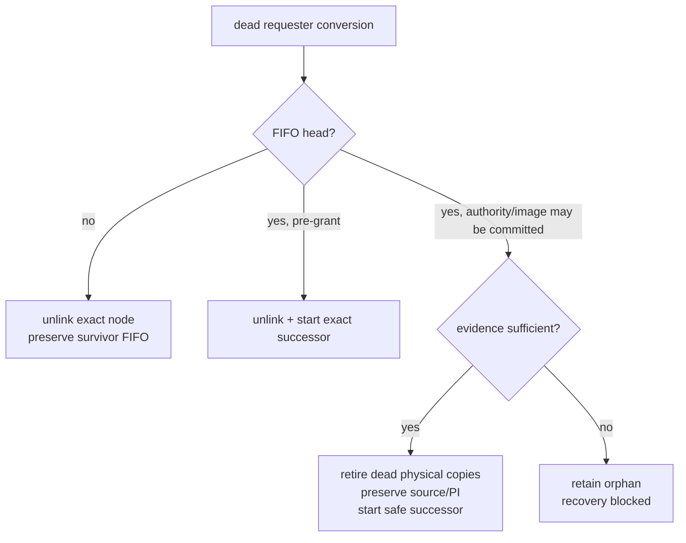

# 05：proof carrier、C-intent、单向释放与 requester 回收

Resource-X 的 final carrier 把 master 的 authority 决定、holder 保留的 image/status evidence 和 requester 的 T1/T2/T3 执行连接起来。它还必须在 ring full、连接漂移、进程退出和节点重配置时保存**逻辑义务**，而不是只保存“曾经发过一个包”的痕迹。

## 1. 三类 proof source

一次 grant 的 source proof 必须由 resource master 从已保留事实中选择，并与 exact authority generation 一起冻结。概念上有三类：

| proof kind | 适用场景 | 必须具备的事实 | 明确不能推断自 |
|---|---|---|---|
| remote carrier | current image 来自远端 holder | exact image envelope、source/target generation、holder status、CRC/provenance | “master 在远端”、消息来自某节点、page 恰好存在 |
| local image proof | requester/master 域已有可验证 current image | exact local retained declaration 与 image identity | tag 命中、buffer valid、旧 ticket |
| durable storage proof | 无 holder 且 durable source 足以恢复 current | master-owned durable/no-holder witness 与 typed page proof | queue 空、timeout、磁盘可读 |

如果 owner-produced proof 不可用，值域必须表达 `UNAVAILABLE`，不能把 enum 的 0 或某个 topology 观察冒充为 proof。



## 2. Logical intent 与 physical copy

C-intent 是一个语义发送义务：immutable payload 已经由 owner 锁内冻结，但尚未或正在被 transport 搬运。它与 ring slot 的生命周期分开。



关键不变量：

- 每个 logical intent 最多只有一个 physical copy；
- ring admission 成功后，物理 copy 所有权转给 ring，owner 不留第二份可并发发送的 copy；
- ring full 不清 logical intent；
- physical deadline 只回收 slot 并 rearm 同一 immutable bytes；
- transport completion 只结束这次物理投递，不自动证明 master apply、T3 或 release complete。

## 3. Block、status 与 changed current image

当新 X claimant 与 current holder 冲突时，正常流为：

```mermaid
sequenceDiagram
    participant M as Resource master
    participant H as Current X holder
    participant I as Interconnect
    participant R as Requester

    M->>M: arm BLOCK intent
    M->>I: block holder
    I->>H: exact block request
    H->>H: freeze status/image while still authoritative
    alt arm succeeds
        H->>H: local X -> N, ordinary writes closed
        H->>I: one-way status + image evidence
        I->>M: exact BLOCKED_TO_N/status apply
        M->>M: remove holder; commit next generation
        M->>I: authority grant
        I->>R: grant / image in any physical order
    else arm fails
        H->>H: preserve X, retry later
    end
```

holder 必须先把 immutable status/image evidence 交给可靠的 logical intent，再允许本地 X→N。否则 holder 在降级后崩溃，会同时丢失 current image 与可重发事实。

normal release 采用单向语义：holder 不等待 master 的 reverse ACK。安全性来自“先保留证据、再降级”和 master 的 exact idempotent apply，而不是让 holder 在网络 ACK 上同步阻塞。

## 4. Master apply 与 successor grant

收到 exact holder status/release 后，master 在一个 resource-entry critical section 内：

1. 验证 assertion、authority generation、holder role 与 source status；
2. 幂等应用 status/PI；
3. 只移除对应 exact holder；
4. 重算 incompatible holder set；
5. 只有集合为空才选择 FIFO head；
6. 固化 proof kind；
7. 提交 successor final generation；
8. arm authority-grant intent。

这样不会出现“最后一个 blocker 尚未真正移除，master 已向 successor grant”的窗口。



## 5. Requester 上的 grant/image join

remote carrier 的 grant 与 image 可以物理乱序到达，但只有 exact join 才能推进本地 executor：



join 至少绑定：

- logical assertion；
- final authority generation；
- source carrier generation；
- target generation；
- source fence；
- proof kind 与 CRC；
- image identity/provenance。

grant first 不能推断 image，image first 也不能推断 grant。duplicate 可以幂等补齐尚缺的一半；同一 generation 上内容不同的 duplicate 是 protocol mismatch。

local/durable proof 分支不期待 remote image frame，但仍必须给 T2 一个由 owner 验证的 typed input，不能把“无远程 frame”误写成“无需 image proof”。

## 6. T1/T2/T3 与 final settlement



install settlement 只通知 master“requester 已完成 exact terminal apply”，它不是 requester 持有的新 ACK 债务。co-located master 可以直接幂等 apply；remote master 使用一个可重发的单向 intent。T3 和本地写入不等待 reverse response。

## 7. O1 可观测性为什么不是 authority

对 remote-carrier episode，requester 可以记录本地单调时钟上的首个：

- image arrival；
- grant arrival；
- install/T3 terminal。

在 exact-once settled bit 从 0→1 的赢家中，统计：

- 可观察的 remote install episode 数；
- grant 在 image 之后到达的数量；
- image 与 grant 同时或之后到达的数量；
- 因没有成功 install、缺 grant、缺 image 而排除的数量；
- 最近一次三种 requester-local timestamp。

如果 requester 在终态前丢失，比例必须标为 unavailable，不能猜测 timestamp 或补零。所有时间都只在 requester 本地比较，不能拿不同节点的 monotonic clock 做全局排序。



## 8. 正常 release

requester/holder 不再需要 X 时：

1. buffer owner 在仍持有 exact X/nonwrite authority 时准备 immutable release status；
2. arm 失败则保持 X，不先降级；
3. arm 成功才按本地 fence 顺序关闭普通写并 X→N；
4. existing sender 单向送到 exact master；
5. master exact apply/remove holder；
6. master 在同一 critical section 选择并启动 successor；
7. duplicate release 只增加诊断，不二次 apply；
8. stale release 不能影响 current holder。

release emitted counter 不是闭环证明。真正闭环还需要 master apply、successor progress，以及 logical/physical intent 零残留或有名的 retained classification。

## 9. Requester death reclaim

requester 节点死亡时不能等待它发送 cancel。formation owner 冻结 admission 后，master-local reclaim 精确处理该节点的 convert：



- dead non-head：只 unlink exact queue node，survivor 相对顺序不变；
- dead head 且 grant 尚未 commit：unlink 并原子启动 next head；
- dead head 已冻结 authority/image intent：只能在 exact evidence 覆盖后选择 successor；
- identity、source fence、terminal effect 或 successor safety 有歧义：保留 orphan，禁止 thaw。

timeout、membership coincidence、tag 相同或 requester socket 消失都不是 terminal proof。

## 10. 失败语义

| 故障 | 保留什么 | 禁止什么 |
|---|---|---|
| ring full | ARMED logical intent | 清义务或消耗为 terminal |
| physical send deadline | immutable bytes rearm | 把 transport timeout 当 master rejection |
| route/session drift | fresh transport 后重发 | 改 logical attempt |
| holder dies before status | 交给 recovery foundation 的 authority/page proof | invent release/image |
| holder dies after status arm | retained status/image intent | 因 socket 消失丢证据 |
| requester dies before grant | exact queue reclaim | 等 dead requester ACK |
| requester dies after grant commit | preserve authority/source proof，terminal 或 orphan | 重新 grant 同一 generation |
| master dies | freeze + rebuild resource authority | 用旧 ring copy 代替 authority |
| LMS restart | shared intent/rebuild source 驱动 | 让 orphan physical copy grant |

## 11. Wire 与兼容边界

目标 carrier 可以在过渡期复用现有 GCS message family 的数字空间，但必须具有严格的 domain、长度、版本、CRC 和 capability gate：

- peer 未声明 Resource-X capability 时，绝不发送 target frame；
- exact legacy length/type 继续交给 legacy parser；
- 一旦按 target length/domain 选择 Resource-X parser，malformed frame 不能 fallback 为 legacy；
- final cutover 之前 legacy normal path 仍由其 owner 管理；
- final cutover 之后旧数字值可以保留为 reserved/stale reject，但不再有正常 producer 或 semantic consumer。

## 12. 验证重点

- grant/image 两种乱序、重复、丢失和内容冲突；
- ring full、physical expiry、route drift 后只有一个 physical copy；
- holder status arm 失败时 local X 不降级；
- master apply 与 successor commit 原子；
- release 无 reverse ACK，仍能在 crash/retry 后幂等闭环；
- requester loss 的 head/non-head/after-grant 三类 reclaim；
- O1 exact-once settlement 与 requester-loss unavailable；
- transport completion 不被误作 semantic completion；
- capability/length/domain/CRC 的 negative matrix；
- 删除某个 logical owner 或 rearm edge 时测试必须变红。

[上一篇：重试与 T1/T2/T3](04-retry-terminal-and-executor.md) · [返回目录](README.md) · [下一篇：Formation sweep](06-reconfiguration-sweep-and-zero-residual.md)
