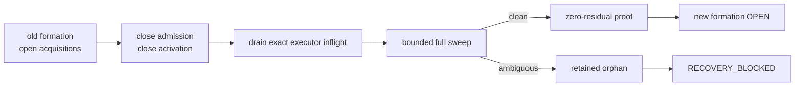
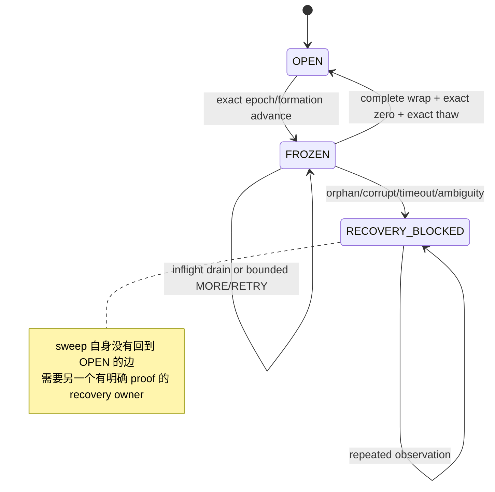
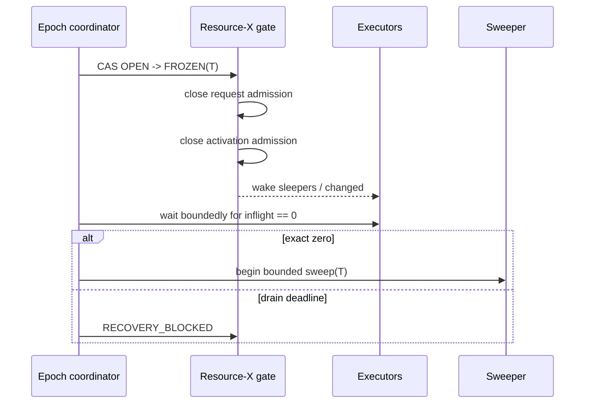
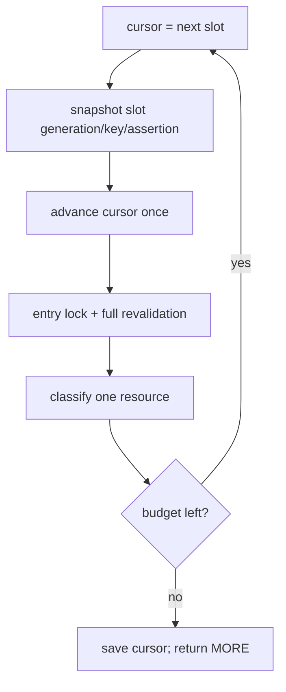
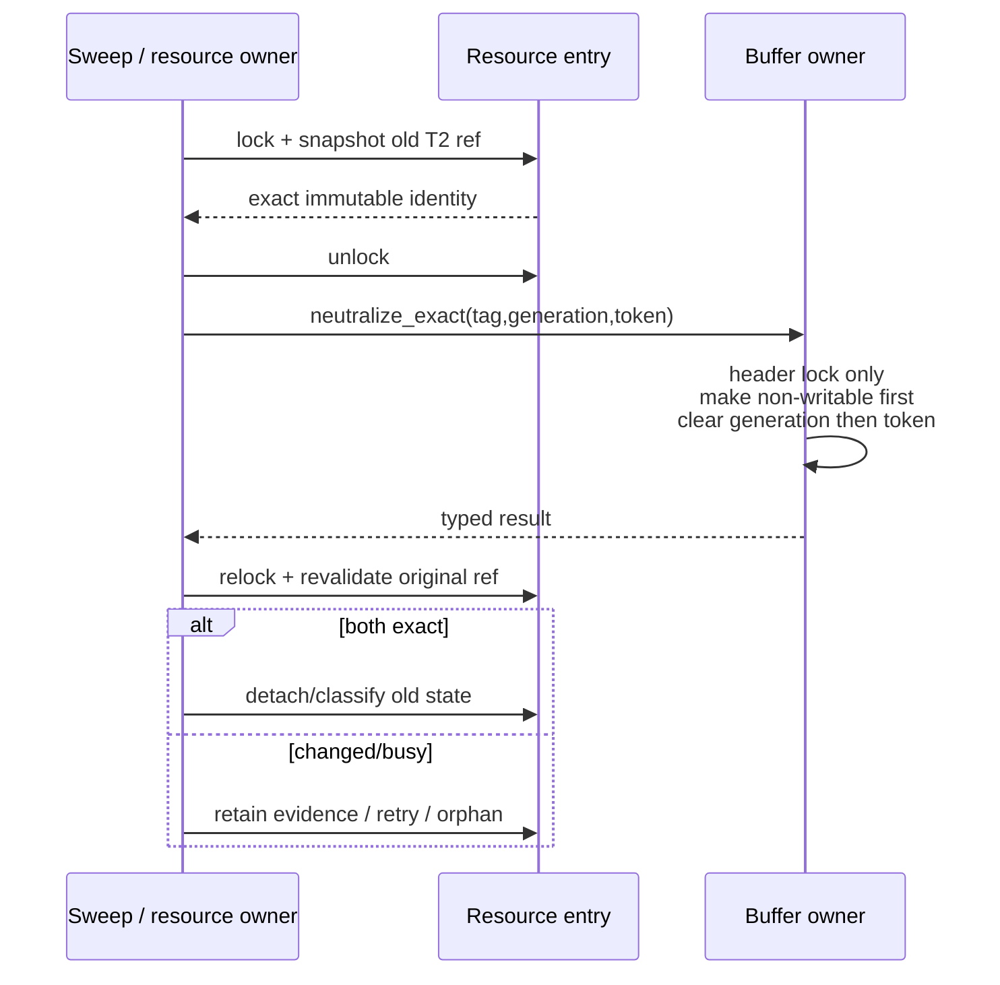
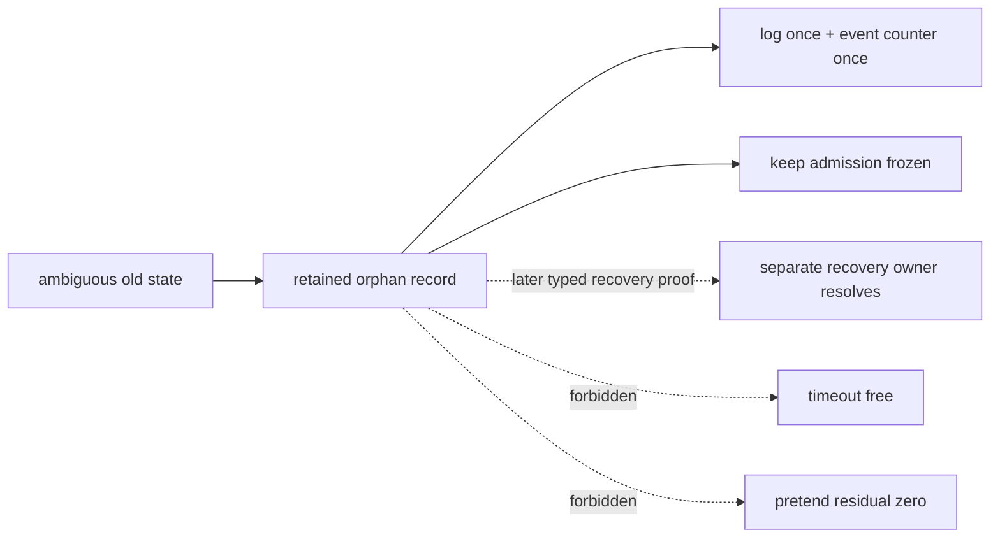
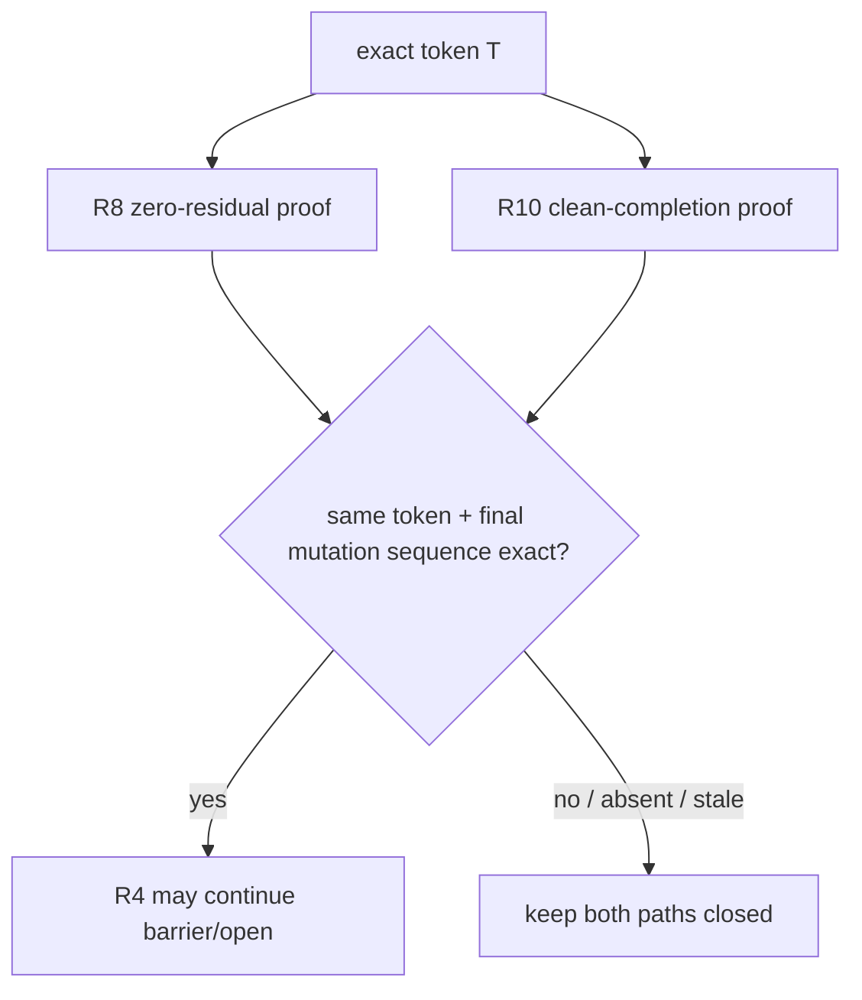

# 06：Formation freeze、bounded sweep、orphan 与零残留证明

成员集合或 resource mastering 发生变化时，旧 formation 的 queue、grant、T2 sidecar 和 transport intent 不能原样进入新 formation。Resource-X 的重配置协议先关闭 admission 与 activation，再逐资源分类；只有一轮完整扫描证明旧状态精确为零，才有资格重新开放。

## 1. Formation change 的安全目标



目标不是“尽快清空 shared memory”，而是把每个旧 acquisition 放进闭合分类：

- 没有语义债务；
- 精确取消，且有 independently produced successor；
- 已完成并可作为 granted owner 进入 recovery 分类；
- evidence-retaining orphan；
- corrupt/recovery blocked。

## 2. Reconfiguration identity

一次 sweep episode 绑定 exact token：

```text
T = {
    old_formation,
    new_formation,
    freeze_generation
}
```

逐 acquisition 还绑定：

```text
{
    resource key,
    canonical assertion,
    formation,
    acquisition_generation
}
```

buffer sidecar 的精确 identity 则包含 tag、descriptor incarnation、ownership generation、acquisition generation 与 activation token。

任何字段 mismatch 都不是“差不多同一个对象”；它要么是 stale snapshot，要么是 successor/descriptor reuse，要么进入保守分类。

## 3. Gate 状态机



gate 至少控制两类入口：

- **request admission**：禁止新 assertion/convert 进入旧 formation；
- **activation admission**：禁止新的 T2/T3 executor 进入，并用 exact inflight counter 排空已经进入的 executor。

## 4. Freeze 的固定顺序



必须先发布 closed gate，再等待 inflight。否则一个新 executor 可能在 coordinator 看到 count=0 后进入 T2，sweep 同时又清理旧 state，造成旧 formation 写穿新 formation。

executor enter 使用“count increment → gate recheck”的双检模式；freeze race 失败时必须 exactly-once leave，并在 count 变零时唤醒 coordinator。

## 5. 为什么 sweep 必须有界

Resource-X table 可能很大，LMON/reconfiguration callback 不能一次持锁扫完全表。目标采用 resumable cursor：



每个 probe 都推进 cursor，包括 free/nonmatching slot；stale snapshot 本轮不修改，但必须在后续 full wrap 再见到。容量在 freeze 期间不能 resize。没有 raw shared pointer 可以跨 unlock 保存。

有界工作保证 scheduler latency；**完整 full wrap** 保证 completeness。两者缺一不可。

## 6. Per-resource 分类矩阵

| 旧 formation 状态 | buffer sidecar | 新 formation successor proof | 结果 |
|---|---|---|---|
| 无 convert/acquisition | none | 无关 | no-op，计入 examined |
| queued convert only | none | exact new assertion 已由正常 producer 发布 | detach old，classify successor |
| queued convert only | none | 缺失 | detach old，保留 orphan，禁止 thaw |
| T1 only | none | exact successor | cancel old T1，successor 独立存在 |
| T1 only | none | 缺失/歧义 | orphan + recovery blocked |
| T2 complete、T3 incomplete | exact old activation sidecar | exact successor | 先 neutralize sidecar，再 detach old |
| T2 complete、T3 incomplete | exact sidecar | 无 successor | 可精确 neutralize，但保留 orphan evidence |
| T2 complete、T3 incomplete | different live token | 任意 | 不清 foreign token；无 exact successor 则 corrupt/orphan |
| T3 complete | exact writable owner | new formation revalidation exact | 作为 granted owner 进入 recovery 分类，不因 cursor 看到就撤销 |
| malformed/torn tuple | 任意 | 任意 | CORRUPT，保留证据并 block |

“successor 存在”不是指 backend 还活着，而是 ordinary requester producer 在新 formation 中发布了完整且可验证的新 assertion。sweep 自己绝不制造 successor。

## 7. T2 residue 的 sidecar neutralization

T2 已把 current image 与 local X 装进 buffer，但 T3 尚未完成。这是最危险的旧 formation residue：它还不可供 ordinary writer 使用，却已经跨进 buffer domain。



neutralize 先把 descriptor 恢复为 non-writable/quarantined，再清 Resource-X generation 和 activation token。它不获取 content lock 去伪造 image，不发布 normal T3，也不在持 entry lock 时进入 buffer domain。

如果 exact neutralization 需要无法安全取得的 content authority，正确结果是 BUSY/retained evidence，不是“为了推进 formation 直接清字段”。

## 8. Orphan 是证据，不是垃圾

orphan 至少保留足以回答以下问题的信息：

- 哪个 resource；
- 哪个 old formation；
- 哪个 assertion 与 acquisition generation；
- 观察到 T1/T2/T3 哪一阶段；
- sidecar neutralization 结果；
- 为什么没有 exact successor 或 terminal proof。



重复 sweep 可以重新观察 orphan，但不能重复计数，也不能因为时间过去就 thaw。若系统还没有 owner-produced proof consumer，保持 `RECOVERY_BLOCKED` 是诚实且安全的完成状态。

## 9. Zero-residual proof 不是 counter==0

一轮有效的 zero proof 至少证明：

```text
same exact token T
AND activation inflight == 0
AND cursor completed a full wrap over fixed capacity
AND every visited state was classified
AND old-formation retained state == 0
AND orphan == 0
AND retry-to-revisit == 0
AND no unclassified/corrupt slot
AND no mutation raced after the final observed sequence
```

`active_count == 0`、`queue_depth == 0` 或累计 event counter 恰好为零都不能替代完整性证明：扫描可能漏 slot、mutation 可能发生在检查之后、transport intent 可能在另一张表中、一个 unknown 分类可能没有计入任何 counter。

守恒关系可用于检测漏分类：

```text
examined = free_or_new + old_detached + successor + orphan + retry
```

但守恒成立仍不自动允许 thaw；还要满足 full wrap、inflight、token、sequence 与 zero-retained 条件。

## 10. 与 final carrier clean proof 的同 token 合取

最终切换前，需要两个不同 owner 的证明使用**同一个 token T**：

- sweep owner 证明 resource/sidecar 维度零残留；
- carrier owner 证明 C-intent、ring、holder、grant、release、settlement 与 reclaim 维度 clean completion。



顺序上，carrier owner 先完成其最后 semantic mutation 并冻结 clean proof；sweep owner 再做一次 post-mutation full wrap。否则 sweep 可能先看到零，随后 carrier cleanup 又产生新 residue。

## 11. Crash matrix

| crash/change point | restart 结果 |
|---|---|
| freeze CAS 前 | old authority 不变，由下一次 coordinator observation 重试 |
| freeze 后、inflight 清零前 | token/count 保留；不得提前 sweep |
| slot snapshot 后 | cursor/shared state 重校验；不得凭旧 pointer 清理 |
| buffer neutralize 后、entry apply 前 | 重验 buffer typed result 与 original entry；否则 block |
| orphan 分类后 | orphan 持续阻止 thaw |
| zero proof 后、exact thaw 前 | 只允许同 token coordinator 消费；formation drift 使 proof 失效 |
| thaw 后 | new formation authority；不能回滚成 ticket authority |
| nested formation change | 旧 token 与新 pair 冲突时 recovery blocked，不能原地改 token |
| worker restart | 不能自行把 gate 设回 OPEN |

## 12. 锁与 wait-for 图

```text
coordinator -> waits for activation_inflight_count == 0
backend     -> waits for formation gate / resource CV

activation leave -> never waits for coordinator
sweep entry phase -> never holds buffer locks
buffer neutralize -> never takes resource entry lock
```

因此没有 `coordinator → executor → resource lock → buffer lock → coordinator` 的环。禁止睡眠时持有 entry/header lock，禁止 raw pointer 跨 unlock，禁止 sweep 获取 content lock 或执行网络 I/O。

## 13. 验证重点

- freeze 与 executor enter 的每个竞态点；
- inflight leak、double leave、deadline；
- bounded cursor 的 wrap、slot reuse、capacity change 与 starvation；
- 分类矩阵每一行的 positive/negative leg；
- T2 sidecar exact neutralize、foreign token 与 after-neutralize race；
- successor 必须来自真实 production requester，而不是测试直接注入；
- orphan exactly-once retention 与 restart 后持续 blocked；
- counter=0 但漏扫 slot 的 negative control；
- R8 zero 与 carrier clean 使用不同 token 时拒绝；
- crash 在 final mutation、full wrap、barrier 与 thaw 前后均不双开。

[上一篇：proof carrier 与释放](05-proof-carrier-release-and-reclaim.md) · [返回目录](README.md) · [下一篇：R4 切换与 ticket 退役](07-r4-open-cutover-and-ticket-retirement.md)
